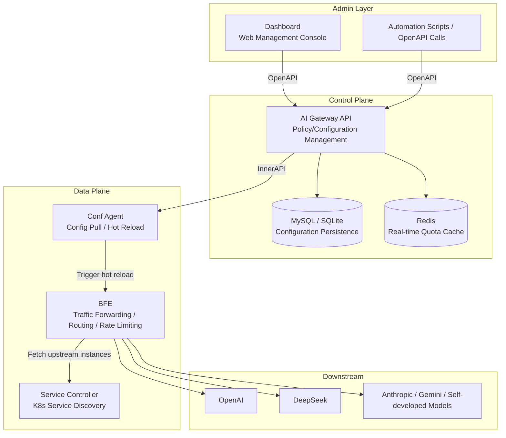
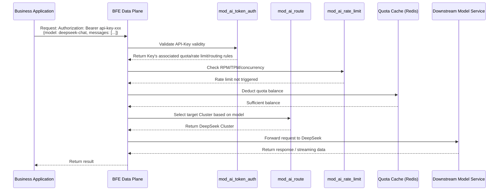

# Chapter 1: Introduction to Rainway AI Gateway

## Chapter Goals

By reading this chapter, you will be able to:

- Understand what Rainway AI Gateway is and the core problems it solves.
- Learn about the common pain points enterprises face when using Large Language Models (LLMs) at scale.
- Understand the core capability boundaries of Rainway AI Gateway, including AI routing, API-Key management, quota and rate limiting, model pricing, and observability.
- Gain an initial understanding of the five major components of the system: AI Gateway API, Dashboard, BFE, Conf Agent, and Service Controller.
- Understand the relationship between Rainway AI Gateway and the BFE open source project, and develop an intuitive understanding of typical application scenarios.

This chapter is intended for all readers and does not assume you have deep background in gateways or AI. The English names of technical terms are given when they first appear; later chapters will go into greater depth.

## What Is Rainway AI Gateway

### Definition

**Rainway AI Gateway** is a unified traffic gateway solution for large model application scenarios. It sits between enterprise applications and various Large Model service Providers, providing a unified access entry point upward while shielding differences in protocol, authentication, billing, and API form across model vendors.

It can be understood as an "intelligent router" for the AI era: based on the model name, API-Key, user identity, and traffic policies in each request, it forwards Large Model calls to the most suitable backend service, while simultaneously completing authentication, quota deduction, rate limiting protection, and cost accounting.

In terms of system positioning, Rainway AI Gateway consists of two core planes:

- **Control Plane**: Responsible for the entry, storage, version control, and distribution of policies and configurations. Its core component is **AI Gateway API**. Operations staff manage API-Keys, routing rules, quotas, rate limit policies, and more through the Dashboard or OpenAPI.
- **Data Plane**: Responsible for traffic forwarding, access control, quota validation, and rate limit enforcement. Its core component is **BFE** (Beyond Front End). Conf Agent synchronizes Control Plane configurations to the Data Plane, enabling hot reload.

### Meaning of the Name

"壬远" conveys the idea of "shouldering heavy responsibilities on a long road ahead," and is a pun on "任远" — representing the exploration of next-generation AI infrastructure. The English name **Rainway** combines "Rain" (symbolizing AI capability nourishing all things) with "Way" (road), expressing the vision of "making the path to accessing AI capabilities smoother."

"AI Gateway" directly states the product form: it is neither a training platform nor an inference engine itself, but rather a **gateway layer connecting applications and models**, focused on access governance, traffic scheduling, and cost control.

### Project Background

Rainway AI Gateway was born out of the practical need for enterprises to rapidly integrate Large Model capabilities and manage them in a unified way. With the vigorous development of domestic and international model services such as OpenAI, DeepSeek, Anthropic, and Google Gemini, enterprises often integrate with multiple Providers simultaneously. Each vendor differs in access address, authentication method, billing unit, and protocol details, making direct integration a source of substantial duplicated work.

In this context, Rainway AI Gateway is built on the open source BFE project, combining the stability and scalability of a traditional traffic gateway with AI-specific capabilities such as routing, authentication, quotas, and pricing, providing enterprises with an AI access infrastructure that can be privately deployed and further developed. The project is open source under the Apache License 2.0, and the Control Plane core code resides in the `ai-gateway-api/` repository.

## Why Rainway AI Gateway Is Needed

When enterprises use Large Models at scale, they typically encounter the following pain points:

- **Complex multi-vendor integration**: Vendors such as OpenAI, DeepSeek, and Anthropic differ in API paths, authentication headers, request body formats, and error codes. Maintaining multiple client implementations in business code is costly and risky.
- **Chaotic API-Key management**: Keys are scattered across teams, configuration files, or code repositories. Once leaked, they are hard to revoke quickly, and there is a lack of team/project-scoped permissions and auditing.
- **Uncontrollable costs**: With billing by Token or RMB, without unified quota and budget control, a misconfigured test script in a loop or a sudden traffic spike can cause budget overruns.
- **Lack of traffic scheduling**: Traditional load balancers do not understand model semantics and cannot perform intelligent routing based on the `model` field or request features, making it hard to switch vendors during failures.
- **Security and compliance risks**: Keys need to be restricted to specific models, network segments, or validity periods, and call logs must be retained for auditing — scattered implementations struggle to guarantee consistency.
- **Insufficient observability**: Metrics such as latency, Token consumption, error rate, and cost distribution are scattered across vendor consoles or application logs, making aggregation difficult.

Through a unified access layer, Rainway AI Gateway centralizes management of multi-vendor differences, authentication and authorization, quota and cost, traffic scheduling, security auditing, and observability — letting application developers focus on business logic and platform engineers focus on policy configuration.

## Core Capabilities of Rainway AI Gateway

### AI Routing

Rainway AI Gateway supports intelligent forwarding based on the model Provider, model name, Cluster, and routing rules. The Control Plane uses Providers to centrally manage downstream vendors' access addresses, keys, model lists, and protocol types; and uses Clusters to define forwarding policies, including model mapping, Key selection policies, Key affinity, and more.

For example, `model=gpt-4o` can be routed to an OpenAI cluster, and `model=deepseek-chat` can be routed to a DeepSeek cluster. Administrators can also implement advanced traffic scheduling such as grayscale releases, A/B testing, and failover through routing rules.

### API-Key Management

The API-Key is the entry credential of the AI gateway. Rainway AI Gateway provides full lifecycle management of API-Keys: create, query, update, delete, enable/disable, validity period control, and validation. When creating an API-Key, it can be associated with a QuotaPlan, rate limit policies, and routing rules, achieving "one Key, one policy set." API-Keys can also be associated with an Entity, which can represent a department, team, or individual, and supports a hierarchical structure of up to 5 levels, making it easy to manage permissions and allocate costs by organizational structure.

### Quota and Rate Limiting

The quota (Quota) controls the total amount that can be consumed within a period of time, and supports measurement by Token count (`total_token`) or RMB. Each API-Key or Entity can be bound to an independent QuotaPlan; the system deducts the balance in real time and rejects requests when thresholds are reached.

Rate Limit controls instantaneous concurrency and request rate, supporting **TPM** (Tokens Per Minute), **RPM** (Requests Per Minute), and maximum concurrency limits. Quotas and rate limits work together to prevent both budget overruns and burst traffic from overwhelming backend model services.

### Model Pricing

Rainway AI Gateway has built-in model pricing management (`/model-prices`), supporting import of `model-list.yaml`, single-record CRUD, and price aggregation by Provider. Model pricing is the data source for RMB quota accounting and BFE cost statistics, enabling enterprises to analyze AI call costs by model, team, and time period.

### Domain and Certificate Management

As the unified entry point, the gateway usually needs to expose custom domain names and enable HTTPS. Rainway AI Gateway supports domain binding, TLS certificate upload, and default certificate settings, and exports certificate configurations to the BFE Data Plane through InnerAPI.

### Observability

The Control Plane exposes a Prometheus monitoring port (default 8284), and the Data Plane BFE also has mature logging and metrics capabilities. Combined with request logs collected at the gateway layer, operations staff can observe request volume, success rate, Token consumption, cost distribution, latency percentiles (P50/P99), quota remaining, and rate limit trigger counts for each model/API-Key — providing a data foundation for capacity planning, cost optimization, and troubleshooting.

### Configuration Version Control and Incremental Distribution

The Control Plane generates a version number for every configuration change through the `iversion_control` module. When Conf Agent pulls configuration from the InnerAPI, it can carry the local version number; when versions match, empty data is returned directly, avoiding unnecessary network transfers and BFE reloads. This mechanism is especially important in large-scale deployments.

## System Components

Rainway AI Gateway consists of five core components working together:

| Component | Role | Main Responsibilities |
|------|------|----------|
| **AI Gateway API** | Control Plane | Exposes OpenAPI and InnerAPI; performs creation, storage, version control, and distribution of policies/configurations |
| **Dashboard** | Management Console | Web-based visual management interface; performs configuration operations via OpenAPI |
| **BFE** | Data Plane | Handles traffic forwarding, access control, AI routing, quota validation, rate limit enforcement, etc. |
| **Conf Agent** | Configuration Agent | Pulls the latest configuration from InnerAPI and triggers BFE hot reload without restarting the Data Plane |
| **Service Controller** | Service Discovery | Discovers and syncs backend service instances in Kubernetes environments; dynamically updates BFE's upstream clusters |

The relationship among these five components is summarized in the following diagram:

### AI Gateway API

AI Gateway API is the core Control Plane component, developed with Go 1.22+ and following the classic three-layer architecture:

- **Interface layer (`endpoints/`)**: Handles HTTP requests, including the OpenAPI v1 and InnerAPI v1 interface families.
- **Model layer (`model/`)**: Encapsulates business logic for API-Key, Entity, Provider, Cluster, Quota, RateLimitPolicy, ModelPrice, and more.
- **Storage layer (`storage/rdb/`)**: Handles relational database read/write, supporting MySQL and SQLite.

After startup, the default API port is `8183` and the monitoring port is `8284`.

### Dashboard

The Dashboard is the web interface for operations staff and administrators, usually packaged in the same image as AI Gateway API. It completes visual configuration of Providers, Clusters, API-Keys, Entities, quotas, rate limits, and routing rules by calling the OpenAPI.

### BFE

BFE is a modern open source Layer-7 load balancer from Baidu and the Data Plane engine of Rainway AI Gateway. On top of BFE, Rainway AI Gateway extends modules such as `mod_ai_route` (AI routing), `mod_ai_token_auth` (API-Key authentication), and `mod_ai_rate_limit` (AI rate limiting). BFE receives application requests, executes policies issued by the Control Plane, and forwards requests to the appropriate backend model services.

### Conf Agent

Conf Agent is deployed on BFE nodes and periodically pulls the latest configuration from the InnerAPI. When it detects a configuration version change, it writes the new configuration locally and notifies BFE to hot reload, updating policies without interrupting traffic.

### Service Controller

In Kubernetes environments, backend model services often scale dynamically as Pods. Service Controller watches K8s Service and Endpoints changes and syncs available instances to BFE, ensuring the Data Plane always has the correct upstream address list.

## Relationship with the BFE Open Source Project

Rainway AI Gateway and the BFE open source project have a "standing on the shoulders of giants" relationship:

- **BFE provides foundational capabilities**: As a mature Layer-7 load balancer and traffic gateway, BFE provides high-performance HTTP forwarding, TLS access, rich routing modules, logging, and monitoring infrastructure.
- **Rainway AI Gateway provides AI-specific enhancements**: On top of BFE, it adds enterprise-grade capabilities such as the Provider/Cluster abstraction, AI routing semantics, API-Key authentication, Token-level quota and rate limiting, model pricing, and AI observability.
- **Two-way collaboration**: The Control Plane generates dedicated configurations for BFE through InnerAPI; new BFE modules (such as `mod_ai_route`) in turn provide the execution vehicle for Control Plane policies.

In other words, BFE is the "engine" of Rainway AI Gateway, while Rainway AI Gateway is the "complete vehicle" for Large Model scenarios — integrating the engine, control system, dashboard, and sensors to provide enterprises with an out-of-the-box AI access experience.

## Typical Application Scenarios

### Scenario 1: Enterprise Unified AI Access Platform

A technology company has multiple business lines using models such as OpenAI, DeepSeek, and Wenxin Yiyan. By deploying Rainway AI Gateway, the company can provide a unified API entry point and authentication method for all businesses:

- Each business line applies for an independent API-Key bound to a different QuotaPlan.
- The platform team maintains Providers and Clusters centrally, so businesses don't need to care about vendor integration details.
- Through the Entity hierarchy, costs and usage can be aggregated by department.

The request flow in this scenario is shown below:

### Scenario 2: Multi-Model Grayscale Release and Failover

An intelligent customer service system wants to switch 10% of traffic from an old model to a new model to observe the effect. Administrators can configure AI routing rules to split traffic by weight or request features; when the old model's Provider fails, traffic can also be quickly switched to a backup model without modifying application code.

### Scenario 3: Quota Management for Cost-Sensitive Businesses

A financial analysis tool measures Large Model call costs in RMB. The platform team creates an RMB QuotaPlan for each tenant, and the gateway automatically rejects subsequent requests when the budget is exhausted. Model pricing data also lets tenants compare unit prices across models and choose more cost-effective ones.

### Scenario 4: Private Deployment and Compliance Auditing

Industries such as finance and healthcare have high requirements for data security and compliance. Rainway AI Gateway supports private deployment: all API-Keys, call logs, and configuration data are stored in the enterprise's own infrastructure. Security teams can audit the source, target model, Token consumption, and response status of every model call through BFE logs and Prometheus metrics.

## Chapter Summary

This chapter introduced Rainway AI Gateway from three dimensions: "what it is," "why it is needed," and "what it can do":

- **Definition**: A unified traffic gateway for Large Model scenarios, sitting between applications and model Providers, responsible for access governance, traffic scheduling, and cost control.
- **Name and background**: "壬远" signifies exploring the distance ahead; Rainway signifies making the path to accessing AI capabilities smoother. The project is built on open source BFE and solves management challenges when enterprises use Large Models from multiple vendors at scale.
- **Pain points**: Complex multi-vendor integration, chaotic API-Key management, uncontrollable costs, lack of traffic scheduling, security and compliance risks, and insufficient observability.
- **Core capabilities**: AI routing, API-Key management, quota and rate limiting, model pricing, domain and certificate management, observability, and configuration version control with incremental distribution.
- **System components**: The Control Plane's AI Gateway API and Dashboard, the Data Plane's BFE, the configuration agent Conf Agent, and service discovery via Service Controller.
- **Relationship with BFE**: BFE is the foundational engine; Rainway AI Gateway is the complete solution for AI scenarios.
- **Typical scenarios**: Unified AI access platform, multi-model grayscale release and failover, cost quota management, and private deployment with compliance auditing.

Subsequent chapters will expand on these concepts: Chapter 5 delves into the overall architecture design, Chapter 6 covers the Control Plane core design, Chapters 10–12 introduce the design principles of Provider/Cluster, routing, and quota and rate limiting respectively, and the Operations and Implementation parts walk you through deployment, configuration, and code reading.

## References

- `ai-gateway-api/README.md`
- `ai-gateway-api/README_CN.md`
- `ai-gateway-api/design-docs/sys-design/总体设计文档.md`
- `ai-gateway-api/CHANGELOG.md`
- `ai-gateway-api/AGENTS.md`
