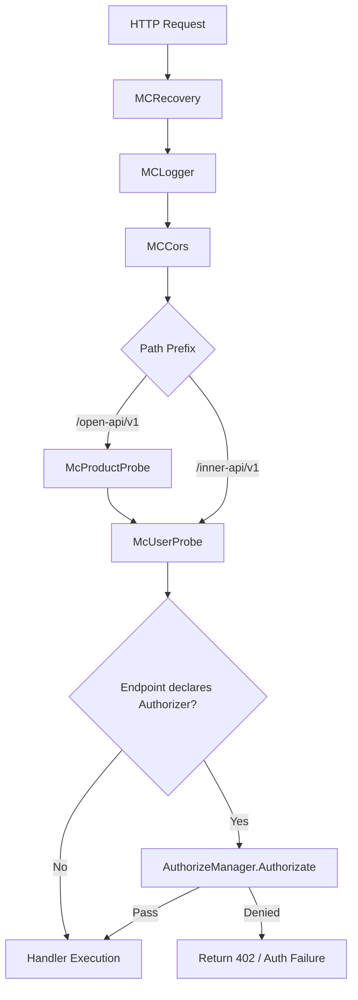

# Chapter 8: Authentication and Authorization Design

## Chapter Goals

The Control Plane of the AI Gateway must provide management capabilities for internal administrators and developers, while also exposing configuration export interfaces to Data Plane components (BFE, Conf Agent). This chapter focuses on the authentication and authorization mechanisms of the Control Plane. After reading this chapter, readers will understand:

- How the Control Plane identifies the identity of a requester;
- How the three types of visitors — users, Session Keys, and Tokens — are managed in a unified way;
- How the Feature-Action permission model works;
- The differences between OpenAPI and InnerAPI in authentication and authorization;
- The execution flow of the authentication middleware chain.

---

## Overall Design of Authentication and Authorization

The authentication and authorization module of `ai-gateway-api` lives in `model/iauth`. It is responsible for visitor identity recognition and permission control for both OpenAPI (Dashboard / third-party integrations) and InnerAPI (BFE / Conf Agent pulling configurations).

This module reuses the design from BFE's historical code in which the `users` table stores both "users" and "Tokens", distinguishing the two types of visitors via the `type` field:

- `type=0`: regular user, mainly for Dashboard administrator login and manual operations;
- `type=1`: Token, mainly for programmatic calls and Conf Agent / BFE pulling InnerAPI.

At the business layer, the two are mapped to `iauth.User` and `iauth.Token` respectively, and are unified under the `Visitor` struct abstraction. `Visitor` implements the `Loginer` interface, uniformly providing the `GetName`, `GetScopes`, `GetType`, and `IsAdmin` methods. Subsequent authorization checks only care about the `Visitor`, not whether the underlying identity is a user or a Token.

Before an HTTP request to the Control Plane reaches the route handler, it first goes through a middleware chain that completes authentication and injects the product line context. The flow is shown in the figure below.



`McUserProbe` reads the `Authorization` header, splits it by space into `Type` and `Identify`, calls `AuthenticateManager.Authenticate` to obtain the `Visitor`, and writes it into the context. If the Endpoint declares an `Authorizer`, an authorization middleware is mounted on the sub-route, calling `AuthorizeManager.Authorizate` to validate Feature-Action permissions and product line binding.

---

## Design of Users, Tokens, and Scopes

### Shared Table for Users and Tokens

The `users` table stores both types of records. Its core fields are as follows:

| Field | Description |
|------|------|
| `id` | Primary key |
| `name` | Username / Token name |
| `type` | `0`=user, `1`=Token |
| `password` | User password (currently stored in plaintext) |
| `ticket` | Session Key or Token value |
| `ticket_created_at` | Session Key creation time |
| `scopes` | Permission scopes, concatenated with commas |

### Four Authentication Methods

The authentication layer defines four authentication methods:

```go
const (
    AuthTypePassword   = "Password" // Password login
    AuthTypeSessionKey = "Session"  // Session Key validation
    AuthTypeToken      = "Token"    // Long-term Token validation
    AuthTypeSkip       = "Skip"     // Debug skip
)
```

| Method | Example Request Header | Applicable Scenario | Writes Session? |
|------|-----------|---------|----------------|
| `Password` | `Authorization: Password <base64(user:pass)>` | Login to obtain a Session Key | Yes, generates a new Session Key and writes it to `ticket` |
| `Session` | `Authorization: Session <session_key>` | Regular OpenAPI calls | No, only checks whether `ticket` has expired |
| `Token` | `Authorization: Token <token_value>` | Programmatic calls / InnerAPI | No, the Token is valid long-term |
| `Skip` | `Authorization: Skip System` | Debugging (requires `SkipTokenValidate=true`) | No, generates a forged Visitor |

A Session Key is generated by encoding 15 bytes of random data with `base64.URLEncoding`. Its validity period is controlled by `RunTime.SessionExpireInDay`. A Token is essentially a record with `type=1`, where the `ticket` field is the Token value, valid long-term.

### Feature-Action Permission Model

Permissions are described by the combination of **Feature (functional dimension)** and **Action (operational dimension)**:

```go
type FeatureAuthorition struct {
    Feature Feature
    Action  Action
}
```

`Feature` is a string, such as `FeatureAPIKey`, `FeatureRoute`, `FeatureToken`. `Action` uses a bitmask:

```go
const (
    ActionDeny    Action = 1 << iota // 000001
    ActionRead                        // 000010
    ActionReadAll                     // 000010 (same value as Read)
    ActionUpdate                      // 000100
    ActionCreate                      // 001000
    ActionDelete                      // 010000
    ActionExport                      // 100000
)
```

Each `xreq.Endpoint` declares the required permissions via `Authorizer`. For example, the API-Key creation endpoint is declared as:

```go
var APIKeyCreateRoute = &xreq.Endpoint{
    Path:   "/api-keys",
    Method: http.MethodPost,
    Authorizer: iauth.FA(iauth.FeatureAPIKey, iauth.ActionCreate),
}
```

`FA(Feature, Action)` only validates Feature-Action; `FAP(Feature, Action)` additionally validates the binding between the Visitor and the current product line.

The global `scope2permission` defines the mapping from Scopes to permissions:

| Scope | Meaning | Permission Range |
|-------|------|---------|
| `System` | System administrator | All Actions for all Features |
| `Support` | Export/support Token | Only some Features have `ActionExport` |

`AuthorizeManager.Authorizate` performs the following steps:

1. Retrieve the `Visitor` from the context;
2. If `Visitor.IsAdmin()` is true, allow the request directly;
3. Iterate over `Visitor.GetScopes()` and look up the Action bitmap of the corresponding Feature in `scope2permission`;
4. Determine whether the required Action is allowed;
5. If `authorizer.ValidateProduct == true`, additionally call `IsVisitorProductGranted` to validate the product line binding.

> Note: The `Product` Scope has been removed from OpenAPI, user `is_admin` only supports `true`, and the Token `scope` only retains `System` and `Support`. The `user_products` table is kept for future multi-tenant extensions.

---

## Authorization Differences Between OpenAPI and InnerAPI

| Dimension | OpenAPI (`/open-api/v1`) | InnerAPI (`/inner-api/v1`) |
|------|--------------------------|----------------------------|
| Visitor | Dashboard user / third-party integration Token | Conf Agent / BFE Token |
| Middleware | `McProductProbe` + `McUserProbe` | `McUserProbe` only |
| Permission Granularity | Feature-Action + product line binding | Usually Feature-Action only |
| Token Scope | `System` / `Support` | `System` / `Support` |
| Typical Use | Configuration management | Configuration export |

Although InnerAPI export endpoints (such as `/configs/mod-api-key`) also perform authentication and authorization on visitors, Conf Agent usually pulls configurations with a Token of the `Support` Scope, whose permission range is narrow, avoiding exposure of management-plane capabilities.

---

## Key Data Models

### `users` Table

```sql
CREATE TABLE users (
    id BIGINT PRIMARY KEY AUTO_INCREMENT,
    name VARCHAR(255) NOT NULL COMMENT 'Username/Token name',
    type TINYINT NOT NULL DEFAULT 0 COMMENT '0=user, 1=Token',
    password VARCHAR(255) DEFAULT NULL COMMENT 'User password',
    ticket VARCHAR(255) DEFAULT NULL COMMENT 'Session Key or Token value',
    ticket_created_at DATETIME DEFAULT NULL,
    scopes VARCHAR(255) DEFAULT NULL COMMENT 'Permission scopes, comma-separated',
    UNIQUE KEY uk_name_type (name, type)
);
```

### `user_products` Table

```sql
CREATE TABLE user_products (
    id BIGINT PRIMARY KEY AUTO_INCREMENT,
    user_id BIGINT NOT NULL,
    product_name VARCHAR(255) NOT NULL,
    UNIQUE KEY uk_user_product (user_id, product_name)
);
```

`user_products` records the binding between users and product lines. The current version retains the table structure in preparation for future multi-tenant extensions.

---

## Chapter Summary

This chapter introduced the authentication and authorization design of the Rainway AI Gateway Control Plane:

- `model/iauth` serves both OpenAPI and InnerAPI; users and Tokens share the `users` table and are unified under the `Visitor` abstraction;
- There are four authentication methods — Password, Session, Token, and Skip — applicable to login, regular calls, programmatic calls, and debugging scenarios respectively;
- Authorization adopts the Feature-Action bitmask model; each Endpoint declares its required permissions, and Scopes determine the permission range;
- The authentication and authorization chains differ between OpenAPI and InnerAPI; InnerAPI usually only goes through `McUserProbe`;
- The `user_products` table is retained in preparation for future multi-tenant extensions.

API-Keys, as the actual calling credentials facing business parties, will be detailed in [Chapter 11: API-Key Design](./chapter09-apikey-design.md), covering their generation, validation, lifecycle, and the inheritance mechanism of their association with Entities.

---

## References

- `ai-gateway-api/design-docs/sys-design/details/认证授权机制.md`
- `ai-gateway-api/design-docs/api-define/OpenAPI接口定义/auth.md`
- `ai-gateway-api/model/iauth/`
- `ai-gateway-api/endpoints/middleware/`
