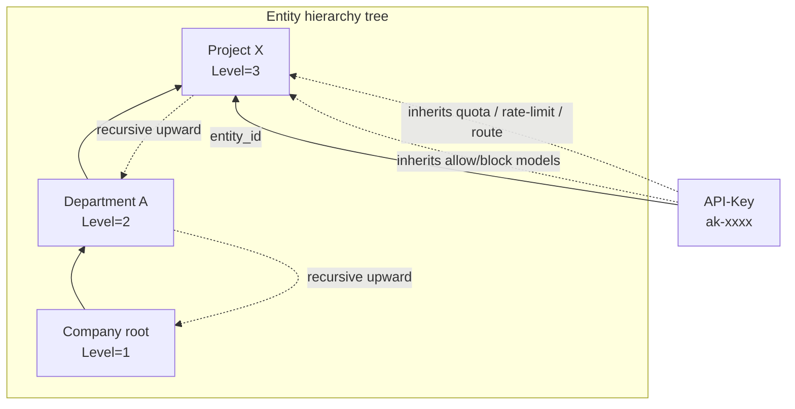

# Chapter 9: Entity and API-Key Design

## Chapter Goals

Entity and API-Key are the two core concepts on the consumer side of the Rainway AI Gateway. Entity represents the business organizational structure (such as company, department, team, and project) and is the unit that carries policies such as the model allowlist, quota, rate limiting, and routing; API-Key is the core credential used by business systems to call the Data Plane, which inherits policies by being mounted to an Entity and can also have its own independent configuration. Together, the two constitute the mount points for capabilities such as quota, rate limiting, routing, and cost accounting. By reading this chapter, readers will understand:

- The Entity data model, the hierarchy tree constraints, and the model inheritance rules;
- The API-Key data model, generation and validation, and the full lifecycle;
- How API-Key is mounted to an Entity and inherits its policies;
- How API-Key is bound to quota, rate limiting, and routing rules and exported to the BFE Data Plane;
- How the final effective rules take shape in the Data Plane.

---

## Entity Data Model and Hierarchy Tree

### Entity and Entity-Type

An Entity is a business organizational unit, such as a company, department, project team, or individual. Through the `parent_id` field, Entities form a hierarchy tree from the bottom up. Their types are defined by the `entity_types` table, and each Entity-Type has a `Level` (1–5; the smaller the number, the higher the level).

When creating or updating an Entity, the hierarchy constraints must be satisfied:

- The parent Entity must exist;
- The parent Entity's Entity-Type Level must be **less than** the current Entity's Level.

That is, the hierarchy can only point from a higher level to a lower level; same-level or reverse references are not allowed, thereby preventing cycles.

### Model Inheritance Rules

An Entity can be configured with `allow_models` and `block_models`, and the API-Keys mounted on it inherit these model policies:

- `allow_models`: inherited by intersection. The non-empty `allow_models` of all levels that do not contain `*` are intersected; if a level is `*` or an empty array, it is treated as unrestricted and does not participate in the intersection.
- `block_models`: inherited by union. All non-empty `block_models` in the hierarchy are unioned.
- The API-Key's own `models` also participates in the final intersection.

For example, suppose an Entity hierarchy is as follows:

| Entity | allow_models | block_models |
|--------|-------------|--------------|
| Company root | `["*"]` | `[]` |
| Department A | `["gpt-4", "gpt-3.5-turbo"]` | `["gpt-4-32k"]` |
| Project X | `["gpt-4", "claude-3"]` | `["davinci"]` |
| API-Key | `[]` (not set) | `[]` |

The final allowed models are the intersection of Department A and Project X: `["gpt-4"]`; the final blocked models are `["gpt-4-32k", "davinci"]`. If the API-Key itself also has a non-empty allowlist, it is intersected with the result above; when the intersection is empty, the API-Key is disabled at export time (`Enabled=false`).

### Entity-Level Policy Binding

Each Entity can be independently configured with:

- `quota_plan_id`: the quota plan;
- `rate_limit_policy_id`: the rate limit policy;
- `route_rules_id`: the routing rules.

These policies work together with the API-Key's own policies, producing a multi-layer policy stacking effect.

---

## API-Key Data Model

The API-Key is the credential used by business systems when calling LLM services. Its core fields are as follows:

| Field | Type | Description |
|------|------|------|
| `id` | string | System-generated unique identifier, used internally |
| `key` | string | The API-Key value used for request header authentication |
| `description` | string | Description |
| `enabled` | bool | Whether it is enabled |
| `expired_time` | int64 | `-1` means never expires; otherwise the Unix expiration time in seconds |
| `unlimited_quota` | bool | Whether to skip quota checks |
| `models` | []string | Allowlist of accessible models, `["*"]` means unrestricted |
| `subnet` | []string | Allowed client subnets, `["*"]` means unrestricted |
| `entity_id` | string | The ID of the mounted Entity; empty means not mounted |

These fields determine whether the API-Key is usable in the Data Plane, the range of callable models, the range of client networks it can originate from, and whether it is subject to quota constraints. The `key` field is the credential value that the business party actually places in the HTTP request header, while `id` is only used for internal association in the Control Plane.

---

## API-Key Generation and Validation

### Generation Rules

When creating an API-Key, an existing external Key can be imported via the `key` parameter; if not provided, a new Key value is generated by the backend. The validity constraints on `key` are as follows:

- Length 1–128 characters;
- Only uppercase and lowercase letters, digits, hyphen `-`, and underscore `_` are allowed;
- Globally unique.

The backend generation logic is shown in the following pseudocode:

```go
if param.Key != nil && *param.Key != "" {
    // Validate the format and global uniqueness
}
// Generate the default Key and bind QuotaPlan, RateLimitPolicy, RouteRules
```

### Data Plane Validation

When forwarding requests, the Data Plane BFE validates the API-Key through the `mod_ai_token_auth` module:

1. Extract the Key value from the request header `Authorization: Bearer <api-key>`;
2. Check whether the Key exists in the exported API-Key configuration;
3. Check whether `enabled` is true;
4. Check whether `expired_time` has been reached;
5. Check whether the request source IP is within the range allowed by `subnet`.

After all checks pass, the request proceeds to the quota, rate limiting, and routing stages. Any failed check returns the corresponding error response.

---

## API-Key Lifecycle

The API-Key lifecycle is managed by the following OpenAPI endpoints:

| Endpoint | Method | Description |
|------|------|------|
| `POST /api-keys` | Create | Can import an external Key; cascades creation of quota/rate limit/routing configuration |
| `GET /api-keys` | List query | Supports filtering by enabled status, Entity, and whether quota is unlimited |
| `GET /api-keys/{id}` | Detail query | Returns the complete nested structure, including the QuotaPlan Balance |
| `PUT /api-keys/{id}` | Full update | Replaces all fields except `key` |
| `PATCH /api-keys/{id}` | Partial update | Updates only the fields provided |
| `DELETE /api-keys/{id}` | Delete | Cascades deletion of its dedicated configuration and cleans up the Redis Key |
| `POST /api-keys/{id}/quota-plan/reset` | Reset quota | Resets used/remaining; quota can be modified |

Key state transition rules:

- When `enabled=false` or `expired_time` is reached, validation fails in the Data Plane and the request is rejected;
- When deleting an API-Key, its dedicated `quota_plan`, `rate_limit_policy`, and `route_rules` are deleted along with the underlying resources (if not referenced by other objects), and the corresponding Redis Key is cleaned up via `quotaCache.DeleteKeys`;
- When modifying `quota_plan.quota` (with the unit unchanged), `used` is preserved and adjusted as `remaining = max(0, new quota - used)`; when modifying `unit` or `unlimited`, `used` is reset to 0.

---

## Relationship Between API-Key and Entity

An API-Key is mounted to an Entity through the `api_keys.entity_id` field. After being mounted, the API-Key retains its own configuration while also inheriting the policies of the Entity hierarchy upward.



The core behaviors after the association include:

1. **Model allowlist/blocklist merging**: the final callable model list is generated according to the intersection/union rules;
2. **Quota plan hierarchy collection**: starting from the API-Key itself, walk up the Entity chain and collect all quota plans that are not unlimited;
3. **Rate limit policy hierarchy collection**: likewise walk upward and collect all enabled rate limit policies;
4. **Routing rule hierarchy binding**: bind in the priority order of API-Key level → direct Entity level → parent Entity level → Global level.

`APIKeyManager.populateAssociatedData` automatically populates the following when querying API-Key details:

- `QuotaPlan` (including the real-time Balance);
- `RateLimitPolicy`;
- `RouteRules`;
- `Entity` summary (id, name, type).

---

## Binding API-Key to Quota, Rate Limit, and Routing Rules

### Quota Plan Hierarchy Merging

When exporting to BFE, `APIKeyRuleManager.fetchQuotaPlansWithEntityHierarchy` performs the following collection logic:

1. If the API-Key itself has a non-unlimited quota plan configured, add it to the result first;
2. If the API-Key is mounted to an Entity, recursively collect all non-unlimited quota plans in the Entity hierarchy upward;
3. All unlimited quota plans do not participate in the export, but they still affect the tag collection at the Entity hierarchy.

Each quota plan is exported as BFE's `QuotaPlan`:

```go
type QuotaPlan struct {
    Id          string
    Unlimited   bool
    PassNoQuota bool
    RedisKey    string
    ExpiredTime int64 // -1 means never expires
    Quota       int64
    Unit        string
}
```

- The `RedisKey` of the API-Key's own quota plan is `QUOTA_<api_key_value>`;
- The `RedisKey` of an Entity quota plan is `QUOTA_<entity_id>`.

This means a single API-Key may be subject to quota control by multiple Redis Keys at the same time, and the BFE side must support multi-quota validation.

Boundary fallback: if the API-Key's `unlimited_quota=false` but all related quota plans have `unlimited=true`, the `QuotaPlans` exported to BFE will be empty. BFE treats `UnlimitedQuota=false & QuotaPlans=[]` as invalid, so the export layer falls back to correcting the Token's `UnlimitedQuota` to `true`, ensuring the configuration can be loaded. This fallback does not modify the original values in the database.

### Rate Limit Policy Hierarchy Merging

The collection logic for rate limit policies is similar to that of quota plans. `RateLimitPolicyManager.fetchRateLimitPolicyIDsWithEntityHierarchy` first collects the API-Key's own policy, then recursively collects all enabled policies in the Entity hierarchy upward. At export time, each policy generates an `rlp-<policy_id>` and is bound to the API-Key.

### Routing Rule Hierarchy Binding

When the AI routes are exported, each API-Key binds to routing tables in the following priority order:

1. API-Key-level routing rules;
2. Entity-level routing rules (traversed bottom-up);
3. Global-level routing rules.

The binding order is `apikey_xxx` → `entity_xxx` (direct Entity) → `entity_<parent>` → ... → `global_default`. BFE matches in this order; typically the API-Key-level rule is matched first, then the Entity rules at each level, and finally the Global fallback rule.

---

## Key Data Model Examples

### `entity_types` Table

```sql
CREATE TABLE entity_types (
    id BIGINT PRIMARY KEY AUTO_INCREMENT,
    name VARCHAR(64) NOT NULL UNIQUE,
    level INT NOT NULL COMMENT 'Hierarchy level; the smaller the number, the higher the level',
    create_time BIGINT NOT NULL,
    update_time BIGINT NOT NULL
);
```

### `entities` Table

```sql
CREATE TABLE entities (
    id VARCHAR(64) PRIMARY KEY,
    name VARCHAR(255) NOT NULL UNIQUE,
    type VARCHAR(64) NOT NULL,
    parent_id VARCHAR(64) DEFAULT NULL,
    allow_models TEXT COMMENT 'JSON array',
    block_models TEXT COMMENT 'JSON array',
    quota_plan_id BIGINT DEFAULT NULL,
    rate_limit_policy_id BIGINT DEFAULT NULL,
    route_rules_id BIGINT DEFAULT NULL,
    create_time BIGINT NOT NULL,
    update_time BIGINT NOT NULL
);
```

### `api_keys` Table

```sql
CREATE TABLE api_keys (
    id VARCHAR(64) PRIMARY KEY,
    key VARCHAR(128) NOT NULL UNIQUE,
    description VARCHAR(512) NOT NULL,
    enabled TINYINT NOT NULL DEFAULT 1,
    expired_time BIGINT DEFAULT -1,
    unlimited_quota TINYINT NOT NULL DEFAULT 0,
    models TEXT COMMENT 'JSON array',
    subnet TEXT COMMENT 'JSON array',
    quota_plan_id BIGINT DEFAULT NULL,
    rate_limit_policy_id BIGINT DEFAULT NULL,
    route_rules_id BIGINT DEFAULT NULL,
    entity_id VARCHAR(64) DEFAULT NULL COMMENT 'ID of the mounted Entity',
    create_time BIGINT NOT NULL,
    update_time BIGINT NOT NULL
);
```

---

## Chapter Summary

This chapter described in detail the two core concepts on the consumer side of the Rainway AI Gateway — Entity and API-Key:

- **Entity data model**: the `entities` and `entity_types` tables jointly express the business organizational structure, forming a hierarchy tree constrained by `parent_id` and `level`;
- **Model inheritance**: `allow_models` in the Entity hierarchy are intersected and `block_models` are unioned, and the final result together with the API-Key's own allowlist determines the usable models;
- **Entity-level policy binding**: each Entity can independently bind a quota plan, a rate limit policy, and routing rules, serving as the source of policies inherited by API-Keys;
- **API-Key data model**: the `api_keys` table records key fields such as the Key value, enabled status, expiration time, model allowlist, subnet restriction, and mounted Entity;
- **Generation and validation**: supports external Key import and backend generation; the Data Plane BFE performs multi-dimensional validation such as validity, expiration, and subnet in `mod_ai_token_auth`;
- **Lifecycle**: creation, query, update, deletion, and quota reset are all performed via OpenAPI; deletion cascades cleanup of the dedicated configuration and the Redis Key;
- **Policy binding and export**: after an API-Key is mounted to an Entity, its own policies are merged with the Entity hierarchy policies, forming the final effective multi-Redis-Key quota, multi-rate-limit-policy, and multi-level routing bindings.

Understanding the design of Entity and API-Key is the foundation for correctly configuring quota, rate limiting, and routing rules, and is also key to troubleshooting Data Plane permission and policy issues.

---

## References

- `ai-gateway-api/design-docs/sys-design/details/API-Key与Entity关联及模型继承.md`
- `ai-gateway-api/design-docs/api-define/OpenAPI接口定义/api-keys.md`
- `ai-gateway-api/design-docs/api-define/OpenAPI接口定义/entities.md`
- `ai-gateway-api/model/api_key/`
- `ai-gateway-api/model/entity/`
