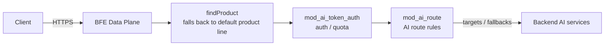
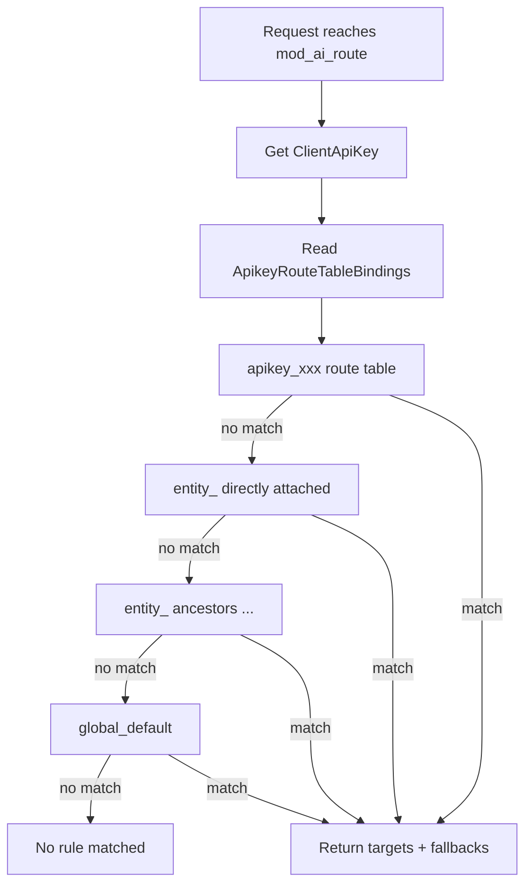

# Chapter 11: AI Route Rule Design

## Chapter Goals

In an AI gateway scenario, the forwarding target of a request is determined entirely by AI route rules. This chapter will help readers:

- Understand where AI route rules sit in the request processing pipeline;
- Understand the three-level organization of AI route tables: Global / Entity / API-Key;
- Master the data model, validation rules, and lifecycle consistency of the `route_rules` table;
- Learn how AI route rules are exported to BFE, including binding order and file format;
- Master the design and configuration of Fallback and the default route.

## Where AI Route Rules Sit in the Request Processing Pipeline

In AI gateway mode, BFE handles requests through a dedicated `ServeHTTPForAI()` path. This path still calls `findProduct()`, but unlike traditional BFE, which matches a product by hostname, the AI gateway scenario configures a default product line in the host table (`defaultProduct`, corresponding to the Control Plane's `AIRouteInnerProductName`). Therefore, `findProduct()` falls back to that default product, which is used only to load the module configuration context of that product line; **traditional product-level BFE route rules are not used to select the target Cluster**. The final model and cluster a request is forwarded to is determined entirely by the `mod_ai_route` module based on AI route rules.

AI route rules are executed at the `HandleFoundProduct` stage, after `mod_ai_token_auth` authentication and before `mod_ai_rate_limit` rate limiting. Each rule contains:

- A match condition `Cond`;
- One or more `targets` (cluster + model + weight);
- Optional `fallbacks` (a list of fallback targets).



The diagram above shows the request pipeline in AI gateway mode: product identification falls back to the default product line, which serves only the middleware and configuration context; the actual forwarding target is determined by AI route rules.

## Three-Level AI Route Tables: Global / Entity / API-Key

An AI route table is a collection of AI route rules. The `route_rules` table distinguishes levels via `type` and `owner`.

### Global Route Table

- Unique record: `type=global, owner=global`.
- OpenAPI endpoints: `GET /global-route-rules`, `PUT /global-route-rules`.
- During system initialization, `stateful/container/rdb/components.go:Init()` calls `RouteRulesManager.EnsureGlobalRouteRules` to automatically create a default record (`enabled=false`, `rules=[]`), ensuring that administrators see the Global Route Table the first time they open the route management page.
- If the record already exists it will not be overwritten; when it does not exist, `PUT` creates it automatically.
- The Global Route Table is the last-resort fallback for all requests. It is typically configured with a `default_t()` rule as the default route.

### Entity Route Table

- Record identifier: `type=entity, owner=<entity_id>`.
- Entity route tables are not maintained through a dedicated endpoint; instead, they are written together as an embedded object when an Entity is created or updated, corresponding to the `entities.route_rules_id` foreign key.
- When creating an Entity, if `route_rules` is not provided, the system writes `enabled=false`, `rules=[]` by default.

### API-Key Route Table

- Record identifier: `type=apikey, owner=<apikey_id>`.
- Similar to Entity, API-Key route tables are written as embedded objects when an API-Key is created or updated, corresponding to `api_keys.route_rules_id`.
- When not provided, `enabled=false`, `rules=[]` is likewise written by default.

### Listing Route Tables

`GET /route-tables` paginates the metadata of all route tables. It returns only `type`, `owner`, and `enabled`, not the `rules` details:

```json
{
    "id": 1,
    "type": "global",
    "owner": "global",
    "enabled": true
}
```

### Binding Priority

For each API-Key, the lookup order seen by BFE is:

1. `apikey_<key>` (API-Key level)
2. `entity_<entity_name>` (the directly attached Entity)
3. `entity_<parent_name>` ... (all ancestor Entities traversed upward along `parent_id`)
4. `global_default` (Global level)

BFE matches in this list order: typically the API-Key level rules hit first, then the rules of each Entity level in turn, and finally the Global fallback rule.

This top-down priority design aligns with organizational management habits: API-Key level rules are the finest-grained and can satisfy special needs of individual applications or users; Entity level rules connect the upper and lower levels, suiting unified scheduling at the department or project level; and Global level rules serve as the default policy for the entire system, preventing any request from being rejected outright simply because no rule matched it.



The diagram above shows the three-level lookup flow of AI route tables: the next level is only consulted when all rules at the current level fail to match; any level that matches returns the result immediately.

## Design and Management of the route_rules Table

### Table Structure

```sql
CREATE TABLE route_rules (
    id BIGINT AUTO_INCREMENT PRIMARY KEY,
    type VARCHAR(64) NOT NULL COMMENT 'global / entity / apikey',
    owner VARCHAR(255) NOT NULL COMMENT 'global for global, entity_id for Entity, apikey_id for API-Key',
    enabled TINYINT(1) NOT NULL DEFAULT 1,
    rules JSON NOT NULL COMMENT 'rule array',
    created_at DATETIME NOT NULL DEFAULT CURRENT_TIMESTAMP,
    updated_at DATETIME NOT NULL DEFAULT CURRENT_TIMESTAMP ON UPDATE CURRENT_TIMESTAMP,
    UNIQUE KEY uk_route_rules_type_owner (type, owner)
);
```

Field descriptions:

- `type`: route table type; one of `global`, `entity`, `apikey`.
- `owner`: owner identifier. Fixed to `global` for Global; `entity_id` for Entity; `apikey_id` for API-Key.
- `enabled`: whether the route table is enabled. Disabled route tables are not exported to BFE and are not added to the binding list.
- `rules`: the rule JSON array.

### Rule JSON Structure

The JSON structure of a single AI route rule is as follows:

```json
{
    "name": "rule-1",
    "cond": "req_body_json_in(\"model\", \"gpt-4\", false)",
    "targets": [
        {"cluster_name": "cluster-openai", "model": "gpt-4", "weight": 80},
        {"cluster_name": "cluster-azure", "model": "gpt-4", "weight": 20}
    ],
    "fallbacks": [
        {"cluster_name": "cluster-fallback", "model": "gpt-3.5-turbo"}
    ]
}
```

Field descriptions:

- `name`: rule name, unique within the same route table.
- `cond`: BFE condition expression; the rule is used when this matches.
- `targets`: list of forwarding targets, containing `cluster_name`, `model`, `weight`. An empty `model` means pass-through of the original model; the sum of all `weight` values within the same rule must equal 100.
- `fallbacks`: list of fallback targets, optional; tried in order.

### Go Model

The corresponding Go struct definitions on the Control Plane are located in `ai-gateway-api/model/shared/types.go`:

```go
type AiRouteRuleParam struct {
    Name      *string                `json:"name"`
    Cond      *string                `json:"cond"`
    Targets   []*AiRouteTargetParam  `json:"targets"`
    Fallbacks []*AiRouteFallbackParam `json:"fallbacks,omitempty"`
}

type AiRouteTargetParam struct {
    ClusterName *string `json:"cluster_name"`
    Model       *string `json:"model"`
    Weight      *int    `json:"weight"`
}

type AiRouteFallbackParam struct {
    ClusterName *string `json:"cluster_name"`
    Model       *string `json:"model"`
}
```

### Management Methods

- **Global Route Table**: managed independently via `GET /global-route-rules` and `PUT /global-route-rules`.
- **Entity / API-Key route tables**: managed as embedded objects via the create/update endpoints of Entities or API-Keys; no dedicated endpoints are exposed.
- **Route table metadata**: paginated via `GET /route-tables`.

## Route Rule Validation and Lifecycle Consistency

### Validation Rules

When creating or updating route rules, `RouteRulesManager.validateRouteRules` performs unified validation:

1. The rule name is required and must not be duplicated within the same route table;
2. `cond` is required and must not be empty;
3. `targets` must not be empty;
4. Every target must have a `weight`;
5. The sum of all target `weight` values within the same rule must equal 100;
6. A Fallback's `cluster_name` must not be empty.

The OpenAPI layer additionally requires:

- `cond` must be a valid BFE condition expression;
- `cluster_name` must be an existing cluster;
- if `model` is not empty, it must be a model already configured in that cluster's `llm_config.models`;
- within the same `targets` array, the `(cluster_name, model)` combination must not be duplicated.

> Note: at save time, `validate.ConditionExpression` performs BFE expression syntax validation on `cond` (internally calling `condition.Build`); expressions with syntax errors cannot be written to the database. The Dashboard or `RouteRuleManager.ExpressionVerify` provides the same pre-validation capability.

### Lifecycle Consistency

AI route rules keep their lifecycle consistent with that of API-Keys / Entities:

- **Create**: when creating an API-Key or Entity with `route_rules` provided, a `route_rules` record is created in sync, and the generated `id` is written back to `api_keys.route_rules_id` or `entities.route_rules_id`.
- **Update**: when updating with `route_rules` provided, an existing `route_rules_id` is updated; if none exists, a new record is created and written into the foreign key.
- **Delete**: deleting an API-Key or Entity cascades to delete its associated `route_rules` record.
- **Switching Entities**: when an API-Key switches from one Entity to another, the API-Key's own `route_rules_id` remains unchanged, and at export time it is automatically bound to the new Entity's route table.
- **Entity name change**: the exported Key `entity_<name>` changes, and BFE must reload.

| Scenario | Behavior |
|---|---|
| Route table `enabled=false` | Not exported to BFE, and not added to the binding list |
| API-Key has no Entity attached | Bound only to its own route table + the Global Route Table |
| Neither API-Key nor Entity has a route table configured | Bound only to the Global Route Table (if enabled) |
| Global Route Table disabled | No global fallback; requests may end up with no rule to match |
| Referenced Cluster deleted | Cluster deletion fails validation; references must be removed or rules deleted first |

## Binding Order and File Format Exported to BFE

### Export Structure

The Control Plane exports AI route rules via InnerAPI as `ai_route.json` (ultimately landing as BFE's `ai_route.data`). The exported Go structure is:

```go
type AiRouteDataExport struct {
    Version                  string                    `json:"Version"`
    RouteRules               map[string]*RouteTableExport `json:"RouteRules"`
    ApikeyRouteTableBindings map[string][]string       `json:"ApikeyRouteTableBindings"`
}
```

### Route Table Naming

| Type | Export Key | Owner Field | `route_rules.type` Value |
|---|---|---|---|
| API-Key | `apikey_<api_key_value>` | The API-Key's key value | `apikey` |
| Entity | `entity_<entity_name>` | The Entity's name | `entity` |
| Global | `global_default` | `global` | `global` |

> Note: the `RouteRulesTypeAPIKey` constant has been corrected from `"api_key"` to `"apikey"`, keeping it consistent with the export Key and the BFE-side convention. Historical records with `type="api_key"` should be migrated to `"apikey"`.

### Binding Order

For each API-Key, the binding list is appended in the following order:

1. `apikey_<key>` (API-Key level)
2. `entity_<entity_name>` (the directly attached Entity)
3. `entity_<parent_name>` ... (all ancestor Entities traversed upward along `parent_id`)
4. `global_default` (Global level)

The core logic can be simplified to:

```go
for _, apiKey := range apiKeys {
    var bindingList []string

    // 1. API-Key level
    if apiKey.RouteRulesID != nil && enabled {
        bindingList = append(bindingList, fmt.Sprintf("apikey_%s", *apiKey.Key))
    }

    // 2. Entity level (traverse the hierarchy bottom-up)
    currentEntityID := apiKey.EntityID
    for currentEntityID != nil && *currentEntityID != "" {
        entity := entityMap[*currentEntityID]
        if entity.RouteRulesID != nil && *entity.RouteRulesID != "" {
            bindingList = append(bindingList, fmt.Sprintf("entity_%s", *entity.Name))
        }
        currentEntityID = entity.ParentID
    }

    // 3. Global level
    if globalRouteRules != nil && enabled {
        bindingList = append(bindingList, "global_default")
    }

    bindings[*apiKey.Key] = bindingList
}
```

### File Format

`ai_route.data` is the rule configuration file of BFE's `mod_ai_route` module. Field descriptions are in `bfe/docs/zh_cn/configuration/mod_ai_route/ai_route.data.md`:

- `Version`: configuration file version, usually in timestamp format;
- `route_rules`: the set of route tables, keyed by route table name;
- `route_rules[k].type`: route table type; one of `apikey`, `entity`, `global`;
- `route_rules[k].owner`: route table owner;
- `route_rules[k].rules`: list of rules, matched in order;
- `ApikeyRouteTableBindings`: bindings from API-Keys to lists of route table names, matched in order.

## Fallback and the Default Route

### Fallback Mechanism

Fallback provides degradation when all `targets` of a rule are unavailable. Typical errors that trigger Fallback include:

- Connection failure;
- Timeout;
- Backend returns 5xx.

Scenarios that do not trigger Fallback include:

- Client-side 4xx;
- Authentication failure;
- Rate limit rejection.

When Fallback is triggered, BFE constructs new targets in the order of the `fallbacks` list, calling `clusterInvoke()` again for each; it stops at the first success, and if all fail, returns the error response of the last fallback.

Two points to note when designing Fallback: first, the Fallback list itself does not perform weighted selection but is tried strictly linearly in array order; second, the `model` in a Fallback can likewise be empty, meaning pass-through of the original model. Operators usually put lower-cost or higher-capacity clusters in Fallback, so they can take over traffic quickly when the primary targets fail.

### Default Route

The Global Route Table is usually configured with a `default_t()` rule as the default route, ensuring that any request that does not match a finer-grained rule still has somewhere to go. For example:

```json
{
    "name": "global-default",
    "cond": "default_t()",
    "targets": [
        {"cluster_name": "cluster_global", "model": "", "weight": 100}
    ],
    "fallbacks": []
}
```

If the Global Route Table is disabled or has no default rule configured, and the API-Key and Entity route tables all fail to match, a request may have no rule to match and ultimately returns 404. Therefore, it is strongly recommended to enable the Global fallback route in production.

## Route Rule Configuration Examples

### Global Route Table Example

```json
{
    "enabled": true,
    "rules": [
        {
            "name": "global-default",
            "cond": "default_t()",
            "targets": [
                {"cluster_name": "cluster_global", "model": "", "weight": 100}
            ],
            "fallbacks": []
        }
    ]
}
```

### Entity Route Table Example

```json
{
    "enabled": true,
    "rules": [
        {
            "name": "dept-ai-default",
            "cond": "req_host_in(\"ai.dept.example.com\")",
            "targets": [
                {"cluster_name": "cluster_dept_ai", "model": "", "weight": 100}
            ],
            "fallbacks": []
        }
    ]
}
```

### API-Key Route Table Example

```json
{
    "enabled": true,
    "rules": [
        {
            "name": "user-a-deepseek",
            "cond": "req_body_json_in(\"model\", \"deepseek-v4-pro\", false)",
            "targets": [
                {"cluster_name": "cluster_deepseek_a", "model": "deepseek-v4-pro", "weight": 70},
                {"cluster_name": "cluster_deepseek_b", "model": "deepseek-v4-pro", "weight": 30}
            ],
            "fallbacks": [
                {"cluster_name": "cluster_deepseek_c", "model": "deepseek-v3.2"}
            ]
        }
    ]
}
```

### Exported `ai_route.data` Example

```json
{
    "Version": "20260720150000",
    "route_rules": {
        "apikey_ak_user_a": {
            "type": "apikey",
            "owner": "ak_user_a",
            "rules": [
                {
                    "name": "user-a-deepseek",
                    "Cond": "req_body_json_in(\"model\", \"deepseek-v4-pro\", false)",
                    "targets": [
                        {"ClusterName": "cluster_deepseek_a", "Model": "deepseek-v4-pro", "Weight": 70},
                        {"ClusterName": "cluster_deepseek_b", "Model": "deepseek-v4-pro", "Weight": 30}
                    ],
                    "fallbacks": [
                        {"ClusterName": "cluster_deepseek_c", "Model": "deepseek-v3.2"}
                    ]
                }
            ]
        },
        "entity_dept_ai": {
            "type": "entity",
            "owner": "dept_ai",
            "rules": [
                {
                    "name": "dept_ai-default",
                    "Cond": "default_t()",
                    "targets": [
                        {"ClusterName": "cluster_dept_ai", "Model": "", "Weight": 100}
                    ],
                    "fallbacks": []
                }
            ]
        },
        "global_default": {
            "type": "global",
            "owner": "global",
            "rules": [
                {
                    "name": "global-default",
                    "Cond": "default_t()",
                    "targets": [
                        {"ClusterName": "cluster_global", "Model": "", "Weight": 100}
                    ],
                    "fallbacks": []
                }
            ]
        }
    },
    "ApikeyRouteTableBindings": {
        "ak_user_a": [
            "apikey_ak_user_a",
            "entity_dept_ai",
            "global_default"
        ]
    }
}
```

> Note: the route configuration InnerAPI exports to BFE keeps capitalized field names such as `Cond`, `ClusterName`, `Model`, and `Weight`. These are field names mandated by the BFE Data Plane and constitute the exception described in `00-common.md`.

## Chapter Summary

This chapter introduced the AI route rule design of the Rainway AI Gateway:

- In AI gateway mode, the forwarding target of a request is determined entirely by AI route rules; traditional product-level BFE route rules do not participate in Cluster selection;
- AI route tables are divided into three levels — Global, Entity, and API-Key — with the binding order API-Key → Entity (bottom-up) → Global;
- The `route_rules` table distinguishes levels via `type` and `owner`, and rules are stored as a JSON array;
- The Control Plane validates rule names, conditions, weights, and Fallbacks at save time, and keeps the lifecycle consistent with that of API-Keys / Entities;
- AI route rules are exported via InnerAPI as `ai_route.json` and land in BFE as `ai_route.data`; `ApikeyRouteTableBindings` determines the lookup order;
- Fallback provides ordered degradation when targets are unavailable, and the Global default route serves as the last-resort fallback; together they improve routing reliability.

## References

- `ai-gateway-api/design-docs/sys-design/details/路由规则管理.md`
- `ai-gateway-api/design-docs/api-define/OpenAPI接口定义/global-route-rules.md`
- `ai-gateway-api/design-docs/api-define/OpenAPI接口定义/route-tables.md`
- `ai-gateway-api/design-docs/api-define/OpenAPI接口定义/00-common.md`
- `bfe/docs/zh_cn/configuration/mod_ai_route/ai_route.data.md`
- `bfe/docs/zh_cn/sys_design/mod_ai_route.md`
- `ai-gateway-api/model/shared/types.go`
- `ai-gateway-api/model/route_rules/route_rules.go`
- `ai-gateway-api/model/imods/ai_route_exporter.go`
- `bfe/bfe_modules/mod_ai_route/mod_ai_route.go`
