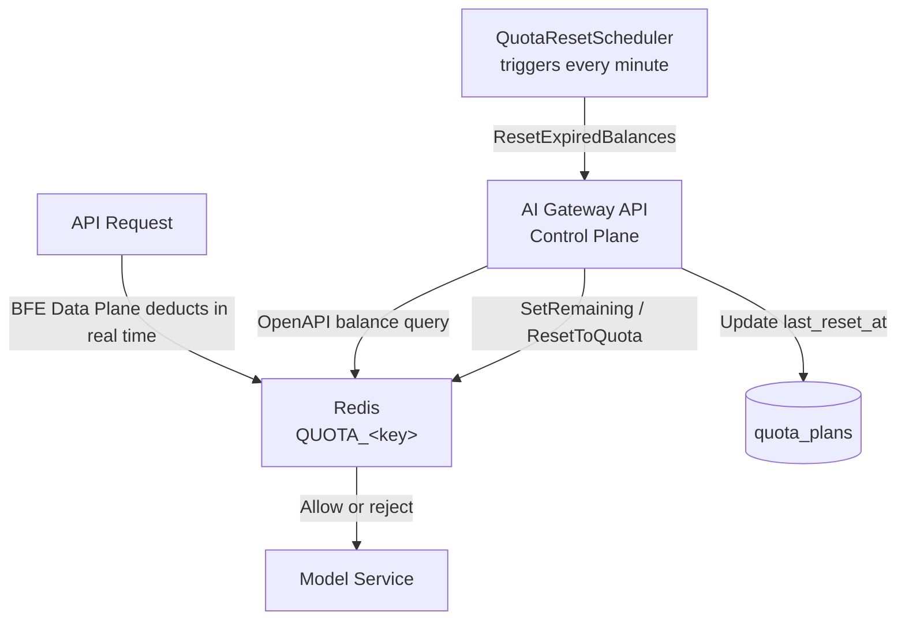
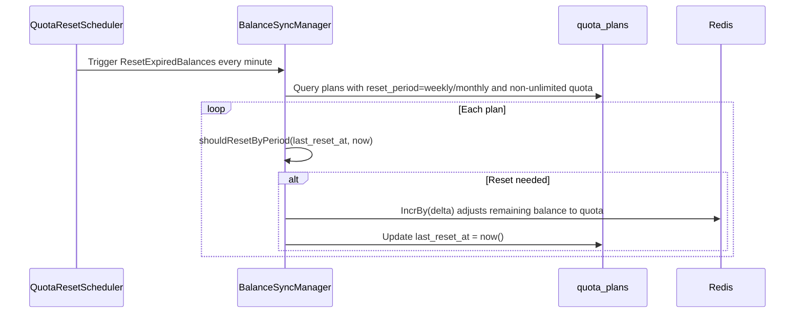
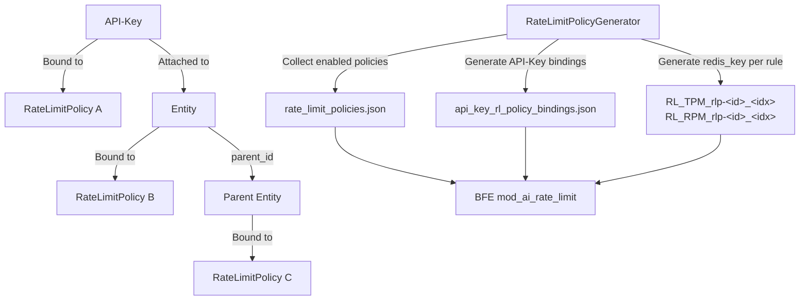
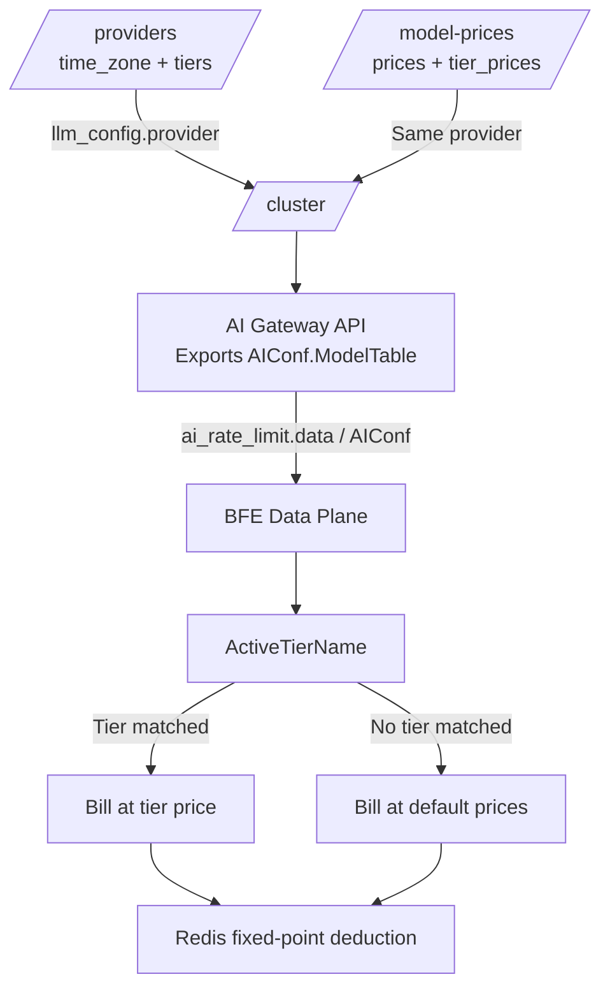

# Chapter 12: Quota and Rate Limit Design

## Chapter Goals

By the end of this chapter, the reader will understand:

- How Rainway AI Gateway uses `QuotaPlan` to allocate quotas in two units, Token or RMB, to API-Keys and Entities;
- Why Redis serves as the single source of truth for quota balances, and how the management plane queries real-time balances by reading Redis directly;
- The reset logic for calendar weeks and calendar months, and the role of `last_reset_at` in reset boundary determination;
- The TPM, RPM, and concurrency limit model of `RateLimitPolicy`, how policies merge upward along the Entity hierarchy, and how they are exported to BFE;
- How RMB quotas combine Provider time-of-day templates with Model tiered prices to enable peak/off-peak differentiated billing;
- Typical quota and rate limit configuration examples.

---

## Why Quotas and Rate Limits Are Needed

After an enterprise unifies access to large-model services, it typically faces two kinds of resource-control risks:

1. **Budget overrun**: a business team or a single API-Key consumes a large amount of Tokens or generates high costs in a short period, blowing through the overall budget;
2. **Traffic overrun**: sudden request surges overwhelm the backend model services, raising latency and error rates, and even triggering upstream rate limiting.

Quota answers the question "how much can be used in total," while rate limit answers "how much can be used per unit of time." The two complement each other: quotas keep the overall budget under control, while rate limits keep instantaneous traffic smooth. Rainway AI Gateway binds both quota plans and rate limit policies to API-Keys or Entities, allowing administrators to control resource usage at fine granularity by application, by team, and by model.

---

## The QuotaPlan Model: Two Units, total_token and RMB

`QuotaPlan` (quota plan) is the most fundamental quota abstraction in Rainway AI Gateway. It can bill by total Token volume or by RMB amount, corresponding to `unit = total_token` and `unit = RMB` respectively.

### Table Structure

Quota plans are persisted in the `quota_plans` table. The core fields are as follows (see `ai-gateway-api/design-docs/sys-design/details/配额余额同步机制.md` for the full definition):

```sql
CREATE TABLE `quota_plans` (
  `id` BIGINT NOT NULL AUTO_INCREMENT,
  `unlimited` TINYINT(1) DEFAULT 1,
  `pass_when_no_enough_quota` TINYINT(1) DEFAULT 0,
  `quota` DECIMAL(18,8) DEFAULT 0,
  `unit` VARCHAR(32) DEFAULT 'total_token',
  `reset_period` VARCHAR(16) DEFAULT 'never',
  `last_reset_at` DATETIME DEFAULT NULL,
  `created_at` DATETIME NOT NULL DEFAULT CURRENT_TIMESTAMP,
  `updated_at` DATETIME NOT NULL DEFAULT CURRENT_TIMESTAMP ON UPDATE CURRENT_TIMESTAMP,
  PRIMARY KEY (`id`),
  INDEX `idx_unlimited` (`unlimited`)
) ENGINE=InnoDB DEFAULT CHARSET=utf8mb4 COMMENT='quota plan table';
```

| Field | Description |
|------|------|
| `unlimited` | Whether the quota is unlimited. When `true`, no quota check is performed, and the balance is displayed as the sentinel value `100000000`. |
| `pass_when_no_enough_quota` | Whether to still allow requests when the quota is insufficient; commonly used in canary or test scenarios. |
| `quota` | Total quota. An integer when `total_token`; up to 8 decimal places when `RMB`. |
| `unit` | Quota unit; either `total_token` or `RMB`. |
| `reset_period` | Reset period; one of `never`, `weekly`, `monthly`. |
| `last_reset_at` | Time of the last reset; periodic reset uses this to determine whether a calendar week/month boundary has been crossed. |

### Applicable Scenarios for the Two Units

- **`total_token`**: suitable for models billed by Token (e.g., OpenAI, Anthropic). Administrators can directly cap the total input + output Tokens available per month.
- **`RMB`**: suitable for scenarios where different models at different prices need to be converted into a unified cost. The system converts consumed Tokens into RMB in real time based on the model's unit price, and deducts from the balance.

### RMB Quota Precision

To avoid floating-point errors, ai-gateway-api and BFE uniformly store RMB amounts inside Redis as fixed-point integers by multiplying by `1e8`; externally, values are uniformly displayed with 4 decimal places. For example, `0.0000015` yuan is represented internally as `150`, and during serialization `strconv.FormatFloat(v, 'f', -1, 64)` forces decimal notation to avoid readability problems or intermediate-layer truncation caused by scientific notation.

---

## Redis as the Single Source of Truth for Balances

Quota consumption happens on the request path (the BFE Data Plane deducts in real time), which demands high concurrency and low latency; meanwhile, the management plane (AI Gateway API) needs to expose `used` / `remaining` to OpenAPI and wants the data to be real-time and consistent. Therefore, the current architecture makes Redis the single source of truth for quota balances:

- Redis stores the current remaining quota, which the request path reads and writes directly;
- OpenAPI balance queries read Redis directly;
- `last_reset_at` is stored only in the `quota_plans` table; periodic reset touches only this one table;
- On manual or periodic reset, Redis and `quota_plans.last_reset_at` are updated together.



In this architecture, the `QuotaCache` interface (defined in `ai-gateway-api/model/quotacache/quotacache.go`, implemented in `ai-gateway-api/model/quotacache/redis.go`) encapsulates all Redis operations, including `GetRemaining`, `BatchGetRemaining`, `SetRemaining`, `ResetToQuota`, and `DeleteKeys`.

### Redis Key Rules

Redis Keys are generated by `AIUsedQuotaKey` (`ai-gateway-api/stateful/config_redis.go`):

```go
func AIUsedQuotaKey(key string) string {
    return fmt.Sprintf("QUOTA_%s", key)
}
```

| Object Type | Redis Key Example | Description |
|----------|----------------|------|
| API-Key | `QUOTA_AI_ak-2v8x9k3m7p` | Suffixed with the API-Key's actual `key` value |
| Entity | `QUOTA_entity-1` | Suffixed with `entity_id` |
| Value Semantics | Current remaining quota | An integer for `total_token`; a fixed-point integer in 1e-8 yuan for `RMB` |

The Key no longer appends the `KeyCreateAt` timestamp; its lifecycle matches that of the API-Key / Entity, avoiding Key bloat. When an API-Key or Entity is deleted, `DeleteKeys` is called to actively clean up the corresponding Redis Keys.

### Atomic Deduction and Zeroing Strategy

Whether periodic or manual, resets always use atomic `IncrBy(delta)` instead of `SET 0`, for the following reasons:

- Under concurrency, `SET` would overwrite the counts just deducted by other requests, causing quota overdraft;
- `IncrBy(delta)` adjusts incrementally based on the current value and can be serialized with other deduction operations;
- When the Key does not exist, a single `IncrBy(quotaTotal)` completes initialization.

---

## Calendar Week/Month Reset and Expired Reset

### Periodic Reset Policy

`QuotaPlan.reset_period` supports three values:

- `never`: no automatic reset;
- `weekly`: calendar week, reset every Monday at 00:00:00;
- `monthly`: calendar month, reset on the 1st of each month at 00:00:00.

`QuotaResetScheduler` (`ai-gateway-api/model/quota/scheduler.go`) runs `ResetExpiredBalances` once per minute and only processes plans that need resetting.

### Reset Boundary Determination

`BalanceSyncManager` (`ai-gateway-api/model/quota/balance_sync.go`) obtains the current time through an injected `Clock` interface, then calls `shouldResetByPeriod` to determine whether a period boundary has been crossed:

```go
func (m *BalanceSyncManager) shouldResetByPeriod(
    lastResetAt *time.Time,
    resetPeriod string,
    now time.Time,
) bool {
    if lastResetAt == nil {
        return true
    }
    switch resetPeriod {
    case "weekly":
        return getWeekStart(now).After(getWeekStart(*lastResetAt))
    case "monthly":
        return getMonthStart(now).After(getMonthStart(*lastResetAt))
    }
    return false
}
```

`getWeekStart` and `getMonthStart` normalize a time to 00:00:00 on Monday or on the 1st of the month (local timezone). Because the determination is based on comparing week/month start points, the scheduler is self-healing: even if it misses a certain moment for some reason, as long as the current period's start point is later than the period start point at the last reset, the reset will be triggered.

### Reset Execution Flow



### Manual Reset API

In addition to periodic reset, the system provides manual reset APIs:

- `POST /api-keys/{id}/quota-plan/reset`
- `POST /entities/{id}/quota-plan/reset`

Manual reset calls `QuotaPlanManager.ResetBalance(..., updateLastResetAt=false)`, i.e., it only resets the Redis balance without updating `last_reset_at`, so as not to interfere with the periodic scheduler's calendar week/month determination. If a new `quota` is passed, `quota_plans.quota` is updated as well.

### Multi-Instance Deployment Notes

Currently, `QuotaResetScheduler` starts independently in every AI Gateway API instance. In a multi-instance deployment, all instances attempt to execute `ResetExpiredBalances()`, which risks duplicate resets. Because resets are based on the Redis `IncrBy(delta)` operation, duplicate execution usually does not cause data errors (it is idempotent), but it produces unnecessary logs and Redis operations. If duplicate execution must be strictly avoided in the future, a Redis distributed lock or a single-instance scheduler can be introduced.

---

## RateLimitPolicy: TPM, RPM, and Concurrency Limits

### Policy Model

`RateLimitPolicy` (rate limit policy) controls the rate at which an API-Key or Entity accesses backend AI models, and supports three types of limits:

- **TPM** (Tokens Per Minute): the maximum Token consumption per minute;
- **RPM** (Requests Per Minute): the maximum number of requests per minute;
- **Concurrency** (Max Concurrency): the maximum number of requests processed simultaneously.

Policies are persisted in the `rate_limit_policies` table (see `ai-gateway-api/design-docs/sys-design/details/限流策略与导出.md` for the full definition):

```sql
CREATE TABLE rate_limit_policies (
    id BIGINT AUTO_INCREMENT PRIMARY KEY,
    name VARCHAR(255) NOT NULL,
    description VARCHAR(255) DEFAULT NULL,
    product_name VARCHAR(255) NOT NULL,
    enabled TINYINT(1) NOT NULL DEFAULT 1,
    max_concurrency INT DEFAULT NULL,
    tpm_configs JSON DEFAULT NULL,
    rpm_configs JSON DEFAULT NULL,
    create_time DATETIME NOT NULL DEFAULT CURRENT_TIMESTAMP,
    update_time DATETIME NOT NULL DEFAULT CURRENT_TIMESTAMP ON UPDATE CURRENT_TIMESTAMP
);
```

### TPM and RPM Rule Structure

TPM and RPM rules are stored as JSON arrays in the `tpm_configs` and `rpm_configs` fields:

```json
{
  "tpm_configs": [
    {
      "name": "tpm_gpt4",
      "model": "gpt-4",
      "window_minutes": 1,
      "max_tokens": 100000,
      "step_minutes": 1
    }
  ],
  "rpm_configs": [
    {
      "name": "rpm_gpt4",
      "model": "gpt-4",
      "window_minutes": 1,
      "max_requests": 1000,
      "burst": 1
    }
  ]
}
```

`model` supports a specific model name or the wildcard `*`; when no specific model matches, the default limit is used. `name` is unique within a policy and cannot be changed after creation, serving as the stable identifier for rule export.

### Validation Rules

`RateLimitPolicyManager` performs strict validation on creation/update:

- `name` must be unique within `product_name`;
- `max_concurrency` must be ≥ 0;
- each rule's `name` is required, non-empty, 1–128 characters, restricted to the character set `[a-zA-Z0-9_-]`;
- `name` must be unique within a policy and cannot be modified;
- `model` cannot be empty, and `limit` must be ≥ 0.

---

## Hierarchical Merge and Export

### Reference Relationships

Both API-Keys and Entities reference rate limit policies via the `rate_limit_policy_id` field:

| Dimension | Quota Plan | Rate Limit Policy |
|------|----------|----------|
| Table | `quota_plans` | `rate_limit_policies` |
| Reference field | `quota_plan_id` | `rate_limit_policy_id` |
| Hierarchical merge | Collect QuotaPlans from all levels | Collect Policy IDs from all levels |
| Exported Redis Key | `QUOTA_xxx` | `RL_TPM_rlp-<id>_<idx>` / `RL_RPM_rlp-<id>_<idx>` |
| Balance sync | Yes | No |

### Entity Hierarchical Merge Upward

During export, `RateLimitPolicyGenerator` (`ai-gateway-api/model/rate_limit_policy/rate_limit_policy_manager.go`) recursively collects the policy IDs bound to each API-Key's own Entity and all parent Entities:

```go
func (m *RateLimitPolicyManager) fetchEntityRateLimitPolicyIDs(ctx context.Context, entity *EntityParam) ([]int64, error) {
    policyIDs := make([]int64, 0)
    if entity.RateLimitPolicyID != nil {
        policyIDs = append(policyIDs, *entity.RateLimitPolicyID)
    }
    if entity.ParentID != nil && *entity.ParentID != "" {
        parent, err := m.entityStorager.FetchEntity(ctx, &EntityFilter{EntityID: entity.ParentID})
        if parent != nil {
            parentPolicyIDs, _ := m.fetchEntityRateLimitPolicyIDs(ctx, parent)
            policyIDs = append(policyIDs, parentPolicyIDs...)
        }
    }
    return policyIDs, nil
}
```

### Export Files

The export result is written to two files:

- `rate_limit_policies.json`: all rate limit policies in enabled state;
- `api_key_rl_policy_bindings.json`: the bindings from API-Keys to policies.

Exported policy names use the uniform format `rlp-<policy_id>` to avoid naming conflicts and to make indexing easy on the BFE side. Only policies with `enabled=true` are exported and generate bindings.

### Redis Key Stability

To eliminate the problem of "renaming or changing the model resets the counter," the Control Plane generates a stable Redis Key for each rule during export:

```go
RedisKey: fmt.Sprintf("RL_RPM_rlp-%d_%d", policyID, idx)
RedisKey: fmt.Sprintf("RL_TPM_rlp-%d_%d", policyID, idx)
```

The Key is based on `(policy_id, rule_index)`, which does not change with user edits, so modifying a rule name or `model` does not reset the counter. On the BFE side, the `redis_key` in the configuration is used preferentially to build the Redis Key; for old configurations, a compatibility fallback that keys by rule name is retained.



### Expected Behavior on the BFE Side

After receiving the configuration, BFE:

1. Uses `api_key_rl_policy_bindings.json` to find the policy list for an API-Key;
2. When a request arrives, matches rules in `rules.tpm` / `rules.rpm` by model, preferring exact model names and falling back to the `*` default limit when no match is found;
3. After a rule matches, builds the Redis counter key from the rule's `redis_key` and performs the rate limit check;
4. Also checks `max_concurrency`;
5. Returns 429 Too Many Requests when any limit is exceeded.

---

## RMB Quota Tiered Pricing by Time of Day

### Background

As model providers such as DeepSeek adopt "peak / off-peak" time-of-day pricing, BFE's RMB quota deduction needs the ability to match different prices based on when a request occurs. Rainway AI Gateway places time-of-day templates under `/providers` and tiered prices under `/model-prices`, achieving separation of Provider and price management.

### Core Concepts

| Concept | Description |
|------|------|
| **Tier** | A price level divided by time dimension, e.g., `peak`. |
| **TimeRange** | A time-of-day definition, containing `weekdays` (0 = Sunday), `start` / `end` (HH:MM, left-closed right-open). |
| **Provider time-of-day template** | The `time_zone` and `tiers` defined on `/providers`, shared by all models under the same provider. |
| **Model tier price** | The `tier_prices` defined on `/model-prices`, describing a model's price under a given tier. |

### Configuration Ownership and Delivery Chain



When multiple clusters reference the same provider, each receives an identical copy of the `ModelTable` data; after a provider's time-of-day rules change, all clusters referencing it take effect automatically on the next configuration export.

### BFE ModelTable Structure

The exported `AIConf.ModelTable` has the following structure (defined in the relevant configuration loading code on the BFE side):

```go
type ModelTable struct {
    Currency string      // Fixed "RMB"
    TimeZone string      // Default "Asia/Shanghai"
    Tiers    []PriceTier // Time-of-day definitions
    Models   []ModelPrice
}

type PriceTier struct {
    Name       string
    TimeRanges []TimeRange
}

type ModelPrice struct {
    Provider   string
    Model      string
    Prices     PriceMap     // Default prices
    TierPrices TierPriceMap // tier name -> price table
}
```

### Runtime Tier Matching

At load time, BFE parses `TimeZone` and validates `Tiers`; at runtime it uses `ActiveTierName` to match the tier based on when the request occurs:

```go
func (table *ModelTable) ActiveTierName(now time.Time) string {
    if table == nil || len(table.Tiers) == 0 {
        return ""
    }
    t := now.In(table.tz)
    wd := int(t.Weekday())
    hour, min := t.Hour(), t.Minute()
    cur := hour*60 + min

    for i := range table.Tiers {
        tier := &table.Tiers[i]
        for _, tr := range tier.TimeRanges {
            if len(tr.Weekdays) > 0 && !containsInt(tr.Weekdays, wd) {
                continue
            }
            start := parseHHMM(tr.Start)
            end := parseHHMM(tr.End)
            if start <= cur && cur < end {
                return tier.Name
            }
        }
    }
    return ""
}
```

When a tier is matched and that tier has the corresponding price key configured, the tier price is used; otherwise it falls back to the default `Prices`. Time ranges are left-closed and right-open; ranges crossing midnight must be split into two segments.

### Backward Compatibility

- When `/providers` omits `time_zone` / `tiers`, `ModelTable.TimeZone` / `Tiers` are empty and behavior is identical to fixed pricing;
- When `/model-prices` omits `tier_prices`, billing uses the default `Prices`;
- When a tier is matched but a price key is not configured for that tier, billing automatically falls back to the corresponding key in the default `Prices`;
- `TokenUsage.UsedCost`, the Lua deduction logic, and the Redis fixed-point storage all require no changes.

---

## Quota and Rate Limit Configuration Examples

### QuotaPlan Example

Below is a quota plan with monthly reset and a total of 100 million Tokens:

```json
{
  "quota_plan": {
    "unlimited": false,
    "pass_when_no_enough_quota": false,
    "quota": 100000000,
    "unit": "total_token",
    "reset_period": "monthly",
    "balance": {
      "used": 50000000,
      "remaining": 50000000
    }
  }
}
```

Below is a quota plan billed in RMB with a monthly budget of 5000 yuan:

```json
{
  "quota_plan": {
    "unlimited": false,
    "pass_when_no_enough_quota": false,
    "quota": 5000.00,
    "unit": "RMB",
    "reset_period": "monthly",
    "balance": {
      "used": 1234.56,
      "remaining": 3765.44
    }
  }
}
```

### RateLimitPolicy Example

Below is a policy that limits TPM/RPM for the gpt-4 model and sets the maximum concurrency to 50:

```json
{
  "rate_limit_policy": {
    "enabled": true,
    "rules": {
      "tpm": [
        {
          "name": "tpm_gpt4",
          "model": "gpt-4",
          "window_minutes": 1,
          "max_tokens": 100000,
          "step_minutes": 1
        },
        {
          "name": "tpm_default",
          "model": "*",
          "window_minutes": 1,
          "max_tokens": 500000,
          "step_minutes": 1
        }
      ],
      "rpm": [
        {
          "name": "rpm_gpt4",
          "model": "gpt-4",
          "window_minutes": 1,
          "max_requests": 1000,
          "burst": 1
        },
        {
          "name": "rpm_default",
          "model": "*",
          "window_minutes": 1,
          "max_requests": 5000,
          "burst": 1
        }
      ],
      "max_concurrency": 50
    }
  }
}
```

### RMB Tiered Pricing Example

Provider time-of-day template:

```json
{
  "name": "deepseek",
  "time_zone": "Asia/Shanghai",
  "tiers": [
    {
      "name": "peak",
      "time_ranges": [
        { "weekdays": [1, 2, 3, 4, 5], "start": "09:00", "end": "12:00" },
        { "weekdays": [1, 2, 3, 4, 5], "start": "14:00", "end": "18:00" }
      ]
    }
  ]
}
```

Model price:

```json
{
  "provider": "deepseek",
  "model": "deepseek-v4-pro",
  "mode": "chat",
  "prices": {
    "input_cost_per_token": 0.000001,
    "output_cost_per_token": 0.000002,
    "cache_read_input_token_cost": 0.0000005
  },
  "tier_prices": {
    "peak": {
      "input_cost_per_token": 0.000002,
      "output_cost_per_token": 0.000004,
      "cache_read_input_token_cost": 0.000001
    }
  }
}
```

---

## Chapter Summary

- `QuotaPlan` supports two quota units, `total_token` and `RMB`, suitable for Token-based and cost-based billing respectively. RMB quotas are stored inside Redis as fixed-point integers in 1e-8 yuan and uniformly displayed externally with 4 decimal places.
- Redis is the single source of truth for quota balances, and OpenAPI queries read Redis directly; both periodic and manual resets are performed via atomic `IncrBy(delta)`, avoiding concurrent overwrites.
- Periodic reset supports `weekly` (every Monday) and `monthly` (the 1st of each month), triggered every minute by `QuotaResetScheduler`, with the period boundary determined based on `last_reset_at`; manual resets do not update `last_reset_at`, avoiding interference with periodic scheduling.
- `RateLimitPolicy` provides three types of limits — TPM, RPM, and concurrency — and rules support exact model names or the `*` default match; during export, policies merge upward along the Entity hierarchy, producing `rate_limit_policies.json` and `api_key_rl_policy_bindings.json`.
- The Control Plane generates a stable Redis Key for each TPM/RPM rule (`RL_TPM_rlp-<id>_<idx>` / `RL_RPM_rlp-<id>_<idx>`), so modifying a rule name or `model` does not reset the counter.
- RMB quotas support tiered pricing by time of day: the Provider maintains `time_zone` and `tiers`, the Model maintains `tier_prices`, and after export BFE matches the tier based on the request time and selects the corresponding price, falling back to the default price when no tier matches.

---

## References

- `ai-gateway-api/design-docs/sys-design/details/配额余额同步机制.md`
- `ai-gateway-api/design-docs/sys-design/details/限流策略与导出.md`
- `ai-gateway-api/design-docs/sys-design/details/RMB配额分时段定价.md`
- `ai-gateway-api/design-docs/api-define/OpenAPI接口定义/api-keys.md`
- `bfe/docs/zh_cn/sys_design/ai_rate_limit_redis_key.md`
- `ai-gateway-api/model/quotacache/quotacache.go`
- `ai-gateway-api/model/quotacache/redis.go`
- `ai-gateway-api/model/quota/balance_sync.go`
- `ai-gateway-api/model/quota/scheduler.go`
- `ai-gateway-api/model/rate_limit_policy/rate_limit_policy.go`
- `ai-gateway-api/model/rate_limit_policy/rate_limit_policy_manager.go`
- `bfe/bfe_modules/mod_ai_rate_limit/data_load.go`
- `bfe/bfe_modules/mod_ai_rate_limit/policy_limiter.go`
