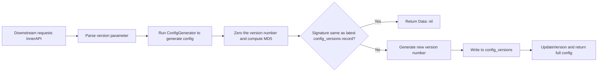
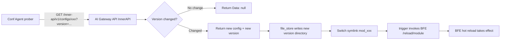

# Chapter 14: Config Export and Version Control Design

## Chapter Goals

Through this chapter, the reader will understand:

- How Rainway AI Gateway exposes runtime configuration to the Data Plane via InnerAPI;
- How `VersionControlManager` uses MD5 signatures and version numbers to implement incremental sync;
- The role of the `config_versions` table in version control, and how downstream components determine whether configuration has changed based on this table;
- The responsibilities and export formats of the nine configuration export topics;
- The batch preloading and in-memory backtracking optimizations used when exporting `mod-api-key`;
- How Conf Agent pulls configuration and connects with BFE's hot reload mechanism;
- The complete path of a configuration from the database to taking effect in BFE.

---

## InnerAPI's Config Export Mechanism

In addition to the management-facing OpenAPI (`/open-api/v1`) for administrators, AI Gateway API also provides a set of **InnerAPI** interfaces for the Data Plane (route prefix `/inner-api/v1`). Downstream components such as BFE and Conf Agent pull runtime configuration through this set of read-only interfaces, so InnerAPI is also known as the configuration sync protocol between the Control Plane and the Data Plane.

InnerAPI has the following characteristics:

- **Read-only export**: All interfaces are `GET`, used to batch-export configuration structures consumable by BFE;
- **Organized by topic**: Each interface corresponds to a configuration topic (e.g. `route_rule`, `mod_api_key_rule`, `ai_route`);
- **Version control**: Each export computes an MD5 signature of the configuration data and compares it with historical signatures; if nothing has changed, an empty response is returned to avoid redundant distribution;
- **Authentication**: Callers must carry a Token, and identity verification is performed by the McUserProbe middleware.

The comparison between InnerAPI and OpenAPI is described in `ai-gateway-api/design-docs/api-define/InnerAPI接口定义/00-overview.md`: OpenAPI targets management operations with individual resources as its data granularity; InnerAPI targets Data Plane sync with batch configuration export as its data granularity.

The entry point for config export is `VersionControlManager`, defined in `model/iversion_control/version_control.go`. It provides a unified export framework for each topic, while the concrete configuration generation logic is implemented by the respective `ConfigGenerator` callbacks.

---

## VersionControlManager's MD5 Signature and Version Number

`VersionControlManager` is the core coordinator of config export. Its structure is defined as follows:

```go
type VersionControlManager struct {
    storager VersionControlStorager
    txn      itxn.TxnStorager
}

func (vcm *VersionControlManager) ExportConfig(
    ctx context.Context,
    configTopic string,
    generator ConfigGenerator,
) (*ExportData, error)
```

Here `ConfigGenerator` is a configuration generation function provided by each business module:

```go
type ConfigGenerator func(ctx context.Context) (*ExportData, error)
```

The export result is wrapped in `ExportData`:

```go
type ExportData struct {
    Topic                  string
    DataWithoutVersion     VersionValuable
    version                string
    DataSignWithoutVersion string
}
```

The fields mean the following:

- `Topic`: the configuration topic, corresponding to `config_versions.name`;
- `DataWithoutVersion`: the final configuration struct returned to downstream, which must implement `UpdateVersion(version string) error`;
- `DataSignWithoutVersion`: the MD5 signature computed over the configuration data (with the version number zeroed out);
- `version`: the actual version number written by the version control manager.

The signature computation logic is located in `model/iversion_control/version_control.go`:

```go
func Sign(data interface{}) (string, error) {
    bs, err := json.Marshal(data)
    if err != nil {
        return "", err
    }
    return fmt.Sprintf("%x", md5.Sum(bs)), nil
}

func Version(t time.Time) string {
    return t.Format("20060102150405")
}

var ZeroVersion = Version(time.Time{})
```

Before computing the signature, the system replaces the version number field in the configuration struct with `ZeroVersion` (i.e. `"00010101000000"`). This way, even if the version number itself changes, as long as the configuration content is unchanged, the signature stays the same, avoiding meaningless configuration distribution.

The version number uses a timestamp format `YYYYMMDDHHMMSS`, generated by `VersionControlManager` when a signature change is detected. Since the version number is based on the current time, new configuration always comes with a new version number, and downstream can safely use the version number as the sole identifier of whether configuration has changed.

---

## The config_versions Table and Incremental Sync

The `config_versions` table is the carrier of persisted configuration version information. Its fields are as follows:

| Field       | Description                                             |
|-------------|---------------------------------------------------------|
| `id`        | Auto-increment primary key                              |
| `name`      | Configuration topic (Topic)                             |
| `data_sign` | MD5 signature of the configuration data (version zeroed) |
| `version`   | Version number corresponding to the signature           |

Multiple records can exist under the same Topic, increasing in chronological order. The behavior of `VersionControlStorager.UpsertConfigLastExportedVersion` is:

- If the current signature already exists in the table, return the version number corresponding to that signature;
- If the current signature does not exist, insert a new record and generate a new version number.

Downstream components implement incremental sync by carrying a `version` query parameter. A request example:

```http
GET /inner-api/v1/configs/mod-api-key?version=20260101120000
Authorization: Token <token>
```

There are two kinds of responses. When the configuration has not changed:

```json
{
  "ErrNum": 200,
  "ErrMsg": "success",
  "Data": null
}
```

When the configuration has changed:

```json
{
  "ErrNum": 200,
  "ErrMsg": "success",
  "Data": {
    "version": "20260102120000",
    "config": {...},
    "QuotaPlans": {...},
    "tokens": {...}
  }
}
```

The workflow of incremental sync is shown in the figure below.



The benefits of this mechanism are:

- On the first pull, downstream omits `version` or passes an empty value, and receives the full configuration and the current version number;
- On subsequent scheduled pulls, downstream carries the `version` returned last time; if the configuration is unchanged, the update is skipped directly;
- The Control Plane does not need to push actively, which naturally fits cross-network-region deployment scenarios.

---

## The Nine Config Export Topics

InnerAPI currently exports nine configuration topics in total. Details are in `ai-gateway-api/design-docs/sys-design/details/InnerAPI配置导出与版本控制.md`. They correspond to different BFE modules or configuration files:

| Interface path                           | Corresponding Manager       | Config topic          | Description                                         |
|------------------------------------------|-----------------------------|-----------------------|-----------------------------------------------------|
| `/configs/tls_conf/server_data_conf`     | `RouteRuleManager`          | `route_rule`          | Domains, basic/advanced route rules, cluster config |
| `/configs/gslb_data/gslb`                | `ClusterManager`            | `gslb.<bfe_cluster>`  | GSLB scheduling config, depends on `bfe_cluster`    |
| `/configs/gslb_data/cluster_table`       | `ClusterManager`            | `cluster_table`       | Cluster table, i.e. the backend instance list       |
| `/configs/protocol/server_cert_conf`     | `CertificateManager`        | `certificate`         | TLS certificate config                              |
| `/configs/extra_files/{filename}`        | `ExtraFileManager`          | none                  | Raw content of extra files, not version-controlled  |
| `/configs/mod-api-key`                   | `APIKeyRuleManager`         | `mod_api_key_rule`    | API-Key validation rules and quota plans            |
| `/configs/mod-body-process`              | `ModBodyProcessManager`     | `mod_body_process`    | Request body processing module config               |
| `/configs/rate-limit-policy`             | `RateLimitPolicyManager`    | `mod_ai_rate_limit`   | Rate limit policy config                            |
| `/configs/ai-route`                      | `AIRouteExporter`           | `ai_route`            | AI route rules and bindings                         |

Among them, `gslb.<bfe_cluster>` depends on the BFE cluster name parameter, so different BFE clusters have independent version lines; `extra_files` returns content as-is by filename and does not go through the version control flow.

### Server Data

The `route_rule` topic exports BFE's Server Data configuration, implemented by `model/iroute_conf/exporter.go`. The exported struct contains:

```go
type RouteRuleExportData struct {
    Version     string
    HostTable   *host_rule_conf.HostTableConf
    RouteTable  *route_rule_conf.RouteTableFile
    ClusterConf *cluster_conf.BfeClusterConf
}
```

The generation flow: query all `domains`, `clusters`, and `products`, assemble them into HostTable, RouteTable, and ClusterConf, then call `VersionControlManager.ExportConfig`. When a Cluster has `llm_config` configured, the exported `ClusterConf.Config.<cluster_name>.AIConf` contains the model mapping, authentication keys, model pricing table, protocol style list, and Key Affinity policy, for consumption by BFE's AI forwarding module.

### GSLB and Cluster Table

`gslb.<bfe_cluster>` and `cluster_table` are implemented by `model/icluster_conf/exporter.go`. `gslb` returns the scheduling matrix of the corresponding cluster based on the request's `bfe_cluster` parameter; `cluster_table` exports the backend instances of all clusters, where IPv6 addresses are automatically wrapped in `[]`, and an instance with `Weight=0` receives no traffic.

### Server Cert

The `certificate` topic is implemented by `model/iprotocol/exporter.go`. On export, all certificate/key file paths are written into the configuration, and `UpdateVersion` performs a versioned replacement of the paths (e.g. `tls_conf_<version>/...`) to make it easy for BFE to load by version.

### mod-api-key, mod-body-process, rate-limit-policy, ai-route

These four topics target BFE's AI-specific modules, and their export logic is concentrated under `model/imods/` and `model/rate_limit_policy/`. Among them, `mod-api-key` has the largest configuration volume and the most complex relationships, so it adopts dedicated performance optimizations, detailed in the next section.

---

## mod-api-key Batch Preloading and In-Memory Backtracking Optimization

The `mod-api-key` topic exports all API-Key rules, quota plans, and token lists required by BFE's `mod_ai_token_auth` module. Its data characteristics: it must span multiple tables (`api_keys`, `entities`, `quota_plans`, `entity_types`, etc.) and backtrack upward along the Entity hierarchy.

If every export queried the Entity ancestors and quota plans of each API-Key one by one, it would cause a serious N+1 query problem. To this end, `model/imods/mod_api_key_rule.go` adopts the following optimization strategies:

1. **Batch preloading**: Load all `api_keys`, `entities`, `quota_plans`, and `entity_types` into in-memory indexes (Maps) in one go, avoiding per-item database queries;
2. **In-memory backtracking**: Backtrack the Entity hierarchy along `parent_id` in the in-memory Maps, computing the intersection of `allow_models` and the union of `block_models`;
3. **Skip unlimited quota plans**: When collecting quota plans of the API-Key itself and those upward along the Entity hierarchy, skip plans with `unlimited=true` to reduce export size;
4. **TagLevel supplement**: For each Entity tag, read the corresponding `EntityType.Level` from the in-memory Map and fill it directly into `TokenFile`.

The exported struct is as follows:

```go
type ModAPIKeyRuleConf struct {
    Version    *string                            `json:"version"`
    Config     map[string][]*TokenRuleFile        `json:"config"`
    QuotaPlans map[string][]*QuotaPlan            `json:"QuotaPlans"`
    Tokens     map[string]map[string]*TokenFile   `json:"tokens"`
}
```

The key steps of the generation flow are:

1. Build the API-Key rules corresponding to AI routes;
2. Batch preload all related tables into in-memory Maps;
3. Iterate over all `api_keys`, generating a `TokenFile` for each key;
4. Determine the exported `enabled` boolean based on the API-Key's `enabled` field and the intersection result of `allow_models` along the Entity hierarchy;
5. Merge `allow_models` (intersection) and `block_models` (union) along the Entity hierarchy;
6. Collect quota plans upward, skipping plans with `unlimited=true`;
7. Output `QuotaPlans`, `Tokens`, and `Config`.

Runtime states such as `expired`/`exhausted` are no longer computed by the export layer; instead, BFE determines them itself based on `expired_time` and the real-time Redis quota balance. This both reduces the export pressure on the Control Plane and guarantees the timeliness of state determination.

---

## Conf Agent Pulling and Integration with BFE Hot Reload

Conf Agent is a Sidecar component deployed alongside BFE, responsible for converting the configuration exported by InnerAPI into local files that BFE can load, and triggering BFE hot reload when configuration changes. Its overall flow is described in `conf-agent/AGENTS.md`.

Each configuration topic corresponds to one `Reloader`, and each `Reloader` contains three submodules internally:

- **prober** (`conf_reload/prober/`): periodically polls the InnerAPI of AI Gateway API, comparing the local version number with the remote version number;
- **file_store** (`conf_reload/file_store/`): writes the new configuration into a temporary version directory, atomically switches via Symlink to `mod_{name}`, and cleans up old versions according to `VersionKeepCount`;
- **trigger** (`conf_reload/trigger/`): invokes BFE's `/reload/{module}` monitor port interface to complete hot reload.

The path from Conf Agent to BFE config taking effect is shown in the figure below.



The advantages of this pull-based design are:

- The Control Plane does not need to be aware of the number of Data Plane nodes, reducing coupling;
- BFE can continue forwarding with locally cached configuration while the Control Plane is briefly unavailable;
- Symlink switching guarantees the atomicity of configuration file replacement, preventing BFE from loading a half-written file;
- Version directories retain a number of historical versions, making quick rollback easy in case of failure.

Specifically, `file_store` allocates a dedicated directory for the new version's configuration (the directory name usually contains the version number), and after writing completes, atomically points the `mod_{name}` symlink at that directory. BFE always reads configuration through the symlink, so switching between old and new versions is transparent to the running forwarding process. If a problem occurs after loading the new configuration, operators can simply point the symlink back to the previous version directory and trigger a reload again, without pulling data from the Control Plane anew.

---

## Config Export Example

Below we use the `mod-api-key` topic to demonstrate a complete incremental sync process.

On the first pull, Conf Agent omits the `version` parameter:

```http
GET /inner-api/v1/configs/mod-api-key HTTP/1.1
Authorization: Token <token>
```

The full configuration is returned:

```json
{
  "ErrNum": 200,
  "ErrMsg": "success",
  "Data": {
    "version": "20260101120000",
    "config": {
      "default": [
        {
          "cond": "req_host_in(\"api.example.com\")",
          "actions": [
            {
              "cmd": "CHECK_API_KEY",
              "params": ["default"]
            }
          ]
        }
      ]
    },
    "QuotaPlans": {
      "plan_basic": [
        {"metric": "token", "interval": 86400, "limit": 1000000}
      ]
    },
    "tokens": {
      "default": {
        "sk-abc123": {
          "enabled": true,
          "expired_time": "2026-12-31T23:59:59+08:00",
          "quota_plans": ["plan_basic"],
          "allow_models": ["gpt-4o", "deepseek-chat"],
          "block_models": [],
          "tags": [{"tag": "team-a", "tag_level": 2}]
        }
      }
    }
  }
}
```

On subsequent pulls, the version number returned last time is carried:

```http
GET /inner-api/v1/configs/mod-api-key?version=20260101120000 HTTP/1.1
Authorization: Token <token>
```

If the configuration has not changed, the response is:

```json
{
  "ErrNum": 200,
  "ErrMsg": "success",
  "Data": null
}
```

After receiving `Data: null`, Conf Agent skips this write and hot reload; when an administrator modifies API-Key quota through the Dashboard, the next pull returns the full configuration with a new `version`, and Conf Agent then triggers a BFE hot reload.

---

## Chapter Summary

- InnerAPI is a read-only interface through which the Control Plane exposes runtime configuration to the Data Plane, with the path prefix `/inner-api/v1`;
- `VersionControlManager` uniformly performs MD5 signature computation and version number generation for each configuration topic; before computing the signature, it first zeroes out the version number, preventing version number changes from interfering with content comparison;
- The `config_versions` table records the mapping between configuration signatures and version numbers per topic, and is the basis of incremental sync;
- InnerAPI currently exports nine configuration topics, corresponding to BFE's Server Data, GSLB, Cluster Table, certificates, extra files, `mod_ai_token_auth`, `mod_body_process`, `mod_ai_rate_limit`, and `mod_ai_route`;
- `mod-api-key` solves the performance problems caused by cross-table queries and Entity hierarchy backtracking through batch preloading and in-memory backtracking;
- Conf Agent pulls configuration and completes hot reload through version directories, Symlink switching, and BFE's `/reload/{module}` interface;
- The pull-based design decouples the Control Plane from the Data Plane, and supports cross-network-region deployment and rapid failure recovery.

---

## References

- `ai-gateway-api/design-docs/sys-design/details/InnerAPI配置导出与版本控制.md`
- `ai-gateway-api/design-docs/api-define/InnerAPI接口定义/README.md`
- `ai-gateway-api/design-docs/api-define/InnerAPI接口定义/00-overview.md`
- `conf-agent/AGENTS.md`
