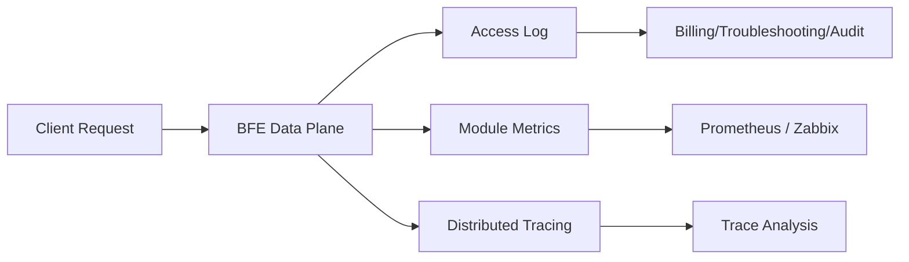

# Chapter 15: Observability Design

## Chapter Goals

An AI Gateway carries a large volume of large-model call traffic, and the request path involves multiple stages: authentication, routing, rate limiting, quota deduction, upstream forwarding, and streaming responses. An anomaly in any of these stages can affect downstream business and cause billing disputes. This chapter introduces the observability system of the Rainway AI Gateway and helps readers understand the following questions:

- How the three pillars of observability (logs, metrics, and traces) are implemented in the AI Gateway;
- Which AI-specific fields are included in the BFE Data Plane access logs, and how these fields are collected;
- Which key monitoring metrics should be tracked, covering route hits, quota hits, and rate limit triggers;
- How to integrate BFE with monitoring systems such as Prometheus and Zabbix;
- The classification of the AI Gateway error code system and troubleshooting approaches;
- Recommended alert configurations based on logs and metrics.

After reading this chapter, readers should be able to independently plan, configure, and troubleshoot the observability solution of the AI Gateway.

## The Three Pillars of Observability

The industry typically divides observability into three pillars: Logs, Metrics, and Traces. The Rainway AI Gateway has made targeted designs for all three pillars in both the Data Plane (BFE) and the Control Plane (AI Gateway API).

### Logs

Logs are used to record the complete lifecycle of every request. The BFE Data Plane outputs key information about each stage of a request — authentication, routing, forwarding, and billing — through the Access Log, enabling downstream troubleshooting, billing reconciliation, and security auditing. AI-specific fields uniformly occupy field numbers 701-900 of the `bfe-access-pb` protocol; 27 fields are currently defined. For details, see [BFE AI Access Log Observability Fields Design](../../../bfe/docs/zh_cn/sys_design/ai_access_log_fields.md).

### Metrics

Metrics are used to quantify system operation status and support trend analysis and threshold-based alerting. Each BFE AI module exposes counter-style monitoring items, such as `REQ_TOTAL` (total requests), `REQ_HIT_APIKEY` (requests hitting apikey routes), and `REQ_HIT_ENTITY` (requests hitting entity routes). These metrics can be collected by systems such as Prometheus and Zabbix through BFE's built-in monitoring interface.

### Traces

Traces are used to depict the complete call path of a request in a distributed system. Although the current BFE access log already records fields such as `ai_cluster_key_names` to reflect the clusters and keys a request has tried, for scenarios that require cross-service latency bottleneck analysis, it is recommended to extend with distributed tracing frameworks such as OpenTelemetry. Traces complement logs and metrics, forming a three-dimensional observability capability.



## BFE Access Log Fields and AI-Specific Fields

When BFE serves as an AI Gateway, the access log no longer contains only traditional HTTP fields (such as status code, response size, and latency); it also appends a series of AI-specific fields. These fields are carried by the AI context in `bfe_basic.Request` and are ultimately assembled and output by `mod_access_pb3`.

### Field Number Planning

AI observability fields uniformly occupy field numbers 701-900 of `bfe-access-pb`, divided into multiple sub-ranges by purpose:

| Number Range | Purpose |
|----------|------|
| 701 - 713 | Fields in use, such as API Key identifier, model name, token counts, rate limit hits |
| 714 - 760 | Model and request basic information, such as provider, protocol, stream, retry, cache |
| 761 - 800 | Token and cost metering, including regular token/cost and cache/audio/image sub-items |
| 801 - 840 | Routing, transformation, and plugins, such as route rule hits, cluster/key attempt lists |
| 841 - 880 | Security, compliance, and privacy, such as hit/rejected Quota Plan IDs |
| 881 - 900 | Vendor extensions and reserved |

### Core AI Access Log Fields

The following table lists the most commonly used fields in daily troubleshooting and billing reconciliation:

| Field Name | Number | Type | Description | Collection Module |
|--------|------|------|------|----------|
| `ai_apikey_id` | 701 | string | Internal identifier of the API Key (`key_id`); the raw key value is not recorded | `mod_ai_token_auth` |
| `ai_apikeytags` | 702 | repeated | Entity hierarchy tags associated with the API Key | `mod_ai_token_auth` |
| `ai_requested_model` | 703 | string | Original model name requested by the client | `bfe_server/http_conn.go` |
| `ai_target_model` | 704 | string | Target model name after gateway routing/mapping | `bfe_server/reverseproxy.go` |
| `ai_stream` | 705 | bool | Whether it is a streaming response | `bfe_basic.Request.IsSse` |
| `ai_input_tokens` | 706 | int64 | Number of input tokens | `mod_ai_token_auth` / `mod_body_process` |
| `ai_output_tokens` | 707 | int64 | Number of output tokens | `mod_ai_token_auth` / `mod_body_process` |
| `ai_total_tokens` | 708 | int64 | Total token consumption | `mod_ai_token_auth` |
| `ai_ttft_us` | 709 | int64 | Time to first token (microseconds), streaming only | `mod_body_process` |
| `ai_tpot_us` | 710 | int64 | Average output token latency (microseconds), streaming only | `mod_body_process` |
| `ai_rate_limit_hits` | 711 | repeated | List of triggered rate limit policies | `mod_ai_rate_limit` |
| `ai_auth_reject_reason` | 712 | string | Authentication rejection reason | `mod_ai_token_auth` |
| `ai_auth_reject_quota_plans` | 713 | repeated | List of Quota Plan IDs with insufficient balance at rejection | `mod_ai_token_auth` |
| `ai_provider` | 714 | string | Upstream model provider identifier | `bfe_server/reverseproxy.go` |
| `ai_retry_count` | 715 | uint32 | Number of key-level retries at the model invocation layer | `bfe_server/reverseproxy.go` |
| `ai_mode` | 716 | string | AI request mode, such as `chat`, `image_generation` | `bfe_server/http_conn.go` |
| `ai_protocol` | 717 | string | AI protocol/auth style, such as `openai`, `anthropic` | `bfe_basic.GetApiKey` / `bfe_server/reverseproxy.go` |
| `ai_cost_value` | 761 | int64 | Estimated cost (fixed-point integer, RMB precision is 1e-8 yuan) | `mod_ai_token_auth` |
| `ai_cost_currency` | 762 | string | Cost currency, such as `RMB` / `USD` | `bfe_server/reverseproxy.go` |
| `ai_route_rule_hits` | 801 | repeated | List of hit AI routing rules | `mod_ai_route` |
| `ai_cluster_key_names` | 802 | repeated | List of (cluster, key) pairs tried during request processing | `bfe_server/reverseproxy.go` |
| `ai_auth_hit_quota_plans` | 841 | repeated | List of Quota Plan IDs hit by normal requests | `mod_ai_token_auth` |

It is worth emphasizing that `ai_apikey_id` in the access log only records the internal identifier of the API Key and never the raw key value, thereby avoiding leakage of sensitive information. The raw key is still kept in memory for injection into upstream requests, but it is never written to the logs.

## Key Monitoring Metrics

Each BFE AI module collects and exposes key metrics at runtime. The following tables summarize the main monitoring items of `mod_ai_route` and `mod_ai_rate_limit`.

### Routing Module Monitoring Items

`mod_ai_route` routes requests to different backend clusters and models based on AI routing rules. Its monitoring items are as follows:

| Monitoring Item | Description |
|--------|------|
| `REQ_TOTAL` | Total number of requests |
| `REQ_HIT_APIKEY` | Number of requests hitting apikey routes |
| `REQ_HIT_ENTITY` | Number of requests hitting entity routes |
| `REQ_HIT_GLOBAL` | Number of requests hitting global routes |
| `REQ_MISS` | Number of requests that hit no route |
| `REQ_FALLBACK` | Number of requests hitting fallback |

By examining the ratio of `REQ_HIT_*` to `REQ_MISS`, operators can quickly determine whether the routing rule configuration is reasonable; `REQ_FALLBACK` reflects the trigger frequency of the fallback route, and an excessively high value indicates that upstream clusters or rule priorities need adjustment.

### Rate Limit and Quota Monitoring Items

`mod_ai_rate_limit` supports Redis-based distributed rate limiting, with TPM, RPM, and max concurrency limits configurable by dimensions such as product and apikey. Although the module documentation does not list monitoring item names one by one, combining the `ai_rate_limit_hits` log field with the BFE module framework, the following metrics deserve attention:

| Metric Category | Description |
|----------|------|
| Rate limit trigger count | Total number of rate limit triggers per policy and per dimension (RPM/TPM/concurrency) |
| Rate limit rejection ratio | Ratio of requests returning 429 to total requests |
| Quota hit count | Number of Quota Plans hit by normal requests, corresponding to `ai_auth_hit_quota_plans` |
| Quota rejection count | Number of requests rejected due to insufficient balance or expiration, corresponding to `ai_auth_reject_quota_plans` |
| Token consumption rate | Rate of `ai_total_tokens` aggregated by model, provider, and apikey |
| TTFT / TPOT percentiles | Time to first token and average output token latency of streaming responses |

It is recommended to aggregate the above metrics by dimensions such as `product`, `apikey_id`, `model`, and `provider`, so that problematic tenants or models can be quickly located in multi-tenant scenarios.

## Prometheus / Zabbix Integration

### BFE Monitoring Interface

The BFE Data Plane has a built-in monitoring interface that exposes module monitoring data through configuration by default. Prometheus can collect these metrics via HTTP pull; Zabbix can collect data via HTTP agent type monitoring items or custom scripts.

### Prometheus Integration Example

Add a scrape configuration for BFE in `prometheus.yml`:

```yaml
scrape_configs:
  - job_name: 'bfe-ai-gateway'
    static_configs:
      - targets: ['bfe-node-1:8421', 'bfe-node-2:8421']
    metrics_path: /monitor/metrics
    scrape_interval: 15s
```

After collection, the following alert rules can be defined in Prometheus:

```yaml
groups:
  - name: ai_gateway_alerts
    rules:
      - alert: AIRouteMissRateHigh
        expr: rate(bfe_mod_ai_route_req_miss[5m]) / rate(bfe_mod_ai_route_req_total[5m]) > 0.05
        for: 2m
        labels:
          severity: warning
        annotations:
          summary: "AI route miss rate too high"

      - alert: AIRateLimitTriggered
        expr: rate(bfe_mod_ai_rate_limit_rejected[5m]) > 0
        for: 1m
        labels:
          severity: info
        annotations:
          summary: "AI rate limit policy triggered"
```

### Zabbix Integration Example

In Zabbix, you can create a monitoring item of type `HTTP agent`:

| Configuration Item | Example Value |
|--------|--------|
| Name | BFE AI REQ_TOTAL |
| Type | HTTP agent |
| Key | bfe.req_total |
| URL | `http://{HOST.IP}:8421/monitor/metrics` |
| Update interval | 30s |
| Preprocessing | Regex match `bfe_mod_ai_route_REQ_TOTAL\s+(\d+)` |

For complex metric parsing, you can also use Zabbix UserParameter to call a local script that converts the BFE monitoring interface output into a format acceptable to Zabbix Sender.

## Error Code System

In the AI Gateway scenario, the BFE Data Plane returns unified OpenAI-compatible format error responses. The error code definitions are located in `bfe_basic/request_ai_basic.go` and are mainly produced by `mod_ai_token_auth`, `mod_ai_rate_limit`, and `bfe_server/reverseproxy.go`.

### Error Response Body Structure

```json
{
  "error": {
    "code": "QUOTA_EXHAUSTED",
    "type": "quota_error",
    "message": "Quota plan qplan-0001 exhausted.",
    "param": null,
    "details": {
      "api_key": "ak-2v8x9k3m7p",
      "key_id": "key-001",
      "quota_plan_id": "qplan-0001",
      "limit_type": "api_key_quota",
      "model": "gpt-4",
      "retry_after_seconds": 0
    }
  }
}
```

### Error Code Classification

| Layer | Main Error Codes | HTTP Status Code | Trigger Scenarios |
|------|------------|-------------|----------|
| Authentication and admission | `INVALID_REQUEST`, `NO_API_KEY`, `INVALID_API_KEY`, `KEY_DISABLED`, `KEY_EXPIRED`, `SUBNET_NOT_ALLOWED`, `MODEL_NOT_ALLOWED` | 400 / 401 / 403 | Product line does not exist, missing API Key, key invalid/disabled/expired, IP not in allowlist, model not in allowlist |
| Rate limit check | `RPM_LIMIT_EXCEEDED`, `TPM_LIMIT_EXCEEDED`, `CONCURRENCY_LIMIT_EXCEEDED`, `RATE_LIMIT_REDIS_ERROR` | 429 / 500 | RPM/TPM/concurrency rate limit triggered, Redis rate limit access failure |
| Quota deduction | `QUOTA_EXHAUSTED`, `QUOTA_EXPIRED`, `INTERNAL_QUOTA_ERROR` | 429 / 500 | Quota Plan insufficient balance, expired, Redis quota query anomaly |
| Forwarding and protocol adaptation | `PROVIDER_PROTOCOL_MISMATCH` | 400 | The requested AuthStyle is not within the `AIConf.ModelProtocols` supported range of the target cluster |

There is a direct correspondence between error codes and access log fields: `ai_auth_reject_reason` records the error code at authentication/quota rejection, `ai_auth_reject_quota_plans` records the Quota Plan IDs with insufficient balance, and `ai_rate_limit_hits` records the triggered rate limit policies.

## Alerting Recommendations

Based on logs and metrics, the following alert rules are recommended:

| Alert Name | Trigger Condition | Severity | Suggested Action |
|----------|----------|------|----------|
| Error rate surge | 5xx/4xx ratio exceeds threshold within 5 minutes | critical | Check backend model service health, Redis connectivity, quota configuration |
| Frequent rate limit triggers | RPM/TPM/concurrency rate limit count stays above 0 | warning | Evaluate whether rate limit thresholds are reasonable; raise quotas or scale out if necessary |
| Insufficient quota balance | `QUOTA_EXHAUSTED` errors appear | warning | Notify users to top up or adjust the Quota Plan |
| High route miss rate | `REQ_MISS` ratio exceeds 5% | warning | Check whether routing rules cover newly added models or API Keys |
| High time to first token | `ai_ttft_us` P99 exceeds business SLA | warning | Investigate network latency, backend model load, cold start hits |
| High average output token latency | `ai_tpot_us` P99 exceeds threshold | warning | Check model instance load, streaming response bandwidth |
| High retry count | `ai_retry_count` average rises abnormally | info | Check upstream key availability, model service stability |

Alert notifications should be split by product line or tenant to avoid global alerts drowning out critical information. Meanwhile, for billing-related alerts (such as insufficient quota), the business party should be notified first rather than only the operations team.

## Log and Metric Configuration Examples

### BFE Access Log Configuration

Enable the `mod_access_pb3` module in the BFE configuration and specify the access log output path and format:

```toml
[Server]
# ...

[Modules]
mod_access_pb3 = true
mod_ai_token_auth = true
mod_ai_route = true
mod_ai_rate_limit = true
mod_body_process = true

[Log]
AccessLogPrefix = "./log/access"
```

The access log is output in the `bfe-access-pb` protocol format, and downstream systems can connect it to a log platform for parsing, archiving, and alerting.

### AI Gateway API Log Configuration

The log configuration of the AI Gateway API Control Plane is located in `ai_gateway_api.toml`, as shown below:

```toml
[Server]
ServerPort          = 8183
GracefulTimeoutInMs = 5000
MonitorPort         = 8284

[Loggers.access]
LogName     = "access"
LogLevel    = "INFO"
RotateWhen  = "MIDNIGHT"
BackupCount = 7
Format      = "[%D %T] [%L] [%S] %M"
StdOut      = false
```

The Control Plane's `MonitorPort` is used to expose its own health checks and runtime metrics. Operators can integrate Prometheus or custom health probes through this port.

### Log Platform Parsing Tips

Since BFE access logs are encoded with Protocol Buffers, the log platform needs to load the corresponding `.proto` files for decoding. After decoding, real-time dashboards and alerts can be built based on fields such as `ai_apikey_id`, `ai_route_rule_hits`, and `ai_rate_limit_hits`.

## Chapter Summary

This chapter introduced the observability design of the Rainway AI Gateway. The key points are as follows:

- Observability consists of three pillars: logs, metrics, and traces. The BFE Data Plane currently has deep customization in logs and metrics;
- The AI access log contains 27 AI-specific fields covering the full lifecycle information of authentication, routing, rate limiting, token metering, and cost estimation, and it does not record the raw API Key;
- Key monitoring metrics include `REQ_TOTAL`, route hit/miss/fallback, rate limit triggers, quota hits and rejections, token consumption rate, TTFT/TPOT, etc.;
- Prometheus can collect BFE metrics via pull, and Zabbix can integrate via HTTP agent or custom scripts;
- The error code system is divided into four layers: authentication and admission, rate limit check, quota deduction, and forwarding and protocol adaptation, with a clear correspondence to access log fields;
- Alerts should cover error rate, rate limiting, quota, route hit rate, latency, and retries, and notifications should be split by product line or tenant.

Observability is not a one-time effort; it evolves continuously as business scale and model variety grow. It is recommended to plan the log retention period, metric aggregation dimensions, and alert severity strategy early in the launch phase, laying a solid foundation for subsequent capacity planning, cost optimization, and fault localization.

## References

- `bfe/docs/zh_cn/sys_design/ai_access_log_fields.md` — BFE AI Access Log Observability Fields Design
- `bfe/docs/zh_cn/sys_design/ai_error_codes.md` — BFE AI Gateway Error Codes
- `bfe/docs/zh_cn/modules/mod_ai_route/mod_ai_route.md` — AI Routing Module Documentation
- `bfe/docs/zh_cn/modules/mod_ai_rate_limit/mod_ai_rate_limit.md` — AI Rate Limit Module Documentation
- `ai-gateway-api/docs/zh_cn/config_param.md` — AI Gateway API Configuration File Documentation
- `bfe_basic/request_ai_basic.go` — AI Context and Error Code Definitions in Go
- `bfe_modules/mod_access_pb3/` — Access Log Output Module
