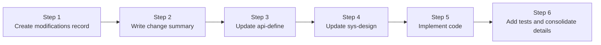
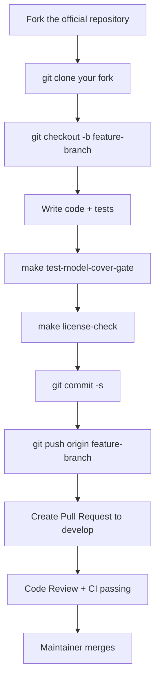

# Chapter 35: How to Contribute Code to Rainway AI Gateway

## Chapter Goals

This chapter is aimed at backend developers who want to join the Rainway AI Gateway open source community. It systematically describes the complete contribution workflow, from environment setup and code checkout through design-first development and test coverage to submitting a Pull Request. After reading this chapter, readers will be able to:

- Set up a local development environment and compile `ai-gateway-api`.
- Follow the "design first" six-step change methodology to develop non-trivial features.
- Write unit tests that comply with project standards and keep statement coverage of the `model/` layer at or above 70%.
- Handle collaboration matters for cross-repository changes (AI Gateway API, BFE, Conf Agent).
- Use tools such as `make` and `license-eye` to complete code style and compliance checks.

## Setting Up the Development Environment

Rainway AI Gateway is developed mainly in Go. The Control Plane depends on MySQL and Redis, and building depends on `make`. Contributors are advised to prepare the following environment before starting to code.

### Required Tools and Versions

| Tool | Recommended Version | Description |
|---|---|---|
| Go | 1.22 | Version specified by `ai-gateway-api/go.mod`; BFE and Conf Agent also use Go |
| MySQL | 5.7+ | Persistent storage for the Control Plane |
| Redis | 6.0+ | Shared state such as quota synchronization and rate limit counting |
| make | GNU Make | Entry point for building, testing, and packaging |
| license-eye | Latest | Apache SkyWalking Eyes; checks/fixes License headers |
| pre-commit | Optional | Automatically runs `gofmt` and other formatting before commits |

### Initializing the Database

AI Gateway API provides a MySQL table-creation script in `ai-gateway-api/db_ddl.sql`. The local initialization command is:

```bash
mysql -u{user} -p{password} < ai-gateway-api/db_ddl.sql
```

To use SQLite instead, run `ai-gateway-api/db_ddl_sqlite.sql`. Example of starting the service locally:

```bash
cd ai-gateway-api
./ai-gateway-api -c ./conf -sc ai_gateway_api.toml -l ./log
```

By default it listens on Open API port `8183` and monitoring port `8284`.

### Installing license-eye

`ai-gateway-api/Makefile` provides an automatic installation target, or you can install manually:

```bash
go install github.com/apache/skywalking-eyes/cmd/license-eye@latest
```

Commands to check and fix License headers:

```bash
make license-check
make license-fix
```

### Verifying Compilation

Once the environment is ready, run `make` in the `ai-gateway-api/` directory to download dependencies and compile the binary:

```bash
cd ai-gateway-api
make
```

If compilation succeeds, an `ai-gateway-api` executable will be generated in the current directory. The first build usually needs to download many Go modules, so it is recommended to run it in a stable network environment.

## Checking Out the Code and Repository Structure

Rainway AI Gateway consists of multiple repositories. Contributors typically need to focus on the following three core repositories:

| Repository | Role | Main Change Scenarios |
|---|---|---|
| `rainway-ai-gateway/ai-gateway-api` | Control Plane | APIs, business models, config export, version control |
| `bfenetworks/bfe` | Data Plane | Traffic forwarding, AI routing, Token authentication, rate limit modules |
| `bfenetworks/conf-agent` | Config pull agent | Hot reload of configuration, delivering configuration to BFE |

### Fork and Clone

All three repositories use the [Git Flow branching model](http://nvie.com/posts/a-successful-git-branching-model/), and day-to-day development happens on the `develop` branch. Contributors should first fork the official repository, then clone their own fork:

```bash
git clone https://github.com/your-github-account/ai-gateway-api
cd ai-gateway-api
git remote add upstream https://github.com/rainway-ai-gateway/ai-gateway-api
```

Create a local feature branch:

```bash
git checkout -b my-cool-stuff
```

### Quick Tour of the ai-gateway-api Directory

```text
ai-gateway-api/
├── endpoints/          # HTTP routes and handlers
│   ├── openapi_v1/     # User-facing Open API
│   └── innerapi_v1/    # Internal API (config export, GSLB data, etc.)
├── model/              # Business logic Managers
│   ├── quota/
│   ├── iai_route/
│   ├── imods/
│   └── ...
├── storage/rdb/        # MySQL/SQLite DAO
├── stateful/           # Configuration, DB/Redis clients, lifecycle
├── design-docs/        # API definitions, system design, change records
│   ├── api-define/
│   ├── sys-design/
│   └── modifications/
├── Makefile
├── db_ddl.sql
└── db_ddl_sqlite.sql
```

The Control Plane request flow is: `endpoints/` → `model/` → `storage/rdb/` → `stateful/`. When adding or modifying an API, changes are usually made in this order.

## Design First: The Six-Step Change Methodology

For non-trivial code changes, `ai-gateway-api/design-docs/README.md` requires following the "six-step change methodology" to ensure that design documents, API definitions, and code implementation always stay consistent.

### Method Overview



### Step 1: Create a modifications Record

Create a new directory under `ai-gateway-api/design-docs/modifications/`, named in the format:

```text
YYYYMMDD-<brief description of the change purpose>
```

For example `20260728-apikey-rate-limit/`. Directory names should use English or pinyin, avoiding special characters.

### Step 2: Write the Change Summary

The directory must contain at least `change-summary.md`, and if necessary add:

| File | Content |
|---|---|
| `change-summary.md` | Background, goals, impact scope, key decisions |
| `api-changes.md` | Added/modified/removed APIs, fields, error codes |
| `design-changes.md` | Data model, process, algorithm, and constraint changes |

### Step 3: Update the API Definitions

Modify the OpenAPI / InnerAPI definitions under `design-docs/api-define/` based on the change summary. Review checklist:

- API paths, methods, and parameters are consistent with the change summary;
- Field naming follows existing conventions;
- Error codes cover new failure scenarios;
- Existing API compatibility is not broken (if applicable).

### Step 4: Update the System Design

Modify the relevant documents in `design-docs/sys-design/`, add detail documents under `sys-design/details/` if necessary, and update the `design-docs/sys-design/summary.md` index accordingly.

### Step 5: Implement the Code

Implement in the order "API layer → model layer → storage layer". `ai-gateway-api/AGENTS.md` describes the typical patterns:

- Open API changes: `endpoints/openapi_v1/<domain>/` → register in `endpoints/openapi_v1/endpoints.go` → `model/<domain>/` → `storage/rdb/<domain>/`.
- Inner API changes: `endpoints/innerapi_v1/<domain>/` → `model/imods/`, `model/iversion_control/`.
- New domain: `model/<domain>/` → define the storager interface → `storage/rdb/<domain>/` → update `db_ddl.sql`.

When implementing in the model layer, dependencies should preferably be injected through constructors — passing `itxn.TxnStorager` and the concrete storager interfaces — rather than starting transactions or accessing global singletons directly inside managers. This keeps the business logic testable and makes it easy to use `fakeTxn` and hand-written mocks in unit tests. If during implementation you find the design needs adjustment, go back to Step 3/Step 4 to update the design documents instead of deviating from the design directly.

### Step 6: Summarize and Decide Whether to Add to the Long-Term Design Documents

After the code changes are complete, evaluate whether there is reusable, consolidatable design knowledge, such as:

- New core mechanisms (quota synchronization, rate limit policies, routing rules);
- Complex inheritance/merge logic (Entity hierarchy, model allowlist/blocklist);
- Key export/version control flows.

If worth consolidating, create a new document under `design-docs/sys-design/details/` and update `sys-design/summary.md`.

## Unit Test Organization, Mock Patterns, and Coverage Requirements

`ai-gateway-api/TESTING.md` defines the unit testing standards for the Control Plane, and contributors must strictly follow them.

### Test Organization

- Test files live in the same package as the code under test: `xxx.go` corresponds to `xxx_test.go` in the same directory.
- Shared mocks are written in `mocks_test.go`.
- Unit tests must not depend on external services (MySQL, Redis, real configuration files, or binaries).

Example directory structure:

```text
ai-gateway-api/model/quota/
├── entity_manager.go
├── entity_manager_test.go
└── mocks_test.go
```

### Mock Patterns

The project uses **hand-written callback mocks**, for example `fakeTxn` and `fakeEntityStorager` in `model/quota/mocks_test.go`:

```go
// ai-gateway-api/model/quota/mocks_test.go
type fakeTxn struct{}

func (f *fakeTxn) AtomExecute(ctx context.Context, do func(context.Context) error) error {
    return do(ctx)
}

type fakeEntityStorager struct {
    createFn func(ctx context.Context, param *EntityParam) (int64, error)
    fetchFn  func(ctx context.Context, filter *EntityFilter) (*EntityParam, error)
}

func (s *fakeEntityStorager) CreateEntity(ctx context.Context, param *EntityParam) (int64, error) {
    if s.createFn != nil {
        return s.createFn(ctx, param)
    }
    return 0, nil
}
```

The Manager layer should inject dependencies through constructors and avoid reading `stateful.DefaultConfig` or `stateful.DefaultClientSet` directly, so that dependencies can be replaced in tests.

### Coverage Requirements

`ai-gateway-api/Makefile` defines `MODEL_COVERAGE_THRESHOLD := 70`, and CI enforces the gate via `make test-model-cover-gate`. The current overall statement coverage of `model/` is about 87.6%.

| Module Type | Target Coverage |
|---|---|
| Core Manager-layer modules | ≥ 70% |
| Utility/pure-function modules | ≥ 80% |

Common test commands:

```bash
# All unit tests
go test ./...

# Only the model layer
go test ./model/...

# Coverage gate
make test-model-cover-gate
```

> `coverage.out` is a generated file and must not be committed to the repository.

## Integration Testing

In addition to unit tests, Rainway AI Gateway also maintains integration tests in the `ai-gateway-api` and `bfe` repositories to verify the real behavior of the Control Plane APIs and the Data Plane forwarding chain. When submitting cross-repository features, contributors should add corresponding integration tests as appropriate.

### AI Gateway API Integration Tests (Local, Offline)

`ai-gateway-api/test/integration/` is the Control Plane's local integration test environment. It compiles a real `ai-gateway-api` binary via `make build` and runs full API tests. The default configuration uses a local SQLite database and an embedded miniredis, requiring no external MySQL / Redis; it also supports switching to real MySQL and Redis via configuration files, making it easy to run regression verification in scenarios closer to production.

#### Directory Structure

```text
ai-gateway-api/test/integration/
├── go.mod / go.sum                # Standalone Go module referencing the main project via replace
├── conf/                          # Test-specific configuration (SQLite + miniredis + SkipTokenValidate by default)
├── data/                          # Runtime data files (created and cleaned up automatically)
├── testutil/                      # Test utility package
│   ├── server.go                  # Compile/copy the binary, start/stop subprocess management
│   ├── client.go                  # HTTP client wrapper
│   ├── assert.go                  # Assertion functions
│   ├── fixture.go                 # Test data factory
│   └── db.go                      # Database initialization/cleanup (SQLite / MySQL)
├── tests/                         # Test case code + design documents (organized by module)
│   ├── api_key/
│   ├── ai_route/
│   ├── auth/
│   ├── entity/
│   ├── route_tables/
│   ├── expression_verify/
│   ├── innerapi/
│   └── ...
└── tests/schema/                  # Schema integration tests
    ├── openapi/
    └── innerapi/
```

#### Test Environment Characteristics

| Characteristic | Description |
|---|---|
| Standalone Go module | `integration/go.mod` references the main project source via `replace github.com/rainway-ai-gateway/ai-gateway-api => ../../`, without polluting production code |
| Real binary subprocess | Uses `exec.CommandContext` to start the real binary compiled by `make build`, covering the full startup path |
| Switchable database: SQLite / MySQL | Uses the pure-Go `glebarez/go-sqlite` driver by default, no CGO needed; each test process uses an independent database file (including PID) that is cleaned up automatically after tests; modifying `conf/ai_gateway_api.toml` also connects to real MySQL |
| Switchable Redis: miniredis / Redis | Starts an embedded miniredis by default, no external Redis needed; after changing the configuration it can connect to real Redis to verify Redis-dependent paths such as quota and rate limiting |
| Authentication skipped | Configures `SkipTokenValidate = true`, so test requests need no real Token authentication |
| Organized by module | Test code and `design.md` for the same module live in the same directory, reducing maintenance cost |

#### Common Commands

```bash
# Compile the binary in the ai-gateway-api root directory
make build

# Download test dependencies
cd ai-gateway-api/test/integration
go mod tidy

# Run all integration tests
../scripts/run_all_tests.sh
# Or: go test -v -count=1 -timeout 300s ./tests/...

# Run tests for a specific module
../scripts/run_module_tests.sh api_key
# Or: go test -v -count=1 -timeout 120s ./tests/api_key/...

# Run a single API test
go test -v -count=1 -timeout 120s ./tests/api_key/create/

# Clean up runtime data
../scripts/clean.sh
```

#### Test Code Template

Each API gets its own subdirectory, and modules share a single server instance through `TestMain`:

```go
package create

import (
    "os"
    "testing"
    "github.com/rainway-ai-gateway/ai-gateway-api/integration/testutil"
)

var sm *testutil.ServerManager

func TestMain(m *testing.M) {
    var err error
    sm, err = testutil.StartServer()
    if err != nil {
        panic("failed to start server: " + err.Error())
    }
    code := m.Run()
    sm.Shutdown()
    os.Exit(code)
}

func TestCreate_NormalCase(t *testing.T) {
    body := map[string]interface{}{"field": "value"}
    resp, err := testutil.GetClient().Post("/open-api/v1/xxx", body)
    if err != nil {
        t.Fatalf("request failed: %v", err)
    }
    testutil.AssertSuccess(t, resp)
    testutil.AssertDataFieldEquals(t, resp, "field", "value")
}
```

`testutil` also provides assertions such as `AssertErrCode`, `AssertListLen`, and `AssertPagination`, as well as helper functions such as `UniqueName`, `RandomString`, and `GenerateTestCert`.

#### Schema Integration Tests

To strictly verify that each API response conforms to the definitions in `design-docs/api-define`, the project maintains a set of schema integration tests:

```bash
# All schema tests
go test -v -count=1 -timeout 300s ./tests/schema/...

# OpenAPI schema tests only
go test -v -count=1 -timeout 300s ./tests/schema/openapi/...

# InnerAPI schema tests only
go test -v -count=1 -timeout 300s ./tests/schema/innerapi/...
```

The generic validator is located in `testutil/schema.go`, supporting validation of object field existence, types, required fields, optional fields, nested objects, array elements, enum values, and pagination structures.

### BFE Integration Tests (Real Process-Level)

`bfe/tests/integration/` is the Data Plane's real process-level integration test. Unlike the `integration-test/` directory in the repository, it only starts a real `bfe` process and does not involve external components such as `ai-gateway-api` or `conf-agent`; the BFE configuration files needed by the tests are provided directly by test code or static `testdata`, requests are sent over real HTTP to the BFE listening port, and forwarding behavior and backend hit statistics are verified.

#### Directory Structure

```text
bfe/tests/integration/
├── common/                                    # Common harness
│   ├── process_env.go                         # Compile/start/stop the real BFE process
│   ├── bfe_config_builder.go                  # Generate temporary BFE configuration
│   ├── mock_backend.go                        # Local mock AI backend
│   └── util.go                                # Utility functions
├── implementation/                            # Go implementation code
│   └── scenario-SC01-route-table-lookup/
│       ├── sc01_route_table_lookup_test.go
│       └── testdata/                          # Static BFE configuration templates
└── 测试设计文档/                               # Chinese test design documents
    ├── 测试场景总体说明.md
    └── scenario-SC01-路由表查找与绑定/
        ├── 场景说明.md
        └── TC-*.md
```

#### How to Run

```bash
# Run all integration tests under the bfe directory
go test ./tests/integration/... -v

# Run a single scenario
go test ./tests/integration/implementation/scenario-SC01-route-table-lookup/... -v

# Run a single test case
go test ./tests/integration/implementation/scenario-SC01-route-table-lookup/ -run TestTC01 -v
```

The first run automatically compiles the `bfe` binary and caches it to `bfe/tests/integration/.integration-test-bin/`.

#### Current Coverage

| Scenario | Description |
|---|---|
| SC01 route table lookup and binding | Verifies the search and fallback order of `mod_ai_route` across multi-level route tables (API-Key / Entity / Global), and the body rewind behavior on fallback |

### Notes When Contributing Integration Tests

1. **Add unit tests first**: unit tests remain the core of the CI gate, and statement coverage of the `model/` layer must not fall below 70%. Integration tests cover real processes, end-to-end chains, or schema contracts, and must not replace unit tests.
2. **AI Gateway API changes**: if OpenAPI / InnerAPI APIs are added or modified, add cases under the corresponding module in `ai-gateway-api/test/integration/tests/` and add schema validation in `tests/schema/`.
3. **BFE module changes**: if you modify Data Plane modules such as `mod_ai_route`, `mod_ai_token_auth`, or `mod_ai_rate_limit`, evaluate whether new scenarios are needed in `bfe/tests/integration/` to cover real forwarding behavior.
4. **Disk space**: the pure-Go `modernc.org/sqlite` / `glebarez/go-sqlite` implementations need considerable temporary space when compiling. If the build fails, first check disk space and clean the Go cache:
   ```bash
   go clean -cache -testcache
   ```
5. **Do not commit generated files**: `coverage.out`, `.integration-test-bin/`, SQLite database files, WAL/SHM files, etc. must not be committed to the repository.

## License Headers and Code Style

Rainway AI Gateway follows the [Golang style guide](https://github.com/golang/go/wiki/Style). All Go source files must include an Apache 2.0 / Rainway AI Gateway License header. An example header from `ai-gateway-api/Makefile`:

```go
// Copyright(c) 2024 The Rainway AI Gateway Authors. All rights reserved.
//
// Licensed under the Apache License, Version 2.0 (the "License");
// ...
```

Contributors can automatically fix missing License headers with `make license-fix` and self-check before CI with `make license-check`. For the BFE repository, it is recommended to use `pre-commit` to run `gofmt` automatically:

```bash
pip install pre-commit
pre-commit install
```

BFE also requires commits to carry a `Signed-off-by:` signature, confirming that the contributor accepts the [Developer Certificate of Origin](https://developercertificate.org/).

## Commit Message Conventions and the PR Workflow

The `CONTRIBUTING.md` of the three core repositories all use the Git Flow branching model, and the PR workflows are similar. This section uses `ai-gateway-api` as the example.

### Local Workflow



### Commit and PR Notes

- Submit the PR from your fork's `feature-branch` to the official repository's `develop` branch.
- Sync with upstream frequently before committing: `git pull upstream develop`.
- If fixing an issue, write `Fixes <issue-URL>` in the PR description; GitHub will automatically close the corresponding issue after merging.
- Specify reviewers; if unsure, follow GitHub's recommendations.
- Avoid meaningless commits; you can use `git commit --amend` to fold in small changes.
- Reply to every reviewer comment: reply "Done" if accepted, or explain the reason if not.
- After the branch is merged, clean up the local and remote branches:

```bash
git push origin :my-cool-stuff
git checkout develop
git pull upstream develop
git branch -d my-cool-stuff
```

## Notes on Cross-Repository Collaboration

AI gateway functionality usually involves the Control Plane, the Data Plane, and configuration delivery at the same time. Contributors should determine during the design phase whether a change spans repositories and coordinate the modifications.

| Change Scope | Repositories Involved | Typical Files |
|---|---|---|
| AI routing rules | ai-gateway-api + bfe | `model/iai_route/`, `bfe/bfe_modules/mod_ai_route/` |
| Token authentication | ai-gateway-api + bfe | `model/imods/`, `bfe/bfe_modules/mod_ai_token_auth/` |
| Rate limit policies | ai-gateway-api + bfe | `model/quota/`, `bfe/bfe_modules/mod_ai_rate_limit/` |
| Configuration delivery | ai-gateway-api + conf-agent | `endpoints/innerapi_v1/export_util/`, `conf-agent/` |

Suggestions for cross-repository contributions:

1. **Complete the design documents in `ai-gateway-api` first**: `design-docs/modifications/`, `api-define/`, `sys-design/`.
2. **Update the BFE configuration format in sync**: if the JSON/TOML structure exported to the Data Plane changes, the corresponding module's configuration parsing in `bfe/` must be updated accordingly.
3. **Update Conf Agent in sync**: if the configuration delivery path or version numbering rules change, synchronize in `conf-agent/`.
4. **Submit separate PRs**: one PR per repository, cross-referencing each other in the PR descriptions (e.g. `Depends on rainway-ai-gateway/ai-gateway-api#123`).
5. **Use a consistent reviewer**: for cross-repository changes, find the same reviewer or reviewer group to ensure design consistency.

The most common problems with cross-repository changes include: field names exported by the Control Plane not matching Data Plane parsing, Conf Agent failing to recognize version number or configuration path changes, and error codes or default values having different semantics in the two repositories. During the design phase, the configuration format consumed by the Data Plane and the version strategy should be made explicit in `design-changes.md`, and an end-to-end verification plan should be provided in the PR.

## Complete Walkthrough: A First-Time Contribution

The following demonstrates the complete flow from zero to PR, using a real commit to the `ai-gateway-api` repository as the example.

> Reference commit:
> - Commit: `51cded34dae072b6c909a4a08f30ceb0199deea9`
> - Author: `zhangmiao <zhangmiao@yf-networks.com>`
> - Date: `2026-08-31`
> - Commit message: `feat(operation-log): add operation log module and update sys-design docs; bump version to 0.0.9`
> - Change size: `58 files changed, 4759 insertions(+), 70 deletions(-)`

This commit adds an "Operation Log" capability to the Control Plane: it records write operations in configuration domains such as entity, api-key, and provider, and exposes a `GET /open-api/v1/operation-logs` query API. It does not involve the BFE Data Plane, so the example flow focuses on a single-repository Control Plane change.

### 1. Create the Change Record

Create a new directory under `ai-gateway-api/design-docs/modifications/`, named in the format `YYYYMMDD-<brief description of the change purpose>`. A non-trivial change must include at least `change-summary.md`; if API or data model changes are involved, `api-changes.md` and `design-changes.md` should also be created.

```bash
cd ai-gateway-api/design-docs/modifications
mkdir 2026-08-31-operation-log
cd 2026-08-31-operation-log
cat > change-summary.md <<EOF
# Operation Log Change Summary

## 1. Background

`ai-gateway-api` currently only records HTTP access logs and lacks structured auditing for configuration changes. After configuration items such as entity, api-key, provider, and route are modified, there is no quick way to answer questions like "who made what change, when, which fields were modified, and what the outcome was".

## 2. Goals

- Record operation logs for all configuration domains that produce write operations in the Control Plane, and persist them to the database.
- Provide a structured query API supporting filtering by operator, resource type, resource ID, action type, time range, and other dimensions.
- Mask sensitive fields such as api-key tokens, passwords, and private keys to prevent leakage through logs.
- Use asynchronous batched writes to minimize the latency impact on main business requests.

## 3. Scope

| Scope | Description |
|------|------|
| Repositories involved | `ai-gateway-api` |
| Modules involved | `model/ioperlog`, `storage/rdb/ioperlog`, `endpoints/openapi_v1/operation_log`, various configuration domain Managers |
| APIs involved | New `GET /open-api/v1/operation-logs`; existing write APIs internally hook in operation log recording |
| Data migration | New `operation_logs` table; no historical data migration |
| Data Plane impact | None |

## 4. Key Decisions

| Decision | Description |
|------|------|
| Managers record proactively | Business Managers construct `OperationLogEntry` after a write operation succeeds, carrying business semantics such as resource ID, name, and change summary — preferable to pure Middleware parsing |
| Asynchronous batched persistence | `OperationLogManager` writes to the database in batches via an in-memory buffer + background worker, triggering an INSERT every 200 entries or 5 seconds by default |
| All domains in phase one | Phase one covers all configuration domains: entity, entity_type, api_key, provider, cluster, route, domain, certificate, quota_plan, rate_limit_policy, model_price, user, token, etc. |
| Failed operations also recorded | Failed write operations are recorded too (`status = 2`), preserving audit evidence of failures |
| Uniform masking of sensitive fields | A `maskSensitiveFields` utility function masks or excludes fields such as tokens, passwords, and private keys |
| Query API restricted to administrators | Access is controlled by system administrator permission for now; after the permission system is restructured, it will be refined per entity dimension |

## 5. Related Documents

- `design-docs/modifications/2026-08-31-operation-log/api-changes.md`
- `design-docs/modifications/2026-08-31-operation-log/design-changes.md`
EOF
```

`change-summary.md` is the entry point for subsequent discussion and review. Write the background, goals, scope, and key decisions clearly, so reviewers don't have to reverse-engineer design intent from the code. If the change involves API contracts or field changes, `api-changes.md` should list in detail the added/modified/removed APIs, request/response fields, and error codes; if it involves data model, process, or algorithm changes, `design-changes.md` should provide the table structures, state machines, call chains, or key algorithm descriptions.

### 2. Update api-define and sys-design

The design document updates in the reference commit include:

- Adding the API definition of `GET /open-api/v1/operation-logs` in `design-docs/api-define/` (request parameters, response fields, error codes, permission control).
- Indexing the new operation log design document in `design-docs/sys-design/summary.md`.
- Adding or updating relevant detail descriptions in `design-docs/sys-design/details/`, such as the asynchronous buffer, batched writes, masking rules, degradation strategy, and monitoring metrics.

### 3. Implement the Control Plane Code

Implement in the order API layer → model layer → storage layer. Key files involved in the reference commit:

- **API layer**
  - `endpoints/openapi_v1/operation_log/endpoints.go`: registers the endpoint.
  - `endpoints/openapi_v1/operation_log/list.go`: implements the `GET /open-api/v1/operation-logs` handler.
  - `endpoints/openapi_v1/endpoints.go`: registers the new endpoint into the global route table.

- **Model layer**
  - `model/ioperlog/types.go`: defines types such as `OperationLogEntry`, `OperationLogFilter`, and `OperationLogQueryResult`.
  - `model/ioperlog/storager.go`: defines the `OperationLogStorager` interface.
  - `model/ioperlog/manager.go`: implements `OperationLogManager`, including asynchronous `Record`, synchronous `RecordSync`, `QueryLogs`, and the background worker for batched INSERTs.
  - `model/ioperlog/mask.go`: implements the sensitive field masking utility function.
  - Managers of each configuration domain (such as `model/entity/entity_manager.go`, `model/api_key/api_key.go`, etc.): call `OperationLogManager.Record()` after write operations succeed.

- **Storage layer**
  - `storage/rdb/ioperlog/operation_log.go`: implements `OperationLogStorager`.
  - `storage/rdb/internal/dao/table_operation_logs.go`: adds the `TOperationLog*` helper functions.
  - `db_ddl.sql` / `db_ddl_sqlite.sql`: add the `operation_logs` table and indexes.

- **Container initialization**
  - `stateful/container/components.go` and `stateful/container/rdb/components.go`: initialize `OperationLogStorager` and `OperationLogManager` and inject them into the Managers of each configuration domain.

- **Version number**
  - `version/version.go`: update the version number according to the release cadence, if any.

### 4. Write Unit Tests

In the reference commit, unit tests live in the same package as the code under test and cover the core logic and boundary scenarios:

```text
model/ioperlog/
├── manager.go
├── manager_test.go       # Tests the async buffer, batched writes, degradation on full queue, graceful-shutdown flush
├── mask.go
└── mask_test.go          # Tests sensitive field masking rules

model/entity/
├── entity_manager.go
├── entity_manager_test.go
└── operation_log_test.go # Verifies that OperationLogManager.Record() is called correctly after write operations
```

Tests should focus on:

- Statement coverage of `model/ioperlog` must reach 70% or higher.
- Verify behaviors such as the asynchronous buffer, batched writes, degradation on full queue, and graceful-shutdown flush.
- Verify that the Managers of all integrated domains call `OperationLogManager.Record()` correctly after write operations.
- Verify the masking effect on sensitive fields such as api-key tokens, passwords, and private keys.

### 5. Write Integration Test Cases

Control Plane API changes should be accompanied by SQLite offline integration tests. The reference commit adds design documents and test code under `ai-gateway-api/test/integration/tests/operation_log/`:

```text
test/integration/tests/operation_log/
├── design.md             # Test case design (API list, parameter descriptions, scenario design)
└── list/
    └── list_test.go      # Tests for the GET /open-api/v1/operation-logs API
```

Typical test code structure:

```go
package list

import (
    "os"
    "testing"

    "github.com/rainway-ai-gateway/ai-gateway-api/integration/testutil"
)

var sm *testutil.ServerManager

func TestMain(m *testing.M) {
    var err error
    sm, err = testutil.StartServer()
    if err != nil {
        panic("failed to start server: " + err.Error())
    }
    code := m.Run()
    sm.Shutdown()
    os.Exit(code)
}

func TestListOperationLogs_NormalCase(t *testing.T) {
    resp, err := testutil.GetClient().Get("/open-api/v1/operation-logs?page=1&page_size=20")
    if err != nil {
        t.Fatalf("request failed: %v", err)
    }
    testutil.AssertSuccess(t, resp)
    testutil.AssertPagedListSchema(t, resp, "list", "pagination")
}
```

If the change involves Data Plane forwarding logic, new or extended scenarios should also be added in `bfe/tests/integration/` to verify the forwarding behavior of a real BFE process under routing, authentication, rate limiting, and other rules.

### 6. Local Verification

```bash
cd ai-gateway-api

# 1. Unit tests and the coverage gate
make test-model-cover-gate

# 2. License header check
make license-check

# 3. Run the new integration tests
cd test/integration
go test -v -count=1 -timeout 120s ./tests/operation_log/...
```

Since this change does not involve the BFE Data Plane, no build verification is needed in the `bfe/` directory; if the change spans repositories, builds and tests must be run in each repository separately.

### 7. Submit the PR

A single-repository change only needs one PR in `ai-gateway-api`. The commit message can follow the real commit:

```text
feat(operation-log): add operation log module and update sys-design docs; bump version to 0.0.9
```

The PR description should cover:

- Change background and goals (may reference `change-summary.md`).
- Main changes (APIs, model, storage, tests, design documents).
- Test coverage (unit tests, integration tests).
- Whether the Data Plane or Conf Agent is involved (not involved in this case).

After the PR is merged, clean up the local and remote branches:

```bash
git push origin :feature-operation-log
git checkout develop
git pull upstream develop
git branch -d feature-operation-log
```

## Pre-Submission Checklist

Before clicking "Create Pull Request", it is recommended to do a final round of checks against the following list:

- [ ] A change directory has been created under `design-docs/modifications/` with descriptions filled in.
- [ ] If API changes are involved, `design-docs/api-define/` has been updated and reviewed.
- [ ] If architecture or data model changes are involved, `design-docs/sys-design/` and `summary.md` have been synchronized.
- [ ] Code has been implemented in the order "API layer → model layer → storage layer" and is consistent with the design documents.
- [ ] Unit tests have been added for new or modified managers, and `make test-model-cover-gate` passes.
- [ ] All unit tests pass with `make test` (at least covering the packages related to the change).
- [ ] `make license-check` passes, or `make license-fix` has been run.
- [ ] No generated files are committed (such as `coverage.out`, binaries, `.exe`).
- [ ] The commit message includes `Signed-off-by:` (required by the BFE repository).
- [ ] The PR description is clear, links the issue (if any), and specifies reviewers.

## Chapter Summary

Contributing code to Rainway AI Gateway requires attention to both code quality and consistency with the design documents. Key takeaways:

- The local environment is based on Go 1.22, MySQL, Redis, and make, with license-eye for License header checks.
- Non-trivial changes must follow the six-step methodology in `design-docs/README.md`: write design documents before code.
- Unit tests use same-package tests + hand-written callback mocks, and Manager-layer coverage must not fall below 70%.
- Code style follows the Golang style guide, and new files must include a License header.
- PRs go from a feature branch in your fork to the official `develop` branch; mind `Signed-off-by:` and reviewer communication.
- Features such as AI routing, Token authentication, rate limiting, and config export are usually cross-repository and require synchronized updates to `ai-gateway-api`, `bfe`, and `conf-agent`.

Following the workflow above ensures that individual contributions pass CI and Code Review smoothly, and maintains the project's long-term maintainable architecture and documentation system.

## References

- `ai-gateway-api/CONTRIBUTING.md` — Contribution workflow and code style
- `ai-gateway-api/TESTING.md` — Unit test standards, mock patterns, coverage requirements
- `ai-gateway-api/AGENTS.md` — Control Plane architecture and common modification patterns
- `ai-gateway-api/design-docs/README.md` — The six-step change methodology
- `ai-gateway-api/Makefile` — Build, test, and License check targets
- `bfe/CONTRIBUTING.md` — BFE Data Plane contribution workflow
- `conf-agent/CONTRIBUTING.md` — Conf Agent contribution workflow
