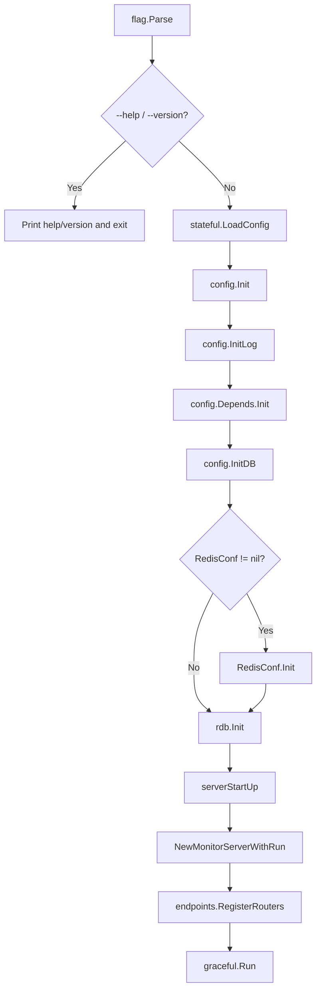
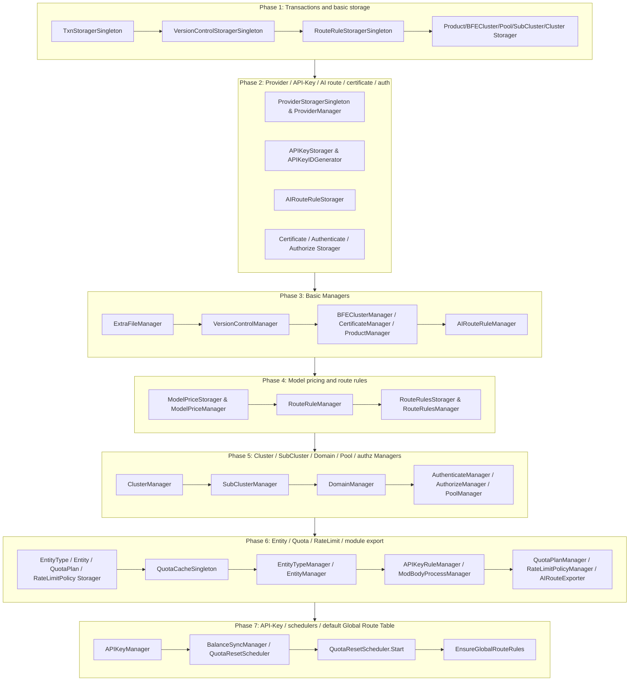

# Chapter 25: Code Layout and Startup Flow

## Chapter Goals

After reading this chapter, readers will be able to:

- Understand the top-level directory organization of the `ai-gateway-api` Control Plane code.
- Identify the responsibility boundaries of the interface layer (Endpoints), the model layer (Model), and the storage layer (Storage/RDB), along with their corresponding directories.
- Master the startup flow of `main.go`, including command-line flag parsing, configuration loading, database initialization, dependency-injection container initialization, and HTTP server startup.
- Understand the role of the `stateful` package in configuration loading and in managing the lifecycle of global components.
- Be familiar with the initialization order of the global `Manager` / `Storager` singletons and their interdependencies.

## Overview of the Layered Architecture

`ai-gateway-api` is the core Control Plane component of the Rainway AI Gateway. It exposes the management-plane OpenAPI and the data-plane InnerAPI to the outside world, and generates consumable configuration snapshots for the BFE Data Plane and Conf Agent. Its code organization follows the classic three-layer architecture:

```
┌─────────────────────────────────────────────────────────────┐
│                 Interface layer (endpoints)                  │
│   OpenAPI v1 (/open-api/v1)  ·  InnerAPI v1 (/inner-api/v1)  │
├─────────────────────────────────────────────────────────────┤
│                    Model layer (model)                       │
│        Business logic · Transaction orchestration ·          │
│        Parameter validation · Cascade operations             │
├─────────────────────────────────────────────────────────────┤
│                  Storage layer (storage/rdb)                 │
│      DAO · Storager implementations · Relational DB access   │
└─────────────────────────────────────────────────────────────┘
```

| Layer | Main responsibilities | Key packages |
|-------|----------------------|--------------|
| **Interface layer** | Handles HTTP requests, parameter binding and validation, permission checks, invokes the model layer, returns uniform responses | `endpoints/openapi_v1`, `endpoints/innerapi_v1`, `endpoints/middleware` |
| **Model layer** | Encapsulates business logic, transaction management, and invokes storage-layer interfaces; does not depend on the underlying database directly | `model/*` |
| **Storage layer** | Responsible for relational database reads and writes; exposes interfaces upward, invoked by the model layer through the transaction abstraction | `storage/rdb/*` |

The interface layer invokes the model layer through the global singleton Managers registered in `stateful/container`, and never accesses the storage layer directly. The model layer depends only on the `XxxStorager` interfaces defined in the same package or in `model/shared`, plus the `model/itxn.TxnStorager` transaction abstraction. The storage layer implements these interfaces and operates on the concrete database tables internally via `storage/rdb/internal/dao`.

The core purpose of this layered design is **isolating change**: when business rules change, only the model layer needs modification; when the database schema changes, only the storage layer; when the interface protocol or authentication method changes, only the interface layer. Meanwhile, because the model layer depends on the storage layer through interfaces rather than concrete implementations, unit tests can conveniently replace the real database with mock storage, ensuring that the `model/` packages achieve over 70% statement coverage.

## ai-gateway-api Directory Layout Overview

The top-level directory structure of `ai-gateway-api` is as follows:

```
ai-gateway-api/
├── main.go                      # Service entry: config loading, initialization, HTTP startup
├── conf/                        # Configuration files (TOML, i18n, AI templates, etc.)
├── data/                        # Data files
├── docs/                        # User documentation
├── design-docs/                 # Design documents
│   ├── api-define/              # API definition documents
│   └── sys-design/              # System design documents
├── endpoints/                   # Interface layer
│   ├── middleware/              # HTTP middleware
│   ├── openapi_v1/              # Management-plane OpenAPI v1
│   └── innerapi_v1/             # Data-plane InnerAPI v1
├── lib/                         # Common libraries (xreq, xerror, xdb, etc.)
├── model/                       # Model layer
│   ├── api_key/                 # API-Key business model
│   ├── entity/                  # Entity / Entity-Type business model
│   ├── iauth/                   # Authentication and authorization
│   ├── ibasic/                  # Basic configuration (product, bfe_cluster, extra_file)
│   ├── icluster_conf/           # Cluster / SubCluster / Instance Pool
│   ├── iprovider/               # Provider business model
│   ├── imodel_price/            # ModelPrice model pricing management
│   ├── iroute_conf/             # Route rules / domains
│   ├── iai_route/               # AI route rules
│   ├── iprotocol/               # TLS certificates
│   ├── iversion_control/        # Configuration version control
│   ├── imods/                   # Module configuration export
│   ├── quota/                   # QuotaPlan / BalanceSync / QuotaResetScheduler
│   ├── rate_limit_policy/       # RateLimitPolicy business model
│   ├── quotacache/              # API-Key/Entity real-time quota cache abstraction
│   ├── shared/                  # Types and models shared across packages
│   ├── route_rules/             # Global/Entity/API-Key route rule business logic
│   └── itxn/                    # Transaction abstraction interface
├── stateful/                    # Configuration, database, logging, DI container
│   └── container/               # Global component container
│       ├── components.go        # Global Manager/Storager singleton declarations
│       └── rdb/                 # RDB-based component initialization and DI
│           └── components.go    # Init() implementation
├── static/                      # Frontend static assets
├── storage/rdb/                 # Storage layer
│   ├── internal/dao/            # DAO layer
│   ├── auth/                    # Authentication and authorization storage
│   ├── basic/                   # Basic configuration storage
│   ├── cluster_conf/            # Cluster / API-Key / Instance Pool storage
│   ├── protocol/                # Certificate storage
│   ├── quota/                   # Quota-related storage
│   ├── route_conf/              # Route rule storage
│   ├── txn/                     # Transaction implementation
│   └── version_control/         # Version control storage
├── test/                        # Test-related
└── version/                     # Version information
```

## Directories for the Interface, Model, and Storage Layers

### Interface Layer (endpoints)

The interface layer lives in `endpoints/` and uniformly uses the `lib/xreq.Endpoint` abstraction to describe each HTTP endpoint:

```go
type Endpoint struct {
    Path            string
    Method          string
    Handler         Handler
    Authorizer      func(*http.Request) error
    RegisterHandler func(*mux.Router) *mux.Route
}
```

| Subdirectory | Responsibility |
|--------------|----------------|
| `endpoints/openapi_v1/` | Management-plane OpenAPI, used by the Dashboard and automation scripts, e.g. `/api-keys`, `/clusters`, `/providers` |
| `endpoints/innerapi_v1/` | Data-plane InnerAPI, used by BFE and Conf Agent to pull configuration, e.g. `/configs/tls_conf/server_data_conf`, `/configs/mod-api-key` |
| `endpoints/middleware/` | Global HTTP middleware: Recovery, Logger, CORS, Product Probe, User Probe |

The two interface families differ significantly in route prefix, authentication method, and purpose. OpenAPI v1 uses the `/open-api/v1` prefix and is aimed at humans and external systems; it typically requires the Product Probe and User Probe middleware to validate the product line and user identity. InnerAPI v1 uses the `/inner-api/v1` prefix and is aimed at machine clients such as BFE and Conf Agent, emphasizing complete configuration export and version-based incremental sync. The top-level `endpoints/router.go` handles global Recovery, Logger, CORS, and static file serving, while `endpoints/openapi_v1/endpoints.go` and `endpoints/innerapi_v1/endpoints.go` each merge the `Endpoint` slices from their sub-packages and complete registration.

### Model Layer (model)

The model layer lives in `model/` and follows the **Manager + Storager interface** pattern:

| Type | Description |
|------|-------------|
| `XxxParam` | Create/update input parameters; fields are mostly pointer types to distinguish "not provided" from "zero value" |
| `XxxFilter` | Query conditions, including pagination fields `Page` / `PageSize` |
| `XxxStorager` | Defines the persistence operation contract, implemented by sub-packages of `storage/rdb/` |
| `XxxManager` | Business logic implementation, aggregating `itxn.TxnStorager` and other `Storager`s |

Key model packages and their responsibilities:

| Model package | Main responsibilities |
|---------------|----------------------|
| `model/api_key` | API-Key business logic, cascade deletion, real-time quota queries, mod-api-key export data source |
| `model/entity` | Entity / Entity-Type business logic, hierarchy validation, cascade deletion |
| `model/icluster_conf` | Business logic for Cluster, SubCluster, and Pool |
| `model/iprovider` | Provider business logic: CRUD, model discovery, referenced-by-cluster checks |
| `model/quota` | QuotaPlan, BalanceSync, QuotaResetScheduler |
| `model/rate_limit_policy` | RateLimitPolicy business logic, hierarchy collection and export |
| `model/route_rules` | Global/Entity/API-Key route rule business logic |
| `model/imods` | Assembly of mod-api-key, mod-body-process, and AI route export configurations |
| `model/itxn` | Transaction abstraction interface `TxnStorager` |

The unified transaction abstraction is defined in `model/itxn/txn.go`:

```go
type TxnStorager interface {
    AtomExecute(ctx context.Context, do func(context.Context) error) error
}
```

`storage/rdb/txn` provides an implementation based on `database/sql`; Managers orchestrate atomic operations across multiple Storagers via `container.TxnStoragerSingleton`. Any business change that involves multiple tables or multiple Storagers should be wrapped in an `AtomExecute` callback, avoiding ad-hoc transactions opened directly inside a Manager.

### Storage Layer (storage/rdb)

The storage layer lives in `storage/rdb` and follows a **DAO + Storage** two-tier structure:

| Component | Responsibility |
|-----------|----------------|
| `storage/rdb/internal/dao` | Provides per-table `T<Table>One/List/Create/Update/Delete` functions that operate on the database directly |
| `storage/rdb/*` | Implements the `XxxStorager` interfaces defined in `model/*`, converting DAO results to and from business models |
| `storage/rdb/txn` | Implements the `model/itxn.TxnStorager` transaction abstraction |

The correspondence between the storage layer and the model layer is as follows:

| Storage package | Corresponding model package | Tables covered |
|-----------------|-----------------------------|----------------|
| `storage/rdb/auth` | `model/iauth` | `users`, `user_products` |
| `storage/rdb/basic` | `model/ibasic` | `bfe_clusters`, `products`, `extra_files` |
| `storage/rdb/api_key` | `model/api_key` | `api_keys`, `api_key_tokens` |
| `storage/rdb/cluster_conf` | `model/icluster_conf` | `clusters`, `sub_clusters`, `pools`, `lb_matrices` |
| `storage/rdb/entity` | `model/entity` | `entity_types`, `entities` |
| `storage/rdb/protocol` | `model/iprotocol` | `certificates` |
| `storage/rdb/quota` | `model/quota` | `quota_plans` |
| `storage/rdb/rate_limit_policy` | `model/rate_limit_policy` | `rate_limit_policies` |
| `storage/rdb/route_conf` | `model/iroute_conf` | `domains`, `route_basic_rules`, etc. |
| `storage/rdb/route_rules` | `model/shared`, `model/route_rules` | `route_rules` |
| `storage/rdb/ai_route` | `model/iai_route` | `ai_route_rules` |
| `storage/rdb/version_control` | `model/iversion_control` | `config_versions` |

The DAO layer follows a uniform template: each table has a table-name constant, a result struct `T<Table>`, a parameter struct `T<Table>Param`, and the `T<Table>One/List/Create/Update/Delete` functions. On top of these DAO functions, the Storage layer implements the `XxxStorager` interfaces, handling conversion between business models and database rows, default value processing, and simple query-condition assembly. All tables include `created_at` and `updated_at` fields, and the DDL declares no physical FOREIGN KEYs; inter-table relationships are maintained by application-layer code, making future database/table sharding and flexible schema changes easier.

## main.go Startup Flow

`ai-gateway-api/main.go` is the single entry point of the entire Control Plane service. Its main flow can be divided into two phases: the initialization phase and the server startup phase.



Key code excerpt from `ai-gateway-api/main.go`:

```go
func main() {
    flag.Parse()

    if *help {
        flag.PrintDefaults()
        return
    }
    if *showVer {
        fmt.Printf("version %s\n", version.Version)
        return
    }

    if err := stateful.LoadConfig(filepath.Join(*confDir, *serverConf)); err != nil {
        stateful.Exit("LoadConfig", err, -1)
    }

    config := stateful.DefaultConfig
    config.LogDir = *logDir
    config.ConfigDir = *confDir

    config.Vars["conf_dir"] = *confDir
    config.Vars["log_dir"] = *logDir

    if err := config.Init(); err != nil {
        stateful.Exit("config.Init", err, -1)
    }

    if err := config.InitLog(); err != nil {
        stateful.Exit("config.InitLog", err, -1)
    }

    defer func() {
        time.Sleep(time.Second)
        stateful.CloseLog()
    }()

    if err := config.Depends.Init(); err != nil {
        stateful.Exit("config.Depends.Init", err, -1)
    }

    if err := config.InitDB(); err != nil {
        stateful.Exit("config.InitDB", err, -1)
    }

    // check redis server conf
    if config.RedisConf != nil {
        config.RedisConf.Init()
    }

    if err := rdb.Init(); err != nil {
        stateful.Exit("rdb.Init", err, -1)
    }

    serverStartUp()
}
```

### Command-Line Flags

`main.go` parses the following flags using the standard library `flag`:

```go
var (
    help       *bool   = flag.Bool("h", false, "to show help")
    showVer    *bool   = flag.Bool("v", false, "to show version")
    confDir    *string = flag.String("c", "./conf/", "API configure dir")
    serverConf *string = flag.String("sc", "ai_gateway_api.toml", "server conf file")
    logDir     *string = flag.String("l", "./log", "dir path of log")
)
```

- `-c`: configuration file directory, default `./conf/`.
- `-sc`: server configuration file name, default `ai_gateway_api.toml`.
- `-l`: log directory, default `./log`.
- `-h` / `-v`: print help and version information respectively.

Example local startup:

```bash
./ai-gateway-api -c ./conf -sc ai_gateway_api.toml -l ./log
```

### Server Startup Phase

Once initialization is complete, `serverStartUp()` is responsible for starting the HTTP server:

```go
func serverStartUp() {
    serverConfig := stateful.DefaultConfig.Server

    if serverConfig.MonitorPort > 0 {
        stateful.NewMonitorServerWithRun(version.Version, serverConfig.MonitorPort)
    }

    n := negroni.New()
    router := mux.NewRouter()
    endpoints.RegisterRouters(router)
    n.UseHandler(router)

    timeout := time.Duration(serverConfig.GracefulTimeOutInMs) * time.Millisecond
    serverAddr := serverConfig.ServerAddr
    if serverAddr == "" {
        serverAddr = "0.0.0.0"
    }
    address := fmt.Sprintf("%s:%d", serverAddr, serverConfig.ServerPort)
    fmt.Println("Run Server At:", address)
    graceful.Run(address, timeout, n)
}
```

This phase mainly accomplishes three things:

1. **Monitor server startup**: if `MonitorPort > 0` in the configuration, a monitor port (default 8284) is started to expose version, health check, performance metrics, etc.
2. **Route registration**: creates a router using `gorilla/mux`, calls `endpoints.RegisterRouters(router)` to register OpenAPI and InnerAPI routes, and mounts global middleware (Recovery, Logger, CORS, etc.) via `negroni`.
3. **Graceful startup**: starts the HTTP server using `tylerb/graceful`, supporting graceful shutdown with a timeout determined by the `GracefulTimeOutInMs` configuration.

## stateful Configuration Loading and DI Container

The `stateful` package is responsible for configuration loading, database connections, logging initialization, and global dependency management. It mainly contains the following files:

| File | Responsibility |
|------|----------------|
| `stateful/config.go` | TOML configuration loading, the `DefaultConfig` global variable, base configuration structs |
| `stateful/config_database.go` | Database configuration and `InitDB` implementation |
| `stateful/config_depends.go` | Initialization of non-database dependencies (i18n, nav_tree, etc.) |
| `stateful/log.go` | Logging initialization and shutdown |
| `stateful/monitor.go` | Monitor server startup |
| `stateful/container/components.go` | Global Manager / Storager singleton declarations |
| `stateful/container/rdb/components.go` | RDB-based component initialization and dependency injection |

Its core flow is as follows:

1. **`stateful.LoadConfig`**: reads the TOML configuration file, deserializes it into the `stateful.Config` struct, and stores it in the `stateful.DefaultConfig` global variable.
2. **`config.Init()`**: initializes path variables, internal state, etc.
3. **`config.InitLog()`**: initializes the log output directory and log level according to the configuration.
4. **`config.Depends.Init()`**: initializes non-database dependencies, such as i18n and the navigation tree (nav_tree).
5. **`config.InitDB()`**: creates the `sql.DB` connection pool according to the configuration; supports MySQL and SQLite.
6. **`RedisConf.Init()`** (optional): initializes the Redis client if Redis is configured.
7. **`rdb.Init()`**: initializes all `Storager` and `Manager` global singletons in order through the dependency-injection container.

If any initialization step fails, `stateful.Exit("stage-name", err, -1)` is called to print the error and exit immediately, avoiding startup with an incomplete configuration or unavailable dependencies. The `defer` block in `main.go` waits one second before shutdown and closes the log, ensuring buffered logs are flushed to disk.

## Global Manager/Storager Initialization Order

The system uses a **global container + manual dependency injection** pattern. All reusable Manager and Storager singletons are declared in `stateful/container/components.go`, and the initialization logic is concentrated in `stateful/container/rdb/components.go:Init()`.

All global singletons are declared in `stateful/container/components.go`, for example:

```go
var (
    TxnStoragerSingleton            itxn.TxnStorager
    VersionControlStoragerSingleton iversion_control.VersionControlStorager
    RouteRuleStoragerSingleton      iroute_conf.RouteRuleStorager
    ProductStoragerSingleton        ibasic.ProductStorager
    // ... other Storagers omitted

    APIKeyManager                   *api_key.APIKeyManager
    ClusterManager                  *icluster_conf.ClusterManager
    RouteRulesManager               *route_rules.RouteRulesManager
    QuotaPlanManager                *quota.QuotaPlanManager
    // ... other Managers omitted
)
```

`stateful/container/rdb/components.go:Init()` performs initialization in the following order:



The details are as follows:

1. **Transactions and basic storage**: `TxnStoragerSingleton` is initialized first, since all subsequent cross-table transactions depend on it. Then the basic Storagers are initialized: version control, route rules, product, BFE cluster, instance pool, sub-cluster, and cluster.
2. **Provider / API-Key / AI route / certificate / auth**: initializes the storage for Provider, API-Key, AI route rules, certificates, and authentication/authorization.
3. **Basic Managers**: assembles ExtraFileManager, VersionControlManager, BFEClusterManager, CertificateManager, ProductManager, AIRouteRuleManager, etc. from the already-initialized Storagers.
4. **Model pricing and route rules**: ModelPriceManager is initialized before RouteRuleManager, so that `ModelTable` can be attached to `AIConf` during InnerAPI export.
5. **Cluster / SubCluster / Domain / Pool / authz Managers**: initializes ClusterManager, SubClusterManager, DomainManager, AuthenticateManager, AuthorizeManager, and PoolManager. Note that `RouteRulesManager` must be initialized before `ClusterManager`, because the cluster deletion checker depends on it.
6. **Entity / Quota / RateLimit / module export**: initializes the storage and Managers for Entity, Quota, and RateLimitPolicy, plus module-export Managers such as `APIKeyRuleManager`, `ModBodyProcessManager`, and `AIRouteExporter`.
7. **API-Key Manager / schedulers / default Global Route Table**: finally, `APIKeyManager` is initialized with the Quota/RateLimit/Entity adapters injected; `QuotaResetScheduler` is started; and `RouteRulesManager.EnsureGlobalRouteRules` is called to ensure the `route_rules` table contains a default record with `type=global, owner=global`.

Key code excerpt from `stateful/container/rdb/components.go`:

```go
func Init() error {
    container.TxnStoragerSingleton = txn.NewRDBTxnStorager(stateful.NewBFEDBContext)
    container.VersionControlStoragerSingleton = version_control.NewVersionControllerStorage(stateful.NewBFEDBContext)
    container.RouteRuleStoragerSingleton = route_conf.NewRouteRuleStorager(
        stateful.NewBFEDBContext,
        container.VersionControlStoragerSingleton)

    container.ProductStoragerSingleton = basic.NewProductManager(stateful.NewBFEDBContext)
    container.BFEClusterStoragerSingleton = basic.NewRDBBFEClusterStorager(stateful.NewBFEDBContext)
    // ... intermediate initialization code omitted

    container.QuotaResetScheduler = quota.NewQuotaResetScheduler(
        container.TxnStoragerSingleton,
        container.BalanceSyncManager)

    container.QuotaResetScheduler.Start()

    // Ensure the global route table exists on startup.
    if err := container.RouteRulesManager.EnsureGlobalRouteRules(context.Background()); err != nil {
        return err
    }

    return nil
}
```

### Interdependencies and Caveats in the Initialization Order

The order in `rdb.Init()` is not arbitrary; it is strictly determined by inter-component dependencies. The following three points are especially critical:

1. **Transactions first**: `TxnStoragerSingleton` must be initialized first, because almost every Manager's constructor needs it. If the transaction abstraction is not ready, no subsequent Manager can be assembled.
2. **Route rules before clusters**: `RouteRulesManager` must be initialized before `ClusterManager`, because `ClusterManager`'s deletion checker (`ClusterDeleteChecker`) and model update checker (`ClusterModelUpdateChecker`) depend on `RouteRulesManager` and `RouteRuleManager`.
3. **Model pricing before route rules**: `ModelPriceManager` is initialized before `RouteRuleManager`, so that when the InnerAPI exports `server_data_conf`, the `ModelTable` corresponding to each `Provider` can be correctly attached to `AIConf`.

When adding a new Manager or Storager, first determine which already-initialized components it depends on, and then insert it at the appropriate position. If a circular dependency arises accidentally, it usually means the responsibility boundaries need to be redrawn — for example, by moving common logic down into `model/shared` or decoupling via adapter interfaces.

### Adapter Pattern

API-Key, Entity, and RateLimitPolicy have been split into independent model packages, while QuotaPlan remains in `model/quota`. The code uses adapters (such as `quota.NewQuotaPlanStoragerAdapter`, `quota.NewEntityStoragerAdapter`, `quota.NewRateLimitPolicyStoragerAdapter`) to convert the Storager interfaces in these packages into the generic interfaces defined in `model/shared`, so that `APIKeyManager` / `EntityManager` can invoke them uniformly and reuse logic across packages. For example:

```go
container.EntityManager = entity.NewEntityManager(
    container.TxnStoragerSingleton,
    container.EntityStorager,
    container.EntityTypeStorager,
    quota.NewQuotaPlanStoragerAdapter(container.QuotaPlanStorager),
    rate_limit_policy.NewRateLimitPolicyStoragerAdapter(container.RateLimitPolicyStorager),
    container.RouteRulesStorager,
    container.QuotaCacheSingleton)
```

## Key Code Excerpts

### main.go Startup Entry

File path: `ai-gateway-api/main.go`

```go
if err := stateful.LoadConfig(filepath.Join(*confDir, *serverConf)); err != nil {
    stateful.Exit("LoadConfig", err, -1)
}

config := stateful.DefaultConfig
config.LogDir = *logDir
config.ConfigDir = *confDir

if err := config.Init(); err != nil {
    stateful.Exit("config.Init", err, -1)
}

if err := config.InitLog(); err != nil {
    stateful.Exit("config.InitLog", err, -1)
}

if err := config.Depends.Init(); err != nil {
    stateful.Exit("config.Depends.Init", err, -1)
}

if err := config.InitDB(); err != nil {
    stateful.Exit("config.InitDB", err, -1)
}

if config.RedisConf != nil {
    config.RedisConf.Init()
}

if err := rdb.Init(); err != nil {
    stateful.Exit("rdb.Init", err, -1)
}

serverStartUp()
```

### rdb.Init Dependency Injection

File path: `ai-gateway-api/stateful/container/rdb/components.go`

```go
func Init() error {
    container.TxnStoragerSingleton = txn.NewRDBTxnStorager(stateful.NewBFEDBContext)
    container.VersionControlStoragerSingleton = version_control.NewVersionControllerStorage(stateful.NewBFEDBContext)
    // ... a large amount of initialization code omitted
    container.QuotaResetScheduler.Start()
    return container.RouteRulesManager.EnsureGlobalRouteRules(context.Background())
}
```

## Chapter Summary

This chapter systematically reviewed the code organization and startup flow of `ai-gateway-api`:

- The project adopts the classic three-layer architecture: the interface layer (`endpoints`), the model layer (`model`), and the storage layer (`storage/rdb`). The layers are decoupled via the `XxxStorager` interfaces and the `TxnStorager` transaction abstraction.
- `main.go` is the single entry point of the service, completing command-line flag parsing, configuration loading, logging initialization, database connection, Redis initialization, and DI-container initialization in sequence, and finally starting the HTTP server.
- The `stateful` package handles configuration loading and runtime infrastructure management; `stateful/container` holds all `Manager` and `Storager` instances as global singletons; and `stateful/container/rdb/components.go:Init()` performs manual dependency injection in a strict dependency order.
- The initialization order is critical: transactions and basic storage first, then Provider/API-Key/AI route/certificate/auth, then basic Managers, then model pricing and route rules, then clusters/domains/pools/authz, and finally Entity/Quota/RateLimit/module export, the API-Key Manager, schedulers, and the default Global Route Table.

Mastering this organization and startup order helps developers, when adding new business modules, choose the right directory, follow the layering constraints, avoid circular dependencies, and quickly locate — when a startup failure occurs — whether the problem lies in the configuration loading, database connection, or dependency-injection stage.

## References

- `ai-gateway-api/AGENTS.md`
- `ai-gateway-api/main.go`
- `ai-gateway-api/design-docs/sys-design/总体设计文档.md`
- `ai-gateway-api/stateful/container/components.go`
- `ai-gateway-api/stateful/container/rdb/components.go`
- `ai-gateway-api/design-docs/sys-design/接口层设计文档.md`
- `ai-gateway-api/design-docs/sys-design/模型层设计文档.md`
- `ai-gateway-api/design-docs/sys-design/存储层设计文档.md`
- `ai-gateway-api/design-docs/sys-design/数据库设计文档.md`
