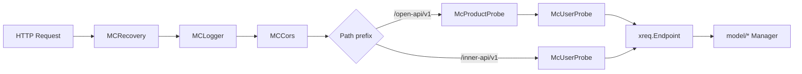

# Chapter 26: Interface Layer Implementation: OpenAPI and InnerAPI

## Chapter Goals

Through this chapter, readers will understand the actual code organization of the `ai-gateway-api` interface layer (the `endpoints` package) and master the following:

- How the `endpoints` directory separates the Management Plane OpenAPI from the Data Plane InnerAPI;
- The structure, registration flow, and authorization mounting points of the unified `xreq.Endpoint` abstraction;
- The roles and execution order of the five middleware components: Recovery, Logger, CORS, Product Probe, and User Probe;
- How OpenAPI v1 aggregates the Endpoints of each business sub-package through the `endpoints()` merge function;
- How InnerAPI v1 exports the nine categories of configuration required by the BFE Data Plane;
- The concrete implementations of parameter binding, permission validation, and the unified response format in the interface layer;
- Complete Action examples for one OpenAPI endpoint and one InnerAPI endpoint.

For the design background on the Control Plane's three-layer architecture and the responsibility division between OpenAPI and InnerAPI, see [Chapter 6: Control Plane Core Design: AI Gateway API](../design/chapter06-control-plane-design.md); for the InnerAPI incremental export and version control mechanism, see [Chapter 21: Config Export and Version Control Design](../design/chapter14-config-export-and-version-control.md).

---

## endpoints Directory Structure

`ai-gateway-api/endpoints/` is the entry layer for HTTP requests, where all Management Plane APIs and Data Plane export APIs are concentrated. To reduce coupling, the directory is clearly divided into four parts: root routes, common middleware, the OpenAPI subsystem, and the InnerAPI subsystem:

```
ai-gateway-api/endpoints/
├── router.go                 # Root route registration: static files, OpenAPI, InnerAPI, global middleware
├── middleware/               # HTTP middleware
│   ├── access_logger.go      # Access logging
│   ├── convert.go            # Request/response conversion and middleware adaptation
│   ├── cors.go               # Cross-origin handling
│   ├── product_probe.go      # Product line context resolution
│   ├── recovery.go           # panic recovery
│   └── user_probe.go         # User/Token authentication
├── openapi_v1/               # Management Plane OpenAPI (prefix /open-api/v1)
│   ├── endpoints.go          # Merges Endpoints from all sub-packages
│   ├── api_key/              # /api-keys
│   ├── auth/                 # /auth, /meta
│   ├── bfe_pool/             # /alb-pool
│   ├── certificate/          # /certificates
│   ├── domain/               # Not currently registered
│   ├── entity/               # /entities
│   ├── entity_type/          # /entity-types
│   ├── global_route_rules/   # /global-route-rules
│   ├── model_price/          # /model-prices
│   ├── product_cluster/      # /clusters
│   ├── provider/             # /providers
│   ├── route/                # /expression/verify
│   ├── route_tables/         # /route-tables
│   ├── subcluster/           # Not currently registered
│   └── traffic/              # Not currently registered
└── innerapi_v1/              # Data Plane InnerAPI (prefix /inner-api/v1)
    ├── endpoints.go          # Unified registration of export endpoints
    ├── ai_route/
    ├── extra_file/
    ├── gslb_data/
    ├── mod_api_key/
    ├── mod_body_process/
    ├── protocol/
    ├── rate_limit_policy/
    ├── server_data/
    └── export_util/
```

This structure follows the principle of "sub-package autonomy, top-level merging": each business sub-package maintains only its own Endpoint variables and Action functions, while `openapi_v1/endpoints.go` and `innerapi_v1/endpoints.go` are responsible only for merging these slices and registering them with the `gorilla/mux` router, handling no business logic. In this way, adding a new business domain only requires creating a new sub-package, exporting its own `Endpoints` slice, and appending one line in the top-level merge function.

---

## The xreq.Endpoint Abstraction

The interface layer uses a unified `xreq.Endpoint` abstraction to describe each HTTP endpoint. Its definition is in `lib/xreq/result.go`:

```go
// ai-gateway-api/lib/xreq/result.go
type Handler func(req *http.Request) (interface{}, error)

type Endpoint struct {
    Path    string
    Method  string
    Handler func(*http.Request) *Result

    RegisterHandler func(*mux.Router) *mux.Route

    Authorizer *iauth.Authorization
}

func (ep *Endpoint) ServeHTTP(rw http.ResponseWriter, req *http.Request) {
    rst := ep.Handler(req)

    render := Render
    if rst != nil && rst.Render != nil {
        render = rst.Render
    }

    render(rw, req, rst)
}

func (ep *Endpoint) Register(router *mux.Router) *mux.Router {
    if authorizer := ep.Authorizer; authorizer != nil {
        router = router.NewRoute().Subrouter()
        router.Use(func(next http.Handler) http.Handler {
            return http.HandlerFunc(func(rw http.ResponseWriter, req *http.Request) {
                ctx := req.Context()
                GetRequestInfo(ctx).URLPattern = ep.Path

                err := container.AuthorizeManager.Authorizate(ctx, authorizer)
                if err != nil {
                    ErrorRender(err, rw, req)
                    return
                }

                next.ServeHTTP(rw, req)
            })
        })
    }

    if ep.RegisterHandler == nil {
        router.Handle(ep.Path, ep).Methods(ep.Method)
    } else {
        ep.RegisterHandler(router).Handler(ep)
    }

    return router
}
```

`Endpoint` consolidates path, method, handler, and authorization information in one place, bringing three benefits:

1. **Self-describing endpoints**: developers can see the URL, method, business handler, and required permission of an endpoint in the same struct;
2. **Unified registration**: the top-level `endpoints.go` is only responsible for merging slices and registering them in a loop, with no business code mixed in;
3. **Consistent authorization**: both OpenAPI and InnerAPI inject `iauth.FA(feature, action)` through the `Authorizer` field, and `Endpoint.Register` uniformly mounts the authorization sub-route.

The signature of a business Action is `func(*http.Request) (interface{}, error)`, while `Endpoint.Handler` requires `func(*http.Request) *Result`. The conversion between the two is done by `xreq.Convert`:

```go
// ai-gateway-api/lib/xreq/result.go
func Convert(h Handler) func(req *http.Request) *Result {
    return func(req *http.Request) *Result {
        data, err := h(req)
        return &Result{
            OriginErr: err,
            Data:      data,
        }
    }
}
```

For export endpoints that need to write raw byte streams directly (such as extra files), `xreq.RawConvert` is used, which returns `application/octet-stream` directly on success and falls back to a JSON error response only on failure.

The overall pipeline of an HTTP request entering the interface layer is shown in the following diagram:



---

## Global Middleware and Route-Subtree Middleware

`endpoints/router.go` registers global middleware on the root router and mounts business middleware on the OpenAPI and InnerAPI sub-routers respectively. They can be divided into two groups:

- **Global middleware**: Recovery, Logger, CORS, which apply to all requests;
- **Route-subtree middleware**: Product Probe and User Probe, mounted according to prefix differences.

### Root Route Registration

```go
// ai-gateway-api/endpoints/router.go
func RegisterRouters(router *mux.Router) {
    // ... static files and NotFoundHandler configuration ...

    router.Use(middleware.MCRecovery)
    router.Use(middleware.MCLogger)
    router.Use(middleware.MCCors)

    openapi_v1.RegisterEndpoints(router)
    innerapi_v1.RegisterRouter(router)
}
```

Middleware registered with `router.Use` applies to all sub-routers, so Recovery, Logger, and CORS take effect for all API paths. `NotFoundHandler` and `MethodNotAllowedHandler` are also explicitly configured, ensuring that unmatched `/open-api/v1` and `/inner-api/v1` paths return JSON-formatted 404/405 responses instead of falling back to static files.

### Recovery: panic Recovery

`NewRecovery` in `middleware/recovery.go` captures panics occurring in the handler within a `defer`, records the exception stack, and returns a unified 500 error response to avoid crashing the process:

```go
// ai-gateway-api/endpoints/middleware/recovery.go
func (rec *Recovery) ServeHTTP(rw http.ResponseWriter, req *http.Request, next http.HandlerFunc) {
    ctx := lib.NewLogContext(req.Context())
    ctx, requestInfo := xreq.InitRequestInfo(ctx, req)
    requestInfo.LogID = lib.GainLogID(ctx)

    req = req.WithContext(ctx)

    defer func() {
        if err := recover(); err != nil {
            stateful.MetricPaincCounter.Inc()

            stack := make([]byte, rec.StackSize)
            stack = stack[:runtime.Stack(stack, rec.StackAll)]
            stackString := string(stack)

            requestInfo.StatusCode = 500
            requestInfo.RetMsg = "system error"
            requestInfo.ErrDetail = fmt.Sprintf("PANIC: ERR:%s STACK:%s", err, strings.ReplaceAll(stackString, "\n", "\\n"))

            stateful.AccessLogger.Warn(requestInfo.String())
            stateful.ExceptionLogger.Error("PANIC in HTTP handler: err=%v\n%s", err, stackString)

            r := &xreq.Result{
                Code:   requestInfo.StatusCode,
                ErrMsg: requestInfo.RetMsg,
            }

            xreq.Render(rw, req, r)
        }
    }()

    next(rw, req)
}
```

The Recovery middleware is the first one mounted, so the subsequent Logger can obtain the `RequestInfo` it initializes and record the full context when a panic occurs.

### Logger: Access Logging and Monitoring

`middleware/access_logger.go` uniformly records access logs after a request completes and updates Prometheus metrics based on the URL Pattern, HTTP method, and status code:

```go
// ai-gateway-api/endpoints/middleware/access_logger.go
func (l *LoggerMiddleWare) ServeHTTP(rw http.ResponseWriter, r *http.Request, next http.HandlerFunc) {
    next(rw, r)

    ctx := r.Context()
    requestInfo := xreq.GetRequestInfo(ctx)
    requestInfo.Duration = time.Since(requestInfo.StartTime)

    nrw := rw.(negroni.ResponseWriter)
    requestInfo.StatusCode = nrw.Status()

    Record(requestInfo)
    UpdateMonitor(r, requestInfo)
}
```

`UpdateMonitor` uses `URLPattern` as a label, so endpoint monitoring can be precise down to individual routes. `URLPattern` is assigned when the Endpoint is registered.

### CORS: Cross-Origin Handling

`middleware/cors.go` uses the `rs/cors` library, allowing all origins, common methods, and headers, and supports credentials:

```go
// ai-gateway-api/endpoints/middleware/cors.go
func NewCors() *cors.Cors {
    options := cors.Options{
        AllowedOrigins:   []string{"*"},
        AllowedMethods:   []string{"POST", "GET", "PUT", "PATCH", "DELETE", "HEAD"},
        AllowedHeaders:   []string{"Origin", "Accept", "Content-Type", "X-Requested-With", "Authorization", "Session_key", "Clientip"},
        AllowCredentials: true,
    }
    return cors.New(options)
}
```

The CORS middleware handles preflight requests and adds response headers, allowing the Dashboard frontend to call Management Plane APIs cross-origin directly.

### Product Probe: Product Line Context

`middleware/product_probe.go` parses `product_id` or `product_name` from URI parameters, queries for the unique product line, and writes it into the request context:

```go
// ai-gateway-api/endpoints/middleware/product_probe.go
func ProductProbeAction(req *http.Request) (*http.Request, error) {
    param, err := newProductProbeParam(req)
    if err != nil {
        return nil, err
    }

    if param.ProductID == nil && param.ProductName == nil {
        return req, nil
    }

    products, err := container.ProductManager.FetchProducts(req.Context(), &ibasic.ProductFilter{
        ID:   param.ProductID,
        Name: param.ProductName,
    })
    if err != nil {
        return nil, err
    }

    if len(products) != 1 {
        return nil, xerror.WrapRecordNotExist("Product")
    }

    return req.WithContext(ibasic.NewProductContext(req.Context(), products[0])), nil
}
```

Product Probe is mounted only on the OpenAPI subtree, because Management Plane operations usually need to distinguish product lines; InnerAPI faces the Data Plane pulling configuration and does not involve product line context.

### User Probe: Identity and Permissions

`middleware/user_probe.go` parses authentication information from the `Authorization` request header, hands it to `AuthenticateManager` for identity validation, and writes the visitor information into the context:

```go
// ai-gateway-api/endpoints/middleware/user_probe.go
func UserProbeAction(req *http.Request) (*http.Request, error) {
    authHeader := req.Header.Get("Authorization")
    if authHeader == "" {
        return req, nil
    }

    ss := strings.SplitN(authHeader, " ", 2)
    if len(ss) != 2 {
        return nil, xerror.WrapAuthenticateFailErrorWithMsg("Bad Format Header Authorization")
    }

    param := &iauth.AuthenticateParam{
        Type:     ss[0],
        Identify: ss[1],
    }

    visitor, err := container.AuthenticateManager.Authenticate(req.Context(), param)
    if err != nil {
        return nil, err
    }

    return req.WithContext(iauth.NewVisitorContext(req.Context(), visitor)), nil
}
```

`McUserProbe` is only responsible for putting the identity into the context; the actual permission validation is completed by the `Authorizer` sub-route middleware when each Endpoint is registered. This design of "unified identity resolution, decentralized permission validation" ensures that all endpoints can identify the caller while allowing each endpoint to declare its own required minimal permission.

---

## OpenAPI v1 Route Registration and Sub-Package Merging

OpenAPI v1 uses the `/open-api/v1` prefix, and its registration entry point is in `endpoints/openapi_v1/endpoints.go`:

```go
// ai-gateway-api/endpoints/openapi_v1/endpoints.go
func RegisterEndpoints(router *mux.Router) *mux.Router {
    openAPIV1Router := router.PathPrefix("/open-api/v1").Subrouter()
    openAPIV1Router.Use(middleware.McProductProbe, middleware.McUserProbe)
    for _, one := range endpoints() {
        one.Register(openAPIV1Router)
    }
    return openAPIV1Router
}

func endpoints() []*xreq.Endpoint {
    return merge(
        product.Routers,
        product_cluster.Endpoints,
        certificate.Endpoints,
        product_pool.Endpoints,
        subcluster.Endpoints,
        bfe_pool.Endpoints,
        auth.Endpoints,
        traffic.Endpoints,
        bfe_cluster.Endpoints,
        route.Endpoints,
        domain.Endpoints,
        api_key.Endpoints,
        entity_type.Endpoints,
        entity.Endpoints,
        global_route_rules.Endpoints,
        route_tables.Endpoints,
        model_price.Endpoints,
        provider.Endpoints,
    )
}

func merge(rss ...[]*xreq.Endpoint) (rs []*xreq.Endpoint) {
    for _, r := range rss {
        rs = append(rs, r...)
    }
    return
}
```

Each business sub-package exports only its own Endpoint slice, for example `entity_type/endpoints.go`:

```go
// ai-gateway-api/endpoints/openapi_v1/entity_type/endpoints.go
var Endpoints = []*xreq.Endpoint{
    EntityTypeCreateRoute,
    EntityTypeListRoute,
    EntityTypeOneRoute,
    EntityTypeUpdateRoute,
    EntityTypeDeleteRoute,
}
```

The top-level `endpoints()` function concatenates these slices into one large `[]*xreq.Endpoint` via `merge` and then registers them uniformly. Currently, the slices exported by sub-packages such as `product_pool`, `subcluster`, `traffic`, `bfe_cluster`, and `domain` are empty, meaning the corresponding endpoints are not actually registered, but the code structure is retained for future enablement on demand. This design means that adding or retiring a business module only requires modifying the merge list in `endpoints()`, without touching the route registration loop.

---

## InnerAPI v1 Export Endpoint Registration

InnerAPI v1 uses the `/inner-api/v1` prefix and mainly exports configuration for the BFE Data Plane and Conf Agent. The registration entry point is in `endpoints/innerapi_v1/endpoints.go`:

```go
// ai-gateway-api/endpoints/innerapi_v1/endpoints.go
func endpoints() []*xreq.Endpoint {
    return []*xreq.Endpoint{
        server_data.ExportEndpoint,
        gslb_data.ExportGSLBEndpoint,
        gslb_data.ExportClusterTableEndpoint,
        protocol.ServertCertExportEndpoint,
        extra_file.ExportExtraFileEndpoint,
        mod_api_key.ExportRoute,
        mod_body_process.ExportRoute,
        rate_limit_policy.ExportRoute,
        ai_route.ExportRoute,
    }
}

func RegisterRouter(router *mux.Router) *mux.Router {
    innerAPIV1Router := router.PathPrefix("/inner-api/v1").Subrouter()
    innerAPIV1Router.Use(middleware.McUserProbe)

    for _, one := range endpoints() {
        one.Register(innerAPIV1Router)
    }

    return innerAPIV1Router
}
```

Unlike OpenAPI, the InnerAPI subtree mounts only `McUserProbe`, not `McProductProbe`, because the Data Plane does not need to distinguish product line context when pulling configuration. Currently, InnerAPI exports nine categories of configuration in total:

| Endpoint Path | Config Topic | Description |
|---|---|---|
| `/configs/tls_conf/server_data_conf` | `route_rule` | TLS/Server/route rule configuration |
| `/configs/gslb_data/gslb` | `gslb.<bfe_cluster>` | GSLB scheduling configuration |
| `/configs/gslb_data/cluster_table` | `cluster_table` | Cluster table configuration |
| `/configs/protocol/server_cert_conf` | `certificate` | Certificate configuration |
| `/configs/extra_files/{filename}` | None | Raw content of extra files |
| `/configs/mod-api-key` | `mod_api_key_rule` | API-Key and quota configuration |
| `/configs/mod-body-process` | `mod_body_process` | Request body processing configuration |
| `/configs/rate-limit-policy` | `mod_ai_rate_limit` | Rate limit policy configuration |
| `/configs/ai-route` | `ai_route` | AI route configuration |

All InnerAPI export endpoints support the `version` query parameter, which is parsed by `export_util.NewExportFromReq` and then handed to the corresponding Manager's `ConfigExport` method. When the requested version matches the current version, `Data: nil` is returned to avoid redundant distribution.

---

## Parameter Binding, Authorization, and Unified Response

### Parameter Binding

`lib/xreq/param.go` provides a set of parameter binding functions based on `go-playground/validator` and `gorilla/mux`:

```go
// ai-gateway-api/lib/xreq/param.go
func Bind(req *http.Request, data interface{}) error       // JSON + URI + validation
func BindJSON(req *http.Request, data interface{}) error   // JSON only + validation
func BindURI(req *http.Request, data interface{}) error    // URI only + validation
func BindForm(req *http.Request, data interface{}) error   // Form + validation
```

`Bind` performs JSON deserialization, URI path parameter filling, and struct tag validation in sequence; `BindJSON` is for request-body-only endpoints; `BindURI` is for endpoints with only path parameters; `BindForm` is for `multipart/form-data` or `application/x-www-form-urlencoded`, such as the YAML full-table import of model pricing.

If the parameter type implements the `xreq.Validator` interface, its custom `Validate()` method is also called after binding completes:

```go
// ai-gateway-api/lib/xreq/validate.go
type Validator interface {
    Validate() error
}

func validateData(data interface{}, lang ut.Translator) error {
    if err := ValidateData(data, lang); err != nil {
        return err
    }

    if v, ok := data.(Validator); ok {
        if err := v.Validate(); err != nil {
            return xerror.WrapParamError(err)
        }
    }

    return nil
}
```

This layered validation leaves generic rules such as "field type, required, range" to the framework and rules involving cross-field or business semantics to the parameter struct itself, making reuse and unit testing easier.

### Authorization

Each Endpoint's `Authorizer` field is generated by `iauth.FA(feature, action)`. During registration, `Endpoint.Register` creates a sub-router and calls `container.AuthorizeManager.Authorizate(ctx, authorizer)` within it. For example:

```go
// ai-gateway-api/endpoints/openapi_v1/entity_type/create.go
var EntityTypeCreateRoute = &xreq.Endpoint{
    Path:       "/entity-types",
    Method:     http.MethodPost,
    Handler:    xreq.Convert(EntityTypeCreateAction),
    Authorizer: iauth.FA(iauth.FeatureEntityType, iauth.ActionCreate),
}
```

When a request reaches this Endpoint, if the current visitor does not have the `FeatureEntityType + ActionCreate` permission, a 401/402 error is returned directly. The OpenAPI permission model has been consolidated: the user `is_admin` field only supports `true`, and the Token `scope` retains only `System`/`Support`, so most management operations require System permission.

### Unified Response

`xreq.Result` defines the unified response structure:

```go
// ai-gateway-api/lib/xreq/result.go
type Result struct {
    OriginErr error `json:"-"`

    Code   int         `json:"ErrNum"`
    ErrMsg string      `json:"ErrMsg"`
    Data   interface{} `json:"Data,omitempty"`

    Render func(w http.ResponseWriter, req *http.Request, res *Result) `json:"-"`
}
```

`xreq.Render` resolves the error code and message based on `OriginErr`, uniformly writes the `Req-ID` response header, and returns JSON. Error code mapping is done through `lib/xerror`, and internationalized error messages are handled by `stateful.TryMappingErrMsg`. OpenAPI currently returns `{ErrNum, Data, ErrMsg}` uniformly, without the `WorkMode` field; new error codes are 401 for authentication failure, 402 for missing call permission, and 510 for feature not enabled.

---

## Typical Endpoint Implementation Examples

### OpenAPI: Entity-Type Creation

`endpoints/openapi_v1/entity_type/create.go` demonstrates a standard Management Plane endpoint: bind and validate parameters first, then check resource existence, and finally call the model layer Manager to complete the creation and return the result.

```go
// ai-gateway-api/endpoints/openapi_v1/entity_type/create.go
var EntityTypeCreateRoute = &xreq.Endpoint{
    Path:       "/entity-types",
    Method:     http.MethodPost,
    Handler:    xreq.Convert(EntityTypeCreateAction),
    Authorizer: iauth.FA(iauth.FeatureEntityType, iauth.ActionCreate),
}

func EntityTypeCreateAction(req *http.Request) (interface{}, error) {
    param := &entity.EntityTypeParam{}
    if err := xreq.BindJSON(req, param); err != nil {
        return nil, err
    }

    if param.TypeName == nil || *param.TypeName == "" {
        return nil, xerror.WrapParamErrorWithMsg("type_name is required")
    }
    if err := validate.EntityTypeName(*param.TypeName); err != nil {
        return nil, err
    }

    if param.Level == nil {
        return nil, xerror.WrapParamErrorWithMsg("level is required")
    }
    if *param.Level < 1 || *param.Level > 5 {
        return nil, xerror.WrapParamErrorWithMsg("level must be between 1 and 5")
    }

    if param.Description != nil {
        if err := validate.Description(*param.Description, validate.MaxDescriptionLength, "description"); err != nil {
            return nil, err
        }
    }

    existing, err := container.EntityTypeManager.FetchEntityType(req.Context(), &entity.EntityTypeFilter{
        TypeName: param.TypeName,
    })
    if err != nil {
        return nil, err
    }
    if existing != nil {
        return nil, xerror.WrapDuplicateData("entity type")
    }

    if _, err := container.EntityTypeManager.CreateEntityType(req.Context(), param); err != nil {
        return nil, err
    }

    return container.EntityTypeManager.FetchEntityType(req.Context(), &entity.EntityTypeFilter{
        TypeName: param.TypeName,
    })
}
```

This example reflects the typical flow of the interface layer: parameter binding → basic validation → business existence check → call the model layer → return the result. After every write operation, a re-query is performed to ensure the returned data includes fields auto-filled by the model layer (such as creation time, ID, etc.).

### InnerAPI: mod-api-key Export

`endpoints/innerapi_v1/mod_api_key/export.go` demonstrates the typical pattern of a Data Plane export endpoint: parse the `version` parameter, call the Manager's `ConfigExport`, and let the version control mechanism decide whether to return the full configuration.

```go
// ai-gateway-api/endpoints/innerapi_v1/mod_api_key/export.go
var ExportRoute = &xreq.Endpoint{
    Path:       "/configs/mod-api-key",
    Method:     http.MethodGet,
    Handler:    xreq.Convert(ExportAction),
    Authorizer: iauth.FA(iauth.FeatureAPIKey, iauth.ActionExport),
}

func ExportAction(req *http.Request) (interface{}, error) {
    return exportActionProcess(req)
}

func exportActionProcess(req *http.Request) (interface{}, error) {
    param, err := export_util.NewExportFromReq(req)
    if err != nil {
        return nil, err
    }

    return container.APIKeyRuleManager.ConfigExport(req.Context(), param.Version)
}
```

Internally, `APIKeyRuleManager.ConfigExport` calls `VersionControlManager.ExportConfig`, computes the MD5 signature of the configuration data, and compares it with the `config_versions` table: if the configuration has not changed, it returns `Data: nil` and Conf Agent will not trigger a BFE hot reload; if it has changed, it returns the full configuration with a new version number. For more details, see [Chapter 21: Config Export and Version Control Design](../design/chapter14-config-export-and-version-control.md).

---

## Key Code Snippets Summary

The following table summarizes the core code locations covered in this chapter and their roles, to help readers quickly locate them in the source code:

| Code Path | Role |
|---|---|
| `ai-gateway-api/endpoints/router.go` | Root route registration, global middleware mounting, static files and 404/405 handling |
| `ai-gateway-api/endpoints/middleware/recovery.go` | panic recovery and unified 500 response |
| `ai-gateway-api/endpoints/middleware/access_logger.go` | Access log recording and Prometheus metric updates |
| `ai-gateway-api/endpoints/middleware/cors.go` | Cross-origin response header handling |
| `ai-gateway-api/endpoints/middleware/product_probe.go` | Product line context injection |
| `ai-gateway-api/endpoints/middleware/user_probe.go` | Identity authentication context injection |
| `ai-gateway-api/endpoints/openapi_v1/endpoints.go` | OpenAPI v1 sub-package Endpoint merging and registration |
| `ai-gateway-api/endpoints/innerapi_v1/endpoints.go` | InnerAPI v1 export endpoint merging and registration |
| `ai-gateway-api/lib/xreq/result.go` | `Endpoint`, `Result`, and unified rendering logic |
| `ai-gateway-api/lib/xreq/param.go` | JSON / URI / Form parameter binding and validation |
| `ai-gateway-api/lib/xreq/validate.go` | Custom `Validator` interface support |
| `ai-gateway-api/endpoints/openapi_v1/entity_type/create.go` | Typical OpenAPI Action example |
| `ai-gateway-api/endpoints/innerapi_v1/mod_api_key/export.go` | Typical InnerAPI export Action example |

---

## Chapter Summary

- `ai-gateway-api/endpoints/` organizes code along three dimensions: `openapi_v1`, `innerapi_v1`, and `middleware`. Each business sub-package is autonomous, and the top level only merges Endpoints.
- `xreq.Endpoint` unifies path, method, Handler, authorization, and custom registration, and is the core abstraction of the interface layer. Business Actions are converted to `Endpoint.Handler` via `xreq.Convert`.
- Recovery, Logger, and CORS act as global middleware applying to all APIs; Product Probe and User Probe act as route-subtree middleware serving OpenAPI and InnerAPI respectively, where User Probe handles identity resolution and each Endpoint's `Authorizer` handles fine-grained permission validation.
- OpenAPI v1 merges the `[]*xreq.Endpoint` exported by each sub-package via the `merge` function and registers them under `/open-api/v1`.
- InnerAPI v1 registers nine categories of configuration export endpoints through a fixed slice; all export endpoints support `version`-based incremental synchronization, implemented jointly by `export_util.NewExportFromReq` and `model/iversion_control`.
- Parameter binding is done by `xreq.Bind*`, supporting struct tag validation and custom `Validator`; permission validation is mounted on each Endpoint via `iauth.FA`; the unified response is completed by `xreq.Result` and `xreq.Render`, returning `{ErrNum, Data, ErrMsg}` uniformly to the outside.

---

## References

- `ai-gateway-api/design-docs/sys-design/接口层设计文档.md`
- `ai-gateway-api/endpoints/router.go`
- `ai-gateway-api/endpoints/openapi_v1/endpoints.go`
- `ai-gateway-api/endpoints/innerapi_v1/endpoints.go`
- `ai-gateway-api/lib/xreq/result.go`
- `ai-gateway-api/lib/xreq/param.go`
- `ai-gateway-api/lib/xreq/validate.go`
- `ai-gateway-api/endpoints/middleware/recovery.go`
- `ai-gateway-api/endpoints/middleware/access_logger.go`
- `ai-gateway-api/endpoints/middleware/cors.go`
- `ai-gateway-api/endpoints/middleware/product_probe.go`
- `ai-gateway-api/endpoints/middleware/user_probe.go`
- `ai-gateway-api/endpoints/openapi_v1/entity_type/create.go`
- `ai-gateway-api/endpoints/innerapi_v1/mod_api_key/export.go`
- [Chapter 6: Control Plane Core Design: AI Gateway API](../design/chapter06-control-plane-design.md)
- [Chapter 21: Config Export and Version Control Design](../design/chapter14-config-export-and-version-control.md)
