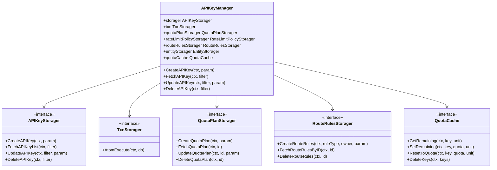

# Chapter 27: Model Layer Implementation: The Manager and Storager Pattern

## Chapter Goals

The Model Layer is the core business layer of the AI Gateway API Control Plane. It sits between the `endpoints/` interface layer and the `storage/rdb/` persistence layer, and is responsible for converting HTTP request parameters from OpenAPI into internal objects that can be persisted, validated, and exported. Beyond handling CRUD for individual resources, it also manages reference relationships between resources, cascading operations, transaction consistency, and the format conversions required to export configuration to the Data Plane.

After reading this chapter, you will understand:

- How the `ai-gateway-api/model/` directory is organized and how responsibilities are divided.
- How the four-layer abstraction of `Param / Filter / Storager / Manager` isolates business logic from persistence implementation.
- The usage of the `itxn.TxnStorager` transaction abstraction and `AtomExecute`, including the mechanism for reusing nested transactions.
- How cross-package Adapters resolve signature inconsistencies between subpackage interfaces.
- How a typical Manager (using `APIKeyManager` as an example) orchestrates parameter validation, cascading creation of associated resources, and eventual-consistency synchronization with the Redis cache.
- How `QuotaPlanManager` resets quota balances across resources outside the transaction.

With an understanding of these design patterns, readers can quickly determine which layer a new business requirement belongs to and which conventions it should follow, and can write unit tests for the model layer that match the existing style.

## Model Layer Directory Structure

`ai-gateway-api/model/` is divided into subpackages by business domain. Each subpackage typically contains the model structs, Param/Filter types, the Storager interface, and the Manager implementation. The overall structure is as follows:

```text
model/
├── api_key/              # API-Key models and Manager
├── entity/               # Entity / EntityType models and Manager
├── quota/                # QuotaPlan, BalanceSync, Scheduler
├── rate_limit_policy/    # RateLimitPolicy models and Manager
├── route_rules/          # Global/Entity/API-Key route rules
├── shared/               # Cross-package shared types and Storager interfaces
├── itxn/                 # Transaction abstraction interface
├── ibasic/               # Products, BFE clusters, attachment files
├── icluster_conf/        # Cluster, SubCluster, Pool
├── iprovider/            # Provider and model discovery
├── imodel_price/         # Model pricing
└── ...
```

> For a complete directory listing and file descriptions, refer to the "模型包结构" section of `ai-gateway-api/design-docs/sys-design/模型层设计文档.md`.

The model layer does not depend directly on the underlying database. It only depends on the `XxxStorager` interfaces defined in the same package or in `model/shared`; the concrete storage implementations are provided by the subpackages of `storage/rdb/` and wired together via dependency injection in `stateful/container/rdb/components.go`. This separation decouples business logic from persistence implementation and makes it easy to hand-write mocks for unit testing.

The responsibilities of each subpackage can be summarized as follows:

- `api_key`: Manages caller identity credentials, including API-Key generation, validation, and the lifecycle of cascading QuotaPlan / RateLimitPolicy / RouteRules resources.
- `entity`: Manages entities (Entity) and entity types (EntityType) in the multi-tenant system, supporting hierarchical relationships and inherited quotas.
- `quota`: Manages quota plans (QuotaPlan), balance synchronization (BalanceSync), and scheduled reset scheduling (Scheduler).
- `rate_limit_policy`: Manages RPM / TPM / concurrency rate limit policies.
- `route_rules`: Manages three-level AI route rules: Global / Entity / API-Key.
- `shared`: Provides cross-package shared Param, Filter, and Storager interfaces, as well as common structures such as route rules and quota balances.
- `itxn`: Provides a minimal transaction abstraction, which is the cornerstone of consistency across the entire model layer.
- `icluster_conf` / `iprovider` / `imodel_price`: Responsible respectively for cluster forwarding policies, Provider integration capabilities, and model pricing — resources closely tied to Data Plane export.

## The Param / Filter / Storager / Manager Four-Layer Abstraction

Each business model follows a four-layer structure. This is the most core and stable design convention of the model layer.

| Type | Description |
|------|-------------|
| `XxxParam` | Input parameters for create/update operations. Fields are mostly pointer types, used to distinguish "not provided" from "zero value". |
| `XxxFilter` | Query conditions, usually including pagination fields `Page` / `PageSize`. |
| `XxxStorager` | Interface defining the persistence operation contract. |
| `XxxManager` | Business logic implementation, aggregating `itxn.TxnStorager` and other `Storager`s. |

Take `model/api_key/api_key.go` as an example:

```go
type APIKeyParam struct {
    ID          *string    `json:"id"`
    Enable      *bool      `json:"enabled"`
    Key         *string    `json:"key"`
    Description *string    `json:"description,omitempty"`
    UnlimitedQuota *bool   `json:"unlimited_quota,omitempty"`
    ExpiredTime    *int64  `json:"expired_time,omitempty"`
    Models         []string `json:"models,omitempty"`
    Subnet         []string `json:"subnet,omitempty"`
    EntityID       *string  `json:"entity_id,omitempty"`
    QuotaPlanID       *int64 `json:"-"`
    RateLimitPolicyID *int64 `json:"-"`
    RouteRulesID      *int64 `json:"-"`
    ProductName       *string `json:"-"`
    InnerID           *int64  `json:"-"`
    RemainingQuota    *float64 `json:"remaining_quota,omitempty"`

    QuotaPlan       *shared.QuotaPlanParam       `json:"quota_plan,omitempty"`
    RateLimitPolicy *shared.RateLimitPolicyParam `json:"rate_limit_policy,omitempty"`
    RouteRules      *shared.RouteRulesParam      `json:"route_rules,omitempty"`
    Entity          *shared.EntitySummary        `json:"entity,omitempty"`
}

type APIKeyFilter struct {
    ProductName    *string
    ProductNames   []string
    ID             *string
    Key            *string
    InnerID        *int64
    QuotaPlanID    *int64
    RouteRulesID   *int64
    Page           *int
    PageSize       *int
    Enabled        *bool
    EntityID       *string
    UnlimitedQuota *bool
}

type APIKeyStorager interface {
    FetchAPIKeyList(ctx context.Context, filter *APIKeyFilter) ([]*APIKeyParam, error)
    CreateAPIKey(ctx context.Context, param *APIKeyParam) (int64, error)
    UpdateAPIKey(ctx context.Context, filter *APIKeyFilter, param *APIKeyParam) (int64, error)
    DeleteAPIKey(ctx context.Context, filter *APIKeyFilter) error
    CreateAPIKeyToken(ctx context.Context, param *APIKeyTokenParam) (int64, error)
    UpdateAPIKeyToken(ctx context.Context, filter *APIKeyTokenFilter, param *APIKeyTokenParam) error
    FetchAPIKeyTokenList(ctx context.Context, filter *APIKeyTokenFilter) ([]*APIKeyTokenParam, error)
}

type APIKeyManager struct {
    storager                APIKeyStorager
    txn                     itxn.TxnStorager
    quotaPlanStorager       QuotaPlanStorager
    rateLimitPolicyStorager RateLimitPolicyStorager
    routeRulesStorager      shared.RouteRulesStorager
    entityStorager          shared.EntityStorager
    quotaCache              quotacache.QuotaCache
}
```

Function naming and parameter style are kept highly consistent:

| Operation | Naming | Parameters | Return Values |
|-----------|--------|------------|---------------|
| Create | `CreateXxx(ctx, param)` | `context.Context, *XxxParam` | `(int64, error)` or `error` |
| Fetch single | `FetchXxx(ctx, filter)` | `context.Context, *XxxFilter` | `(*Xxx, error)` |
| Fetch list | `FetchXxxList(ctx, filter)` | `context.Context, *XxxFilter` | `([]*Xxx, error)` |
| Update | `UpdateXxx(ctx, filter, param)` | `context.Context, *XxxFilter, *XxxParam` | `(int64, error)` |
| Delete | `DeleteXxx(ctx, filter)` | `context.Context, *XxxFilter` | `error` |

Pagination defaults are generally `page=1, pageSize=20`, with a maximum of 100. The unified naming and parameter style lets new business models follow the template quickly, reducing maintenance costs.

The use of pointer fields in Param and Filter is especially noteworthy. Take `APIKeyParam.UnlimitedQuota *bool` as an example: if the request body does not include this field, the pointer is `nil`, meaning "keep the original value"; if `false` is passed in, it means "explicitly set to false". This design naturally supports partial-field updates without introducing an additional Field Mask mechanism.

## The itxn.TxnStorager Transaction Abstraction and AtomExecute

All business operations in the model layer that require atomicity are performed through the `TxnStorager` interface defined in `model/itxn/txn.go`:

```go
// model/itxn/txn.go
package itxn

import "context"

type TxnStorager interface {
    AtomExecute(ctx context.Context, do func(context.Context) error) error
}
```

`AtomExecute` takes a `context.Context` and a callback function `do`; `storage/rdb/txn/txn.go` provides an implementation based on `database/sql`:

```go
func (ps *RDBTxnStorager) AtomExecute(ctx context.Context, do func(context.Context) error) error {
    dbCtx, err := ps.dbCtxFactory(ctx, lib.OpenTxn())
    if err != nil {
        return err
    }
    return lib.RDBTxnExecute(dbCtx, do)
}
```

Business methods in Managers are typically wrapped directly in `AtomExecute`. For example, `APIKeyManager.CreateAPIKey` in `model/api_key/api_key.go`:

```go
func (rppm *APIKeyManager) CreateAPIKey(ctx context.Context, param *APIKeyParam) (err error) {
    err = rppm.txn.AtomExecute(ctx, func(ctx context.Context) error {
        // 1. Generate or validate the ID
        // 2. Validate ID uniqueness within the same product
        // 3. Validate that the Entity exists
        // 4. Create QuotaPlan, RateLimitPolicy, RouteRules
        // 5. Write the api_key record
        _, err = rppm.storager.CreateAPIKey(ctx, param)
        return err
    })
    if err != nil {
        return err
    }
    // Sync the initial remaining quota to Redis after the transaction commits
    ...
}
```

If the passed `ctx` is already a `*lib.DBContext`, the factory reuses the same transaction, thereby supporting nested transaction scenarios. For example, when `APIKeyManager.CreateAPIKey` calls `quotaPlanStorager.CreateQuotaPlan` inside the `AtomExecute` callback, and the latter internally also calls `AtomExecute`, no new transaction is started because the context already carries the transaction marker; instead, the outer transaction is reused. This mechanism lets Managers compose other Managers/Storagers as if calling ordinary functions while preserving overall atomicity.

As a result, the model layer does not need to worry about starting, committing, or rolling back transactions; it only needs to place the steps that must execute within the same atomic unit inside the `AtomExecute` callback. This also makes unit testing simple: test code can inject a mock `TxnStorager` that executes the callback directly in `AtomExecute`, verifying business logic without connecting to a database.

## The Cross-Package Adapter Pattern

Different subpackages often define their own dedicated Storager interfaces, whose signatures do not exactly match the generic interfaces defined in `model/shared`. To avoid Managers depending directly on concrete types from other subpackages, the model layer makes extensive use of the Adapter pattern.

For example, `model/entity/entity_manager.go` defines `entityStoragerAdapter`, which adapts `entity.EntityStorager` to `shared.EntityStorager`:

```go
// model/entity/entity_manager.go
type entityStoragerAdapter struct {
    entityStorager EntityStorager
}

func NewEntityStoragerAdapter(entityStorager EntityStorager) shared.EntityStorager {
    return &entityStoragerAdapter{entityStorager: entityStorager}
}

func (a *entityStoragerAdapter) FetchEntity(ctx context.Context, filter *shared.EntityFilter) (*shared.EntitySummary, error) {
    entity, err := a.entityStorager.FetchEntity(ctx, &EntityFilter{
        EntityID: filter.EntityID,
        Name:     filter.Name,
        Type:     filter.Type,
        ParentID: filter.ParentID,
    })
    if err != nil {
        return nil, err
    }
    if entity == nil {
        return nil, nil
    }
    return &shared.EntitySummary{
        ID:   entity.EntityID,
        Name: entity.Name,
        Type: entity.Type,
    }, nil
}
```

`model/quota/adapters.go` goes further by providing backward-compatible factory functions:

```go
// model/quota/adapters.go
func NewEntityStoragerAdapter(entityStorager entity.EntityStorager) shared.EntityStorager {
    return entity.NewEntityStoragerAdapter(entityStorager)
}

func NewRateLimitPolicyStoragerAdapter(storager rate_limit_policy.RateLimitPolicyStorager) shared.RateLimitPolicyStorager {
    return rate_limit_policy.NewRateLimitPolicyStoragerAdapter(storager)
}
```

In the dependency injection in `stateful/container/rdb/components.go`, you can see the actual usage of these adapters:

```go
container.APIKeyManager = api_key.NewAPIKeyManager(
    container.TxnStoragerSingleton,
    container.APIKeyStorager,
    quota.NewQuotaPlanStoragerAdapter(container.QuotaPlanStorager),
    quota.NewRateLimitPolicyStoragerAdapter(container.RateLimitPolicyStorager),
    container.RouteRulesStorager,
    quota.NewEntityStoragerAdapter(container.EntityStorager),
    container.QuotaCacheSingleton,
)
```

The benefit of the Adapter pattern is that `APIKeyManager` only depends on generic interfaces such as `shared.EntityStorager` and `shared.QuotaPlanStorager`, while the concrete implementation can be either a real RDB Storager or a mock object in unit tests — truly achieving interface-oriented programming.

Without adapters, `APIKeyManager` would have to depend directly on the concrete signatures of `entity.EntityStorager` or `quota.QuotaPlanStorager`. Once those subpackage interfaces change due to business needs, every referencing party would have to be updated in sync. Adapters isolate the changes between `model/shared` and the corresponding subpackages, keeping the Manager side stable.

## Analysis of a Typical Manager Implementation: APIKeyManager

`APIKeyManager` is one of the most representative Managers in the model layer, because it involves multiple concerns at once: parameter validation, cascading creation of associated resources, transaction consistency, and eventual consistency with the Redis cache. Below we walk through the three main flows: create, query, and delete.

### Class Relationships and Call Chain

The diagram below shows the relationship between `APIKeyManager` and its surrounding components:



### Creating an API-Key: Cascading Resources and Transaction Orchestration

The core flow of `CreateAPIKey` in `model/api_key/api_key.go` is as follows:

```go
func (rppm *APIKeyManager) CreateAPIKey(ctx context.Context, param *APIKeyParam) (err error) {
    err = rppm.txn.AtomExecute(ctx, func(ctx context.Context) error {
        // 1. Generate a UUID if no ID was provided
        if param.ID == nil || *param.ID == "" {
            id := uuid.New().String()
            param.ID = &id
        }

        // 2. Check for duplicate ID within the same product
        list, err := rppm.storager.FetchAPIKeyList(ctx, &APIKeyFilter{
            ID:          param.ID,
            ProductName: param.ProductName,
        })
        if err != nil {
            return err
        }
        if len(list) > 0 {
            return xerror.WrapParamErrorWithMsg(fmt.Sprintf("Duplicate id with product:%s", *param.ProductName))
        }

        // 3. Validate the Entity (if specified)
        if param.EntityID != nil && *param.EntityID != "" && rppm.entityStorager != nil {
            entity, err := rppm.entityStorager.FetchEntity(ctx, &shared.EntityFilter{EntityID: param.EntityID})
            if err != nil {
                return err
            }
            if entity == nil {
                return xerror.WrapParamErrorWithMsg(fmt.Sprintf("Entity not found: %s", *param.EntityID))
            }
        }

        // 4. Validate that the API-Key value is globally unique
        if param.Key != nil && *param.Key != "" {
            existingKeys, err := rppm.storager.FetchAPIKeyList(ctx, &APIKeyFilter{Key: param.Key})
            if err != nil {
                return err
            }
            if len(existingKeys) > 0 {
                return xerror.WrapParamErrorWithMsg("API-Key value %s already exists", *param.Key)
            }
        }

        // 5. Create the QuotaPlan (if any)
        if param.QuotaPlan != nil && rppm.quotaPlanStorager != nil {
            quotaPlanID, err := rppm.quotaPlanStorager.CreateQuotaPlan(ctx, param.QuotaPlan)
            if err != nil {
                return err
            }
            param.QuotaPlanID = &quotaPlanID
        }

        // 6. Create the RateLimitPolicy (if any)
        if param.RateLimitPolicy != nil && rppm.rateLimitPolicyStorager != nil {
            rateLimitPolicyID, err := rppm.rateLimitPolicyStorager.CreateRateLimitPolicy(ctx, param.RateLimitPolicy)
            if err != nil {
                return err
            }
            param.RateLimitPolicyID = &rateLimitPolicyID
        }

        // 7. Create the RouteRules (if any)
        if param.RouteRules != nil && rppm.routeRulesStorager != nil {
            routeRulesID, err := rppm.routeRulesStorager.CreateRouteRules(
                ctx, shared.RouteRulesTypeAPIKey, param.ID, param.RouteRules)
            if err != nil {
                return err
            }
            param.RouteRulesID = &routeRulesID
        }

        // 8. Write the api_key record
        _, err = rppm.storager.CreateAPIKey(ctx, param)
        return err
    })
    if err != nil {
        return err
    }

    // 9. Sync the initial remaining quota to Redis outside the transaction (eventual consistency)
    if param.Key != nil && param.QuotaPlan != nil &&
        (param.QuotaPlan.Unlimited == nil || !*param.QuotaPlan.Unlimited) &&
        param.QuotaPlan.Quota != nil && rppm.quotaCache != nil {
        if cacheErr := rppm.quotaCache.SetRemaining(ctx, *param.Key, param.QuotaPlan.Quota, param.QuotaPlan.Unit); cacheErr != nil {
            stateful.AccessLogger.Warn("failed to set quota cache for api_key %s: %v", *param.Key, cacheErr)
        }
    }
    return nil
}
```

This flow embodies several important conventions of the model layer:

1. **Parameter validation happens inside the transaction**: validations such as ID uniqueness, Entity existence, and API-Key global uniqueness run in the same transaction as the writes, avoiding race conditions under concurrency. If validation happened outside the transaction, two concurrent requests could both pass validation and then both write successfully.
2. **Cascading creation of associated resources**: subresources such as QuotaPlan, RateLimitPolicy, and RouteRules are created on demand inside the transaction, their returned IDs are back-filled into `param`, and the `api_key` record is written last. Failure of any step triggers a full rollback, preventing "half-created" dirty data.
3. **Redis operations happen outside the transaction**: the initial remaining quota is written to Redis via `quotaCache.SetRemaining`; failures are only logged and do not affect the committed DB result. This "eventual consistency" strategy avoids the complexity of pulling Redis into a distributed transaction, and matches the "rebuildable" nature of the quota cache — even if the Redis write fails, the cache can later be re-initialized from the DB quota on query.

### Querying API-Keys: Associated Data Population and Real-Time Balances

`FetchAPIKeyList` first reads the primary data, then populates QuotaPlan, RateLimitPolicy, RouteRules, and Entity in turn via `populateAssociatedData`, and finally reads real-time balances from Redis in bulk outside the transaction:

```go
func (rppm *APIKeyManager) FetchAPIKeyList(ctx context.Context,
    filter *APIKeyFilter) (list []*APIKeyParam, err error) {
    err = rppm.txn.AtomExecute(ctx, func(ctx context.Context) error {
        list, err = rppm.storager.FetchAPIKeyList(ctx, filter)
        if err != nil {
            return err
        }
        for _, one := range list {
            if err := rppm.populateAssociatedData(ctx, one); err != nil {
                return err
            }
        }
        return nil
    })
    if err != nil {
        return nil, err
    }

    // Read real-time balances from Redis in bulk outside the transaction
    if err := rppm.populateQuotaBalances(ctx, list); err != nil {
        stateful.AccessLogger.Warn("failed to populate quota balances for api key list: %v", err)
    }
    return
}
```

`populateQuotaBalances` groups keys by `unit`, calls `quotaCache.BatchGetRemaining` to fetch remaining quotas in bulk, and fills them into `quotaPlan.Balance`. This keeps the API response fast while confining the impact of Redis failures to the acceptable range of "inaccurate balance display".

Notably, the real-time balance is not computed by subtracting usage from `quota_plan.quota` in the DB; instead, the remaining quota in Redis is treated as the authoritative source. The Data Plane (BFE) decrements the quota via Redis after each request, while the Control Plane reads Redis to display the latest balance — the two stay naturally consistent.

### Deleting an API-Key: Cascading Cleanup and Redis Reclamation

`DeleteAPIKey` queries the record to be deleted inside the transaction, then cascades the deletion in the order of QuotaPlan, RateLimitPolicy, and RouteRules, and finally deletes the `api_key` record; after the transaction commits, it cleans up the Redis key:

```go
func (rppm *APIKeyManager) DeleteAPIKey(ctx context.Context, filter *APIKeyFilter) error {
    var quotaKey string
    err := rppm.txn.AtomExecute(ctx, func(ctx context.Context) error {
        list, err := rppm.storager.FetchAPIKeyList(ctx, filter)
        if err != nil {
            return err
        }
        if len(list) == 0 {
            return xerror.WrapRecordNotExist("APIKey")
        }
        one := list[0]
        if one.Key != nil {
            quotaKey = *one.Key
        }
        if one.QuotaPlanID != nil && rppm.quotaPlanStorager != nil {
            if err := rppm.quotaPlanStorager.DeleteQuotaPlan(ctx, *one.QuotaPlanID); err != nil {
                return err
            }
        }
        if one.RateLimitPolicyID != nil && rppm.rateLimitPolicyStorager != nil {
            if err := rppm.rateLimitPolicyStorager.DeleteRateLimitPolicy(ctx, *one.RateLimitPolicyID); err != nil {
                return err
            }
        }
        if one.RouteRulesID != nil && rppm.routeRulesStorager != nil {
            if err := rppm.routeRulesStorager.DeleteRouteRules(ctx, *one.RouteRulesID); err != nil {
                return err
            }
        }
        return rppm.storager.DeleteAPIKey(ctx, filter)
    })
    if err != nil {
        return err
    }

    // Clean up Redis after the transaction commits successfully
    rppm.cleanupRedisKeys(ctx, quotaKey, nil)
    return nil
}
```

The deletion flow follows the same principle of "cascade within the DB transaction, clean the cache outside the transaction". Deleting child resources before the parent ensures that all foreign-key or logical references are released before the transaction commits; a Redis cleanup failure does not cause a DB rollback, because even if cache residue remains, it only briefly affects quota checks for the deleted key and will eventually be resolved by expiry or by recreating a key with the same name.

## Business Orchestration Example: QuotaPlan Reset

`QuotaPlanManager.ResetBalance` demonstrates more complex cross-resource orchestration: it needs to update the `quota_plans` table inside the transaction, and then reset the Redis remaining quota of all API-Keys and Entities referencing that plan to the new quota total outside the transaction.

```go
// model/quota/quota_plan_manager.go
func (m *QuotaPlanManager) ResetBalance(ctx context.Context, planID int64, newQuota *float64, updateLastResetAt bool) error {
    var resetQuota *float64
    var planUnit *string

    err := m.txn.AtomExecute(ctx, func(ctx context.Context) error {
        plan, err := m.storager.FetchQuotaPlan(ctx, &QuotaPlanFilter{ID: &planID})
        if err != nil {
            return err
        }
        if plan == nil {
            return fmt.Errorf("quota_plan not found")
        }
        if plan.Unlimited != nil && *plan.Unlimited {
            return fmt.Errorf("cannot reset balance for unlimited quota")
        }

        resetQuota = plan.Quota
        if newQuota != nil {
            resetQuota = newQuota
            _, err = m.storager.UpdateQuotaPlan(ctx, &QuotaPlanFilter{ID: &planID}, &QuotaPlanParam{Quota: resetQuota})
            if err != nil {
                return err
            }
        }
        planUnit = plan.Unit

        if updateLastResetAt {
            now := time.Now()
            _, err = m.storager.UpdateQuotaPlan(ctx, &QuotaPlanFilter{ID: &planID}, &QuotaPlanParam{LastResetAt: &now})
            if err != nil {
                return err
            }
        }
        return nil
    })
    if err != nil {
        return err
    }

    // Reset Redis in bulk outside the transaction
    if m.quotaCache == nil || resetQuota == nil {
        return nil
    }
    apiKeys, err := m.apiKeyStorager.FetchAPIKeyList(ctx, &api_key.APIKeyFilter{QuotaPlanID: &planID})
    if err != nil {
        stateful.AccessLogger.Warn("failed to fetch api keys for quota plan %d: %v", planID, err)
        return nil
    }
    for _, apiKey := range apiKeys {
        if apiKey.Key == nil {
            continue
        }
        if cacheErr := m.quotaCache.ResetToQuota(ctx, *apiKey.Key, resetQuota, planUnit); cacheErr != nil {
            stateful.AccessLogger.Warn("failed to reset quota cache for api_key %s: %v", *apiKey.Key, cacheErr)
        }
    }

    if m.entityStorager != nil {
        entities, err := m.entityStorager.FetchEntityList(ctx, &entity.EntityFilter{QuotaPlanID: &planID})
        if err != nil {
            stateful.AccessLogger.Warn("failed to fetch entities for quota plan %d: %v", planID, err)
            return nil
        }
        for _, ent := range entities {
            if ent.EntityID == nil {
                continue
            }
            if cacheErr := m.quotaCache.ResetToQuota(ctx, *ent.EntityID, resetQuota, planUnit); cacheErr != nil {
                stateful.AccessLogger.Warn("failed to reset quota cache for entity %s: %v", *ent.EntityID, cacheErr)
            }
        }
    }
    return nil
}
```

The key design points here are:

- The `updateLastResetAt` parameter distinguishes between "scheduled reset" and "manual reset", preventing a manual reset from interfering with the next scheduled check. `BalanceSyncManager` passes `true` during scheduled resets, while the OpenAPI manual reset endpoint passes `false`.
- The Redis reset completes asynchronously outside the transaction; even if some keys fail, the DB is not rolled back, keeping the core state correct. Failures are caught via logging and monitoring.

Besides `ResetBalance`, `QuotaPlanManager` also provides `ApplyQuotaPlanChange`, used when an API-Key or Entity changes its quota plan: it adjusts the Redis balance only when `quota`, `unit`, or `unlimited` actually change, preventing ordinary attribute modifications from zeroing out the quota usage. The implementation of this method likewise follows a conservative "detect differences first, then adjust as needed" strategy, reflecting the model layer's careful treatment of data consistency.

## Key Code Snippets

### 1. Transaction Abstraction Interface

```go
// ai-gateway-api/model/itxn/txn.go
type TxnStorager interface {
    AtomExecute(ctx context.Context, do func(context.Context) error) error
}
```

### 2. Manager Constructor and Dependency Injection

```go
// ai-gateway-api/model/api_key/api_key.go
func NewAPIKeyManager(txn itxn.TxnStorager, storager APIKeyStorager,
    quotaPlanStorager QuotaPlanStorager, rateLimitPolicyStorager RateLimitPolicyStorager,
    routeRulesStorager shared.RouteRulesStorager, entityStorager shared.EntityStorager,
    quotaCache quotacache.QuotaCache) *APIKeyManager {
    return &APIKeyManager{
        txn:                     txn,
        storager:                storager,
        quotaPlanStorager:       quotaPlanStorager,
        rateLimitPolicyStorager: rateLimitPolicyStorager,
        routeRulesStorager:      routeRulesStorager,
        entityStorager:          entityStorager,
        quotaCache:              quotaCache,
    }
}
```

### 3. Cross-Package Adapter

```go
// ai-gateway-api/model/entity/entity_manager.go
type entityStoragerAdapter struct {
    entityStorager EntityStorager
}

func NewEntityStoragerAdapter(entityStorager EntityStorager) shared.EntityStorager {
    return &entityStoragerAdapter{entityStorager: entityStorager}
}
```

### 4. Eventually-Consistent Redis Quota Synchronization

```go
// ai-gateway-api/model/api_key/api_key.go
if param.Key != nil && param.QuotaPlan != nil &&
    (param.QuotaPlan.Unlimited == nil || !*param.QuotaPlan.Unlimited) &&
    param.QuotaPlan.Quota != nil && rppm.quotaCache != nil {
    if cacheErr := rppm.quotaCache.SetRemaining(ctx, *param.Key, param.QuotaPlan.Quota, param.QuotaPlan.Unit); cacheErr != nil {
        stateful.AccessLogger.Warn("failed to set quota cache for api_key %s: %v", *param.Key, cacheErr)
    }
}
```

## Chapter Summary

This chapter introduced the Manager and Storager patterns of the Rainway AI Gateway model layer:

1. **Four-layer abstraction**: `Param / Filter / Storager / Manager` forms the basic unit of the model layer, unifying naming, parameter, and return-value styles. Param uses pointer fields to distinguish "not provided" from "zero value"; Filter carries query and pagination conditions; Storager defines the persistence contract; Manager handles business orchestration.
2. **Transaction management**: business operations are wrapped in the same database transaction via `itxn.TxnStorager.AtomExecute`, which supports nested transaction reuse. The model layer does not deal with `BEGIN/COMMIT/ROLLBACK` directly; it only needs to place atomic steps into the callback.
3. **Adapter pattern**: `NewXxxStoragerAdapter` adapts the concrete Storagers of each subpackage to the generic interfaces in `model/shared`, reducing coupling between Managers and making mocks easier to write in unit tests.
4. **Typical implementation**: `APIKeyManager` demonstrates the complete flow of parameter validation, cascading creation of associated resources, transaction orchestration, and eventual-consistency synchronization with Redis. On creation, it validates first and then cascades creation of subresources; on query, it populates associated data and reads real-time balances outside the transaction; on deletion, it cascades cleanup of subresources first and then reclaims the Redis key.
5. **Eventual consistency**: writes/deletes/resets of the Redis quota cache happen outside the transaction, and failures are only logged, avoiding the complexity of a distributed transaction. Since the quota cache itself can be rebuilt from the DB, brief inconsistency is acceptable.

Through interface isolation and dependency injection, the model layer keeps business logic cohesive while providing clear boundaries for unit testing and future extension. When adding a new business model, developers only need to fill in Param, Filter, Storager, and Manager according to the four-layer abstraction and orchestrate transactions via `AtomExecute` to fit quickly into the existing system.

## References

- `ai-gateway-api/design-docs/sys-design/模型层设计文档.md`
- `ai-gateway-api/model/itxn/txn.go`
- `ai-gateway-api/model/api_key/api_key.go`
- `ai-gateway-api/model/entity/entity_manager.go`
- `ai-gateway-api/model/entity/entity.go`
- `ai-gateway-api/model/quota/quota_plan_manager.go`
- `ai-gateway-api/model/quota/adapters.go`
- `ai-gateway-api/model/shared/types.go`
- `ai-gateway-api/stateful/container/rdb/components.go`
