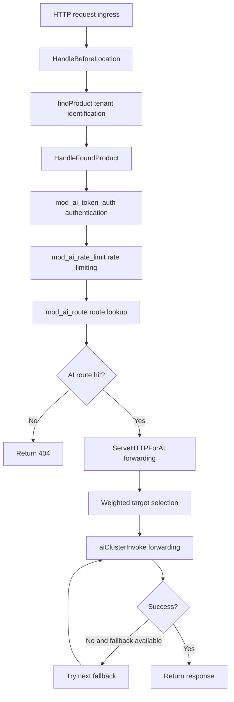
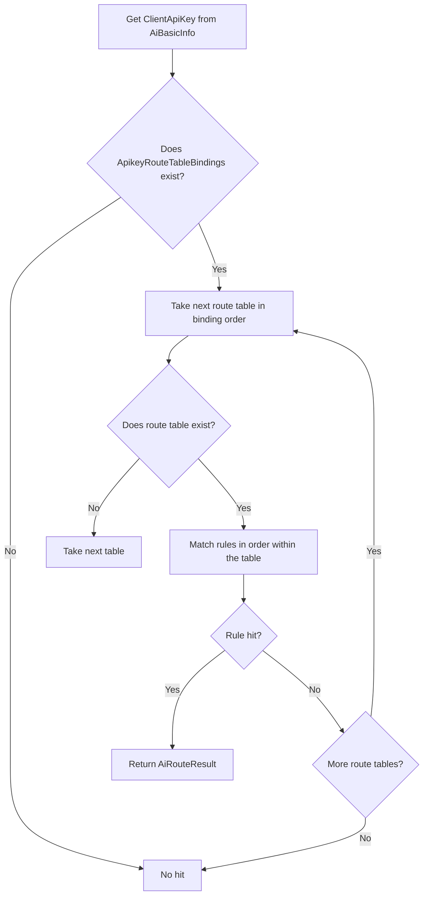

# Chapter 29: Implementing the AI Route Module: mod_ai_route

## Chapter Goals

This chapter focuses on the module in the Rainway AI Gateway Data Plane that decides "where to forward a request" — `mod_ai_route`. After reading this chapter, readers will be able to:

- Understand the responsibilities and position of `mod_ai_route` in the BFE module chain;
- Master the module configuration, the route rule data file, and the hot reload mechanism;
- Understand the matching logic of the three-level route table: **apikey → entity → global**;
- Learn how `targets` weighted selection and the `fallbacks` degradation flow are implemented;
- Understand how `mod_ai_route` and `mod_ai_token_auth` cooperate on the request context;
- Become familiar with the monitoring metrics exposed by the module.

## Responsibilities of mod_ai_route

`mod_ai_route` is the core routing module of the Rainway AI Gateway Data Plane, registered at BFE's `HandleFoundProduct` callback point. Its responsibilities can be summarized as:

1. **Look up the route table by API-Key**: take `ClientApiKey`, already parsed by `mod_ai_token_auth`, from the request context as the entry key for route lookup;
2. **Three-level route matching**: match condition expressions in order across the `apikey` route table, the `entity` route table, and the `global` route table;
3. **Return a complete forwarding intent**: on a hit, return an `AiRouteResult` containing the weighted target list `Targets` and the fallback list `Fallbacks`;
4. **Stay decoupled from the forwarding layer**: it only "looks up and writes to the context"; the actual target selection, model override, and fallback retry are performed by `ServeHTTPForAI()` in `bfe_server/reverseproxy.go`.

Unlike traditional BFE routing, which returns a single `ClusterName`, the AI gateway routing needs to return a set of candidate targets and perform fallback when the backend fails. Therefore `mod_ai_route` adopts a new data structure, `AiRouteResult`, to carry the forwarding intent.

## Module Initialization and Configuration Loading

### Module Configuration File

The module configuration file for `mod_ai_route` is `conf/mod_ai_route/mod_ai_route.conf`, parsed by `bfe/bfe_modules/mod_ai_route/conf_load.go`:

```ini
[basic]
RouteRulePath = ../conf/mod_ai_route/ai_route.data

[log]
OpenDebug = false
```

The core fields are described as follows:

| Field | Description |
|------|------|
| `RouteRulePath` | Path of the AI route rule data file; supports paths relative to `conf_root`. |
| `OpenDebug` | Whether to output debug logs. |

The `ConfModAiRoute` struct and the loading logic are as follows (`bfe/bfe_modules/mod_ai_route/conf_load.go`):

```go
type ConfModAiRoute struct {
	Basic struct {
		RouteRulePath string // path for ai route rule
	}
	Log struct {
		OpenDebug bool
	}
}

func ConfLoad(filePath string, confRoot string) (*ConfModAiRoute, error) {
	var cfg ConfModAiRoute
	if err := gcfg.ReadFileInto(&cfg, filePath); err != nil {
		return &cfg, err
	}
	if err := cfg.Check(confRoot); err != nil {
		return &cfg, err
	}
	return &cfg, nil
}
```

### Route Data File

The actual route rules are stored in `conf/mod_ai_route/ai_route.data` in JSON format. This file is loaded by `bfe/bfe_modules/mod_ai_route/data_load.go` and converted into runtime structures (`bfe/bfe_modules/mod_ai_route/route_rule.go`).

A minimal example:

```json
{
    "Version": "20260720150000",
    "route_rules": {
        "apikey_ak_user_a": {
            "type": "apikey",
            "owner": "ak_user_a",
            "rules": [
                {
                    "name": "user_a-rule1",
                    "Cond": "req_host_in(\"api.example.org\")",
                    "targets": [
                        { "ClusterName": "cluster_deepseek_a", "Model": "deepseek-v4-pro", "Weight": 70 },
                        { "ClusterName": "cluster_deepseek_b", "Model": "deepseek-v4-pro", "Weight": 30 }
                    ],
                    "fallbacks": [
                        { "ClusterName": "cluster_deepseek_c", "Model": "deepseek-v3.2" }
                    ]
                }
            ]
        },
        "entity_dept_ai": {
            "type": "entity",
            "owner": "dept_ai",
            "rules": [
                {
                    "name": "dept_ai-default",
                    "Cond": "default_t()",
                    "targets": [
                        { "ClusterName": "cluster_dept_ai", "Model": "", "Weight": 100 }
                    ],
                    "fallbacks": []
                }
            ]
        },
        "global_default": {
            "type": "global",
            "owner": "global",
            "rules": [
                {
                    "name": "global-default",
                    "Cond": "default_t()",
                    "targets": [
                        { "ClusterName": "cluster_global", "Model": "", "Weight": 100 }
                    ],
                    "fallbacks": []
                }
            ]
        }
    },
    "ApikeyRouteTableBindings": {
        "ak_user_a": [
            "apikey_ak_user_a",
            "entity_dept_ai",
            "global_default"
        ]
    }
}
```

Field descriptions:

- `route_rules`: the collection of route tables, with keys usually named `<type>_<owner>`;
- `type`: the route table type, taking the values `apikey`, `entity`, or `global`;
- `rules`: the rule list, matched in order;
- `Cond`: a BFE condition expression, such as `req_host_in(...)` or `default_t()`;
- `targets`: the list of forwarding targets on a hit; the weights must sum to 100;
- `fallbacks`: an optional list of fallback targets;
- `ApikeyRouteTableBindings`: the mapping from API-Key to the route table search order.

### DTO and Runtime Structure Conversion

`route_rule.go` defines both the JSON DTO and the runtime structure. The DTO is used to deserialize the configuration file, while the runtime structure drops the JSON tags and compiles the condition strings into `condition.Condition`, avoiding repeated parsing on every request.

```go
// JSON DTO
type AiRouteDataFile struct {
	Version                  string                    `json:"Version"`
	RouteRules               map[string]RouteTableFile `json:"route_rules"`
	ApikeyRouteTableBindings map[string][]string       `json:"ApikeyRouteTableBindings"`
}

// Runtime structure
type AiRouteData struct {
	Version                  string
	RouteRules               map[string]RouteTable
	ApikeyRouteTableBindings map[string][]string
}
```

To accommodate field naming differences in configurations issued by the Control Plane, `AiRouteDataFile.UnmarshalJSON` accepts both `route_rules` and `RouteRules`, and normalizes the legacy alias `api_key` to `apikey`:

```go
func (f *AiRouteDataFile) UnmarshalJSON(data []byte) error {
	type rawFile AiRouteDataFile
	raw := &struct {
		*rawFile
		RouteRulesUpper map[string]RouteTableFile `json:"RouteRules"`
	}{
		rawFile: (*rawFile)(f),
	}

	if err := json.Unmarshal(data, raw); err != nil {
		return err
	}

	if f.RouteRules == nil && raw.RouteRulesUpper != nil {
		f.RouteRules = raw.RouteRulesUpper
	}

	for key, table := range f.RouteRules {
		if table.Type == "api_key" {
			table.Type = RouteTypeApikey
		}
		f.RouteRules[key] = table
	}

	return nil
}
```

`data_load.go` converts the DTO into the runtime structure:

```go
func AiRouteDataLoad(fileName string) (*AiRouteData, error) {
	var file AiRouteDataFile

	if err := bfe_util.LoadJsonFile(fileName, &file); err != nil {
		return nil, fmt.Errorf("LoadJsonFile(): err[%s]", err.Error())
	}

	data := &AiRouteData{
		Version:                  file.Version,
		RouteRules:               make(map[string]RouteTable, len(file.RouteRules)),
		ApikeyRouteTableBindings: file.ApikeyRouteTableBindings,
	}

	for key, tableFile := range file.RouteRules {
		rules := make([]RouteRule, len(tableFile.Rules))
		for i, ruleFile := range tableFile.Rules {
			rules[i] = RouteRule{
				Name:      ruleFile.Name,
				CondStr:   ruleFile.Cond,
				Targets:   ruleFile.Targets,
				Fallbacks: ruleFile.Fallbacks,
			}
		}
		data.RouteRules[key] = RouteTable{
			Type:  tableFile.Type,
			Owner: tableFile.Owner,
			Rules: rules,
		}
	}

	return data, nil
}
```

This layered design minimizes the impact of configuration format evolution (e.g., adding fields or renaming fields) on runtime logic.

### Startup and Hot Reload

The module initialization entry is the `Init()` method in `bfe/bfe_modules/mod_ai_route/mod_ai_route.go`:

```go
func (m *ModuleAiRoute) Init(cbs *bfe_module.BfeCallbacks, whs *web_monitor.WebHandlers, cr string) error {
	confPath := bfe_module.ModConfPath(cr, m.name)
	var err error
	if m.conf, err = ConfLoad(confPath, cr); err != nil {
		return fmt.Errorf("%s: conf load err %v", m.name, err)
	}
	openDebug = m.conf.Log.OpenDebug

	if err := m.loadRouteRuleConf(nil); err != nil {
		return fmt.Errorf("%s: loadRouteRuleConf err %v", m.name, err)
	}

	if err := cbs.AddFilter(bfe_module.HandleFoundProduct, m.routeFoundProductHandler); err != nil {
		return fmt.Errorf("%s.Init(): AddFilter(routeFoundProductHandler): %s", m.name, err.Error())
	}

	monitorHandlers := map[string]interface{}{
		m.name: m.getState,
	}
	if err := web_monitor.RegisterHandlers(whs, web_monitor.WebHandleMonitor, monitorHandlers); err != nil {
		return fmt.Errorf("%s.Init(): RegisterHandlers(monitor): %v", m.name, err)
	}

	reloadHandlers := map[string]interface{}{
		m.name: m.loadRouteRuleConf,
	}
	if err := web_monitor.RegisterHandlers(whs, web_monitor.WebHandleReload, reloadHandlers); err != nil {
		return fmt.Errorf("%s.Init(): RegisterHandlers(reload): %v", m.name, err)
	}

	return nil
}
```

`Init()` performs the following work:

1. Load `mod_ai_route.conf`;
2. Call `loadRouteRuleConf()` to load `ai_route.data`;
3. Register `routeFoundProductHandler` at the `HandleFoundProduct` callback point;
4. Register the monitoring endpoint and the hot reload endpoint (`/reload/mod_ai_route`).

On hot reload, `loadRouteRuleConf()` re-reads the rule file; only after validation passes does it atomically swap the in-memory route tables, so a failure does not affect the rules currently in effect.

### Atomicity of Hot Reload

The locking strategy of `AiRouteTable.Update()` is worth noting:

```go
func (t *AiRouteTable) Update(data *AiRouteData) error {
	// validate and compile conditions (outside the lock)
	rules := make(map[string]*RouteTable)
	for key, table := range data.RouteRules {
		if err := ValidateRouteTable(&table); err != nil {
			return fmt.Errorf("validate route table[%s] err: %s", key, err)
		}
		tableCopy := table
		rules[key] = &tableCopy
	}

	// only lock when swapping the atomic references
	t.lock.Lock()
	t.routeRules = rules
	t.bindings = data.ApikeyRouteTableBindings
	t.lock.Unlock()

	return nil
}
```

Compiling condition expressions is a CPU-intensive operation; if performed inside the write lock, it would block all route lookups during hot reload. `Update()` completes all compilation during the validation phase first, then takes the write lock only to swap the references, thereby minimizing the impact of hot reload on request processing. Even if validation fails, the in-memory route tables remain unchanged.

## AI Route Lookup Logic

### Request Context Passing

`mod_ai_route` does not parse the API-Key in request headers itself; it relies on upstream modules to write the result into the request context. The key context structures are defined in `bfe/bfe_basic/request_ai_route.go`:

```go
const CtxAiRouteResult = "__REQ_AI_ROUTE_RESULT"

type AiRouteResult struct {
	RouteType string // apikey / entity / global
	Owner     string // route table owner
	RuleName  string // hit rule name
	Targets   []AiRouteTarget
	Fallbacks []AiRouteFallback
}

type AiRouteTarget struct {
	ClusterName string
	Model       string
	Weight      int
}

type AiRouteFallback struct {
	ClusterName string
	Model       string
}
```

`Request` provides the `SetAiRouteResult()` and `GetAiRouteResult()` methods for passing results between modules and the forwarding layer.

### routeFoundProductHandler

`routeFoundProductHandler` in `bfe/bfe_modules/mod_ai_route/mod_ai_route.go` is the module's core callback:

```go
func (m *ModuleAiRoute) routeFoundProductHandler(req *bfe_basic.Request) (int, *bfe_http.Response) {
	m.state.ReqTotal.Inc(1)

	aiMeta := req.GetAiBasicInfo()
	if aiMeta == nil {
		return bfe_module.BfeHandlerGoOn, nil
	}

	apiKey := aiMeta.ClientApiKey
	if apiKey == "" {
		if openDebug {
			log.Logger.Debug("%s: api key empty, skip", m.name)
		}
		return bfe_module.BfeHandlerGoOn, nil
	}

	result := m.routeTable.Search(apiKey, req)
	if result == nil {
		m.state.ReqMiss.Inc(1)
		if openDebug {
			log.Logger.Debug("%s: no route hit for apiKey[%s]", m.name, apiKey)
		}
		return bfe_module.BfeHandlerGoOn, nil
	}

	switch result.RouteType {
	case RouteTypeApikey:
		m.state.ReqHitApikey.Inc(1)
	case RouteTypeEntity:
		m.state.ReqHitEntity.Inc(1)
	case RouteTypeGlobal:
		m.state.ReqHitGlobal.Inc(1)
	}

	req.SetAiRouteResult(result)

	return bfe_module.BfeHandlerGoOn, nil
}
```

Execution flow:

1. Increment the total request counter `ReqTotal`;
2. Take `AiBasicInfo` from the context; if absent, skip;
3. If `ClientApiKey` is empty, upstream authentication did not pass or this is not an AI request — skip directly;
4. Call `routeTable.Search(apiKey, req)` to look up the route;
5. On a miss, increment `ReqMiss` and let the request proceed;
6. On a hit, count by route table type and write `AiRouteResult` into the request context.

This callback always returns `BfeHandlerGoOn` and never constructs a response itself; whether a 404 is returned is decided later by `ServeHTTPForAI()` based on whether `AiRouteResult` exists.

## Three-Level Route Table Matching (apikey, entity, global)

### ApikeyRouteTableBindings

The core organization of the three-level routing is embodied in the `ApikeyRouteTableBindings` field: each API-Key is bound to an ordered list of route table keys. `mod_ai_route` searches strictly in that order, rather than implicitly ordering by route table type.

For example:

```json
"ApikeyRouteTableBindings": {
    "ak_user_a": [
        "apikey_ak_user_a",
        "entity_dept_ai",
        "global_default"
    ],
    "ak_user_b": [
        "entity_dept_ai",
        "global_default"
    ]
}
```

`ak_user_a` first looks up its own `apikey`-level rules; if no hit, it falls back to its `entity`'s rules; finally it uses `global` as the catch-all. `ak_user_b` has no dedicated `apikey` rules, so the search starts directly from `entity`.

### AiRouteTable.Search

`bfe/bfe_modules/mod_ai_route/route_table.go` implements the in-memory structure of the route tables and the lookup:

```go
type AiRouteTable struct {
	lock sync.RWMutex

	// routeRules key: route table key (<type>_<owner>)
	// routeRules value: pointer to the route table
	routeRules map[string]*RouteTable

	// bindings key: API-Key string
	// bindings value: ordered list of route table keys to search
	bindings map[string][]string
}

func (t *AiRouteTable) Search(apiKey string, req *bfe_basic.Request) *bfe_basic.AiRouteResult {
	t.lock.RLock()

	tableKeys, ok := t.bindings[apiKey]
	if !ok || len(tableKeys) == 0 {
		t.lock.RUnlock()
		return nil
	}

	// copy table references under lock; table.Match() may be expensive,
	// so we release the lock before matching.
	tables := make([]*RouteTable, 0, len(tableKeys))
	for _, key := range tableKeys {
		if table, ok := t.routeRules[key]; ok {
			tables = append(tables, table)
		} else if openDebug {
			log.Logger.Debug("mod_ai_route: route table[%s] not found", key)
		}
	}
	t.lock.RUnlock()

	// match outside the lock to reduce critical section
	for _, table := range tables {
		rule := table.Match(req)
		if rule != nil {
			return &bfe_basic.AiRouteResult{
				RouteType: table.Type,
				Owner:     table.Owner,
				RuleName:  rule.Name,
				Targets:   rule.Targets,
				Fallbacks: rule.Fallbacks,
			}
		}
	}

	return nil
}
```

Design highlights:

- `Update()` does not hold the lock while validating and compiling condition expressions; it only takes the lock at the end to atomically swap `routeRules` and `bindings`;
- `Search()` first takes the read lock to copy the table references needed for lookup, releases the lock, and then performs condition matching, avoiding long-running conditions blocking hot reload;
- Once a route table hits a rule, it returns immediately without searching the remaining route tables.

### Condition Compilation and Validation

`ValidateRouteTable()` in `bfe/bfe_modules/mod_ai_route/route_rule.go` completes condition compilation and validation at configuration load time:

```go
func ValidateRouteTable(table *RouteTable) error {
	switch table.Type {
	case RouteTypeApikey, RouteTypeEntity, RouteTypeGlobal:
	default:
		return fmt.Errorf("invalid route table type: %s", table.Type)
	}

	for i := range table.Rules {
		rule := &table.Rules[i]
		if rule.Name == "" {
			return fmt.Errorf("rule name empty")
		}
		if rule.CondStr == "" {
			return fmt.Errorf("rule[%s] Cond empty", rule.Name)
		}
		cond, err := condition.Build(rule.CondStr)
		if err != nil {
			return fmt.Errorf("rule[%s] build cond[%s] err: %s", rule.Name, rule.CondStr, err)
		}
		rule.Cond = cond

		if len(rule.Targets) == 0 {
			return fmt.Errorf("rule[%s] targets empty", rule.Name)
		}

		totalWeight := 0
		for _, target := range rule.Targets {
			totalWeight += target.Weight
		}
		if totalWeight != 100 {
			return fmt.Errorf("rule[%s] total weight %d != 100", rule.Name, totalWeight)
		}
	}
	return nil
}
```

The validation rules include:

- The route table type is valid;
- Rule names and condition expressions are non-empty;
- Condition expressions compile successfully;
- `targets` is non-empty and the weights sum to 100.

These checks ensure that configuration errors surface at startup or hot reload time, rather than failing during request processing.

## Fallback Handling

`mod_ai_route` is only responsible for writing the `Fallbacks` list into `AiRouteResult`; the actual fallback logic is executed in `ServeHTTPForAI()` in `bfe/bfe_server/reverseproxy.go`.

The fallback flow is roughly as follows:

1. Select the preferred target from `Targets` by weighted random;
2. Assemble the `attempts` list in order: the preferred target followed by all `Fallbacks`;
3. If fallbacks exist, first make the request body rewindable;
4. Call `aiClusterInvoke()` in turn;
5. Stop when an attempt returns 2xx/3xx;
6. On a network error, a backend 5xx, or special degradation status codes in the configuration, trigger the next fallback.

The `shouldTriggerFallback` logic (`bfe/bfe_server/reverseproxy.go`) is as follows:

```go
func shouldTriggerFallback(res *bfe_http.Response, err error) bool {
	if err != nil {
		return true
	}
	code := getResponseStatus(res)
	if code >= 500 {
		return true
	}
	if _, ok := aiFallbackStatusCodes[code]; ok {
		return true
	}
	return false
}
```

Trigger conditions include:

- An error during forwarding (connection failure, timeout, etc.);
- The backend returns 5xx;
- Degradation status codes additionally specified in the configuration (e.g., 429).

Typical cases that do not trigger fallback:

- Client 4xx errors;
- Authentication failure or rate limit rejection;
- Fallback proactively disabled when the request body is not rewindable.

Before each fallback attempt, `resetRequestForRetry()` resets the connection count, transport, out request, and error information, and rewinds the request body, ensuring the next forwarding attempt starts from a clean request state.

```go
func (p *ReverseProxy) resetRequestForRetry(basicReq *bfe_basic.Request) bool {
	if basicReq.Trans.Backend != nil {
		basicReq.Trans.Backend.DecConnNum()
		basicReq.Trans.Backend = nil
	}
	basicReq.Trans.Transport = nil
	basicReq.RetryTime = 0

	basicReq.OutRequest = nil

	if !rewindRequestBody(basicReq.HttpRequest) {
		return false
	}

	basicReq.ErrCode = nil
	basicReq.ErrMsg = ""
	return true
}
```

Request body rewinding is done cooperatively by `prepareRequestBodyForRetry()` and `rewindRequestBody()`. `prepareRequestBodyForRetry()` checks, before the first forwarding attempt, whether the Body implements the `Rewindable` interface; if not, it tries to wrap the Body into a rewindable type via `GetBodyAccessor()`. `rewindRequestBody()` is called before each fallback to reset the Body to its starting position; otherwise the next `aiClusterInvoke()` would read an empty request body.

Note that when the request body is too large or exceeds the buffer limit, `prepareRequestBodyForRetry()` returns failure, and `ServeHTTPForAI()` then proactively truncates the `attempts` list and disables fallback, avoiding a wasted, ineffective fallback attempt on a non-rewindable request body.

## Cooperation with mod_ai_token_auth

`mod_ai_route` and `mod_ai_token_auth` cooperate through BFE's request context `AiBasicInfo`:

- `mod_ai_token_auth` parses and validates the API-Key at the `HandleFoundProduct` stage and writes the result into `AiBasicInfo.ClientApiKey`;
- `mod_ai_route` executes shortly after at the same point and reads `ClientApiKey` as the route lookup key;
- Both share fields in `AiBasicInfo` such as `ClientModel` and `TargetModel`, for subsequent model override and logging.

The module order is explicitly constrained in `bfe/bfe_modules/bfe_modules.go`:

```go
// mod_ai_token_auth
mod_ai_token_auth.NewModuleAITokenAuth(),

// mod_ai_route
// Requirement: after mod_ai_token_auth (needs ClientApiKey)
mod_ai_route.NewModuleAiRoute(),
```

If the order is reversed, `mod_ai_route` may see an empty `ClientApiKey`, causing all requests to take the miss path. Therefore, when adding or adjusting AI gateway modules, this order must be strictly preserved.

## Monitoring Metrics

`mod_ai_route` defines `ModuleAiRouteState` (`bfe/bfe_modules/mod_ai_route/mod_ai_route.go`) to expose request-level monitoring:

| Metric | Type | Description |
|--------|------|------|
| `ReqTotal` | Counter | Total number of requests entering `mod_ai_route`. |
| `ReqHitApikey` | Counter | Number of requests hitting the `apikey` route table. |
| `ReqHitEntity` | Counter | Number of requests hitting the `entity` route table. |
| `ReqHitGlobal` | Counter | Number of requests hitting the `global` route table. |
| `ReqMiss` | Counter | Number of requests hitting no route table. |
| `ReqFallback` | Counter | Reserved fallback trigger counter; the actual fallback trigger count is primarily tracked in `reverseproxy.go`. |

These metrics can be viewed via the `/monitor/mod_ai_route` endpoint and can also be integrated with Prometheus. In operations, a spike in `ReqMiss` indicates missing route configuration, and the `ReqHitApikey/Entity/Global` distribution reveals the hit ratio across the different routing levels.

When queried via the monitoring endpoint, the response is usually text in the following form:

```text
mod_ai_route{
    ReqTotal: 1234567
    ReqHitApikey: 890123
    ReqHitEntity: 234567
    ReqHitGlobal: 100000
    ReqMiss: 9997
    ReqFallback: 0
}
```

The sum of `ReqHitApikey`, `ReqHitEntity`, and `ReqHitGlobal`, plus `ReqMiss`, should roughly equal `ReqTotal`. If `ReqMiss` stays high, it means some API-Keys are not bound to route tables or none of their bound tables matched; if `ReqHitGlobal` accounts for too high a proportion, it means many requests miss the apikey/entity-level rules, and the routing policy may need refinement.

## Key Code Snippets

### 1. Module Registration

`bfe/bfe_modules/bfe_modules.go`:

```go
// mod_ai_route
// Requirement: after mod_ai_token_auth (needs ClientApiKey)
mod_ai_route.NewModuleAiRoute(),
```

### 2. Route Lookup and Context Write

`bfe/bfe_modules/mod_ai_route/mod_ai_route.go`:

```go
result := m.routeTable.Search(apiKey, req)
if result == nil {
	m.state.ReqMiss.Inc(1)
	return bfe_module.BfeHandlerGoOn, nil
}

switch result.RouteType {
case RouteTypeApikey:
	m.state.ReqHitApikey.Inc(1)
case RouteTypeEntity:
	m.state.ReqHitEntity.Inc(1)
case RouteTypeGlobal:
	m.state.ReqHitGlobal.Inc(1)
}

req.SetAiRouteResult(result)
```

### 3. Weighted Random Target Selection

`bfe/bfe_server/reverseproxy.go`:

```go
func SelectTarget(targets []bfe_basic.AiRouteTarget) bfe_basic.AiRouteTarget {
	if len(targets) == 1 {
		return targets[0]
	}

	r := aiTargetRand.Intn(100)
	sum := 0
	for _, target := range targets {
		sum += target.Weight
		if r < sum {
			return target
		}
	}
	return targets[len(targets)-1]
}
```

### 4. Building the attempts List and the Fallback Loop

A core snippet in `bfe/bfe_server/reverseproxy.go`:

```go
// weighted random select target
if len(aiResult.Targets) > 0 {
	selectedTarget = SelectTarget(aiResult.Targets)
}

// build attempt list: selected target + fallbacks
attempts = make([]aiForwardAttempt, 0, 1+len(aiResult.Fallbacks))
if selectedTarget.ClusterName != "" {
	attempts = append(attempts, aiForwardAttempt{
		ClusterName: selectedTarget.ClusterName,
		Model:       selectedTarget.Model,
		IsFallback:  false,
	})
}
for _, fb := range aiResult.Fallbacks {
	attempts = append(attempts, aiForwardAttempt{
		ClusterName: fb.ClusterName,
		Model:       fb.Model,
		IsFallback:  true,
	})
}

// ensure request body is rewindable before attempting fallbacks
if len(attempts) > 1 && basicReq.HttpRequest.Body != nil {
	if !prepareRequestBodyForRetry(basicReq.HttpRequest) {
		log.Logger.Warn("ServeHTTPForAI: request body is not rewindable, disable fallback")
		attempts = attempts[:1]
	}
}
```

## Flow Diagrams

### Figure 1: AI Gateway Request Processing Flow



### Figure 2: Three-Level Route Table Lookup Flow



## Chapter Summary

`mod_ai_route` is the routing module that connects the upstream and downstream of the Rainway AI Gateway Data Plane:

- It is registered at the `HandleFoundProduct` callback point and relies on `ClientApiKey` written by `mod_ai_token_auth` for route lookup;
- Through `ApikeyRouteTableBindings` it implements three-level priority routing of **apikey → entity → global**, with condition expressions matched in rule order within each route table;
- The configuration file uses a layered design of JSON DTO and runtime structures, accommodating legacy field differences such as `route_rules`/`RouteRules` and `api_key`/`apikey`;
- Condition expression compilation and weight validation are completed at configuration load time, ensuring configuration correctness at startup and during hot reload;
- Hot reload atomically swaps the in-memory route tables only after validation passes, so failures do not affect the currently running rules;
- On a hit it only writes `AiRouteResult` into the request context; forwarding, weighted selection, and fallback degradation are all done by `ServeHTTPForAI()`, keeping module responsibilities clear;
- Fallback degradation depends on the request body being rewindable; when the request body is not rewindable, fallback is proactively disabled;
- It exposes runtime state through metrics such as `ReqTotal`, `ReqHitApikey`, `ReqHitEntity`, `ReqHitGlobal`, and `ReqMiss`, facilitating operational observability.

Understanding the implementation of `mod_ai_route` helps you quickly find the root cause when diagnosing problems such as "which cluster/model was the request forwarded to" and "why did a 404 or fallback failure occur".

## References

- `bfe/bfe_modules/mod_ai_route/mod_ai_route.go`
- `bfe/bfe_modules/mod_ai_route/conf_load.go`
- `bfe/bfe_modules/mod_ai_route/data_load.go`
- `bfe/bfe_modules/mod_ai_route/route_rule.go`
- `bfe/bfe_modules/mod_ai_route/route_table.go`
- `bfe/bfe_modules/bfe_modules.go`
- `bfe/bfe_basic/request_ai_route.go`
- `bfe/bfe_server/reverseproxy.go`
- `bfe/docs/zh_cn/sys_design/mod_ai_route.md`
- `bfe/docs/zh_cn/modules/mod_ai_route/mod_ai_route.md`
- `bfe/docs/zh_cn/configuration/mod_ai_route/ai_route.data.md`
