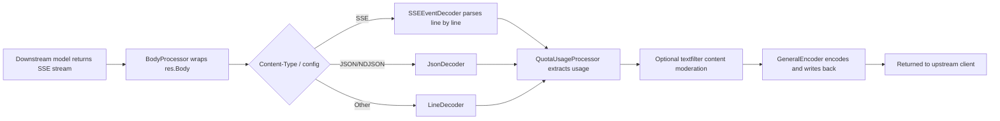
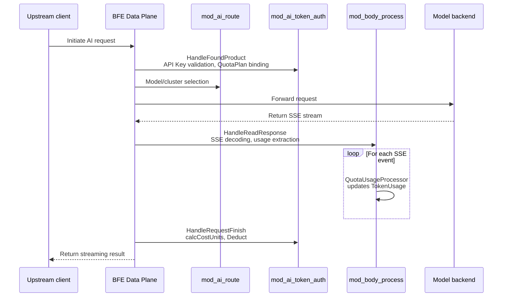

# Chapter 32: Request Body Processing Module Implementation: mod_body_process

## Chapter Goals

This chapter focuses on the `mod_body_process` module in the BFE Data Plane, explaining how it parses request bodies and response bodies during AI request forwarding — in particular, how it extracts token usage from Server-Sent Events (SSE) streaming responses and cooperates with `mod_ai_token_auth` to complete quota deduction. After reading this chapter, readers will be able to:

- Understand the position of `mod_body_process` in the BFE module chain and its lifecycle.
- Master the implementation details of SSE decoding and `QuotaUsage` extraction.
- Understand how token usage is aggregated into the `TokenUsage` context in both streaming and non-streaming scenarios.
- Learn how RMB quota time-based pricing interacts with response body processing.
- Understand how content moderation (`textfilter`) shares the same event-processing framework with token extraction.

## mod_body_process Module Responsibilities

`mod_body_process` is a generic module in BFE responsible for request body/response body processing. In the AI gateway scenario it is given three core responsibilities:

1. **Request body processing**: In the `HandleAfterLocation` phase, it decodes and transforms the upstream request body according to rules. Currently it mainly supports `textfilter` content moderation (`content_audit_process.go`).
2. **Response body processing**: In the `HandleReadResponse` phase, it performs streaming decoding, token usage extraction, content moderation, and other processing on the response body returned by the downstream.
3. **Token timing collection**: In the `HandleRequestFinish` phase, it computes `TTFT` (Time To First Token) and `TPOT` (Time Per Output Token), providing a basis for observability and rate limiting.

Unlike AI-specific modules such as `mod_ai_route` and `mod_ai_token_auth`, the design goal of `mod_body_process` is a "generic body-processing framework": it unifies data in different protocol formats into a sequence of `Event`s through an event abstraction, and then lets a processor chain consume these events. This design means that adding a new decoding format or a new processing logic (e.g., sensitive-word filtering, log masking) only requires implementing the corresponding `EventDecoder` or `EventProcessor`, without touching the reverse-proxy core logic.

The module wraps the raw `io.ReadCloser` into a chained processor supporting "decode → process → encode" via the `BodyProcessor` structure. `BodyProcessor` is defined in `bfe/bfe_modules/mod_body_process/body_process.go:30` and internally holds `source` (raw stream), `buffer` (output buffer), `decoder` (event decoder), `processors` (event processor array), and `encoder` (event encoder).

```go
// bfe/bfe_modules/mod_body_process/body_process.go
type BodyProcessor struct {
    source     io.ReadCloser
    buffer     *bytes.Buffer
    decoder    EventDecoder
    processors []EventProcessor
    encoder    EventEncoder
    err        error
    rejection  *RejectionError
    onReject   func(error, *BodyProcessor)
}
```

## Position in the BFE Module Chain

`mod_body_process` is registered in `bfe/bfe_modules/bfe_modules.go:156`, after `mod_ai_route` and before `mod_ai_rate_limit`. The registration order is as follows:

```go
// bfe/bfe_modules/bfe_modules.go
mod_ai_token_auth.NewModuleAITokenAuth(), // API Key validation and QuotaPlan binding
mod_ai_route.NewModuleAiRoute(),          // model/cluster selection
mod_body_process.NewModuleBodyProcess(),  // response body parsing and token extraction
mod_ai_rate_limit.NewModuleAiRateLimit(), // rate limiting based on token calculation results
```

`mod_body_process` registers three hooks with the BFE callback chain:

| Callback Phase | Function | Purpose |
|----------|------|------|
| `HandleAfterLocation` | `afterLocationHandler` | Matches rules and prepares the `BodyProcessor` for the request/response body. |
| `HandleReadResponse` | `readResponseHandler` | Triggers response body processing; injects `QuotaUsageProcessor` by default. |
| `HandleRequestFinish` | `requestFinishHandler` | Records `TLastToken` and computes `TTFT`/`TPOT`. |

> Note: `mod_ai_token_auth` also executes in the `HandleReadResponse` phase (`bfe/bfe_modules/mod_ai_token_auth/mod_ai_token_auth.go:365`), where it reads non-streaming responses in full and extracts usage; the `readResponseHandler` of `mod_body_process`, by contrast, prioritizes streaming responses.

### Configuration Loading and Rule Matching

The main configuration file of `mod_body_process` is `mod_body_process/mod_body_process.conf`, loaded by `ConfLoad` (`conf_mod_body_process.go:47`); the rule data file defaults to `mod_body_process/body_process.data`, parsed by `ProductRuleConfLoad` (`body_process_rule_load.go:183`). The rule file is in JSON format, with `Version` and `Config` at the top level; `Config` organizes rule lists by product line. Each rule contains `Cond` (a BFE condition expression), `RequestProcess`, and `ResponseProcess` configurations:

```json
{
  "Version": "2025-01-01-000000",
  "Config": {
    "ai_product": [
      {
        "Cond": "req_ai_model_match()",
        "RequestProcess": {
          "Dec": "json",
          "Proc": [{"Name": "textfilter", "Params": ["http://audit-service:8080"]}]
        },
        "ResponseProcess": {
          "Dec": "sse",
          "Proc": [{"Name": "textfilter", "Params": ["http://audit-service:8080"]}]
        }
      }
    ]
  }
}
```

In `BodyProcessConfig`, `Dec` supports `sse`, `line`, and `json`; `Proc` currently supports only `textfilter`. After rules are loaded, they are stored in `ProcessRuleTable` (`body_process_rule_table.go:21`), and at runtime they are looked up by `req.Route.Product` and matched in condition order.

## SSE Streaming Response Parsing

Large language models generally use the SSE protocol to return streaming results. The `SSEEventDecoder` in `mod_body_process` (`bfe/bfe_modules/mod_body_process/llm_util.go:229`) reads line by line based on `bufio.Reader`, parses `event:`, `id:`, `data:`, `retry:`, and comment fields according to the SSE specification, and finally assembles them into an `SSEEvent`.

```go
// bfe/bfe_modules/mod_body_process/llm_util.go
type SSEEvent struct {
    ID        *string
    Event     *string
    DataLines [][]byte
    Retry     *int
    Comments  [][]byte
    RawLines  [][]byte
    raw       []byte
    dirty     bool
    truncated bool
    endstyle  string
}
```

`DoResponseProcess` (`body_process.go:295`) automatically selects the decoder based on the configuration or response headers:

- When `Dec == "sse"` is explicitly configured, `NewSSEEventDecoder` is used.
- When the response `Content-Type` is `text/event-stream`, `application/sse`, etc., `ContentTypeDecoder` automatically selects the SSE decoder.
- Other cases fall back to the line decoder or JSON decoder.

```go
// bfe/bfe_modules/mod_body_process/body_process.go
switch dec {
case "sse":
    bp.CreateEventDecoder(NewSSEEventDecoder)
case "line":
    bp.CreateEventDecoder(NewLineDecoder)
case "json":
    bp.CreateEventDecoder(NewJsonDecoder)
default:
    contentType := res.Header.Get("Content-Type")
    bp.CreateEventDecoder(func(source io.Reader) (EventDecoder, error) {
        return NewContentTypeDecoder(source, contentType)
    })
}
```

The SSE decoder collects each `data:` line into `DataLines` and emits an event when it encounters a blank line; if the stream ends without a trailing blank line at the end of an event, it marks `truncated` as `true` and still emits the parsed event to avoid losing the last chunk.

The SSE protocol itself is very simple: each event consists of several field lines separated by newline characters, the field name and value are separated by the first colon, and an optional single space may precede the value. The decoder in `mod_body_process` handles several kinds of edge cases:

- **Comment lines**: Lines starting with `:` are treated as comments, saved to `Comments`, and do not participate in event content.
- **Blank line triggers event dispatch**: When a blank line is read and the current event has accumulated content, the event is emitted immediately; otherwise reading continues and heartbeat blank lines are skipped.
- **Multi-line data**: In SSE responses from providers such as OpenAI, the JSON object of one event may span multiple `data:` lines, so `DataLines` is an array and `GetData()` joins them with `\n`.
- **Abnormal stream truncation**: If the connection breaks before an event is complete and the event already has content, `truncated = true` is set and the event is emitted, ensuring that trailing data such as `usage` is not discarded.
- **Newline style adaptation**: The decoder detects `\n` or `\r\n` and records it in `endstyle`, so that encoding in `ToBytes()` preserves the original style.

### Streaming Response Processing Flow



## Token Usage Extraction

Whether streaming or non-streaming, the ultimate goal is to aggregate the token usage in the response into `bfe_basic.TokenUsage` (`bfe/bfe_basic/request_ai_basic.go:57`):

```go
// bfe/bfe_basic/request_ai_basic.go
type TokenUsage struct {
    PromptTokens      int64 // input token count (including cache_read/audio_input)
    CompletionTokens  int64 // output token count (including audio_output)
    CacheReadTokens   int64 // cache-hit input tokens
    CacheWriteTokens  int64 // cache-write tokens
    AudioInputTokens  int64 // audio input tokens
    AudioOutputTokens int64 // audio output tokens
    ImageCount        int64 // number of images generated
    UsedQuota         int64 // used token quota
    UsedCost          int64 // used RMB cost, 1 unit = 1e-8 yuan
}
```

`QuotaUsageProcessor` (`bfe/bfe_modules/mod_body_process/content_quota_usage.go:23`) is the response event processor injected by default. It calls `Event.GetQuotaUsage()` on each event and writes the result into `aiBasicInfo.GetTokenUsage()`.

`SSEEvent.GetQuotaUsage()` and `RawEvent.GetQuotaUsage()` have identical implementation logic (`llm_util.go:123`, `body_process.go:422`); both use `gjson` to read the following fields from JSON:

- OpenAI style: `usage.total_tokens`, `usage.prompt_tokens`, `usage.completion_tokens`.
- DeepSeek cache extension: `usage.cache_read_tokens`, `usage.prompt_cache_hit_tokens`, `usage.prompt_tokens_details.cached_tokens`.
- Anthropic style: `usage.input_tokens`, `usage.output_tokens`, `usage.cache_read_input_tokens`, `usage.cache_creation_input_tokens`.
- Image generation: `usage.image_count`, `data.#`.

```go
// bfe/bfe_modules/mod_body_process/llm_util.go
used := gjson.GetBytes(data, "usage.total_tokens").Int()
prompt := gjson.GetBytes(data, "usage.prompt_tokens").Int()
completion := gjson.GetBytes(data, "usage.completion_tokens").Int()

// DeepSeek fallback
if cacheRead == 0 {
    cacheRead = gjson.GetBytes(data, "usage.prompt_cache_hit_tokens").Int()
}

// Claude fallback
if prompt == 0 && completion == 0 {
    prompt = gjson.GetBytes(data, "usage.input_tokens").Int()
    completion = gjson.GetBytes(data, "usage.output_tokens").Int()
}
```

If the response never contains a `usage` field, `IsGuess` stays `true` and `CurrentTokens` is estimated by `EstimateContentToken`, i.e., content length divided by 4 (`llm_util.go:319`). In `QuotaUsageProcessor.Process`, when `UsedQuota <= 0` and estimation is allowed, the estimated value is added to `CompletionTokens`.

The extraction logic adopts a "priority + fallback" strategy to accommodate the field naming differences across providers:

1. OpenAI-style fields are read first: `prompt_tokens`, `completion_tokens`, `total_tokens`.
2. If both `prompt_tokens` and `completion_tokens` are 0, it falls back to the Anthropic style: `input_tokens`, `output_tokens`.
3. Cache-hit fields also have multi-layer fallbacks: read `cache_read_tokens` first, then DeepSeek's `prompt_cache_hit_tokens` or `prompt_tokens_details.cached_tokens`, and finally Anthropic's `cache_read_input_tokens`.
4. In image generation scenarios, `usage.image_count` is preferred, falling back to `data.#` (the length of the `data` array).

This layered fallback allows the gateway to identify usage automatically as long as a model follows mainstream conventions, without configuring a field mapping per model.

### Key Extraction Rules

| Field | Source | Description |
|------|------|------|
| `input_tokens` | `usage.input_tokens` | Anthropic-style input tokens. |
| `output_tokens` | `usage.output_tokens` | Anthropic-style output tokens. |
| `prompt_tokens` | `usage.prompt_tokens` | OpenAI-style input tokens. |
| `completion_tokens` | `usage.completion_tokens` | OpenAI-style output tokens. |
| `total_tokens` | `usage.total_tokens` | When present, used directly as `UsedQuota`. |
| `cache_read_tokens` | Multi-source fallback | Input tokens served from cache, used for RMB tiered pricing. |

## Cooperation with mod_ai_token_auth

`mod_body_process` itself does not directly deduct quota; it only writes token usage into the request context. The actual quota deduction is completed by `mod_ai_token_auth` in the `HandleRequestFinish` phase. The cooperation works as follows:

1. **Request phase**: `mod_ai_token_auth.tokenFoundProductHandler` validates the API Key, binds the `QuotaPlan`, and caches `serverConf` in `TokenAuthContext` (`mod_ai_token_auth.go:440`).
2. **Response phase**:
   - Non-streaming response: `mod_ai_token_auth.tokenReadResponseHandler` reads the complete response body via `res.GetBodyAccessor()` and calls `UpdateCtxByUsage` to populate `TokenUsage`.
   - Streaming response: `mod_body_process.readResponseHandler` wraps `res.Body`, and `QuotaUsageProcessor` updates `TokenUsage` on each SSE event.
3. **Request finish phase**: `mod_ai_token_auth.tokenRequestFinishHandler` computes the RMB cost and performs quota deduction.

```go
// bfe/bfe_modules/mod_ai_token_auth/mod_ai_token_auth.go
if tokenUsage.UsedCost <= 0 && hasRMBPlan(ctx.Token.QuotaPlans) {
    tokenUsage.UsedCost = m.calcCostUnits(req, ctx.serverConf, tokenUsage)
}

costUnits := tokenUsage.UsedCost
if tokenUsage.UsedQuota > 0 || costUnits > 0 {
    for _, plan := range ctx.Token.QuotaPlans {
        if quota.IsRMB(plan.Unit) {
            if costUnits > 0 {
                plan.Deduct(m.redisClient, costUnits)
            }
        } else {
            if tokenUsage.UsedQuota > 0 {
                plan.Deduct(m.redisClient, tokenUsage.UsedQuota)
            }
        }
    }
}
```

This division of labor guarantees two things:

- `mod_body_process` focuses on protocol parsing and data extraction, and is unaware of Redis or QuotaPlan.
- `mod_ai_token_auth` focuses on quota and billing, and does not handle SSE protocol details directly.

### Module Cooperation Sequence



## RMB Quota Deduction Scenario

When the user's QuotaPlan unit is RMB, `mod_ai_token_auth` computes the cost at the end of the request based on `TokenUsage` and the model price. RMB cost calculation involves two key capabilities:

### 1. Time-Based Pricing Matching

The `AIConf.ModelTable` exported by the Control Plane contains `TimeZone` and `Tiers` (`ai-gateway-api/design-docs/sys-design/details/RMB配额分时段定价.md`). After BFE loads it, `ActiveTierName` matches the peak/off-peak tier based on the current request time:

```go
// bfe/bfe_config/bfe_cluster_conf/cluster_conf/cluster_conf_load.go
func (table *ModelTable) ActiveTierName(now time.Time) string {
    t := now.In(table.tz)
    wd := int(t.Weekday())
    hour, min := t.Hour(), t.Minute()
    cur := hour*60 + min

    for i := range table.Tiers {
        tier := &table.Tiers[i]
        for _, tr := range tier.TimeRanges {
            if len(tr.Weekdays) > 0 && !containsInt(tr.Weekdays, wd) {
                continue
            }
            start := parseHHMM(tr.Start)
            end := parseHHMM(tr.End)
            if start <= cur && cur < end {
                return tier.Name
            }
        }
    }
    return ""
}
```

When no tier matches, the default `Prices` are used.

### 2. Cost Calculation

`mod_ai_token_auth.calcCostUnits` (`mod_ai_token_auth.go:472`) looks up the price of the target model and selects the corresponding price key based on the tier:

```go
// bfe/bfe_modules/mod_ai_token_auth/mod_ai_token_auth.go
entry := cluster_conf.LookupModelPrice(cluster.AIConf.ModelTable, targetModel, mode)
tierName := cluster.AIConf.ModelTable.ActiveTierName(time.Now())
cost := calcChatCost(entry, usage, tierName)
```

`calcChatCost` supports multi-dimensional billing such as regular input/output, cache read/write, and audio input/output (`mod_ai_token_auth.go:531`). Costs are stored as fixed-point integers, `1 unit = 1e-8` yuan, avoiding floating-point errors.

### 3. Streaming Scenario Compatibility

RMB quota deduction happens in `HandleRequestFinish`, by which time `mod_body_process` has already aggregated `usage` from all SSE events into `TokenUsage`. Therefore, whether the response is streaming or non-streaming, `mod_ai_token_auth` can obtain the complete token usage at the end of the request and compute the cost. `bfe/AGENTS.md` also specifically reminds: when modifying RMB quota deduction, make sure the streaming scenario still works correctly after `mod_body_process` is loaded.

Here is a concrete example: for a certain DeepSeek model, the off-peak `input_cost_per_token` is `0.0000015` yuan/token, while it is `0.0000030` yuan/token under the peak-hour `peak` tier. Assume a streaming request consumes 1000 input tokens and 500 output tokens in total, of which 200 are cache hits:

- If the request occurs during peak hours, `ActiveTierName` returns `"peak"`, `calcChatCost` uses the `peak` prices, and the cost is approximately `(800 × 0.0000030 + 200 × cache_read_cost + 500 × output_cost)` yuan.
- If the request occurs during off-peak hours, no tier matches and it falls back to the default `Prices`, with the cost computed at default prices.

All prices are already converted to fixed-point integers (`1 unit = 1e-8` yuan) by `PriceMap`'s custom `MarshalJSON` when loaded into `ModelTable`, so multiplications and accumulations at runtime are all integer operations, ensuring both precision and performance.

## Key Code Snippets

### 1. Response Body Processing Entry Point

```go
// bfe/bfe_modules/mod_body_process/body_process.go
func (m *ModuleBodyProcess) DoResponseProcess(req *bfe_basic.Request,
    res *bfe_http.Response, conf *BodyProcessConfig) *BodyProcessor {

    ccq := NewQuotaUsageProcessor(req, res)
    if conf == nil && ccq == nil {
        return nil
    }

    bp := NewBodyProcessor(res.Body)
    if ccq != nil {
        bp.AddProcessor(ccq)
    }
    // ... select decoder/encoder
    res.Body = bp
    res.ContentLength = -1
    res.Header.Del("Content-Length")
    return bp
}
```

### 2. QuotaUsageProcessor Updating TokenUsage

```go
// bfe/bfe_modules/mod_body_process/content_quota_usage.go
func (caf *QuotaUsageProcessor) Process(events []Event) ([]Event, error) {
    tctx := caf.aiBasicInfo.GetTokenUsage()
    for _, ev := range events {
        curCompletionToken := int64(0)
        if tctx.UsedQuota <= 0 {
            rquota := ev.GetQuotaUsage()
            curCompletionToken = rquota.CurrentTokens
            if !rquota.IsGuess {
                if rquota.ImageCount > 0 {
                    tctx.ImageCount = rquota.ImageCount
                    tctx.UsedQuota = rquota.ImageCount
                } else if rquota.UsedQuota > 0 {
                    tctx.CompletionTokens = rquota.CompletionTokens
                    tctx.PromptTokens = rquota.PromptTokens
                    tctx.CacheReadTokens = rquota.CacheReadTokens
                    tctx.UsedQuota = rquota.UsedQuota
                } else if rquota.PromptTokens > 0 || rquota.CompletionTokens > 0 {
                    tctx.UsedQuota = rquota.PromptTokens + rquota.CompletionTokens
                    // ...
                }
            }
        }
        if tctx.UsedQuota <= 0 && caf.aiBasicInfo.IsAllowEstimateToken() {
            if tctx.CompletionTokens == -1 {
                tctx.CompletionTokens = 0
            }
            tctx.CompletionTokens += curCompletionToken
        }
    }
    return events, nil
}
```

### 3. SSE Event Decoding Main Loop

```go
// bfe/bfe_modules/mod_body_process/llm_util.go
func (d *SSEEventDecoder) Decode() ([]Event, error) {
    var ev SSEEvent
    ev.endstyle = "\n"
    for {
        line, err := d.r.ReadString('\n')
        if err != nil && len(line) == 0 {
            if ev.hasContent() {
                ev.truncated = true
                return []Event{&ev}, nil
            }
            if err == io.EOF {
                return []Event{}, nil
            }
            return nil, err
        }
        // parse event/id/data/retry/comment
        // ...
        if trimmed == "" {
            if ev.hasContent() {
                return []Event{&ev}, nil
            }
            continue
        }
    }
}
```

### 4. Module Registration

```go
// bfe/bfe_modules/bfe_modules.go
mod_ai_token_auth.NewModuleAITokenAuth(),
mod_ai_route.NewModuleAiRoute(),
mod_body_process.NewModuleBodyProcess(),
mod_ai_rate_limit.NewModuleAiRateLimit(),
```

## Chapter Summary

`mod_body_process` is the key module in the AI gateway Data Plane connecting model responses with quota billing. The main points of this chapter:

- `mod_body_process` prepares processors in `HandleAfterLocation`, parses the response body in `HandleReadResponse`, and records token timing metrics in `HandleRequestFinish`.
- Through `BodyProcessor`, it abstracts decoding, processing, and encoding as an event stream, supporting multiple inputs such as SSE, JSON/NDJSON, and line mode.
- `QuotaUsageProcessor` is injected into the response processing chain by default, responsible for extracting usage information such as `input_tokens`, `output_tokens`, and `total_tokens` from SSE events or non-streaming JSON, and writing it into the `TokenUsage` context.
- RMB quota deduction is still completed by `mod_ai_token_auth` at the end of the request; `mod_body_process` only provides accurate token usage data, and the two are decoupled through the request context.
- Tier matching for time-based pricing is done on the BFE side via `ModelTable.ActiveTierName`, and cost calculation uses fixed-point integers to avoid floating-point errors.

Understanding the implementation of `mod_body_process` helps keep Data Plane code clear and maintainable when extending new model protocols, new content moderation policies, or new billing dimensions. Later, if support for a new response format (e.g., protobuf streams, multipart) is needed, a new `EventDecoder` implementation can be added in `body_process.go` and wired into the dispatch logic of `ContentTypeDecoder`; if a new body-processing policy (e.g., PII masking, keyword replacement) is needed, one only needs to implement an `EventProcessor` and register it in the rule configuration.

## References

- `bfe/bfe_modules/mod_body_process/` — complete module source code.
- `bfe/bfe_modules/mod_ai_token_auth/mod_ai_token_auth.go` — API Key validation, RMB cost calculation, and quota deduction.
- `bfe/bfe_modules/bfe_modules.go` — BFE module registration order.
- `bfe/bfe_basic/request_ai_basic.go` — definitions of `TokenUsage` and `TokenTimeInfo`.
- `bfe/AGENTS.md` — BFE module change guide (AI gateway module changes section).
- `ai-gateway-api/design-docs/api-define/InnerAPI接口定义/mod-body-process.md` — Control Plane export interface definition.
- `ai-gateway-api/design-docs/sys-design/details/RMB配额分时段定价.md` — RMB time-based pricing design.
