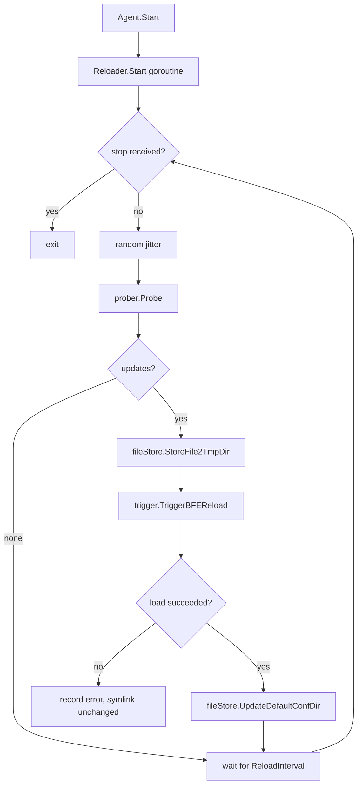
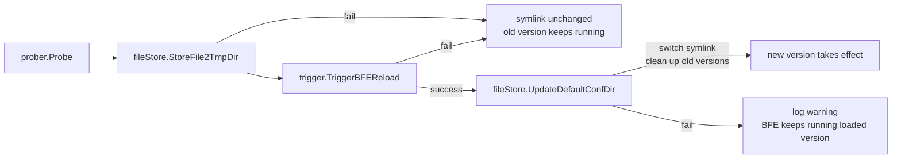

# Chapter 33: Conf Agent Implementation

## Chapter Goals

Conf Agent (configuration agent) is the configuration delivery link between the Control Plane and the Data Plane of the Rainway AI Gateway. This chapter takes the reader deep into the source-code implementation of Conf Agent: how it periodically pulls the latest configuration from the AI Gateway API, how it persists versions locally, how it triggers BFE hot reload, how it leaves room for rollback on failure, and how it cleans up outdated versions.

After reading this chapter, you will be able to:

- Explain the responsibilities of each Conf Agent directory and the module boundaries.
- Describe the lifecycle and collaboration of `Agent`, `Reloader`, `prober`, `file_store`, and `trigger`.
- Explain the applicable scenarios of the three pull modes: normal configuration tasks, multi-key JSON tasks, and extra-file tasks.
- Master the implementation details of versioned directories, symlink switching, and old-version cleanup.
- Identify the key paths and log messages involved in failure rollback.

## Conf Agent Directory Structure

The Conf Agent code lives under `conf-agent/` in the repository root. By function it can be divided into five layers: entry point, orchestration, core subsystems, configuration loading, and utility libraries.

| Directory | Responsibility |
|-----------|----------------|
| `main.go` | Program entry: parses command-line arguments, loads the TOML configuration, initializes logging, creates and starts the `Agent`. |
| `agent/` | Lifecycle container; responsible for creating, starting, and stopping all `Reloader`s. |
| `conf_reload/` | Orchestration of a single reload; contains the `Reloader` and the three sub-packages `prober`, `file_store`, and `trigger`. |
| `conf_reload/prober/` | Pulls configuration from the AI Gateway API; supports normal tasks, multi-key JSON tasks, and extra-file tasks. |
| `conf_reload/file_store/` | Local versioned storage: writes temp directories, switches symlinks, cleans up old versions, and backs up plain directories. |
| `conf_reload/trigger/` | Calls BFE's monitor port `/reload/{module}` endpoint to trigger hot reload. |
| `config/` | TOML configuration parsing and building of `ReloaderConfig`. |
| `xfile/` | Cross-platform file operations: copy, overwrite, symlink/junction. |
| `xhttp/` | HTTP request decorators and error handling. |
| `xlog/` | Structured log output. |

A typical production configuration file can be found at `conf-agent/conf/conf-agent.toml`, which defines a `Reloader` for modules such as `server_data_conf`, `mod_ai_route`, and `mod_ai_token_auth`.

## Agent and Reloader Lifecycle

### Startup Flow

The startup logic of `conf-agent/main.go` is very clear:

```go
conf, err := config.Init(filepath.Join(*confDir, *confFile))
if err != nil {
    exit(err)
}

if err := xlog.Init(conf.Logger); err != nil {
    exit(err)
}

agent, err := agent.New(conf.Reloaders)
if err != nil {
    exit(err)
}

agent.Start()
```

- `config.Init` reads the TOML, merges the `Basic` default values with each `Reloader`'s individual configuration, and produces `[]*config.ReloaderConfig`.
- `agent.New` creates a `conf_reload.Reloader` for each `ReloaderConfig`.
- `agent.Start` launches the goroutine of every `Reloader` in a blocking call and waits on `<-agent.stop`.

### Relationship Between Agent and Reloader

The `Agent` in `agent/agent.go` holds only the `stop` channel and the `reloaders` list:

```go
type Agent struct {
    stop     chan bool
    stopOnce sync.Once
    reloaders []*conf_reload.Reloader
}

func (agent *Agent) Start() {
    for _, reloader := range agent.reloaders {
        go reloader.Start()
    }
    <-agent.stop
}

func (agent *Agent) Stop() {
    agent.stopOnce.Do(func() { close(agent.stop) })
    for _, reloader := range agent.reloaders {
        reloader.Stop()
    }
}
```

Each `Reloader` runs independently in its own goroutine without interfering with the others; `Agent.Stop()` safely closes its own stop channel via `sync.Once` and then calls `Reloader.Stop()` one by one, so repeated calls are idempotent.

### Reloader Main Loop

`Reloader.Start` in `conf_reload/reloader.go` implements polling at a fixed interval:

```go
func (r *Reloader) Start() {
    // avoid multiple Reloaders hitting the API at the same time
    time.Sleep(time.Duration(rand.Int()%int(r.ReloadInterval/time.Millisecond)) * time.Millisecond)

    for {
        select {
        case <-r.stop:
            return
        default:
        }

        r.reload(xlog.NewContext(context.Background(), r.Name))

        select {
        case <-r.stop:
            return
        case <-time.After(r.ReloadInterval):
        }
    }
}
```

The random jitter at startup is intended to prevent all `Reloader`s from hitting the AI Gateway API at the same moment and causing a traffic burst.

The orchestration order of a single reload is as follows:

1. `prober.Probe(ctx)` pulls the latest configuration.
2. If there are no updates at all, the current round ends immediately.
3. `fileStore.StoreFile2TmpDir(ctx, version, files)` writes the configuration into a temporary version directory.
4. `trigger.TriggerBFEReload(ctx, version)` notifies BFE to load the new version.
5. `fileStore.UpdateDefaultConfDir(ctx, version)` switches the symlink to point to the new version.

This order is deliberate: BFE first completes the hot-reload validation through the temporary directory, and only after success does the symlink point to the new directory; if BFE fails to load, the symlink still points to the old version and the business continues unaffected.



## prober Pulling Configuration

`conf_reload/prober/prober.go` defines the unified `Task` interface:

```go
type Task interface {
    FetchConfFiles(ctx context.Context) ([]*FetchFileResult, error)
}

type FetchFileResult struct {
    Name    string
    Version string
    Content []byte
}
```

`Prober` aggregates three kinds of tasks and executes them in turn in `Probe`:

```go
func (prober *Prober) Probe(ctx context.Context) ([]*FetchFileResult, error) {
    result := []*FetchFileResult{}
    for _, p := range prober.tasks {
        fileList, err := p.FetchConfFiles(ctx)
        if err != nil {
            return nil, err
        }
        result = append(fileList, result...)
    }
    return result, nil
}
```

The three task types correspond to three configuration shapes.

### Normal Task: NormalFileTask

The normal task (Normal File Task) is used in the "one API returns one configuration file" scenario, e.g. the `ai_route.data` of `mod_ai_route`. The implementation is in `conf_reload/prober/task_normal.go`.

Workflow:

1. Read the current file content from local `ConfDir/ConfFileName` and compute the local version number.
2. Issue a GET request to `ConfAPI` with two query parameters: `version` and `bfe_cluster`.
3. If the server returns `null`, it means there is no update; return an empty list.
4. Otherwise extract the `Data` field from the response, compute the new version number, and return it.

The version computation logic `calculateVersion` parses the `Version` field in the JSON and keeps only digits via a regular expression, ensuring that version freshness can be compared by simple lexicographic order.

```go
func calculateVersion(fileContent []byte) (string, error) {
    tmp := struct {
        Version string
    }{}
    if err := json.Unmarshal(fileContent, &tmp); err != nil {
        return "", err
    }
    version := justKeepNumber(tmp.Version)
    if version == "" {
        version = "00000000000000"
    }
    return version, nil
}
```

### Multi-Key JSON Task: MultiKeyFileTask

The multi-key JSON task (Multi-Key JSON File Task) is used in the "one API returns multiple sub-configurations" scenario, e.g. one `server_data_conf` endpoint returns `host_rule.data`, `route_rule.data`, and `cluster_conf.data` at the same time. The implementation is in `conf_reload/prober/task_multip_key.go`.

The advantage of this task is reducing network round trips: configuration that originally required three API calls can now be fetched in a single request. It requires the server to pack multiple sub-configurations into one JSON object, with each sub-configuration containing its own independent `Version` field so that Conf Agent can determine whether each file needs an update.

The configuration maps top-level JSON field names to local file names via `Key2ConfFile`:

```toml
[[Reloaders.server_data_conf.MultiKeyFileTasks]]
ConfAPI         = "/inner-api/v1/configs/tls_conf/server_data_conf"
Key2ConfFile    = {"HostTable" = "host_rule.data", "RouteTable" = "route_rule.data", "ClusterConf" = "cluster_conf.data"}
```

When pulling, `MultiKeyFileTask` takes the maximum version among all mapped files as the local version, issues one API request, and then splits the result into multiple `FetchFileResult`s according to `Key2ConfFile`.

### Extra-File Task: ExtraFileTask

The extra-file task (Extra File Task) is used in the "the main configuration references extra files via JSON Path" scenario, e.g. the TLS certificate configuration `server_cert_conf.data` references certificate files and private key files. The implementation is in `conf_reload/prober/task_extra.go`.

Internally, `ExtraFileTask` reuses `NormalFileTask` to pull the main configuration, and then uses JSON Path expressions from the `ojg` library to extract extra-file paths from the main configuration:

```go
for _, pattern := range prober.config.JSONPaths {
    results := pattern.Get(jsonData)
    for _, result := range results {
        fileName := fmt.Sprintf("%v", result)
        remote, local, err := removeDirVersionInfo(fileName)
        if err != nil {
            return nil, err
        }
        remotePath2localPath[remote] = local
    }
}
```

`removeDirVersionInfo` converts a remote path of the form `{module}_{version}/xxxx` to `{module}/xxxx`; the local path drops the `{module}_{version}/` prefix, thereby guaranteeing that BFE always reads stable file names without version information.

Finally, `ExtraFileTask` returns the main configuration file plus all extra files, which are handed over to `file_store` for processing.

## file_store Versioned Storage and Symlink Switching

`conf_reload/file_store/file_store.go` is responsible for writing the configuration obtained by `prober` to disk and managing the directory view that BFE actually reads. The core data structure is:

```go
type FileStore struct {
    ConfDir          string
    CopyFiles        []string
    VersionKeepCount int
}
```

- `ConfDir`: the directory name BFE uses when reading configuration, e.g. `/home/work/bfe/conf/mod_ai_route`.
- `CopyFiles`: files or directories that must be copied from the current `ConfDir` into each new version, used to retain static configuration that cannot be obtained via the API. For example, `mod_ai_route.conf` of `mod_ai_route` is usually written by hand by operators and is not delivered from the Control Plane, so it must be listed in `CopyFiles`.
- `VersionKeepCount`: the number of version directories to keep, at least 1. When set to 2, the disk typically holds both the current version and the previous one, facilitating emergency rollback.

### Writing to the Temporary Version Directory

`StoreFile2TmpDir` always deletes the old temporary directory first, then creates the new version directory `ConfDir_{version}`, and completes the following steps in order:

1. Recursively copy `CopyFiles` from the current `ConfDir` into the temporary directory.
2. Write the file contents returned by `prober` into the temporary directory as formatted JSON.
3. Write the `.conf-agent-version` marker file, used later to identify which directories are version directories managed by Conf Agent.

```go
func (fileStore *FileStore) StoreFile2TmpDir(ctx context.Context, version string, files map[string][]byte) error {
    tmpDir := fileStore.tmpDir(version)

    os.RemoveAll(tmpDir)
    os.MkdirAll(tmpDir, os.ModePerm)

    for _, copyFile := range fileStore.CopyFiles {
        file := filepath.Join(fileStore.ConfDir, copyFile)
        xfile.FileCopyRecursive(file, tmpDir)
    }

    for fileName, fileContent := range files {
        formattedContent := formatJSONWithIndent(fileContent)
        xfile.FileOverwrite(filepath.Join(tmpDir, fileName), formattedContent)
    }

    fileStore.writeVersionMarker(tmpDir, version)
    return nil
}
```

### Switching the Symlink

`UpdateDefaultConfDir` switches `ConfDir` into a symlink pointing to the new version (a directory junction is used on Windows). It first handles the existing state of `ConfDir`:

- If it is already a symlink: remove the symlink itself and keep the old target directory.
- If it is a plain directory: rename it to `ConfDir_{timestamp}.backup` to avoid accidentally deleting the user's original configuration.
- If it is any other type of file: delete it directly.
- If it does not exist: create the new symlink directly.

It then calls `xfile.FileLink` to create the link `ConfDir -> ConfDir_{version}` and triggers cleanup of old versions.

```go
func (fileStore *FileStore) UpdateDefaultConfDir(ctx context.Context, version string) error {
    info, err := os.Lstat(fileStore.ConfDir)
    switch {
    case err == nil:
        if info.Mode()&os.ModeSymlink != 0 {
            os.Remove(fileStore.ConfDir)
        } else if info.IsDir() {
            backupDir := fileStore.ConfDir + "_" + strconv.FormatInt(time.Now().Unix(), 10) + ".backup"
            os.Rename(fileStore.ConfDir, backupDir)
        } else {
            os.RemoveAll(fileStore.ConfDir)
        }
    case os.IsNotExist(err):
    default:
        os.RemoveAll(fileStore.ConfDir)
    }

    xfile.FileLink(fileStore.tmpDir(version), fileStore.ConfDir)
    fileStore.cleanupOldVersions(ctx, fileStore.VersionKeepCount)
    return nil
}
```

### Example Version Directory Layout

After a successful switch, the directory structure on disk may look like this:

```text
/home/work/bfe/conf/
├── mod_ai_route -> mod_ai_route_20260101120003   (symlink)
├── mod_ai_route_20260101120002/
│   ├── .conf-agent-version
│   └── ai_route.data
├── mod_ai_route_20260101120003/
│   ├── .conf-agent-version
│   └── ai_route.data
└── mod_ai_route_xxxxxxxxx.backup/                 (migrated from a plain directory on first deployment)
```

## trigger Triggering BFE Hot Reload

`conf_reload/trigger/trigger.go` is responsible for calling BFE's hot-reload endpoint on the monitor port. BFE's reload URL format is:

```text
http://127.0.0.1:{BFEMonitorPort}/reload/{module}?path={confDir}_{version}[/{ReloadFile}]
```

`Trigger.TriggerBFEReload` assembles the URL above, issues a GET request to BFE, and validates the `error` field in the response JSON:

```go
func (trigger *Trigger) TriggerBFEReload(ctx context.Context, version string) error {
    confDir := trigger.c.ConfDir + "_" + version
    if trigger.c.ReloadFile != "" {
        confDir = path.Join(confDir, trigger.c.ReloadFile)
    }

    query := url.Values{}
    query.Add("path", confDir)
    api := fmt.Sprintf("%s?%s", trigger.c.BFEReloadAPI, query.Encode())

    rsp := &struct {
        Error string `json:"error"`
    }{}

    req := xhttp.NewHTTPRequest().
        Decorate(
            xhttp.HTTPRequestTimeoutOp(trigger.c.BFEReloadTimeout),
            xhttp.SimpleRequestOp(http.MethodGet, api, nil),
        ).
        Do().
        Decorate(
            xhttp.RspBodyRawReaderOp,
            xhttp.RspCode200Op,
            xhttp.RspBodyJSONReader(rsp),
        )

    if req.Err() != nil {
        return req.Err()
    }
    if rsp.Error != "" {
        return fmt.Errorf("reload fail, rsp: %s", string(req.RawContent))
    }
    return nil
}
```

Note the role of `ReloadFile`: some BFE modules (e.g. `mod_ai_route`) require `path` to point to a specific data file rather than a directory, so the configuration specifies the final file path via `ReloadFile = "ai_route.data"`.

## Cleaning Up Old Versions and Failure Rollback

### Cleaning Up Old Versions

`cleanupOldVersions` scans all directories under the parent directory of `ConfDir` that start with `ConfDir_`, contain the `.conf-agent-version` marker, and are not `.backup` directories. It sorts them by modification time, keeps the latest `VersionKeepCount` directories, and deletes the rest. The version currently pointed to by the symlink is never deleted.

```go
func (fileStore *FileStore) cleanupOldVersions(ctx context.Context, keep int) error {
    parentDir := filepath.Dir(fileStore.ConfDir)
    baseName := filepath.Base(fileStore.ConfDir)
    currentTarget, _ := filepath.EvalSymlinks(fileStore.ConfDir)

    entries, _ := os.ReadDir(parentDir)
    var versions []versionDir
    for _, entry := range entries {
        if !entry.IsDir() { continue }
        name := entry.Name()
        if !strings.HasPrefix(name, baseName+"_") { continue }
        if strings.HasSuffix(name, ".backup") { continue }

        dirPath := filepath.Join(parentDir, name)
        if _, err := os.Stat(filepath.Join(dirPath, versionMarkerFile)); err != nil {
            continue
        }

        absDirPath, _ := filepath.Abs(dirPath)
        absCurrent, _ := filepath.Abs(currentTarget)
        if absDirPath == absCurrent { continue }

        info, _ := entry.Info()
        versions = append(versions, versionDir{path: dirPath, modTime: info.ModTime()})
    }

    sort.Slice(versions, func(i, j int) bool {
        return versions[i].modTime.After(versions[j].modTime)
    })

    for i, v := range versions {
        if i < keep-1 { continue }
        os.RemoveAll(v.path)
    }
    return nil
}
```

The version marker file `.conf-agent-version` is the key to safe cleanup: it ensures Conf Agent never accidentally deletes directories manually created by the user or generated by BFE itself. The exclusion rule for `.backup` directories protects the historical configuration migrated from a plain directory on first deployment.

### Failure Rollback

Conf Agent's rollback mechanism relies on the "validate first, switch later" order:

1. `StoreFile2TmpDir` fails: the temporary directory is not ready, the symlink stays put, and BFE still reads the old version.
2. `TriggerBFEReload` fails: BFE returns an error or a non-200 status code; the function returns the error directly, `UpdateDefaultConfDir` is not executed, and the symlink still points to the old version.
3. `UpdateDefaultConfDir` fails: BFE may have loaded successfully, but the symlink was not switched; at this point BFE internally holds the temporary-directory path, so operation is unaffected, but the Conf Agent log will record `UpdateDefaultConfDir fail`, and manual investigation of filesystem permissions or disk space is needed.

Therefore, as long as `Reloader.reload` fails before `TriggerBFEReload`, the Data Plane is never affected; the symlink, as the stable entry point when BFE restarts, always points to the last version that Conf Agent confirmed as successful.



### Operations Perspective

From a troubleshooting perspective, Conf Agent logs usually let you pinpoint the failing stage directly:

- `probe fail`: check network connectivity from Conf Agent to the AI Gateway API, Token authorization, and whether the `bfe_cluster` parameter matches.
- `StoreFile2TmpDir fail`: check local disk space, whether the files specified in `CopyFiles` exist in the current `ConfDir`, and filesystem permissions.
- `TriggerBFEReload fail`: check whether the BFE monitor port is listening, whether the `BFEReloadAPI` path is correct, and whether BFE reports a format error when loading the data file.
- `UpdateDefaultConfDir fail`: usually a symlink/junction creation failure; check directory permissions and whether the target directory is in use.

When `reload succ update` appears in the logs, it means prober, file_store, trigger, and the symlink switch have all completed, and the old versions will be reclaimed in the next round of cleanup.

## Key Code Snippets

### Entry and Startup

```go
// conf-agent/main.go
conf, err := config.Init(filepath.Join(*confDir, *confFile))
agent, err := agent.New(conf.Reloaders)
agent.Start()
```

### Reloader Orchestration

```go
// conf-agent/conf_reload/reloader.go
fileList, err := r.prober.Probe(ctx)
if err != nil { /* log and return */ }

err = r.fileStore.StoreFile2TmpDir(ctx, version, files)
if err != nil { /* log and return */ }

err = r.trigger.TriggerBFEReload(ctx, version)
if err != nil { /* log and return */ }

err = r.fileStore.UpdateDefaultConfDir(ctx, version)
if err != nil { /* log and return */ }
```

### Normal Task Version Negotiation

```go
// conf-agent/conf_reload/prober/task_normal.go
params := url.Values{}
params.Add("version", localVersion)
params.Add("bfe_cluster", config.BFECluster)
requestURL := apiURL + "?" + params.Encode()
```

### Cross-Platform Symlink/Junction

```go
// conf-agent/xfile/file.go
if runtime.GOOS == "windows" && targetInfo.IsDir() {
    cmd := exec.Command("cmd", "/c", "mklink", "/J", absLinkName, absTarget)
    // ...
} else {
    relTarget, _ := filepath.Rel(filepath.Dir(linkName), target)
    os.Symlink(relTarget, linkName)
}
```

## Chapter Summary

Conf Agent is the key component that enables the Rainway AI Gateway to "deliver from the Control Plane and load on the Data Plane without interruption." This chapter focused on its source-code implementation and covered the following:

- **Directory and module division**: `main.go`, `agent`, and `conf_reload` each have their own responsibilities; `prober`, `file_store`, and `trigger` complete the three steps of pulling, storing, and triggering.
- **Lifecycle**: `Agent` manages multiple `Reloader` goroutines; each `Reloader` polls at `ReloadInterval`, with random jitter added at startup to avoid thundering herd.
- **Configuration pulling**: normal tasks pull one-to-one; multi-key JSON tasks split multiple files out of one large JSON; extra-file tasks parse and download extra resources such as certificates via JSON Path.
- **Versioned storage**: a `ConfDir_{version}` temporary directory is created each time and a `.conf-agent-version` marker is written; at switch time a symlink/junction atomically points to the new version.
- **Hot-reload triggering**: `trigger` calls `/reload/{module}` on BFE's monitor port, passing the temporary-directory path in the URL.
- **Cleanup and rollback**: `VersionKeepCount` controls how many versions are kept; failures before the symlink switch do not affect the Data Plane, while a symlink-switch failure keeps BFE running the loaded version and records a log.

Understanding Conf Agent's implementation helps operators troubleshoot problems such as "configuration not taking effect," "rollback failure," and "version directory bloat," and also provides a clear modification path for extending new configuration task types.

## References

- `conf-agent/AGENTS.md`
- `conf-agent/main.go`
- `conf-agent/agent/agent.go`
- `conf-agent/conf_reload/reloader.go`
- `conf-agent/conf_reload/prober/prober.go`
- `conf-agent/conf_reload/prober/task_normal.go`
- `conf-agent/conf_reload/prober/task_multip_key.go`
- `conf-agent/conf_reload/prober/task_extra.go`
- `conf-agent/conf_reload/file_store/file_store.go`
- `conf-agent/conf_reload/trigger/trigger.go`
- `conf-agent/config/config.go`
- `conf-agent/config/config_file.go`
- `conf-agent/xfile/file.go`
- `conf-agent/conf/conf-agent.toml`
- `conf-agent/conf_reload/file_store/file_store_test.go`
