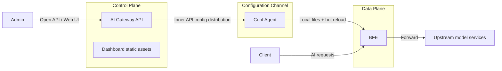
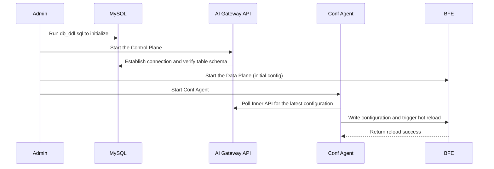

# Chapter 17: Installation and Deployment

## Chapter Goals

This chapter covers the production-ready installation and deployment of the Rainway AI Gateway. After reading this chapter, you will be able to:

- Prepare the hardware, software, and dependency environment required to run AI Gateway.
- Compile executable binaries from source and start them locally.
- Initialize a MySQL or SQLite database, configure the Redis dependency, and set the minimal Control Plane parameters needed to run.
- Build Docker images and run AI Gateway API in a container environment.
- Deploy the Control Plane and Data Plane components in a Kubernetes cluster.
- Understand the startup order and collaboration between AI Gateway API, BFE, and Conf Agent.
- Troubleshoot common deployment and startup issues.

## Core Concepts

The Rainway AI Gateway adopts a layered **Control Plane + Data Plane** architecture:

- **AI Gateway API**: the core of the Control Plane, responsible for creating, storing, and distributing policies and configurations. The corresponding repository is `rainway-ai-gateway/ai-gateway-api`.
- **BFE**: the Data Plane forwarding engine, responsible for routing, authentication, rate limiting, and forwarding of AI traffic. The corresponding repository is `bfenetworks/bfe`.
- **Conf Agent**: the configuration agent, which communicates with the Control Plane and triggers hot reload of BFE configurations. The corresponding repository is `bfenetworks/conf-agent`.
- **Dashboard**: the visual management console, usually served as static assets mounted into AI Gateway API.
- **Service Controller**: a Kubernetes service discovery component, deployed optionally.



Figure 16-1: Relationship between the AI Gateway Control Plane, configuration channel, and Data Plane

## Environment Requirements

Before deploying AI Gateway, verify that the environment meets the following minimum requirements. It is recommended to deploy Control Plane components and Data Plane components on different hosts or in different container groups, so they can be scaled independently and failures are isolated.

### Control Plane AI Gateway API

| Dependency | Version | Description |
|---|---|---|
| Go | 1.22 or higher | Required for compiling from source |
| MySQL | 8.0 | Recommended for production; SQLite is also supported |
| Redis | 6.2 | Runtime state such as quota balances, rate limit counters, and session cache |

MySQL is used to persistently store core data such as API configurations, tenants, routes, certificates, and API-Keys. Redis is a critical runtime dependency of the AI Gateway: high-frequency state such as quota balances, RPM/TPM rate limit counters, and session cache are all read from and written to Redis directly. In single-machine validation scenarios, SQLite can be used in place of MySQL, but SQLite does not support high-concurrency writes and must not be used in production; Redis should not be replaced with SQLite.

### Data Plane BFE

| Dependency | Version | Description |
|---|---|---|
| Go | 1.22 or higher | Required for compiling from source |
| Linux / macOS / Windows | 64-bit | BFE runs on multiple platforms |

As a Data Plane component, BFE is sensitive to network throughput and latency. For production deployment, it is recommended to allocate dedicated CPU and memory resources and to enable kernel parameter tuning, such as adjusting `net.core.somaxconn`, `tcp_tw_reuse`, and so on.

### Configuration Agent Conf Agent

| Dependency | Version | Description |
|---|---|---|
| Go | 1.22 or higher | Required for compiling from source |
| Co-located with BFE | — | Conf Agent must write configurations to the machine where BFE runs |

Conf Agent is the configuration channel between the Control Plane and the Data Plane. It periodically pulls the latest configuration from AI Gateway API, writes the configuration to a local versioned directory, and calls BFE's monitor port to trigger a hot reload. Therefore, Conf Agent must run on the same machine or in the same Pod as BFE so that they can share the configuration directory.

## Compiling from Source and Starting the Binary

### Obtaining the Source Code

```bash
git clone https://github.com/rainway-ai-gateway/ai-gateway-api.git
cd ai-gateway-api
```

### Compiling

The project uses a Makefile to manage the build process. Running `make` automatically downloads dependencies, compiles the binary, and packages everything into the `output/` directory:

```bash
make
```

The key targets defined in `ai-gateway-api/Makefile` are:

- `make build`: compiles the `./ai-gateway-api` binary.
- `make package`: copies `conf/`, `static/`, `db_ddl.sql`, etc. into `output/`.
- `make docker`: builds a local container image.
- `make docker-push REGISTRY=...`: builds multi-architecture images and pushes them.

Before the first build, verify that the Go environment is set up correctly and that `GOPROXY` can reach public module repositories. If the network is restricted, configure a mirror:

```bash
export GOPROXY=https://goproxy.cn,direct
export GO111MODULE=on
```

After compilation, the `output/` directory has the following structure:

```text
output/
├── ai-gateway-api      # Executable
├── conf/               # Configuration files
├── static/             # Dashboard static assets
├── db_ddl.sql          # MySQL initialization script
└── db_ddl_sqlite.sql   # SQLite initialization script
```

### Starting the Service

Enter the `output/` directory and run:

```bash
./ai-gateway-api -c ./conf -sc ai_gateway_api.toml -l ./log
```

Startup parameter description:

- `-c`: root directory of configuration files, corresponding to `ai-gateway-api/conf/`.
- `-sc`: name of the main configuration file, default `ai_gateway_api.toml`.
- `-l`: log output directory.

Default listening ports:

- API service port: `8183`
- Monitor port: `8284`

After a successful startup, you can verify service health with:

```bash
curl http://localhost:8284/monitor/health
```

Visiting `http://localhost:8183` opens the Dashboard; the default username and password are both `admin`. Change the password immediately after the first login, and avoid running with default credentials in production.

## Database Initialization

AI Gateway API uses a relational database to store configurations. It currently supports two backends: MySQL 8 and SQLite.

### MySQL Initialization

1. Install MySQL 8 and create a database. It is recommended to set the character set to `utf8mb4` to support multilingual characters and emoji:

```sql
CREATE DATABASE IF NOT EXISTS open_bfe
  DEFAULT CHARACTER SET utf8mb4
  DEFAULT COLLATE utf8mb4_unicode_ci;
```

2. Run `db_ddl.sql` in the project root:

```bash
mysql -u{user} -p{password} < db_ddl.sql
```

3. Fill in the database connection information in the main configuration `conf/ai_gateway_api.toml`:

```toml
[Databases.bfe_db]
DBName               = "open_bfe"
Addr                 = "127.0.0.1:3306"
Net                  = "tcp"
User                 = "{user}"
Passwd               = "{password}"
MultiStatements      = true
MaxAllowedPacket     = 67108864
ParseTime            = true
AllowNativePasswords = true
Driver               = "mysql"
MaxOpenConns         = 100
MaxIdleConns         = 100
ConnMaxIdleTimeInMs  = 50000
ConnMaxLifetimeInMs  = 50000
```

For production, it is recommended to create a dedicated database account for AI Gateway and restrict the source IP addresses allowed to connect.

### SQLite Initialization

For testing or single-machine environments, you can use SQLite and skip installing MySQL. Run the SQLite initialization script:

```bash
sqlite3 open_bfe.db < db_ddl_sqlite.sql
```

Then adjust the database driver and address in `ai_gateway_api.toml`:

```toml
[Databases.bfe_db]
DBName = "open_bfe"
Addr   = "./open_bfe.db"
Driver = "sqlite3"
```

SQLite is suitable for functional validation and development debugging; it is not recommended for high-concurrency production scenarios.

## Configuration File Description and Minimal Runnable Configuration

The main configuration file of AI Gateway API is `conf/ai_gateway_api.toml`, specified by the `-sc` startup parameter. The configuration root directory must also contain `nav_tree.toml` and the `i18n/` directory.

### Minimal Runnable Configuration

Only the database username and password need to be changed to start:

```toml
[Server]
ServerPort          = 8183
GracefulTimeoutInMs = 5000
MonitorPort         = 8284

[Loggers.access]
LogName     = "access"
LogLevel    = "INFO"
RotateWhen  = "MIDNIGHT"
BackupCount = 1
Format      = "[%D %T] [%L] [%S] %M"
StdOut      = false

[Databases.bfe_db]
DBName               = "open_bfe"
Addr                 = "127.0.0.1:3306"
Net                  = "tcp"
User                 = "root"
Passwd               = "your_password"
MultiStatements      = true
MaxAllowedPacket     = 67108864
ParseTime            = true
AllowNativePasswords = true
Driver               = "mysql"
MaxOpenConns         = 100
MaxIdleConns         = 100
ConnMaxIdleTimeInMs  = 50000
ConnMaxLifetimeInMs  = 50000

[Depends]
NavTreeFile = "${conf_dir}/nav_tree.toml"
I18nDir     = "${conf_dir}/i18n"

[RunTime]
SkipTokenValidate  = false
RecordSQL          = false
SessionExpireInDay = 10
StaticFilePath     = "./static"
Debug              = false

[RedisConf]
# Redis logical name, resolved to the real address in name_conf.data
Bns            = "example.redis.cluster"
ConnectTimeout = 10
ReadTimeout    = 5
WriteTimeout   = 5
MaxIdle        = 10
```

### Key Configuration Items

| Section | Key Items | Description |
|---|---|---|
| `[Server]` | `ServerPort` | API service port, default 8183 |
| `[Server]` | `MonitorPort` | Monitor port, default 8284 |
| `[Loggers.access]` | `LogLevel` | Access log level |
| `[Databases.bfe_db]` | `Addr`, `User`, `Passwd` | Database connection |
| `[RedisConf]` | `Bns` | Redis logical name, resolved to the real address by `name_conf.data` |
| `[RedisConf]` | `ConnectTimeout`, `ReadTimeout`, `WriteTimeout` | Redis connection and read/write timeouts (milliseconds) |
| `[Depends]` | `NavTreeFile`, `I18nDir` | Navigation and internationalization paths, supporting the `${conf_dir}` variable |
| `[RunTime]` | `StaticFilePath` | Dashboard static assets path |
| `[RunTime]` | `SkipTokenValidate` | For debugging only; must be `false` in production |

In actual deployments, it is recommended to manage configuration files under version control, but inject sensitive information such as database passwords via environment variables or Secrets instead of writing plaintext passwords directly into configuration files. For detailed parameter descriptions, refer to `ai-gateway-api/docs/zh_cn/config_param.md`.

### Redis Address Resolution

`[RedisConf].Bns` holds a Redis logical name; the real address must be configured in `conf/name_conf.data`. This file uses the BFE naming service format:

```json
{
    "Version": "init version",
    "Config": {
        "example.redis.cluster": [
            {
                "Host": "127.0.0.1",
                "Port": 6379,
                "Weight": 10
            }
        ]
    }
}
```

At startup, AI Gateway API looks up the host list corresponding to `Bns` in `name_conf.data` and establishes Redis connections. If Redis runs in cluster or sentinel mode, you can configure multiple addresses here with weights; for production, it is recommended to use a Redis password together with TLS connections, and to restrict access sources via network policies.

## Docker Image Build and Container Deployment

### Building the Image

The project root already contains a Dockerfile, and the image can be built directly via the Makefile:

```bash
make docker
```

After the build, check the local images:

```bash
docker images | grep ai-gateway-api
```

The default image names are `ai-gateway-api:v{Version}` and `ai-gateway-api:latest`; the version number is read from `version/version.go`.

To disable the build cache or specify a Dashboard version:

```bash
make docker NO_CACHE=true DASHBOARD_VERSION=v0.0.3
```

### Running a Single Container

Mount the configuration files, database initialization script, and log directory into the container:

```bash
docker run -d \
  --name ai-gateway-api \
  -p 8183:8183 \
  -p 8284:8284 \
  -v $(pwd)/conf:/app/conf \
  -v $(pwd)/log:/app/log \
  -v $(pwd)/static:/app/static \
  ai-gateway-api:latest \
  ./ai-gateway-api -c ./conf -sc ai_gateway_api.toml -l ./log
```

If MySQL is not in the container network, make sure the container can reach the database address, or use a Docker network / host network mode. For production, it is recommended to use a custom Docker network and place AI Gateway API together with MySQL and Redis in the same network namespace for service discovery and access control.

## Kubernetes Deployment Example

The following example shows how to deploy AI Gateway API in Kubernetes. The example assumes MySQL and Redis are already available externally or in the same cluster.

### ConfigMap

Mount `ai_gateway_api.toml` as a ConfigMap:

```yaml
apiVersion: v1
kind: ConfigMap
metadata:
  name: ai-gateway-api-config
data:
  ai_gateway_api.toml: |
    [Server]
    ServerPort          = 8183
    GracefulTimeoutInMs = 5000
    MonitorPort         = 8284

    [Loggers.access]
    LogName     = "access"
    LogLevel    = "INFO"
    RotateWhen  = "MIDNIGHT"
    BackupCount = 1
    Format      = "[%D %T] [%L] [%S] %M"
    StdOut      = false

    [Databases.bfe_db]
    DBName               = "open_bfe"
    Addr                 = "mysql:3306"
    Net                  = "tcp"
    User                 = "root"
    Passwd               = "$(MYSQL_PASSWORD)"
    MultiStatements      = true
    MaxAllowedPacket     = 67108864
    ParseTime            = true
    AllowNativePasswords = true
    Driver               = "mysql"
    MaxOpenConns         = 100
    MaxIdleConns         = 100
    ConnMaxIdleTimeInMs  = 50000
    ConnMaxLifetimeInMs  = 50000

    [Depends]
    NavTreeFile = "${conf_dir}/nav_tree.toml"
    I18nDir     = "${conf_dir}/i18n"

    [RunTime]
    SkipTokenValidate  = false
    RecordSQL          = false
    SessionExpireInDay = 10
    StaticFilePath     = "./static"
    Debug              = false

    [RedisConf]
    Bns            = "example.redis.cluster"
    ConnectTimeout = 10
    ReadTimeout    = 5
    WriteTimeout   = 5
    MaxIdle        = 10
```

You also need to mount `name_conf.data` in the ConfigMap, resolving `example.redis.cluster` to the actual Redis address.

### Deployment

```yaml
apiVersion: apps/v1
kind: Deployment
metadata:
  name: ai-gateway-api
spec:
  replicas: 2
  selector:
    matchLabels:
      app: ai-gateway-api
  template:
    metadata:
      labels:
        app: ai-gateway-api
    spec:
      containers:
        - name: ai-gateway-api
          image: ai-gateway-api:latest
          imagePullPolicy: IfNotPresent
          ports:
            - containerPort: 8183
            - containerPort: 8284
          env:
            - name: MYSQL_PASSWORD
              valueFrom:
                secretKeyRef:
                  name: ai-gateway-api-secret
                  key: mysql-password
          volumeMounts:
            - name: config
              mountPath: /app/conf
          command:
            - ./ai-gateway-api
            - -c
            - ./conf
            - -sc
            - ai_gateway_api.toml
            - -l
            - ./log
      volumes:
        - name: config
          configMap:
            name: ai-gateway-api-config
```

### Service

```yaml
apiVersion: v1
kind: Service
metadata:
  name: ai-gateway-api
spec:
  selector:
    app: ai-gateway-api
  ports:
    - name: api
      port: 8183
      targetPort: 8183
    - name: monitor
      port: 8284
      targetPort: 8284
```

### DaemonSet Example for BFE and Conf Agent

BFE and Conf Agent must be deployed on the same machine. The following DaemonSet example runs two containers in one Pod, sharing the configuration directory:

```yaml
apiVersion: apps/v1
kind: DaemonSet
metadata:
  name: bfe-conf-agent
spec:
  selector:
    matchLabels:
      app: bfe-conf-agent
  template:
    metadata:
      labels:
        app: bfe-conf-agent
    spec:
      containers:
        - name: bfe
          image: bfe:latest
          ports:
            - containerPort: 8080
            - containerPort: 8421
          volumeMounts:
            - name: bfe-conf
              mountPath: /bfe/conf
        - name: conf-agent
          image: conf-agent:latest
          volumeMounts:
            - name: bfe-conf
              mountPath: /bfe/conf
          command:
            - ./conf-agent
            - -c
            - ./conf
            - -cf
            - conf-agent.toml
      volumes:
        - name: bfe-conf
          emptyDir: {}
```

In a real production environment, the API Server address in `conf-agent.toml` should point to the cluster DNS of the `ai-gateway-api` Service: `http://ai-gateway-api:8183`.

When deploying in Kubernetes, also note the following:

- Use Secrets to manage sensitive information such as database and Redis passwords; do not write them directly into ConfigMaps.
- Configure LivenessProbe and ReadinessProbe for AI Gateway API; it is recommended to reuse the `8284` monitor port for monitoring.
- As the Data Plane, BFE is usually deployed as a DaemonSet on every edge node, or as a Deployment exposed via a load balancer.
- When Conf Agent and BFE are deployed in the same Pod, an `emptyDir` volume is sufficient to share the configuration directory; if you need to persist historical versions, use `hostPath` or a PVC instead.

## Multi-Component Startup Order

A complete production deployment involves three core components: AI Gateway API, BFE, and Conf Agent. The recommended startup order is:



Figure 16-2: Multi-component startup order

### Startup Order Notes

1. **Initialize the database**: run `db_ddl.sql` first to ensure the table schema is ready. The database is the source of state for the Control Plane and must be initialized before AI Gateway API starts.
2. **Start AI Gateway API**: wait for the database connection to succeed; the API service and monitor service then begin listening. At this point you can use the Dashboard or Open API to create configurations such as routes and API-Keys.
3. **Start BFE**: BFE can start with a fallback configuration, so that a configuration is available before Conf Agent pulls one. The fallback configuration should include the minimum listening ports and product line definitions.
4. **Start Conf Agent**: Conf Agent polls AI Gateway API for configurations; when it detects a new version, it writes the configuration locally and triggers a BFE hot reload. After the hot reload completes, BFE processes traffic with the latest configuration distributed by the Control Plane.

In production, it is recommended to deploy AI Gateway API with multiple replicas and place a load balancer in front of it. BFE and Conf Agent are scaled horizontally according to the number of edge nodes.

### Configuration Directory Conventions

- AI Gateway API configuration directory: `/app/conf`, containing `ai_gateway_api.toml`, `nav_tree.toml`, and `i18n/`.
- BFE configuration directory: usually `/bfe/conf`.
- Conf Agent configuration directory: on the same machine as BFE, e.g. `/bfe/conf-agent/conf`.

Conf Agent startup command example:

```bash
./conf-agent -c ./conf -cf conf-agent.toml
```

The Conf Agent configuration file must specify parameters such as the AI Gateway API address, the BFE configuration directory, and the BFE monitor port. For details, refer to `conf-agent/docs/zh_cn/config/config.md`.

## Production Deployment Checklist

Before bringing the system online, it is recommended to confirm each item in the following checklist:

- [ ] The database has been initialized with character set `utf8mb4`, and a dedicated service account has been created.
- [ ] The database password in `ai_gateway_api.toml` has been replaced with a strong password and is not committed to the code repository.
- [ ] Redis has an access password enabled, or access sources are restricted via network policies.
- [ ] AI Gateway API runs as a non-root user, and log directory permissions are correct.
- [ ] The default Dashboard password `admin/admin` has been changed.
- [ ] `SkipTokenValidate` in `[RunTime]` is `false`.
- [ ] BFE and Conf Agent are deployed on the same machine, and the configuration directory is readable and writable.
- [ ] Production TLS certificates and keys are configured, and test certificates have been replaced.
- [ ] Monitoring and alerting are integrated with the `8284` port metrics or a log collection system.
- [ ] A rollback plan is in place: keep the previous version of the BFE configuration directory so a manual rollback is possible if needed.

## Troubleshooting Common Deployment Issues

### 1. Database Connection Failure at Startup

**Symptom**: the log shows `dial tcp 127.0.0.1:3306: connect: connection refused`.

**Troubleshooting steps**:

- Confirm MySQL is running and listening on port `3306`.
- Check that `Addr`, `User`, and `Passwd` in `ai_gateway_api.toml` are correct.
- Confirm network reachability from the AI Gateway API process to MySQL (firewall, security group, container network).
- Test the connection from the command line:

```bash
mysql -u{user} -p{password} -h127.0.0.1 -P3306 -e "USE open_bfe; SHOW TABLES;"
```

### 2. Dashboard Returns 404

**Symptom**: visiting `http://localhost:8183` returns 404.

**Troubleshooting steps**:

- Confirm the `static/` directory exists and contains the Dashboard build artifacts.
- Check that `StaticFilePath` in `[RunTime]` points to the correct static assets directory.
- If using Docker/Kubernetes, confirm `static/` is mounted correctly into the container.

### 3. Conf Agent Cannot Fetch Configuration

**Symptom**: Conf Agent logs show `http error`, or `config version not changed` while BFE has not taken effect.

**Troubleshooting steps**:

- Confirm that the API Server address configured in Conf Agent is reachable.
- Check that the AI Gateway API monitor port and Inner API routes are working normally.
- Check whether the Conf Agent polling interval and timeout settings are reasonable.
- Confirm that the BFE monitor port (default 8421) is accessible to Conf Agent.

### 4. BFE Hot Reload Fails on TLS Configuration

**Symptom**: when Conf Agent triggers a reload, an association check failure is reported for `tls_rule_conf.data`.

**Cause**: by default, `tls_rule_conf.data` depends on an `example.org` certificate. If that certificate is not configured, an association error occurs.

**Solution**:

In `tls_rule_conf.data`, set `Config` to an empty object:

```json
{
    "Version": "12",
    "DefaultNextProtos": ["http/1.1"],
    "Config": {}
}
```

For more details, refer to the section "BFE configuration files that may require manual maintenance" in `ai-gateway-api/docs/zh_cn/deploy.md`.

### 5. Startup Failure Due to Insufficient Permissions

**Symptom**: unable to write to the log directory or configuration directory.

**Troubleshooting steps**:

- Make sure the log directory specified by `-l` exists and the process has write permission.
- When the container runs as a non-root user, confirm the UID/GID of mounted directories match.
- Adjust directory permissions with `chmod` or `chown`:

```bash
mkdir -p log conf static
chmod -R 755 log conf static
```

### 6. Port Conflict

**Symptom**: startup reports `bind: address already in use`.

**Troubleshooting steps**:

- Use `netstat` or `ss` to check whether `8183` and `8284` are occupied by other processes.
- If you need to run multiple instances simultaneously, modify `ServerPort` and `MonitorPort` in `ai_gateway_api.toml`.

### 7. Redis Connection Failure

**Symptom**: after login, session anomalies are reported, quota balances are not updated, rate limit policies do not take effect, or Redis connection errors appear in the logs.

**Troubleshooting steps**:

- Check that the Redis service is running and listening on the correct port.
- Confirm the `[RedisConf]` configuration in `ai_gateway_api.toml` is correct, especially the `Bns` logical name.
- Confirm that `conf/name_conf.data` contains the address mapping for `Bns`, and that `Host` / `Port` match the actual Redis instance.
- Test Redis connectivity:

```bash
redis-cli -h 127.0.0.1 -p 6379 ping
```

## Chapter Summary

This chapter systematically covered the installation and deployment of the Rainway AI Gateway:

- The Control Plane depends on Go 1.22, MySQL 8, and Redis 6.2; Redis, used for quota balances, rate limit counters, and session cache, is a critical runtime dependency. The Data Plane BFE and Conf Agent must be deployed on the same machine.
- Running `make` completes the source compilation and packaging of AI Gateway API.
- The database supports MySQL and SQLite; MySQL is recommended for production with the character set `utf8mb4`.
- The minimal runnable configuration requires adjusting the database connection and the Redis logical name; the real Redis address is resolved via `name_conf.data`.
- Container images can be built with `make docker`, and cluster deployment uses Kubernetes Deployments, Services, and DaemonSets.
- The multi-component startup order is: database initialization → AI Gateway API → BFE → Conf Agent, ensuring the Data Plane promptly receives the latest configuration distributed by the Control Plane.
- Common deployment issues mainly involve database connections, static asset mounting, Conf Agent communication, TLS configuration association checks, port conflicts, and Redis connection failures.
- Before going live, complete the production deployment checklist, focusing on password security, permission configuration, and the rollback plan.

## References

This chapter references the following project documentation and code:

- `ai-gateway-api/README.md`: project overview, quick start, and containerized deployment entry point.
- `ai-gateway-api/docs/zh_cn/deploy.md`: deployment steps for the BFE Control Plane components and TLS configuration notes.
- `ai-gateway-api/docs/zh_cn/config_param.md`: complete configuration parameter description for `ai_gateway_api.toml`.
- `ai-gateway-api/Makefile`: build, packaging, Docker image build, and push targets.
- `conf-agent/AGENTS.md`: Conf Agent architecture, build method, and local startup commands.
- `conf-agent/docs/zh_cn/config/config.md`: detailed description of the Conf Agent configuration file.
- [BFE Installation Official Documentation](https://www.bfe-networks.net/en_us/installation/install/): guide for standalone deployment of the BFE Data Plane.
- [ai-gateway-demo deployment example repository](https://github.com/rainway-ai-gateway/ai-gateway-demo): complete Kubernetes and Docker Compose examples.
