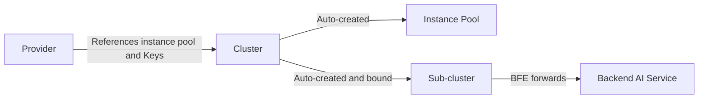

# Chapter 20: Cluster and Route Configuration

## Chapter Goals

Through this chapter, readers will master the core configuration methods for **Cluster** and **AI route rules** in the Rainway AI Gateway. Specifically: understanding the relationship between Cluster and Provider and creating one independently; configuring forwarding policies, model mappings, key policies, and session affinity; configuring three levels of route rules — Global, Entity, and API-Key; understanding route priorities and the Fallback mechanism; using the expression validation tool to troubleshoot condition syntax issues; and verifying that routing takes effect with real requests.

## Cluster Concepts and Creation Steps

### What Is a Cluster

In the Rainway AI Gateway, a **Cluster** is the logical backend unit to which the Data Plane BFE forwards traffic. A Cluster references an existing **Provider**, inheriting its `instance_pool` (backend instance pool) and `keys` (plaintext API-Keys), and on top of that declares the list of models the Cluster can serve, model mappings, key selection policies, and more.



Unlike a Provider, a Cluster addresses "how to use a given Provider":

- A Provider answers "who the backend is, which models it has, and which keys it has".
- A Cluster answers "which models this request may use, how to map model names, how to select among multiple keys with weights, and whether session affinity is enabled".

### Preparation Before Creation

Before creating a Cluster, confirm that the following prerequisites are met:

1. A product line (Product) and its corresponding Provider have been created, and the Provider has at least one backend instance and one model configured.
2. If the Cluster needs to use API-Keys, the keys must first be defined in the Provider's `keys`, and each key's `name` recorded.
3. It is clear which models this Cluster should expose externally, and whether advanced capabilities such as model mapping or multi-key traffic splitting are needed.

Once preparation is complete, configuration can be submitted either through the Dashboard visual wizard or directly via the OpenAPI.

### Steps to Create a Cluster

Before creating a Cluster, the corresponding Provider must already exist, and the `llm_config.provider` reference must be present. The typical creation flow is as follows:

1. Submit the Cluster configuration via `POST /clusters`.
2. The Control Plane validates that `name` is globally unique, `provider` exists, `models` is a subset of the Provider's models, and `keys` reference keys already defined in the Provider.
3. The system automatically:
   - Creates an instance pool named `{product_name}.{cluster_name}`;
   - Creates a sub-cluster named `{cluster_name}`;
   - Binds the sub-cluster to the Cluster.
4. `llm_config.model_table` is generated automatically by InnerAPI based on the Provider information and delivered to BFE; it is not exposed in the OpenAPI.

Example creation request:

```json
{
    "name": "cluster-deepseek-prod",
    "description": "Production DeepSeek cluster",
    "basic": {
        "protocol": "https",
        "connection": {
            "max_idle_conn_per_rs": 0,
            "cancel_on_client_close": false
        },
        "retries": {
            "max_retry_in_cluster": 2
        },
        "buffers": {
            "req_write_buffer_size": 512
        },
        "timeouts": {
            "timeout_conn_serv": 50000,
            "timeout_response_header": 50000,
            "timeout_readbody_client": 30000,
            "timeout_read_client_again": 30000,
            "timeout_write_client": 60000
        }
    },
    "llm_config": {
        "models": ["deepseek-chat", "deepseek-coder"],
        "model_mappings": [
            {"source_model": "gpt-4", "target_model": "deepseek-chat"}
        ],
        "keys": [
            {"name": "key-prod-01", "weight": 70},
            {"name": "key-prod-02", "weight": 30}
        ],
        "key_policy": {
            "strategy": "weighted_random",
            "max_retries": 3,
            "retry_backoff_initial": 500,
            "retry_backoff_max": 5000
        },
        "provider": "deepseek"
    }
}
```

> Note: after a Cluster is created, the instance pool and sub-cluster are maintained automatically by the system. **Do not modify** `instance_pool` directly; to adjust backend instances, update the corresponding Provider.

### Updating and Deleting a Cluster

To update a Cluster, use `PATCH /clusters/{cluster_name}`. Fields that can be modified include `description`, `basic`, `sticky_sessions`, `passive_health_check`, and `llm_config`. Pay special attention to the following:

- `name` cannot be modified;
- `llm_config.keys` is treated as a **full replacement** — the caller must pass the complete list of key references;
- `sub_clusters` and `scheduler` are generated automatically by the system and do not support manual modification.

When deleting a Cluster, the system first checks whether the Cluster is referenced by AI route rules at the Global, Entity, or API-Key level. If references exist, the deletion fails; the references or the corresponding route rules must be removed first. After passing the reference check, the system cascades: unbinds the sub-cluster, deletes the sub-cluster, deletes the instance pool, and finally deletes the Cluster.

## Configuring Forwarding Policies, Model Mappings, Key Policies, and Session Affinity

### Basic Forwarding Policy

The `basic` section controls the transport-layer behavior of BFE's interaction with the backend. Common fields are as follows:

| Field | Meaning | Typical Value |
|------|------|--------|
| `protocol` | Backend protocol | `http` / `https` |
| `connection.max_idle_conn_per_rs` | Idle persistent connections per instance | `0` (default, recommended for AI scenarios) |
| `connection.cancel_on_client_close` | Whether to cascade-close the backend connection when the client disconnects | `false` |
| `retries.max_retry_in_cluster` | Number of retries after a forwarding failure within the same cluster | `2` |
| `buffers.req_write_buffer_size` | Request write buffer size | `512` |
| `timeouts.timeout_conn_serv` | Backend connection timeout (ms) | `50000` |
| `timeouts.timeout_response_header` | Response header read timeout (ms) | `50000` |
| `timeouts.timeout_readbody_client` | Request body read timeout (ms) | `30000` |
| `timeouts.timeout_write_client` | Response write timeout (ms) | `60000` |

### Model Mapping

`llm_config.model_mappings` maps the model name in a user request to the model name actually used by the backend. For example, mapping the user's familiar `gpt-4` to the backend's `deepseek-chat`:

```json
{
    "source_model": "gpt-4",
    "target_model": "deepseek-chat"
}
```

Rules:

- `source_model` must not be duplicated within the same mapping table;
- The mapped `target_model` must belong to the Cluster's `models` list and must exist in the Provider's model list.

### Key Policy

`llm_config.keys` references keys defined in the Provider and assigns weights to them, enabling weighted random selection among multiple keys:

```json
{
    "keys": [
        {"name": "key-prod-01", "weight": 70},
        {"name": "key-prod-02", "weight": 30}
    ]
}
```

`key_policy` controls the key selection algorithm and failure retry behavior:

| Field | Meaning |
|------|------|
| `strategy` | Selection algorithm; currently only `weighted_random` is supported |
| `max_retries` | Total additional retries at the key level for the current request |
| `retry_backoff_initial` | Backoff time for the first retry (ms) |
| `retry_backoff_max` | Backoff time upper limit (ms) |

`key_affinity` implements session-level key affinity based on Redis: the same `ClientKeyId` keeps hitting the same key within a period of time (`ttl`, default 600 seconds); if `penalty_enable` is on, keys that recently returned `429/401/403` are skipped.

### Session Affinity

`sticky_sessions` controls whether a client is bound long-term to the same backend instance. Common strategies:

- `CLIENT_IP_ONLY`: hash based on client IP (default).
- `CLIENT_ID_ONLY`: hash based on a specified header, which must be set in `hash_header`, e.g. `X-Client-Id` or `Cookie:session_id`.
- `CLIENT_ID_PREFERED`: prefer the header, falling back to IP when absent.

AI scenarios usually do not need session persistence; leaving it disabled by default is fine.

## Configuring Global / Entity / API-Key Level Route Rules

AI route rules are stored uniformly in the `route_rules` table, targeting three levels:

| Level | Type | Owner | Management Entry |
|------|------|--------|----------|
| Global | `global` | `global` | `PUT /global-route-rules` |
| Entity | `entity` | `entity_id` | Embedded in Entity create/update APIs |
| API-Key | `apikey` | `api_key_id` | Embedded in API-Key create/update APIs |

Each rule contains:

- `name`: rule name, unique within the same route table;
- `Cond`: BFE condition expression;
- `targets`: list of target Cluster + model + weight; the weights must sum to 100;
- `fallbacks`: optional list of Fallback targets.

AI route rules work after API-Key authentication and decide which target model and backend Cluster a request is ultimately forwarded to. It is worth noting that in AI gateway mode, BFE processes requests through the dedicated `ServeHTTPForAI()` path; `findProduct()` is only used for product line identification and configuration context loading, and the traditional product-level BFE route rules (`route_basic_rules` / `route_advance_rules` / `route_default_rules`) do not participate in Cluster selection for AI requests.

### Global Route Table

The Global Route Table is the global catch-all rule; every API-Key is ultimately bound to it. During system initialization, a default record is created automatically (`enabled=false`, `rules=[]`); it should be configured to enabled state before first use. A good global catch-all rule typically uses `default_t()` as the condition and directs all unmatched traffic to the default Cluster.

```json
{
    "enabled": true,
    "rules": [
        {
            "name": "global-default",
            "cond": "default_t()",
            "targets": [
                {"cluster_name": "cluster-global", "model": "", "weight": 100}
            ],
            "fallbacks": [
                {"cluster_name": "cluster-global-fallback", "model": ""}
            ]
        }
    ]
}
```

### Entity and API-Key Route Tables

The route tables of Entity and API-Key are written as embedded objects when the corresponding resource is created or updated. For example, attaching `route_rules` in an Entity configuration achieves department-level routing policies; attaching `route_rules` in an API-Key achieves user-level fine-grained routing. If `route_rules` is not explicitly passed at creation time, the system generates an empty record by default (`enabled=false`, `rules=[]`), making it easy to enable later.

`GET /route-tables` returns paginated metadata for all route tables; the returned fields contain only `id`, `type`, `owner`, and `enabled`, not the rule details. To view or modify rule content, access the management API of the corresponding level — for example, the Global Route Table uses `GET /global-route-rules` and `PUT /global-route-rules`.

## Route Rule Priority and Fallback

### Binding Order

For each API-Key, BFE obtains a list of route tables in the following order:

1. `apikey_<key>`: the API-Key level route table;
2. `entity_<entity_name>`: the Entity route table to which the API-Key is directly attached;
3. All ancestor Entity route tables traversed upward along `parent_id`;
4. `global_default`: the Global Route Table.

BFE matches in this order and stops at the first hit. Therefore the priority is:

**API-Key level > direct Entity level > parent Entity level > Global level**

### Matching Within a Rule Set

Within a single route table, rules are matched in array order; on a hit, the target Cluster and model are chosen according to the `targets` weights.

### Fallback Mechanism

If all `targets` of a rule fail, BFE tries the rule's `fallbacks` list. Fallback targets are used in order, without weight calculation. It is recommended to keep at least one `default_t()` catch-all rule at the Global level to avoid requests having no target to forward to.

> Note: disabled route tables (`enabled=false`) are not exported to BFE and do not join the binding list.

## Using the Expression Validation Tool

The `Cond` field of AI route rules uses the BFE condition expression syntax. Common expression examples:

| Condition | Expression Example |
|----------|------------|
| Match all | `default_t()` |
| By request Host | `req_host_in("api.example.com")` |
| By path prefix | `req_path_prefix_in("/v1/chat", true)` |
| By request method | `req_method_in("POST")` |
| By request body JSON field | `req_body_json_in("model", "gpt-4", false)` |
| Multiple conditions combined | `req_host_in("api.example.com") && req_body_json_in("model", "gpt-4", false)` |

> Note: at save time, in addition to checking that the expression is non-empty, the Control Plane also validates the expression's BFE syntax via `validate.ConditionExpression` (which internally calls `condition.Build`); expressions with syntax errors cannot be written to the database. The Dashboard usually also provides a "condition expression validation" button for early verification in the form.

If you manage routes directly via the OpenAPI, the Control Plane performs validation before writing; if you want to verify locally in advance, you can also call `RouteRuleManager.ExpressionVerify` or use BFE's condition expression parsing tool directly.

Common validation advice:

1. For any condition using the request body JSON, note that the third parameter indicates case sensitivity: `false` means case-insensitive, which is typically used for model name matching.
2. When combining conditions, connect them with `&&`, and take care not to miss parentheses or escape characters.
3. For model names containing special characters such as Chinese characters or slashes, use correct JSON escaping to ensure the value stored by the Control Plane matches the value parsed by BFE.
4. After configuration, it is recommended to verify once with real requests in a test environment before syncing to production.

## Verifying That Routing Takes Effect

After route configuration is complete, it is recommended to verify in the following steps:

1. **Confirm Cluster health**: check that the corresponding Provider's instances are reachable and the Cluster's passive health check status is normal. The Cluster's health status can be viewed via the BFE status interface or the Control Plane.
2. **Confirm the route table is enabled**: use `GET /route-tables` to confirm the relevant route table has `enabled=true`. If a route table is disabled, its rules will not be delivered to BFE even if the rule content is correct.
3. **Confirm the binding relationships**: check that the API-Key is attached to the expected Entity, and that `ApikeyRouteTableBindings` contains the expected route table order.
4. **Send test requests**: send a chat request using an API-Key with configured route rules and observe the returned model and target Cluster. It is recommended to explicitly specify the model name in the request to verify that model mapping takes effect.
5. **Check logs and metrics**: confirm in BFE logs that the expected route table and rule were hit; confirm via response headers or monitoring metrics that the model was correctly replaced. If a Fallback was hit, the corresponding Fallback marker should also appear in the logs.

For example, the global catch-all rule can be verified with the following request:

```bash
curl -i https://api.example.com/v1/chat/completions \
  -H "Authorization: Bearer ak-test-001" \
  -H "Content-Type: application/json" \
  -d '{"model":"gpt-4","messages":[{"role":"user","content":"hello"}]}'
```

If the returned model is mapped to `deepseek-chat` and the request log shows the `global-default` rule was hit, routing is in effect.

## Complete Configuration Example

The following example shows a complete AI routing scenario, covering the coordination of Cluster, Global Route Table, and API-Key route table:

- `cluster-deepseek-prod`: references the `deepseek` Provider, supports model mapping and multi-key weighting;
- `cluster-azure-fallback`: serves as the Fallback cluster, taking over traffic when the primary cluster is unavailable;
- Global catch-all rule: provides a default forwarding target for API-Keys without dedicated rules;
- API-Key level fine-grained rule: specifies the forwarding path for `gpt-4` model requests from `ak_user_a` alone.

In this scenario, when `ak_user_a` requests `gpt-4`, the API-Key level rule is hit first; the model is mapped to `deepseek-chat` and forwarded to `cluster-deepseek-prod`; if that request fails, it falls back to `cluster-azure-fallback`. For other models or when there is no API-Key level rule, the global catch-all rule is hit.

### Cluster Configuration

```json
{
    "name": "cluster-deepseek-prod",
    "description": "DeepSeek production cluster",
    "basic": {
        "protocol": "https",
        "connection": {"max_idle_conn_per_rs": 0, "cancel_on_client_close": false},
        "retries": {"max_retry_in_cluster": 2},
        "buffers": {"req_write_buffer_size": 512},
        "timeouts": {
            "timeout_conn_serv": 50000,
            "timeout_response_header": 50000,
            "timeout_readbody_client": 30000,
            "timeout_read_client_again": 30000,
            "timeout_write_client": 60000
        }
    },
    "sticky_sessions": {"enabled": false},
    "passive_health_check": {
        "interval": 1000,
        "failnum": 3,
        "host": "",
        "uri": "/",
        "statuscode": 0
    },
    "llm_config": {
        "models": ["deepseek-chat", "deepseek-coder"],
        "model_mappings": [
            {"source_model": "gpt-4", "target_model": "deepseek-chat"}
        ],
        "keys": [
            {"name": "key-prod-01", "weight": 70},
            {"name": "key-prod-02", "weight": 30}
        ],
        "key_policy": {
            "strategy": "weighted_random",
            "max_retries": 3,
            "retry_backoff_initial": 500,
            "retry_backoff_max": 5000
        },
        "key_affinity": {
            "enabled": true,
            "ttl": 600,
            "redis_prefix": "bfe:ai:key_affinity",
            "penalty_enable": true
        },
        "provider": "deepseek"
    }
}
```

### AI Route Configuration (BFE `ai_route.data`)

```json
{
    "Version": "20260720150000",
    "route_rules": {
        "apikey_ak_user_a": {
            "type": "apikey",
            "owner": "ak_user_a",
            "rules": [
                {
                    "name": "user_a-gpt4",
                    "Cond": "req_body_json_in(\"model\", \"gpt-4\", false)",
                    "targets": [
                        {"ClusterName": "cluster-deepseek-prod", "Model": "deepseek-chat", "Weight": 100}
                    ],
                    "fallbacks": [
                        {"ClusterName": "cluster-azure-fallback", "Model": "gpt-4"}
                    ]
                }
            ]
        },
        "global_default": {
            "type": "global",
            "owner": "global",
            "rules": [
                {
                    "name": "global-default",
                    "Cond": "default_t()",
                    "targets": [
                        {"ClusterName": "cluster-deepseek-prod", "Model": "", "Weight": 100}
                    ],
                    "fallbacks": [
                        {"ClusterName": "cluster-azure-fallback", "Model": ""}
                    ]
                }
            ]
        }
    },
    "ApikeyRouteTableBindings": {
        "ak_user_a": [
            "apikey_ak_user_a",
            "global_default"
        ]
    }
}
```

## Chapter Summary

- A **Cluster** is the logical backend for BFE forwarding; it references a Provider and declares models, keys, forwarding policies, etc.; instance pools and sub-clusters are generated automatically at creation time.
- Clusters support rich configuration options: basic forwarding policies, `model_mappings` model mapping, multi-key weighting with `key_policy`, Redis-based `key_affinity`, and `sticky_sessions` session affinity.
- AI route rules are divided into three levels — **Global, Entity, and API-Key** — used respectively for global catch-all, department-level policies, and user-level fine-grained control.
- The route binding order is **API-Key > Entity > parent Entity > Global**; within a single table, rules are matched in order; when `targets` fail, `fallbacks` serve as the fallback.
- `Cond` expressions must pass syntax validation before saving, to avoid parse failures after delivery to BFE.
- Test requests, BFE logs, and monitoring metrics can be used to verify that routing takes effect as expected.

## References

- `ai-gateway-api/design-docs/api-define/OpenAPI接口定义/clusters.md`
- `ai-gateway-api/design-docs/api-define/OpenAPI接口定义/global-route-rules.md`
- `ai-gateway-api/design-docs/api-define/OpenAPI接口定义/route-tables.md`
- `ai-gateway-api/design-docs/sys-design/details/路由规则管理.md`
- `bfe/docs/zh_cn/configuration/mod_ai_route/ai_route.data.md`
