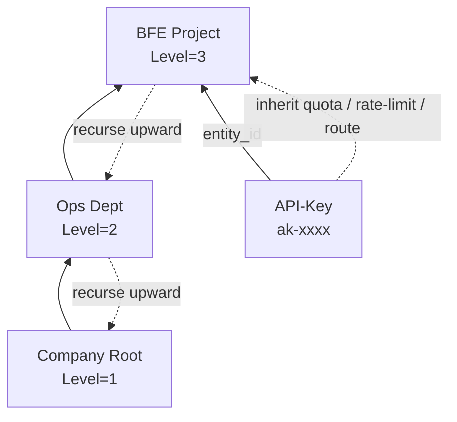

# Chapter 21: API-Key and Quota Configuration

## Chapter Goals

After reading this chapter, you will learn how to perform the following operations in the Control Plane of Rainway AI Gateway:

- Create, query, update, and delete API-Keys, as well as import existing Keys from external systems;
- Configure a `QuotaPlan` for an API-Key or Entity, and understand the applicable scenarios for the `total_token` and `RMB` quota units;
- Query the real-time balance and, when necessary, manually reset the quota;
- Use the Entity hierarchy to implement quota and policy inheritance;
- Bind API-Keys to Entities, quota plans, rate limit policies, and route rules;
- Complete typical configuration flows through the OpenAPI and troubleshoot common configuration issues.

This chapter is intended for operations engineers and platform engineers. It assumes that the Control Plane (AI Gateway API) has been deployed and is accessible, listens on the default port `8183`, and that you already have a valid Session Key or long-term Token for authentication.

---

## Core Concepts and Configuration Entry Points

In Rainway AI Gateway, the API-Key is the ultimate credential used by business parties to call LLM services, while the Entity is the business unit that carries the organizational hierarchy and policy inheritance. The Control Plane manages them through two sets of endpoints: `/open-api/v1/api-keys` and `/open-api/v1/entities`.

Both API-Keys and Entities can be bound to three types of policy resources:

- **QuotaPlan**: Controls the total amount of resources consumable within a period;
- **RateLimitPolicy**: Controls tokens, requests, and concurrency per unit of time;
- **RouteRules**: Controls which backend Cluster a request should be forwarded to.

When an API-Key is attached to an Entity, the Data Plane BFE considers both the API-Key's own policies and the policies inherited up the Entity hierarchy, forming the final effective rules. Understanding this inheritance relationship is the prerequisite for configuring quotas and permissions correctly.

---

## API-Key Lifecycle Management

An API-Key (Application Programming Interface Key) is the credential used by business parties when calling the AI Gateway. The Control Plane provides complete CRUD endpoints, all under `/open-api/v1/api-keys`.

### Creating an API-Key

When creating an API-Key, the system automatically generates a globally unique Key value and cascades the creation of its dedicated quota plan, rate limit policy, and route rules. If these resources are not explicitly provided, default values are used:

- `quota_plan` defaults to `unlimited=true`, i.e., no quota limit;
- `rate_limit_policy` defaults to `enabled=false`, i.e., no rate limiting;
- `route_rules` defaults to `enabled=false` with empty rules, i.e., no dedicated routing.

`description` is a required field with a maximum length of 512 characters. `expired_time` of `-1` means the Key never expires; otherwise, a Unix timestamp in seconds no earlier than the current time must be provided.

The following request creates an API-Key with a monthly-reset, 100-million-token quota, attached to a specified Entity:

```bash
curl -X POST http://localhost:8183/open-api/v1/api-keys \
  -H "Authorization: Session <your_session_key>" \
  -H "Content-Type: application/json" \
  -d '{
    "description": "BFE project test Key",
    "expired_time": -1,
    "enabled": true,
    "unlimited_quota": false,
    "models": ["*"],
    "subnet": ["*"],
    "quota_plan": {
      "unlimited": false,
      "pass_when_no_enough_quota": false,
      "quota": 100000000,
      "unit": "total_token",
      "reset_period": "monthly"
    },
    "rate_limit_policy": {
      "enabled": true,
      "rules": {
        "tpm": [
          {"name": "tpm_1min", "model": "*", "window_minutes": 1, "max_tokens": 10000, "step_minutes": 1}
        ],
        "rpm": [
          {"name": "rpm_1min", "model": "*", "window_minutes": 1, "max_requests": 100}
        ],
        "max_concurrency": 50
      }
    },
    "route_rules": {
      "enabled": true,
      "rules": [
        {
          "name": "apikey-default",
          "cond": "default_t()",
          "targets": [
            {"cluster_name": "cluster_apikey", "model": "", "weight": 100}
          ],
          "fallbacks": []
        }
      ]
    },
    "entity_id": "ent-zhangsan-001"
  }'
```

The response contains `id` (internal identifier) and `key` (authentication value). Keep the `key` safe — the Control Plane will never return it in plaintext again. If the Key value is lost, you usually need to delete the API-Key and create a new one.

### Querying API-Keys

List queries support filtering by enabled status, attached Entity, and whether the quota is unlimited. Detail queries return the complete nested structure, where `quota_plan` includes the real-time `balance`.

```bash
# List query; supports filters such as page, page_size, enabled, entity_id, unlimited_quota
curl "http://localhost:8183/open-api/v1/api-keys?page=1&page_size=20&enabled=true" \
  -H "Authorization: Session <your_session_key>"

# Detail query; quota_plan includes balance
curl http://localhost:8183/open-api/v1/api-keys/apikey-001 \
  -H "Authorization: Session <your_session_key>"
```

The returned `quota_plan.balance` comes directly from Redis and reflects the current remaining quota and usage. If Redis is unavailable, the query endpoint returns an error; the management plane no longer degrades to cold data in the database.

### Updating an API-Key

The Control Plane provides both full update (`PUT`) and partial update (`PATCH`). The `key` field is ignored during updates — the Key value itself cannot be modified; to change the Key, delete the old Key and create a new one.

For example, to disable an API-Key:

```bash
curl -X PATCH http://localhost:8183/open-api/v1/api-keys/apikey-001 \
  -H "Authorization: Session <your_session_key>" \
  -H "Content-Type: application/json" \
  -d '{"enabled": false}'
```

When modifying `quota_plan.quota` (unit unchanged), the system preserves the historical `used`, adjusts the balance as `remaining = max(0, new quota - used)`, and atomically adjusts Redis via `IncrBy(delta)`. This design avoids clearing historical usage during ordinary quota adjustments. When modifying `unit` or `unlimited`, since the old and new units cannot be converted, `used = 0` and `remaining = new quota` are reset, and Redis is updated to the new values.

If an API-Key is attached to a new Entity, and `unlimited_quota=false` and `quota_plan.unlimited=false`, then the new Entity or at least one of its ancestors must have a valid Quota Plan; otherwise the update is rejected.

### Deleting an API-Key

Deletion cascades the cleanup of its dedicated `quota_plan`, `rate_limit_policy`, and `route_rules`, along with the underlying resources (if not referenced by other objects), and also deletes the quota Key in Redis:

```bash
curl -X DELETE http://localhost:8183/open-api/v1/api-keys/apikey-001 \
  -H "Authorization: Session <your_session_key>"
```

> Note: Deletion may affect requests currently being processed. It is recommended to perform it during off-peak hours. After deletion, the original Key value immediately becomes invalid, and business party calls will receive authentication failure responses.

---

## Importing External Keys

If a business party already holds an API-Key in another system, it can be imported into Rainway AI Gateway via the `key` parameter of the creation endpoint, enabling a smooth migration. After import, the original Key value can continue to be used for requests, while quota, rate limiting, routing, and model permissions are uniformly taken over by the Control Plane.

Import constraints:

- Length of 1–128 characters;
- Only uppercase and lowercase letters, digits, hyphen `-`, and underscore `_` are allowed;
- Globally unique; duplicates return 422;
- The `key` field is ignored during updates — the Key value cannot be modified through the update endpoint.

Typical migration scenarios include: decommissioning a legacy gateway, merging multiple gateways, and unified key management. When importing, it is recommended to also configure the description, quota, and attached Entity to facilitate subsequent auditing and policy inheritance.

```bash
curl -X POST http://localhost:8183/open-api/v1/api-keys \
  -H "Authorization: Session <your_session_key>" \
  -H "Content-Type: application/json" \
  -d '{
    "key": "ak-migrate-2024q3",
    "description": "Key migrated from the legacy system",
    "quota_plan": {
      "unlimited": false,
      "quota": 50000000,
      "unit": "total_token",
      "reset_period": "monthly"
    }
  }'
```

After the import is complete, immediately verify that the Key works on the Data Plane, and confirm that the corresponding quota in the legacy system has been disabled, to avoid duplicate billing or double writes.

---

## QuotaPlan Configuration: total_token and RMB

`QuotaPlan` controls the total amount of resources an API-Key or Entity can consume within a period, and supports two units. Which unit to choose depends on the enterprise's billing model and management requirements.

### total_token Quotas

`unit = total_token` applies to models billed by token (such as OpenAI and Anthropic). The system directly counts the total input and output tokens and deducts them from the balance. This approach is intuitive and easy to understand, and suits scenarios where model prices are relatively fixed or tokens are procured by token.

```json
{
  "quota_plan": {
    "unlimited": false,
    "pass_when_no_enough_quota": false,
    "quota": 100000000,
    "unit": "total_token",
    "reset_period": "monthly"
  }
}
```

### RMB Quotas

`unit = RMB` applies to scenarios requiring unified budget management by cost. When an enterprise uses multiple models at multiple prices, the system converts token consumption into RMB in real time based on the model's unit price, and deducts it from the balance. This approach makes it easy for the finance department to control total cost against a monthly budget.

```json
{
  "quota_plan": {
    "unlimited": false,
    "pass_when_no_enough_quota": false,
    "quota": 5000.00,
    "unit": "RMB",
    "reset_period": "monthly"
  }
}
```

RMB quotas are stored in Redis internally as fixed-point integers with `1e-8` yuan as the unit, and are uniformly displayed externally with 4 decimal places to avoid floating-point errors. If tiered pricing by time period is used, BFE matches the current tier price at the time of the request, then converts it into cost for deduction.

### Key Field Descriptions

| Field | Description |
|------|------|
| `unlimited` | Whether the quota is unlimited. When `true`, no quota check is performed and the balance is shown as a sentinel value. |
| `pass_when_no_enough_quota` | Whether requests are still allowed when the quota is insufficient; often used for gray release or testing. Recommended to be disabled in production. |
| `quota` | Total quota. `total_token` is an integer; `RMB` may have decimal places. |
| `unit` | Unit; `total_token` or `RMB`. Modifying it after creation causes the balance to reset. |
| `reset_period` | Reset period; `never`, `weekly`, or `monthly`. |

### Unit Selection Guidelines

- If the enterprise procures quota separately for each model, or primarily uses a single model, prefer `total_token`;
- If the enterprise needs a unified cost budget across models, or model prices vary greatly and fluctuate frequently, prefer `RMB`;
- `total_token` and `RMB` quotas can coexist within the same Entity hierarchy, and BFE validates them separately.

---

## Balance Queries and Manual Resets

### Querying the Quota Balance

When querying API-Key details via the OpenAPI, `quota_plan` already includes the real-time `balance`. You can also obtain it through a dedicated endpoint:

```bash
curl http://localhost:8183/open-api/v1/api-keys/apikey-001/quota-plan \
  -H "Authorization: Session <your_session_key>"
```

Example response (token quota):

```json
{
  "ErrNum": 200,
  "ErrMsg": "success",
  "Data": {
    "unlimited": false,
    "pass_when_no_enough_quota": false,
    "quota": 100000000,
    "unit": "total_token",
    "reset_period": "monthly",
    "balance": {
      "used": 12345679,
      "remaining": 87654321
    }
  }
}
```

The balance is read directly from Redis and is real-time data; when Redis is unavailable, the query endpoint returns an error. An unlimited quota returns a sentinel balance (`used=0`, `remaining=100000000`).

### Manually Resetting the Quota

When you need to restore quota ahead of time, correct the total quota, or fix a Redis anomaly, call the reset endpoint:

```bash
curl -X POST http://localhost:8183/open-api/v1/api-keys/apikey-001/quota-plan/reset \
  -H "Authorization: Session <your_session_key>" \
  -H "Content-Type: application/json" \
  -d '{
    "quota": 100000000,
    "reason": "Manual reset at the start of the month"
  }'
```

- If `quota` is provided, the total quota is updated and the balance is reset;
- If `quota` is not provided, the balance is reset to the current total quota;
- After reset, `used = 0` and `remaining = quota`;
- A manual reset does not update `last_reset_at`, avoiding interference with the periodic scheduler's judgment of natural weeks/months.

The balance query and reset endpoints for Entities are `/entities/{id}/quota-plan` and `/entities/{id}/quota-plan/reset`, and behave the same as those for API-Keys.

### Relationship Between Periodic and Manual Resets

Every minute the system executes `ResetExpiredBalances`, which performs periodic resets for plans whose `reset_period` is `weekly` or `monthly` and whose quota is not unlimited. A periodic reset updates both Redis and `quota_plans.last_reset_at`.

A manual reset only resets the Redis balance and does not update `last_reset_at`. For example, if an administrator temporarily adjusts a project's quota from 5,000 yuan to 8,000 yuan mid-month and manually resets, the periodic scheduler will still automatically reset on the 1st of next month according to the new `quota`, unaffected by this manual operation.

---

## Entity Hierarchy and Quota Inheritance

An Entity is a business organizational unit, such as a company, department, project, or individual. After an API-Key is attached to an Entity via `entity_id`, it inherits the policies of that Entity and its parent Entities.



### Model Allowlist and Blocklist Inheritance

- `allow_models` (allowlist): takes the hierarchical intersection. Only non-empty configurations without `*` participate in the intersection; if the intersection is empty and both sides have non-empty, non-`*` configurations, the API-Key is disabled when exported.
- `block_models` (blocklist): takes the hierarchical union.

Example:

| Level | allow_models | block_models |
|------|-------------|--------------|
| Company Root | `["*"]` | `[]` |
| Ops Dept | `["gpt-4", "gpt-3.5-turbo"]` | `["gpt-4-32k"]` |
| BFE Project | `["gpt-4", "claude-3"]` | `["davinci"]` |
| API-Key | `[]` (not set) | `[]` |

The final allowed model is `gpt-4`, and the blocked models are `gpt-4-32k` and `davinci`. If the API-Key itself also has a non-empty allowlist, it is further intersected with the above result.

### Hierarchical Collection of Quota Plans

When exporting to BFE, the system collects all **non-unlimited** quota plans of the API-Key itself and up the Entity hierarchy. Each plan corresponds to one Redis Key:

- API-Key itself: `QUOTA_<api_key_value>`
- Entity: `QUOTA_<entity_id>`

Therefore, a single API-Key may be subject to quota control by multiple Redis Keys. For example, if an API-Key itself has a 20-million-token quota, the attached project has a 100-million-token quota, and the department has a 5,000-yuan RMB budget, the Key must satisfy all three constraints simultaneously.

### Hierarchical Merging of Rate Limit Policies and Route Rules

- Rate limit policies: all **enabled** policies are collected by recursing upward, exported as `rlp-<policy_id>`, and bound to the API-Key. The collection order does not affect the final limits, because each policy takes effect independently — if any policy is triggered, a 429 is returned.
- Route rules: bound with the priority `API-Key level → direct Entity level → parent Entity level → Global level`, and BFE matches in this order. This means API-Key-level rules have the highest priority, suitable for assigning dedicated clusters to specific business parties.

---

## Binding API-Keys to Entities, Quotas, Rate Limits, and Route Rules

Once created, an API-Key can be bound to various policies. It is generally recommended to create the Entity first, then create the API-Key and specify its `entity_id`. This allows model permissions and budgets to be configured uniformly at the organizational level, with fine-grained controls layered on at the API-Key level.

### Creating an Entity and Configuring Policies

```bash
curl -X POST http://localhost:8183/open-api/v1/entities \
  -H "Authorization: Session <your_session_key>" \
  -H "Content-Type: application/json" \
  -d '{
    "name": "bfe-project",
    "type": "team",
    "parent_id": "ent-ops-001",
    "allow_models": ["gpt-4", "claude-3"],
    "block_models": ["gpt-4-32k"],
    "quota_plan": {
      "unlimited": false,
      "quota": 200000000,
      "unit": "total_token",
      "reset_period": "monthly"
    },
    "rate_limit_policy": {
      "enabled": true,
      "rules": {
        "tpm": [
          {"name": "tpm_team", "model": "*", "window_minutes": 1, "max_tokens": 50000, "step_minutes": 1}
        ],
        "rpm": [
          {"name": "rpm_team", "model": "*", "window_minutes": 1, "max_requests": 500}
        ],
        "max_concurrency": 100
      }
    }
  }'
```

### Creating an API-Key and Attaching It to an Entity

```bash
curl -X POST http://localhost:8183/open-api/v1/api-keys \
  -H "Authorization: Session <your_session_key>" \
  -H "Content-Type: application/json" \
  -d '{
    "description": "BFE project read-only Key",
    "entity_id": "ent-bfe-project-001",
    "unlimited_quota": false,
    "models": ["gpt-4"],
    "quota_plan": {
      "unlimited": false,
      "quota": 50000000,
      "unit": "total_token",
      "reset_period": "monthly"
    },
    "rate_limit_policy": {
      "enabled": true,
      "rules": {
        "tpm": [
          {"name": "tpm_key", "model": "*", "window_minutes": 1, "max_tokens": 10000, "step_minutes": 1}
        ],
        "rpm": [
          {"name": "rpm_key", "model": "*", "window_minutes": 1, "max_requests": 100}
        ],
        "max_concurrency": 20
      }
    },
    "route_rules": {
      "enabled": true,
      "rules": [
        {
          "name": "apikey-default",
          "cond": "default_t()",
          "targets": [
            {"cluster_name": "cluster_bfe", "model": "", "weight": 100}
          ],
          "fallbacks": []
        }
      ]
    }
  }'
```

After attachment, the API-Key is subject to both its own quota (50 million tokens) and the Entity quota (200 million tokens), and also inherits the Entity's model allowlist and blocklist. Its final usable models are the intersection of its own `models` and the Entity inheritance result, i.e., `gpt-4`.

---

## Client Call Example

After obtaining an API-Key, the business party calls the AI Gateway with `Authorization: Bearer <key>` in the request header. The following example uses the OpenAI-compatible endpoint:

```bash
curl http://localhost:8080/v1/chat/completions \
  -H "Authorization: Bearer ak-2v8x9k3m7p" \
  -H "Content-Type: application/json" \
  -d '{
    "model": "gpt-4",
    "messages": [
      {"role": "user", "content": "Hello"}
    ]
  }'
```

If the API-Key is disabled, expired, subnet-restricted, or out of quota, BFE returns the corresponding 401 / 403 / 429 errors. Operators can locate the problem by querying the API-Key details or the quota balance endpoint.

---

## Complete Configuration Example

The following is a complete department-level budget configuration: the department has a 5,000-yuan-per-month RMB budget, while sub-projects and API-Keys each have their own independent RMB budgets, with dedicated rate limiting and routing configured.

### Creating the Department Entity

```bash
curl -X POST http://localhost:8183/open-api/v1/entities \
  -H "Authorization: Session <your_session_key>" \
  -H "Content-Type: application/json" \
  -d '{
    "name": "ai-lab",
    "type": "dep",
    "parent_id": null,
    "allow_models": ["*"],
    "block_models": [],
    "quota_plan": {
      "unlimited": false,
      "pass_when_no_enough_quota": false,
      "quota": 5000.00,
      "unit": "RMB",
      "reset_period": "monthly"
    }
  }'
```

### Creating the Project Entity

```bash
curl -X POST http://localhost:8183/open-api/v1/entities \
  -H "Authorization: Session <your_session_key>" \
  -H "Content-Type: application/json" \
  -d '{
    "name": "chatbot-proj",
    "type": "team",
    "parent_id": "ent-ai-lab-001",
    "allow_models": ["gpt-4", "gpt-3.5-turbo", "claude-3"],
    "block_models": [],
    "quota_plan": {
      "unlimited": false,
      "pass_when_no_enough_quota": false,
      "quota": 3000.00,
      "unit": "RMB",
      "reset_period": "monthly"
    },
    "rate_limit_policy": {
      "enabled": true,
      "rules": {
        "tpm": [
          {"name": "tpm_proj", "model": "*", "window_minutes": 1, "max_tokens": 20000, "step_minutes": 1}
        ],
        "rpm": [
          {"name": "rpm_proj", "model": "*", "window_minutes": 1, "max_requests": 200}
        ],
        "max_concurrency": 30
      }
    }
  }'
```

### Creating and Attaching the API-Key

```bash
curl -X POST http://localhost:8183/open-api/v1/api-keys \
  -H "Authorization: Session <your_session_key>" \
  -H "Content-Type: application/json" \
  -d '{
    "description": "chatbot-prod-key",
    "entity_id": "ent-chatbot-proj-001",
    "unlimited_quota": false,
    "models": ["gpt-4", "claude-3"],
    "subnet": ["10.0.0.0/8"],
    "quota_plan": {
      "unlimited": false,
      "pass_when_no_enough_quota": false,
      "quota": 1000.00,
      "unit": "RMB",
      "reset_period": "monthly"
    },
    "rate_limit_policy": {
      "enabled": true,
      "rules": {
        "tpm": [
          {"name": "tpm_key", "model": "*", "window_minutes": 1, "max_tokens": 5000, "step_minutes": 1}
        ],
        "rpm": [
          {"name": "rpm_key", "model": "*", "window_minutes": 1, "max_requests": 50}
        ],
        "max_concurrency": 10
      }
    },
    "route_rules": {
      "enabled": true,
      "rules": [
        {
          "name": "chatbot-route",
          "cond": "default_t()",
          "targets": [
            {"cluster_name": "cluster_chatbot", "model": "", "weight": 100}
          ],
          "fallbacks": [
            {"cluster_name": "cluster_chatbot_fallback", "model": "", "weight": 100}
          ]
        }
      ]
    }
  }'
```

Once the above configuration takes effect, the API-Key is subject to all of the following:

- Department-level 5,000-yuan-per-month RMB budget control;
- Project-level 3,000-yuan-per-month RMB budget control;
- Its own 1,000-yuan-per-month RMB budget control;
- Project-level and its own rate limit policies;
- Its own route rules take precedence, with project-level route rules as fallback;
- Only requests from the `10.0.0.0/8` subnet are allowed.

---

## Common Issues and Troubleshooting

| Symptom | Possible Cause | Troubleshooting Method |
|------|---------|---------|
| Request returns 401 | Key does not exist, has been deleted, or is malformed | Query `/api-keys` to confirm the Key status |
| Request returns 403 | API-Key is disabled, expired, subnet-restricted, or the model is not in the allowlist | Check `enabled`, `expired_time`, `subnet`, `models`, and the Entity inheritance result |
| Request returns 429 | Quota exhausted or rate limit triggered | Query `/api-keys/{id}/quota-plan` and the rate limit policy |
| Balance shows 0 but requests still pass | `pass_when_no_enough_quota=true` | Check the quota_plan configuration |
| Quota not reset monthly | `reset_period` is `never`, or `last_reset_at` was updated | Check quota_plan and scheduler logs |
| Model permissions do not match expectations | The `allow_models` intersection of the Entity hierarchy is empty | Check the `models` configuration of each Entity and API-Key level by level |

---

## Chapter Summary

- The API-Key is the credential used by business parties to call Rainway AI Gateway, supporting creation, query, full/partial update, deletion, and external Key import; deletion cascades the cleanup of dedicated configurations and Redis Keys.
- `QuotaPlan` supports two units, `total_token` and `RMB`, applicable to scenarios billed by total token volume and by cost budget respectively; RMB quotas are stored internally in Redis as fixed-point integers and displayed externally with 4 decimal places.
- The balance is read directly from Redis; both the OpenAPI detail response and the dedicated `quota-plan` endpoint return the real-time `used` / `remaining`; the manual reset endpoint can restore the balance to the current or a new quota without interfering with periodic scheduling.
- Entities support a hierarchical structure; after an API-Key is attached, it inherits the model allowlist (intersection), blocklist (union), quota plans, rate limit policies, and route rules; policies take effect in the priority order API-Key level → Entity level → Global level.
- In practice, it is recommended to plan the Entity hierarchy first, then attach API-Keys and layer fine-grained policies on top, achieving organizational-level budget control and project-level resource isolation. When encountering anomalies, troubleshoot comprehensively by combining the API-Key status, quota balance, Entity inheritance result, and BFE logs.

---

## References

- `ai-gateway-api/design-docs/api-define/OpenAPI接口定义/api-keys.md`
- `ai-gateway-api/design-docs/api-define/OpenAPI接口定义/entities.md`
- `ai-gateway-api/design-docs/sys-design/details/API-Key与Entity关联及模型继承.md`
- `ai-gateway-api/design-docs/sys-design/details/配额余额同步机制.md`
- `rainway-book/design/chapter08-auth-and-apikey.md`
- `rainway-book/design/chapter12-quota-and-rate-limit.md`
- `ai-gateway-api/model/quotacache/quotacache.go`
- `ai-gateway-api/model/quota/quota_plan_manager.go`
