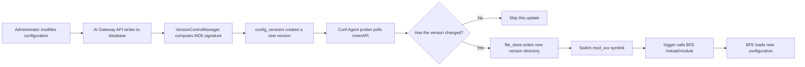

# Chapter 24: Configuration Hot Reload and Upgrade

## Chapter Goals

By the end of this chapter, readers will be able to:

- Understand the complete chain through which a configuration is delivered from the AI Gateway API management plane to the BFE data plane and takes effect;
- Understand how Conf Agent (configuration agent) polls the InnerAPI, compares versions, and persists configurations;
- Understand how BFE hot reload is triggered and how the monitoring port works;
- Know how to check the currently active configuration version;
- Perform a version rollback when the configuration is abnormal;
- Understand the precautions when upgrading components such as AI Gateway API, Dashboard, and Conf Agent.

---

## The Complete Configuration Delivery Flow

Rainway AI Gateway adopts an architecture of **control plane generation, data plane pull**. After an administrator modifies a configuration in the Dashboard or via the OpenAPI, the configuration is not pushed to BFE immediately. Instead, it is first persisted to the database by AI Gateway API, and then periodically pulled by Conf Agent, which is deployed alongside BFE, to trigger a hot reload. The complete flow is as follows:



Description of each step:

1. **Configuration write**: The administrator modifies resource configurations such as Provider, Cluster, API-Key, and rate limit policies through the Dashboard or OpenAPI, and AI Gateway API writes the changes to MySQL/SQLite.
2. **Configuration export and version control**: When Conf Agent requests the InnerAPI, AI Gateway API calls `VersionControlManager.ExportConfig` to generate the configuration and computes an MD5 signature after zeroing the version number field. If the signature matches the latest record in the `config_versions` table, it returns `Data: null`; otherwise, it generates a new timestamp-based version number and returns the full configuration. See `ai-gateway-api/design-docs/sys-design/details/InnerAPI配置导出与版本控制.md` for details.
3. **Conf Agent pull**: The `prober` in Conf Agent accesses the InnerAPI at the configured interval and compares the local version number with the remote version number.
4. **Local persistence**: When a version change is detected, `file_store` writes the new configuration to a directory named after the version number and atomically switches the `mod_{name}` symlink to point to the new directory.
5. **BFE hot reload**: `trigger` calls the `/reload/{module}` interface on the BFE monitoring port, and BFE re-reads the configuration files pointed to by the symlink, completing the hot reload.

This pull-based design means the control plane does not need to know the number of data plane nodes, and BFE can continue forwarding traffic with its locally cached configuration even when the control plane is temporarily unreachable.

---

## Conf Agent Polling and Version Comparison

Conf Agent is a key component in the configuration delivery chain; its architecture and responsibilities are described in `conf-agent/AGENTS.md`. Each configuration topic corresponds to one `Reloader`, and each `Reloader` contains three submodules:

- **prober** (`conf_reload/prober/`): responsible for polling the InnerAPI of AI Gateway API;
- **file_store** (`conf_reload/file_store/`): responsible for writing configurations to version directories and managing symlinks;
- **trigger** (`conf_reload/trigger/`): responsible for calling the BFE monitoring port to trigger a reload.

### Polling Configuration

Conf Agent's configuration file `conf/conf-agent.toml` defines the polling interval, the BFE configuration directory, the monitoring port, and the mapping of each `Reloader`. Key configuration items are as follows:

```toml
[Basic]
BFECluster              = "bfe-cluster-01"
BFEConfDir              = "/home/work/bfe/conf"
BFEMonitorPort          = 8421
BFEReloadTimeoutMs      = 1500
ReloadIntervalMs        = 5000
ConfServer              = "http://127.0.0.1:8183"
ConfTaskHeaders         = {"Authorization" = "Token {Token}"}
ConfTaskTimeoutMs       = 1500
```

`ReloadIntervalMs` determines the prober's polling cycle, with a default of 5000 milliseconds. Each `Reloader` sends a GET request to the corresponding InnerAPI at this interval, carrying the locally cached version number:

```http
GET /inner-api/v1/configs/mod-api-key?version=20260101120000 HTTP/1.1
Authorization: Token <token>
```

### Version Comparison

After receiving the request, AI Gateway API looks up the latest signature and version number for that topic in the `config_versions` table. If the requested `version` matches the latest version, it returns:

```json
{
  "ErrNum": 200,
  "ErrMsg": "success",
  "Data": null
}
```

After receiving an empty response, Conf Agent skips the write and hot reload. If the version has changed, the response contains the full configuration data with the new `version`, and Conf Agent enters the persistence and trigger flow.

### Local Version Directories and Symlinks

`file_store` allocates an independent directory for the new version's configuration (the directory name usually contains the version number). After the write completes, it atomically modifies the `mod_{name}` symlink to point to that directory. For example, the symlink corresponding to the `mod_ai_token_auth` topic is `mod_ai_token_auth`, and BFE always reads files such as `token_rule.data` through this symlink. This mechanism prevents BFE from reading half-written files and also preserves several historical version directories, making rollback easy.

---

## BFE Hot Reload Trigger Mechanism

At startup, BFE listens on a monitoring port (default 8421) to receive administrative requests, including the configuration hot reload interface `/reload/{module}`. After `file_store` completes the symlink switch, the `trigger` module of Conf Agent constructs the following request:

```bash
curl -X POST http://127.0.0.1:8421/reload/mod_ai_token_auth
```

Different configuration topics correspond to different BFE reload interfaces. Typical mappings are as follows:

| Configuration Topic | Conf Agent Reloader | BFE Hot Reload Interface |
|----------|---------------------|----------------|
| `route_rule` | `server_data_conf` | `/reload/server_data_conf` |
| `cluster_table` / `gslb.<cluster>` | `cluster_conf` | `/reload/gslb_data_conf` |
| `certificate` | `tls_conf` | `/reload/tls_conf` |
| `mod_api_key_rule` | `mod_ai_token_auth` | `/reload/mod_ai_token_auth` |
| `mod_body_process` | `mod_body_process` | `/reload/mod_body_process` |
| `mod_ai_rate_limit` | `mod_ai_rate_limit` | `/reload/mod_ai_rate_limit` |
| `ai_route` | `mod_ai_route` | `/reload/mod_ai_route` |

These mappings are explicitly configured via the `BFEReloadAPI` field in the `[Reloaders.xxx]` section of `conf-agent/conf/conf-agent.toml`:

```toml
[Reloaders.mod_ai_token_auth]
BFEReloadAPI    = "/reload/mod_ai_token_auth"
ReloadFile      = "token_rule.data"
CopyFiles       = ["token_rule.data", "mod_ai_token_auth.conf"]
[[Reloaders.mod_ai_token_auth.NormalFileTasks]]
ConfAPI         = "/inner-api/v1/configs/mod-api-key"
ConfFileName    = "token_rule.data"
```

After receiving the reload request, BFE re-reads the configuration file of the corresponding module and updates the rule table in memory. Since the reload process does not involve restarting the process, existing connections are not interrupted.

---

## How to Check the Currently Active Configuration Version

In operations, it is often necessary to confirm which version of the configuration BFE has currently loaded. There are three ways to check:

### 1. Check the Conf Agent Log

After each successful write of a new version and hot reload trigger, Conf Agent prints a log, whose path is specified in the `[Logger]` section of `conf-agent.toml`. The log usually contains the version number, module name, and reload result.

### 2. Check the Symlink Target

Directly check the version directory that each module's symlink in the BFE configuration directory points to:

```bash
ls -l /home/work/bfe/conf/mod_ai_token_auth
# Example output:
# mod_ai_token_auth -> mod_ai_token_auth_20260102120000
```

The timestamp in the symlink target directory name is the currently active version.

### 3. Check the version Field in the Configuration File

Most exported configuration files contain a `version` field at the JSON root node, which can be read directly:

```bash
cat /home/work/bfe/conf/mod_ai_token_auth_20260102120000/token_rule.data | head -c 200
```

The output should contain `"version": "20260102120000"`.

---

## Version Rollback

When a new configuration causes abnormal BFE behavior, you can quickly roll back to the previous version. Since Conf Agent retains several historical version directories (the number is controlled by `VersionKeepCount`; by default the most recent few versions are kept), the rollback does not need to pull from the control plane again.

### Manual Rollback Steps

1. Identify the historical version directory to roll back to, e.g. `mod_ai_token_auth_20260101120000`.
2. Stop Conf Agent or temporarily increase the polling interval to prevent it from immediately switching the symlink back to the new version.
3. Manually modify the symlink to point to the target version directory:

```bash
cd /home/work/bfe/conf
ln -sfn mod_ai_token_auth_20260101120000 mod_ai_token_auth
```

4. Call the BFE monitoring port to reload that module:

```bash
curl -X POST http://127.0.0.1:8421/reload/mod_ai_token_auth
```

5. After verifying that the service has recovered, fix the configuration in the Dashboard and publish it again.

### Rollback Precautions

- Rollback only affects the local configuration of the data plane and does not write back to the database. If the control plane configuration itself is wrong, it still needs to be fixed in the Dashboard.
- When rolling back basic modules such as `server_data_conf`, `cluster_conf`, and `tls_conf`, confirm the compatibility between the versions of each module to avoid inconsistency between the routing and backend instance table versions.
- In production, it is recommended to verify on a small set of nodes before switching all nodes; see the canary release suggestions in the next section.

---

## Upgrade Precautions

AI Gateway involves multiple components, including the control plane (AI Gateway API), Dashboard, Conf Agent, BFE, and MySQL. Upgrades must be performed in the correct order, with attention to database migration and configuration compatibility. The following uses the v0.0.2 upgrade path from `ai-gateway-api/docs/zh_cn/upgrade.md` as an example.

### Database Migration

Upgrading AI Gateway API is often accompanied by database schema changes. Before upgrading, back up the database, and then execute the DDL according to the upgrade documentation. For example, v0.0.2 requires the following adjustments to the `users` table:

```sql
ALTER TABLE users ADD COLUMN `type` tinyint(1) NOT NULL DEFAULT '0' AFTER name;
ALTER TABLE users ADD COLUMN `scopes` varchar(2048) NOT NULL DEFAULT '' AFTER `type`;

UPDATE users SET type = 0, scopes = 'System' WHERE roles = 'admin';
UPDATE users SET type = 1, scopes = 'Support' WHERE roles = 'inner';

ALTER TABLE users CHANGE COLUMN `session_key` `ticket` varchar(20) NOT NULL DEFAULT '';
ALTER TABLE users CHANGE COLUMN `session_key_created_at` `ticket_created_at` datetime NOT NULL DEFAULT '0000-01-01 00:00:00';

ALTER TABLE users DROP COLUMN `roles`;

ALTER TABLE users DROP INDEX name_uni;
ALTER TABLE users ADD UNIQUE KEY `name_uni` (`name`, `type`);
```

Before upgrading, be sure to:

- Make a full backup of the production database;
- Verify the DDL and data migration scripts in a test environment first;
- Confirm that the starting version listed in the upgrade documentation includes your current version.

### Configuration Compatibility

A new version may introduce new configuration fields or change the authentication header format. For example, in v0.0.2, the Conf Agent request header changed from `Session {Token}` to `Token {Token}`:

```toml
# Old version
ConfTaskHeaders = {"Authorization" = "Session {Token}"}

# v0.0.2 and later
ConfTaskHeaders = {"Authorization" = "Token {Token}"}
```

After upgrading, check the following:

- Whether `ConfTaskHeaders` and `ExtraFileTaskHeaders` in `conf-agent.toml` are consistent with the authentication method of AI Gateway API;
- Whether the `Reloader` for newly added modules is configured correctly;
- Whether BFE supports the hot reload interface for the new modules.

### Component Version Compatibility

According to `upgrade.md`, the v0.0.2 upgrade requires:

- AI Gateway API upgraded to v0.0.2;
- Dashboard upgraded to v0.0.2;
- Conf Agent kept at v0.0.1 or a newer version.

The recommended upgrade order is:

1. Back up the database;
2. Execute the database migration scripts;
3. Replace the AI Gateway API executable;
4. Upgrade the Dashboard;
5. Upgrade Conf Agent as needed and check its configuration;
6. Observe the Conf Agent logs and BFE monitoring metrics to confirm that configurations are synchronizing normally.

---

## Complete Operation Example

The following demonstrates the complete operation from modifying an API-Key quota in the Dashboard, through BFE hot reload taking effect, to a rollback.

### Scenario

An administrator adjusts the daily Token quota of `team-a` from 1 million to 2 million.

### Step 1: Modify the Quota in the Dashboard

After saving, AI Gateway API writes the new quota to the database, but it has not yet been delivered to BFE.

### Step 2: Wait for Conf Agent Polling

Within about 5 seconds, the `mod_ai_token_auth` Reloader of Conf Agent will detect the version change of the `mod-api-key` topic:

```bash
# Conf Agent log example (path depends on actual configuration)
tail -f /home/work/conf-agent/log/conf_agent.log
# [2026-01-02 12:00:05] [INFO] [prober.go:xxx] mod_ai_token_auth version changed: 20260101120000 -> 20260102120000
# [2026-01-02 12:00:05] [INFO] [file_store.go:xxx] write mod_ai_token_auth_20260102120000
# [2026-01-02 12:00:05] [INFO] [trigger.go:xxx] reload mod_ai_token_auth success
```

### Step 3: Check the Currently Active Version

```bash
ls -l /home/work/bfe/conf/mod_ai_token_auth
# mod_ai_token_auth -> mod_ai_token_auth_20260102120000

curl -X POST http://127.0.0.1:8421/reload/mod_ai_token_auth
# {"code":0,"message":"reload success"}
```

### Step 4: Verify the Quota Takes Effect

Send a test request carrying the API-Key of `team-a` and confirm that the limit has changed to 2 million.

### Step 5: Roll Back (If Needed)

If the business behaves abnormally after the quota adjustment, roll back quickly:

```bash
cd /home/work/bfe/conf
ln -sfn mod_ai_token_auth_20260101120000 mod_ai_token_auth
curl -X POST http://127.0.0.1:8421/reload/mod_ai_token_auth
ls -l mod_ai_token_auth
# mod_ai_token_auth -> mod_ai_token_auth_20260101120000
```

---

## Chapter Summary

- Rainway AI Gateway adopts a configuration synchronization model of control plane generation and data plane pull: administrator changes are first written to the database, and Conf Agent then pulls them from the InnerAPI periodically and triggers a BFE hot reload.
- `VersionControlManager` implements incremental synchronization based on MD5 signatures and the `config_versions` table; when the configuration has not changed, it returns `Data: null`, avoiding meaningless configuration delivery.
- Each `Reloader` of Conf Agent consists of three parts — prober, file_store, and trigger — responsible for pulling, persistence, and triggering the BFE hot reload, respectively.
- BFE completes hot reload through the `/reload/{module}` interface on the monitoring port, and each module has an independent hot reload path.
- The active version can be checked via the Conf Agent log, the symlink target, or the `version` field in the configuration file.
- Version rollback can use the historical version directories retained by Conf Agent: manually switch the symlink and reload, without restarting BFE.
- When upgrading, perform database migration, AI Gateway API replacement, Dashboard upgrade, and Conf Agent configuration checks in order, and pay attention to the compatibility of authentication headers and configuration fields.

---

## References

- `ai-gateway-api/docs/zh_cn/upgrade.md`
- `conf-agent/AGENTS.md`
- `ai-gateway-api/design-docs/sys-design/details/InnerAPI配置导出与版本控制.md`
- `ai-gateway-api/design-docs/api-define/InnerAPI接口定义/00-overview.md`
- [Chapter 21: Configuration Export and Version Control Design](../design/chapter14-config-export-and-version-control.md)
