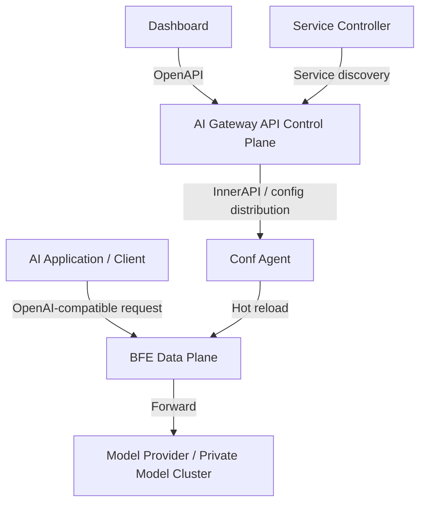

# Chapter 2: AI Gateway Technology Overview

## Chapter Goals

The AI gateway is a category of infrastructure that has rapidly emerged in the past two years as large models have been productized as services. This chapter builds the reader's overall understanding of the AI gateway from the perspectives of concept, capability boundaries, differences from adjacent systems, and comparisons with mainstream products, and clarifies the positioning of the Rainway AI Gateway in the AI gateway space and its key differentiators. After reading this chapter, the reader will be able to:

- Accurately describe the definition and typical use cases of an AI gateway;
- Distinguish the differences in responsibilities and capabilities between an AI gateway and a traditional API gateway or a traditional layer-7 load balancer;
- Master the six core capability model of an AI gateway;
- Understand the characteristics of mainstream products such as LiteLLM, Kong AI Gateway, Apache APISIX, Higress, and AWS API Gateway;
- Understand the architectural positioning of the Rainway AI Gateway, which combines the BFE Data Plane with the AI Gateway API Control Plane.

## What Is an AI Gateway

An AI gateway is a traffic entry point and governance layer deployed between AI applications and various large model services. Facing upward, it provides applications with a unified model invocation endpoint; facing downward, it connects to heterogeneous model providers such as OpenAI, Anthropic, Google Gemini, DeepSeek, and Tongyi Qianwen, shielding applications from differences among vendors in protocol, authentication, billing, and rate limiting, so that applications can consume large model capabilities in a consistent way.

In essence, an AI gateway is still a layer-7 traffic proxy, but its design focus has shifted from "generic HTTP routing" to "AI request lifecycle governance." A typical large model invocation request goes through the following stages:

1. The client sends the request in an OpenAI-compatible format;
2. The AI gateway performs authentication (API-Key validation) and permission checks;
3. The target model and backend cluster are selected according to routing rules;
4. Protocol conversion or model parameter rewriting is performed when necessary;
5. Governance policies such as rate limiting, quota, and cost accounting are applied;
6. The request is forwarded to the backend model service;
7. Metrics such as token usage, latency, and time to first token are collected, and the response is returned.

Therefore, an AI gateway is not merely a "connection point," but the **unified access plane, security control plane, cost governance plane, and observability plane** between AI applications and model providers.

## Differences Between an AI Gateway and a Traditional API Gateway

Traditional API gateways (such as Kong, Apache APISIX, and AWS API Gateway) mainly address routing, authentication, rate limiting, transformation, and observability for generic REST/HTTP traffic. The AI gateway inherits these basic capabilities but is significantly enhanced for large model scenarios.

| Comparison Dimension | Traditional API Gateway | AI Gateway |
|---|---|---|
| Core traffic | Generic REST/HTTP/gRPC API requests | Large model inference requests (Chat Completions, Embeddings, text-to-image, speech, etc.) |
| Routing basis | Path, Host, Header, parameters | Model name (model), API-Key, Entity, request content, cost, latency |
| Rate limiting dimensions | QPS/TPS, connection count, bandwidth | Token rate (TPM), request rate (RPM), concurrency, context length |
| Protocol conversion | JSON/XML/gRPC mutual conversion | Mutual conversion among OpenAI, Claude, Gemini, Azure OpenAI, and other protocols |
| Cost governance | Weak or none | Model pricing, Token/RMB quota, cost deduction, usage audit |
| Observability focus | Latency, error rate, throughput | TTFT (time to first token), TPOT, input/output tokens, model-dimension metrics |
| Streaming responses | Mostly pass-through | Requires SSE streaming parsing, streaming quota deduction, streaming logs |
| API-Key management | Simple key authentication | Virtual Key, multi-key rotation, key affinity, quota binding |

As the table shows, the AI gateway is not meant to replace the traditional API gateway; rather, it layers semantic understanding of large models, cost accounting, and model-level governance on top of it. In enterprise deployments, AI gateways typically coexist with API gateways: the API gateway handles north-south access, general security, and traffic shaping, while the AI gateway handles model routing, quota billing, and AI-specific observability.

## Differences Between an AI Gateway and a Traditional Load Balancer

Traditional layer-7 load balancers such as Nginx and BFE excel at content routing and load balancing based on conditions such as Host, Path, and Header, and provide enterprise-grade capabilities such as TLS termination, connection management, and access logging. An AI gateway can be built on top of a load balancer or extended from one, but the two focus on different layers.

| Comparison Dimension | Traditional Load Balancer (Nginx/BFE) | AI Gateway |
|---|---|---|
| Primary positioning | Traffic access, forwarding, high availability | Model service governance, cost and security control |
| Routing granularity | Host/Path/Header level | API-Key / Entity / Global three levels + model level |
| Request body awareness | Usually does not parse the request body | Must parse the request body to extract model, messages, token usage |
| Protocol ecosystem | HTTP/HTTPS/HTTP2/WebSocket/gRPC, etc. | Understands AI protocols such as OpenAI/Claude/Gemini on top of generic protocols |
| Rate limiting algorithms | Leaky bucket, token bucket, connection limiting | Redis-based distributed TPM/RPM/concurrency rate limiting |
| Quota and billing | Generally not supported | Token quota, RMB cost quota, model pricing table |
| Backend management | Static upstreams or service discovery | Multi-level management of Provider / Cluster / Model / Key |
| Observability fields | Generic access logs | Additional fields such as ai_apikey, ai_model, ai_tokens, ai_ttft_us |

Taking BFE as an example: BFE is a modern layer-7 load balancer open-sourced by Baidu, supporting advanced routing based on condition expressions, global/distributed load balancing, and a flexible module framework (`bfe_modules/mod_*`). The Rainway AI Gateway is built on BFE, adding modules such as `mod_ai_route`, `mod_ai_token_auth`, `mod_ai_rate_limit`, and `mod_body_process`, extending BFE from a generic load balancer into an enterprise-grade AI gateway Data Plane. For details, see `bfe/docs/zh_cn/introduction/overview.md`.

## Core Capability Model of an AI Gateway

A complete AI gateway typically includes six core capabilities: unified access, protocol conversion, authentication and authorization, routing and scheduling, cost governance, and observability. Each is described below.

### Unified Access

Unified access means providing upper-layer applications with a standardized invocation entry point that is independent of backend model vendors. Whether the backend is OpenAI, DeepSeek, or a privately deployed model, applications can send requests in a unified OpenAI-compatible format. The AI gateway is responsible for dispatching requests to the correct backend and returning responses uniformly to clients. The value of unified access lies in reducing application integration costs and avoiding applications directly holding large numbers of vendor-specific API-Keys and endpoint addresses.

### Protocol Conversion

Interfaces of different model vendors differ in request format, authentication method, error codes, streaming responses, and more. An AI gateway needs protocol conversion capability so that the client accesses with one protocol while the backend is invoked with another. For example, the client uses the OpenAI format, while the backend actually calls the Claude Messages API; or the client requests `gpt-4o`, and the gateway maps it to the backend's `qwen-max`. Protocol conversion typically includes model name mapping (`ModelMapping`), prefix trimming (`StripPrefix`/`MatchPrefix`), request body rewriting, and response body format conversion.

### Authentication and Authorization

An AI gateway needs to verify the caller's identity for every model invocation and check whether it has permission to access the specified model or cluster. Authentication methods include traditional API-Key, JWT, OAuth, and others. In AI scenarios, the **Virtual Key** mechanism is emphasized: the client holds a virtual key issued by the gateway, and the gateway maps it to the real key of the backend Provider. This both protects upstream keys from leakage and enables fine-grained per-caller authorization, quota, and audit.

### Routing and Scheduling

Routing and scheduling is one of the most core capabilities of an AI gateway. The Rainway AI Gateway adopts a **API-Key → Entity → Global three-level route table** structure:

- **API-Key level routing**: binds dedicated routing rules to a single API-Key, suitable for customizing model access policies for a specific application or user;
- **Entity level routing**: organizes routing rules by entity (such as department, project, or product line), enabling hierarchical management;
- **Global level routing**: the global default route table, serving as the fallback policy.

Within each route table, condition expressions are matched in order; on a match, the target cluster list (`targets`) and the fallback list (`fallbacks`) are returned. At the forwarding stage, a target is selected randomly by weight, and on failure, fallback targets are tried one by one. The detailed design can be found in `ai-gateway-api/design-docs/sys-design/总体设计文档.md`.

### Cost Governance

Cost governance is the key capability that distinguishes an AI gateway from a generic gateway. It typically includes:

- **Model pricing management**: maintaining input/output token unit prices for different providers and different models;
- **Quota management**: allocating Token quota or RMB currency quota to API-Keys or Entities, with real-time deduction;
- **Rate limiting policies**: rate limiting by RPM (requests per minute), TPM (tokens per minute), and concurrency;
- **Cost accounting and audit**: computing the cost of each request based on actual token usage and the pricing table, and producing usage reports.

The Rainway AI Gateway supports both `total_token` and `RMB` quota units and handles fixed-point conversion uniformly through `go-lib/quota` to avoid floating-point errors. The Control Plane manages model pricing via `/model-prices`, while the Data Plane fills in price information through `AIConf.ModelTable` to implement cost-based deduction.

### Observability

Observability in AI scenarios must cover the entire model invocation chain. Key metrics include:

- **Latency metrics**: time to first token (TTFT, Time To First Token), time per output token (TPOT, Time Per Output Token), and total latency;
- **Usage metrics**: input tokens, output tokens, total tokens, cache-hit tokens;
- **Business metrics**: request volume, success rate, and cost aggregated by apikey, entity, model, provider, and cluster;
- **Log fields**: the Rainway AI Gateway extends fields such as `ai_apikey`, `ai_model`, `ai_tokens`, `ai_ttft_us`, and `ai_tpot_us` in `bfe-access-pb` to facilitate subsequent analysis and alerting.

## Comparison of Mainstream AI Gateway Products

There are AI gateway products in many forms on the market today, ranging from open-source tools to cloud-hosted services, and from dedicated AI gateways to AI extensions of traditional gateways. The table below briefly compares several representative products.

| Product | Positioning | Deployment Form | Core Strengths | Main Weaknesses |
|---|---|---|---|---|
| **LiteLLM** | Open-source AI routing and cost management framework | Python library / proxy service | Supports 100+ providers, unified OpenAI interface, powerful cost and quota management | Enterprise-grade high availability and traffic governance weaker than dedicated gateways |
| **Kong AI Gateway** | AI extension of an enterprise-grade API gateway | Enterprise plugin / cloud service | Seamless integration with the Kong ecosystem, AI semantic routing, observability | Advanced features depend on the enterprise edition, relatively high cost |
| **Apache APISIX** | Cloud-native API gateway + AI plugins | Open source / cloud service | Rich AI plugins (proxy, rate limit, cache, guard), active ecosystem | Enterprise-grade quota billing and RMB cost governance require secondary development |
| **Higress** | AI Native API Gateway | K8s + Envoy + Istio + WASM | Rich plugin ecosystem, strong protocol adaptation, integrated metric/log/trace | Heavyweight architecture, lacks a native Virtual Key layer, quota supports only tokens |
| **AWS API Gateway** | Cloud-hosted API gateway | Fully managed cloud service | Deep integration with the AWS ecosystem, Serverless elasticity | Limited AI-specific capabilities, per-call billing, vendor lock-in |
| **Rainway AI Gateway** | Enterprise-grade private AI gateway | Control Plane / Data Plane separation, BFE Data Plane | Three-level routing, Virtual Key, Token/RMB quota, high-performance forwarding, enterprise-grade operability | AI caching, content security, MCP, and other capabilities still under development |

The comparison shows that mainstream open-source AI gateways each have strengths in protocol adaptation and plugin ecosystems, but differ in enterprise-grade quota billing, multi-tenant routing isolation, and high-performance private deployment. The Rainway AI Gateway's choice is: use BFE, proven at Baidu's large traffic scale, as the Data Plane and AI Gateway API as the Control Plane, to build an open-source AI gateway with Control Plane / Data Plane separation, hot-reloadable configuration, and enterprise-grade billing and rate limiting.

## Positioning of the Rainway AI Gateway in the AI Gateway Space

The overall architecture of the Rainway AI Gateway consists of five core components:

- **AI Gateway API**: the core Control Plane component, responsible for the creation, storage, version control, and distribution of policies/configurations;
- **Dashboard**: the management console, performing visual operations through the OpenAPI;
- **BFE**: the Data Plane, responsible for traffic forwarding, AI routing, authentication, rate limiting, and access logging;
- **Conf Agent**: the configuration agent, pulling the latest configuration from the InnerAPI and triggering BFE hot reload;
- **Service Controller**: the service discovery component, synchronizing Kubernetes backend services.

Compared with products such as Higress and OmniRoute, the Rainway AI Gateway is differentiated in the following aspects:

- **Enterprise-grade multi-tenant routing**: adopts the `API-Key → Entity → Global` three-level route table, naturally fitting enterprise scenarios where model access permissions are managed hierarchically by department, project, and application.
- **Leading quota and billing capabilities**: supports both Token quota and RMB currency quota, with a built-in model pricing table (`ModelTable`), enabling differentiated pricing per model and precise cost deduction.
- **High performance and stability**: the Data Plane is based on the Go-based, self-developed BFE, proven at large traffic scale, suitable for high-concurrency online inference scenarios.
- **Control Plane / Data Plane separation**: configuration management, service discovery, and traffic forwarding are deployed independently, making fault isolation, horizontal scaling, and canary releases more controllable.
- **Open-source and private-deployment friendly**: Apache-2.0 license, supports binary, container, Kubernetes, and other deployment forms, meeting scenarios such as finance and government that have high requirements for data sovereignty.

Of course, the Rainway AI Gateway also needs to continuously fill in capabilities such as AI caching, content security, MCP support, and more complete observability metrics, in order to cover a broader range of AI application scenarios.

## Chapter Summary

This chapter gave a systematic introduction covering the concept, boundaries, capabilities, and product landscape of the AI gateway:

- An AI gateway is the unified access, governance, and observability layer between AI applications and model services;
- Compared with traditional API gateways, AI gateways differ significantly in routing granularity, rate limiting dimensions, protocol conversion, cost governance, and observability;
- Compared with traditional load balancers, AI gateways focus more on request body semantics, model-level routing, quota billing, and AI-specific logging;
- The six core capabilities of an AI gateway are: unified access, protocol conversion, authentication and authorization, routing and scheduling, cost governance, and observability;
- Mainstream products each emphasize different aspects of protocol ecosystem, plugin capabilities, and deployment forms; the Rainway AI Gateway chooses to build an enterprise-grade private AI gateway with the BFE Data Plane + AI Gateway API Control Plane, forming differentiating advantages in three-level routing, Virtual Key, Token/RMB quota, and high-performance forwarding.

Subsequent chapters will build on this foundation to dive into the Rainway AI Gateway's architecture design, Control Plane implementation, Data Plane modules, and operations and deployment practices.

## References

- `ai-gateway-api/README.md`
- `ai-gateway-api/design-docs/sys-design/总体设计文档.md`
- `bfe/docs/zh_cn/introduction/overview.md`
- `document-ai-gateway/竞品分析/higress/bfe-vs-higress-ai-gateway-comparison.md`
- `document-ai-gateway/竞品分析/OmniRoute/OmniRoute-vs-bfe-AI网关能力对比分析.md`
- `document-ai-gateway/竞品分析/higress/Higress AI网关配额管理功能分析.md`
- `document-ai-gateway/竞品分析/tokenHub/control-data-plane-analysis.md`
