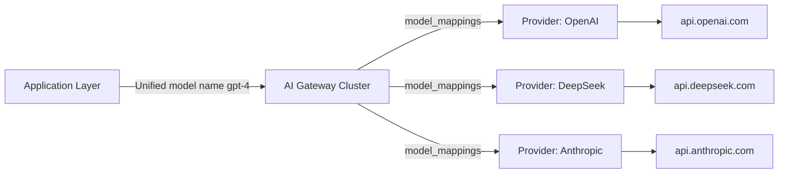
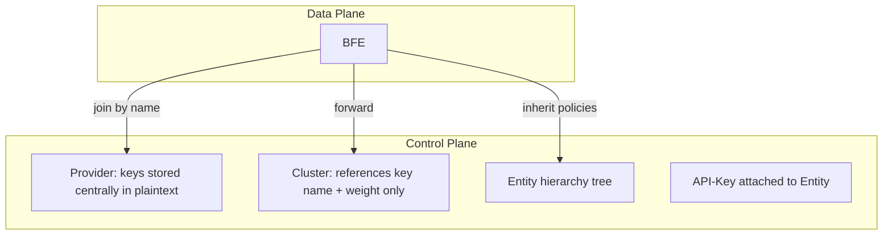

# Chapter 3: Challenges of Integrating Large Language Model Services

## Chapter Goals

This chapter starts from the real-world scenarios in which enterprises integrate Large Language Model (LLM) services, and systematically reviews the main challenges of calling model provider APIs directly in a multi-cloud, multi-model, multi-team environment. Readers will learn the root causes and risks of the following problems, as well as the corresponding solutions offered by the Rainway AI Gateway:

- Differences in protocol, endpoints, and model naming across Providers;
- Security and operational risks caused by scattered API-Key management;
- Requirements for Token quotas, RPM/TPM rate limiting, and cost control;
- Security auditing and compliance requirements;
- High availability and failover requirements.

The content of this chapter directly corresponds to the implementation details in Chapter 11 "Provider and Cluster Design", Chapter 21 "Quota and Rate Limit Design", and Chapter 21 "Dashboard Basic Operations", laying the foundation for understanding the overall architecture of the AI Gateway.

## Multi-Model Providers and Protocol Differences

Enterprises today source LLM services from an increasingly diverse set of providers, including public-cloud model providers such as OpenAI, DeepSeek, Anthropic, and Google Gemini, as well as self-hosted open-source models or privately deployed inference clusters. Each provider differs significantly in interface protocol, authentication method, model naming, and request/response formats.

### Protocol and Endpoint Differences

- **OpenAI**: uses the `/v1/chat/completions` endpoint with `Authorization: Bearer <api_key>` authentication; the request body uses fields such as `messages`, `model`, and `temperature`; streaming responses are returned via SSE (Server-Sent Events).
- **DeepSeek**: the API style is highly compatible with OpenAI, but model names (e.g. `deepseek-chat`, `deepseek-coder`), endpoint domains, and error codes differ.
- **Anthropic Claude**: uses a standalone Messages API with request body fields `model`, `max_tokens`, and `messages`; the response structure and error codes differ from OpenAI.
- **Google Gemini**: uses the separate SDK/REST paths of Vertex AI or the Gemini API; model names look like `gemini-1.5-pro`, and authentication and parameter formats also differ.

### Differences in Model Naming and Capability Mapping

The same capability is named differently across providers. For example:

| Capability Positioning | OpenAI | DeepSeek | Anthropic | Google |
|---------|--------|----------|-----------|--------|
| Long-context reasoning | `gpt-4-turbo` | `deepseek-chat` | `claude-3-opus` | `gemini-1.5-pro` |
| Lightweight chat | `gpt-3.5-turbo` | `deepseek-chat` | `claude-3-haiku` | `gemini-1.0-pro` |

If the application layer is programmed directly against a specific provider's API, switching or extending models requires modifying business code, re-testing, and re-releasing, stretching the model onboarding cycle to days or even weeks.

### Corresponding AI Gateway Solution

The Rainway AI Gateway solves these problems by **separating the Provider and Cluster concepts**. A Provider expresses "who I am, which models I can access, and what my backends and keys are", and contains fields such as `model_endpoint`, `models`, `keys`, `instance_pool`, and `model_protocols`; a Cluster expresses "how I forward requests, which models to use, and how key weights are distributed", and only retains forwarding policies. See `ai-gateway-api/design-docs/sys-design/details/provider与cluster概念分离.md` for the detailed design.

By introducing the Provider abstraction, the AI Gateway lets a Cluster reference a registered Provider through the `llm_config.provider` field, and supports `model_mappings` to map a unified model name passed by the application to the real model name of the target Provider. When a request arrives, the BFE Data Plane automatically matches the request protocol style based on `AIConf.ModelProtocols`, so the calling side does not need to care whether the downstream is OpenAI, DeepSeek, or another protocol.

The diagram above shows that the application layer only needs to send requests to the unified model name exposed by the AI Gateway; inside the gateway, model name mapping, protocol conversion, and backend routing are completed based on the Cluster and Provider configurations.

## Risks of Scattered API Key Management

In a typical architecture where model APIs are called directly, every business application, every microservice, and every test environment may independently hold several API-Keys. This scattered management model brings the following risks:

### Expanded Key Exposure Surface

API-Keys in plaintext are scattered across application config centers, CI/CD pipelines, test scripts, developers' local environments, and even log files. Any single leak can lead to unauthorized model calls, drained quotas, or surging bills.

### Difficulty Unifying Permissions and Lifecycle

When an employee leaves, a project is decommissioned, or an API-Key is suspected to be leaked, administrators must search multiple places to rotate the keys. Without a unified directory, the overlapped state of "old keys not cleaned up, new keys already live" often occurs, further expanding the attack surface.

### Unclear Cost Attribution

Scattered API-Keys cannot be stably associated with business organizational units (such as departments and projects), making it hard to allocate model call costs by team and complicating budget control and anomaly consumption tracing.

### Corresponding AI Gateway Solution

The Rainway AI Gateway associates API-Keys with Entities (business organizational units) and centrally manages Provider-level keys. See `ai-gateway-api/design-docs/sys-design/details/API-Key与Entity关联及模型继承.md` for the detailed design.

- **Provider-level key centralization**: the `keys` field of a Provider centrally stores the plaintext keys of downstream model providers, while a Cluster only references them by `name` and no longer duplicates key plaintext in the Cluster configuration. This significantly reduces the exposure points of keys at the configuration level.
- **API-Key to Entity association**: an API-Key used by the application side can be attached to an Entity, thereby inheriting the model allowlist, quota plan, rate limit policy, and routing rules of that Entity and its parent Entities. Entities support a hierarchical structure (`parent_id`), making it easy to align with the enterprise organization structure.
- **Unified lifecycle management**: creation, enablement, disablement, deletion, and quota reset of API-Keys are all performed on the AI Gateway API Control Plane, and can be viewed centrally through the Dashboard, preventing keys from "growing wildly" in application configurations.

The diagram above illustrates that Provider keys are centrally managed on the Control Plane, Clusters only reference them, and the BFE Data Plane joins by name when exporting configuration to generate a weighted key list—meeting forwarding requirements while reducing the risk of key proliferation.

## Token Quotas, RPM/TPM Rate Limiting, and Cost Control Requirements

LLM calls are usually billed by Token count or call volume, making costs sensitive and volatile. Enterprises face three core control requirements during integration.

### Token Quota Management

Enterprises need to allocate Token quotas to different teams, projects, or applications, and automatically reset them on cycles such as calendar weeks or calendar months. The traditional approach is for each business to track its own usage, which is prone to double counting and cannot achieve real-time interception.

### RPM/TPM Rate Limiting

Model providers usually set limits on Requests Per Minute (RPM) and Tokens Per Minute (TPM). Once the threshold is exceeded, requests are rejected or trigger degradation. Enterprises need fine-grained rate limiting on internal callers at the gateway side, preventing traffic from a single group from exhausting the shared provider quota.

### Cost Control

Unit prices differ enormously across models (for example, `gpt-4` and `gpt-3.5-turbo` can differ in cost by an order of magnitude). Enterprises need to:

- Set budget caps per model;
- Allocate costs by organizational unit;
- Choose to block or only warn when the balance is insufficient (`pass_when_no_enough_quota`).

### Corresponding AI Gateway Solution

The Rainway AI Gateway meets these requirements through three mechanisms: **QuotaPlan**, **RateLimitPolicy**, and **RMB quota**. See `ai-gateway-api/design-docs/sys-design/details/配额余额同步机制.md` for the quota balance synchronization mechanism.

- **QuotaPlan quota plan**: supports two units, `unit = total_token` and `unit = RMB`, and can configure the total amount, reset period (`weekly`/`monthly`/`never`), and whether to allow requests when the balance is insufficient. RMB quotas have an internal precision of 8 decimal places and are uniformly displayed with 4 decimal places, working with `model-prices` data for cost accounting.
- **RateLimitPolicy rate limit policy**: supports TPM, RPM, and maximum concurrency limits, can be bound to an API-Key or Entity, and is merged recursively upward along the Entity hierarchy, enabling unified rate limiting at the organization level.
- **Redis as the single source of truth for balances**: the request path performs atomic deduction directly against `QUOTA_<key>`, and the management plane reads the balance directly from Redis. Periodic reset atomically adjusts the remaining amount via `IncrBy(delta)`, avoiding the `SET` operation overwriting counts that were just deducted in concurrent scenarios.

| Requirement | AI Gateway Mechanism | Key Configuration |
|------|------------|---------|
| Token quota | QuotaPlan | `quota`, `unit=total_token`, `reset_period` |
| Cost budget | QuotaPlan | `unit=RMB`, `pass_when_no_enough_quota` |
| RPM/TPM rate limiting | RateLimitPolicy | `rpm`, `tpm`, `max_concurrency` |
| Periodic reset | QuotaResetScheduler | `weekly` / `monthly` |

The table above summarizes the mapping between control requirements and AI Gateway mechanisms, helping administrators quickly choose configuration items.

## Security Auditing and Compliance Requirements

Once enterprises bring LLM services into production, security auditing and compliance become hard requirements, mainly including:

### Traceable Calls

It is necessary to record "who called which model, through which API-Key, at what time, consuming how many Tokens, and whether a rate limit or quota was hit". Without a unified entry point, audit data will be scattered across multiple provider consoles and hard to correlate.

### Least-Privilege Access

Different teams should only be able to access permitted models. For example, the finance team should not access code generation models, and the customer service team should not access high-cost reasoning models. Applications holding provider keys directly make it hard to enforce such fine-grained, model-level permissions.

### Data Compliance

Some industries have explicit requirements on cross-border data transfer and sensitive field handling. A unified gateway can process request bodies, mask sensitive information, or route to model clusters deployed in compliant regions before forwarding requests.

### Corresponding AI Gateway Solution

- **Entity hierarchy and model allow/blocklists**: Entities support `allow_models` and `block_models`; once an API-Key is attached, it inherits parent-level policies. `allow_models` takes the intersection across the hierarchy, while `block_models` takes the union, ensuring the final effective model set satisfies the least-privilege principle.
- **Tagging and auditing**: when an API-Key is exported, an `ApikeyTag` is generated from the Entity type and name (`TagName = Entity.Type`, `TagValue = Entity.Name`, `TagLevel = EntityType.Level`), making it easy to aggregate by organizational dimension in logs and monitoring.
- **Request body processing and routing**: BFE's `mod-body-process` module can rewrite, mask, or watermark request bodies at the Data Plane, and together with AI routing rules, direct sensitive traffic to compliant clusters.

## High Availability and Failover Requirements

LLM services themselves fluctuate: providers may rate limit, a region may fail, or a model may become temporarily unavailable. When a business system calls a single provider directly, once the backend fails, it can only wait passively or urgently modify code to switch models.

### Typical Failure Scenarios

- A Provider returns 429 (Rate Limit Exceeded) or 503;
- A model is temporarily unavailable due to insufficient capacity;
- Transoceanic link jitter causes increased latency;
- A single API-Key reaches its usage cap and needs to switch to a backup key.

### Corresponding AI Gateway Solution

The Rainway AI Gateway achieves high availability through the collaboration of multiple Providers, multiple keys, Cluster-level forwarding policies, and BFE Data Plane modules.

- **Multi-Provider integration**: register multiple Providers on the Control Plane (for example, a domestic mirror and an overseas official endpoint of the same model); different Clusters can reference different Providers, achieving geographic proximity and failure isolation.
- **Multiple keys and weights**: the `llm_config.keys` of a Cluster supports configuring multiple keys and their weights; combined with the `weighted_random`, `max_retries`, and `retry_backoff` policies of `key_policy`, other keys are automatically retried when a single key is rate limited or fails.
- **Key affinity**: `key_affinity` implements session-level key affinity based on Redis and `ClientKeyId`, preventing the same user session from jumping between multiple keys and causing inconsistent context, while also providing a failure penalty mechanism.
- **Routing rule fallback**: Global-level AI routing rules serve as the default fallback; API-Key-level and Entity-level rules can override them by priority, ensuring traffic can switch to a backup Cluster in abnormal scenarios.

## Chapter Summary

The challenges enterprises face when integrating LLM services can be summarized at five levels:

1. **Protocol differences**: interface protocols, model naming, and authentication methods are not unified across providers;
2. **Key management**: scattered API-Keys lead to an expanded exposure surface and a lifecycle that is hard to unify;
3. **Quotas and cost**: Token quotas, RPM/TPM rate limiting, and cost allocation lack real-time, unified means;
4. **Security and compliance**: requirements for traceable calls, least-privilege access, and data compliance are hard to implement;
5. **High availability**: there is no fast switching capability when a single Provider or key fails.

The Rainway AI Gateway unifies access differences through **Provider/Cluster separation**, achieves centralized authorization through **API-Key to Entity association**, implements real-time quota and cost control through **QuotaPlan + RateLimitPolicy + Redis balance synchronization**, satisfies security auditing and compliance through **Entity-level allow/blocklists + tagging + request body processing**, and achieves high availability and failover through **multiple Providers, multiple keys, routing rules, and key affinity**.

These solutions will be expanded one by one in later chapters of this book: Chapter 11 details Provider and Cluster design, Chapter 21 details quota and rate limit design, and Chapter 21 introduces Dashboard basic operations.

## References

- `ai-gateway-api/design-docs/sys-design/总体设计文档.md`
- `ai-gateway-api/design-docs/sys-design/details/provider与cluster概念分离.md`
- `ai-gateway-api/design-docs/sys-design/details/API-Key与Entity关联及模型继承.md`
- `ai-gateway-api/design-docs/sys-design/details/配额余额同步机制.md`
