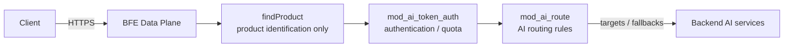
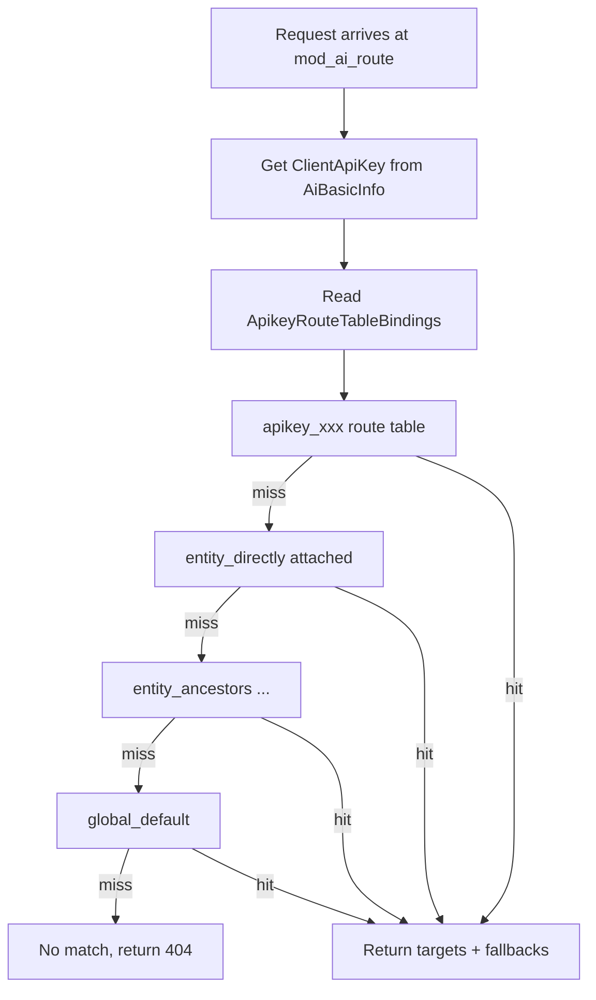
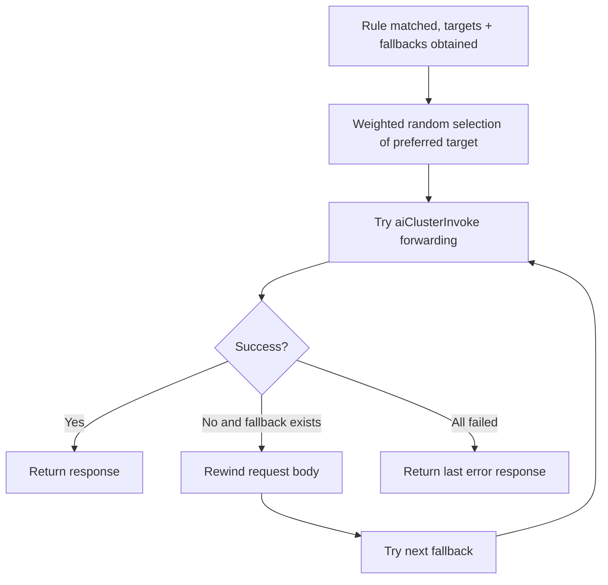
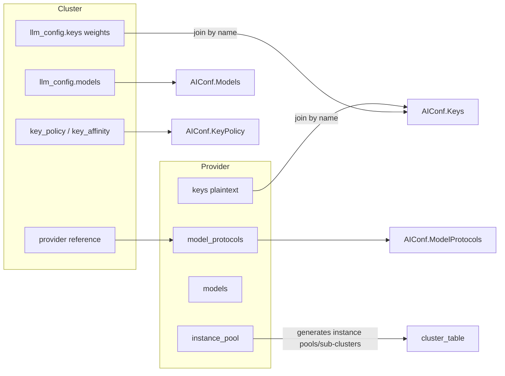
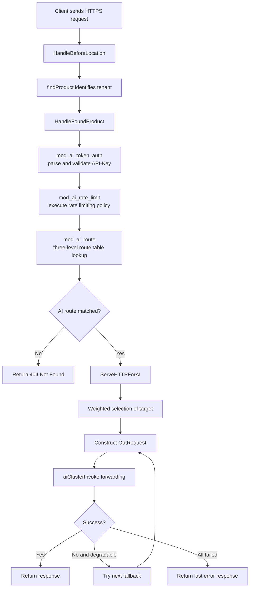

# Chapter 4: Routing and Scheduling Principles of the AI Gateway

## Chapter Goals

Every day, the AI Gateway must deliver tens of thousands of requests accurately to the right models and clusters. Unlike traditional layer-7 load balancing, which only cares about "domain + path → backend cluster", AI requests also carry metadata such as the caller's identity (API-Key), the target model, the quota plan, and the fallback/degradation strategy. This chapter helps readers understand how the Rainway AI Gateway organizes this information into executable routing and scheduling policies:

- Understand where AI routing rules sit in the request processing pipeline;
- Master the priority and binding order of the three-level route tables: API-Key / Entity / Global;
- Understand model-level weighted selection and the Fallback degradation mechanism;
- Learn the respective responsibilities of Provider and Cluster;
- Recognize typical uses of BFE condition expressions in AI routing;
- Trace the complete scheduling flow of an AI request from ingress to forwarding.

## Basic Concepts of AI Request Routing

In traditional load balancing scenarios, routing usually means distributing traffic to a backend cluster (Cluster) based on fields such as the request's Host, Path, and Headers. In the era of large models, a single `/v1/chat/completions` path may correspond to dozens of models such as `gpt-4`, `deepseek-chat`, and `claude-3-opus`, and different callers (API-Keys) may have different available model lists, quotas, and priorities. Therefore, the AI Gateway needs to add a semantic routing layer oriented toward "caller + model" on top of the original L7 routing.

In AI Gateway mode, BFE handles requests through a dedicated `ServeHTTPForAI()` path. This path calls `findProduct()` to identify the product line, which is used by middleware and configuration loading, but **does not use the traditional product-level BFE routing rules to select the target Cluster**. Which model and cluster a request is ultimately forwarded to is determined entirely by the AI routing rules.

AI routing rules are stored in the `route_rules` table of the Control Plane. They are organized into three levels — API-Key / Entity / Global — and their output is a set of `targets` (cluster + model + weight) plus optional `fallbacks` (degradation targets).



AI routing rules are executed in the `HandleFoundProduct` stage, after authentication by `mod_ai_token_auth`, and determine which model and cluster the request ultimately accesses.

## The Three-Level Route Tables: API-Key, Entity, and Global

The carrier of AI routing rules is the **Route Table**. The Control Plane manages them uniformly through the `route_rules` table and distinguishes the three levels by the `type` and `owner` fields:

| Level | Table Record Identifier | Key Exported to BFE | Applicable Scenario |
|------|-----------|------------------|---------|
| API-Key level | `type=apikey, owner=<apikey_id>` | `apikey_<api_key_value>` | Special routing for a single caller, e.g. designating a test model |
| Entity level | `type=entity, owner=<entity_id>` | `entity_<entity_name>` | Unified policy at the department, project, or application level |
| Global level | `type=global, owner=global` | `global_default` | System-wide fallback policy |

For each API-Key, the Control Plane generates a **binding list (ApikeyRouteTableBindings)** that determines the lookup order in BFE:

1. `apikey_<key>` (API-Key level)
2. `entity_<entity_name>` (the directly attached Entity)
3. `entity_<parent_name>` … (all ancestor Entities traversed upward along `parent_id`)
4. `global_default` (Global level)

BFE matches strictly in this order: as soon as any rule hits in a route table, the result is returned immediately and no further lookup is performed. This design matches organizational management conventions — the API-Key level is the finest granularity, the Entity level connects the levels above and below, and the Global level serves as the final fallback.

The lookup flow of the three-level route tables is shown below:



Note that only route tables with `enabled=true` are exported and added to the binding list. If the Global route table is disabled and both the API-Key and Entity level rules miss, the request returns 404 because there is no rule to match. Therefore, production environments usually configure a `default_t()` rule in the Global route table as the fallback.

## Model-Level Load Balancing and the Fallback Mechanism

After an AI routing rule is matched, the result is a set of `targets`. Each target contains `ClusterName`, `Model`, and `Weight`. An empty `Model` means the original model name in the request body is passed through; a non-empty value overrides the `model` field of the request body before forwarding.

### Weighted Selection

The sum of the weights of all targets within the same rule must equal 100. In `ServeHTTPForAI()`, BFE performs weighted random selection, with core logic equivalent to the following pseudocode:

```go
func SelectTarget(targets []AiRouteTarget) AiRouteTarget {
    r := rand.Intn(100)
    sum := 0
    for _, t := range targets {
        sum += t.Weight
        if r < sum {
            return t
        }
    }
    return targets[len(targets)-1]
}
```

Weighted selection allows operators to distribute traffic proportionally by capacity or cost across multiple clusters serving the same model — for example, sending 70% of traffic to `cluster_deepseek_a` and 30% to `cluster_deepseek_b`. Note that the load balancing here happens at the "model level": the AI routing rule first selects a set of targets for the same semantic model, and traffic is then distributed among these targets by weight. This is not the same as instance-level load balancing within a cluster, which remains the responsibility of BFE's `bfe_balance` module.

After a target's `ClusterName` is selected, BFE enters that cluster's forwarding path. If the cluster has multiple Provider Keys configured, `AIConf.KeyPolicy` further determines the key-level selection strategy and retry backoff, while `key_affinity` can maintain session-level key affinity for the same `ClientKeyId`. The complete scheduling chain is therefore a multi-layer decision: "route table → rule → target → key → backend instance".

### Fallback Degradation

`fallbacks` is an ordered list of backup targets. When the preferred target selected by weighted selection is unavailable, BFE tries the fallbacks in order until one attempt succeeds or all fail. Typical errors that trigger Fallback include:

- Connection failure or timeout;
- The backend returning 5xx;
- Additional degradation status codes specified in the configuration (e.g. 429).

Cases that do not trigger Fallback include client 4xx errors, authentication failures, and rate limit rejections. The Fallback list itself does not perform weighted selection; it is tried strictly linearly in array order.

The degradation flow is illustrated below:



In practice, Fallback usually points to clusters with lower cost or more abundant capacity, so they can take over traffic quickly when the primary target fails. For example, if the primary target is `gpt-4`, the fallback can be `gpt-3.5-turbo`.

## Division of Responsibilities Between Provider and Cluster

In the Control Plane of the AI Gateway, **Provider** and **Cluster** are two independent concepts. Provider answers "who is the downstream, which models it can serve, where the backend is, and what the keys are"; Cluster answers "how traffic is forwarded, which models are used, and how key weights are distributed". The current design splits the two into independent resources:

- Provider is the sole holder of plaintext API-Keys;
- Cluster references the Provider through `llm_config.provider`, and references keys by `name` through `llm_config.keys`, setting weights for them;
- When generating the BFE configuration, the Control Plane joins the plaintext in the Provider with the weights in the Cluster by key name to produce the final `AIConf.Keys`.

The relationship between Provider and Cluster is shown below:



The core benefits of this decoupling include: clear separation of responsibilities, configuration reuse, Clusters no longer exposing key plaintext, and the BFE-side configuration structure remaining unchanged. Before deleting a Provider, you must confirm that no Cluster references it; before deleting a Cluster, you must also confirm that it is not referenced by any AI routing rule, to prevent routes from pointing to a non-existent cluster.

For the more detailed data model and the AIConf generation process, see [Chapter 11: Provider and Cluster Design](../design/chapter10-provider-and-cluster.md).

## Applying BFE Condition Expressions in AI Routing

BFE provides a condition expression (Condition) language, and AI routing rules describe their matching conditions through the `Cond` field. When saving a rule, the Control Plane sends the condition string down to BFE, which calls `condition.Build()` at startup or during hot reload to compile the string into an executable `Condition` object, avoiding repeated parsing on every request.

Commonly used condition dimensions in AI routing include:

| Dimension | Example Expression |
|------|-----------|
| Exact match on request body JSON | `req_body_json_in("model", "gpt-4", false)` |
| Prefix match on request body JSON | `req_body_json_prefix_in("model", "openrouter/", false)` |
| Domain | `req_host_in("api.example.com")` |
| Header | `req_header_value_in("X-Model", "gpt-4", true)` |
| Request body size | `req_body_larger_than(8192)` |
| Default match | `default_t()` |

Multiple conditions can be combined with `&&`, for example:

```text
req_host_in("api.example.com") && req_body_json_in("model", "gpt-4", false)
```

Among these, `default_t()` is typically used as the fallback rule of the Global route table, ensuring that all requests not matched by earlier rules still have a target. It is worth noting that `req_body_larger_than` / `req_body_less_than` judge the request body size in bytes based on the `Content-Length` header; if the request has no `Content-Length`, the condition will not match.

Condition expressions are compiled into internal executable objects at configuration load time, and request processing only performs matching, so a large number of rules does not significantly increase per-request CPU overhead. However, overly complex combined conditions or a large number of request-body-JSON-based matches may still incur some parsing cost. It is recommended to prioritize high-frequency rules in production, placing those with high hit rates first.

At save time, the Control Plane validates the `Cond` expression syntax through `validate.ConditionExpression` (which internally calls `condition.Build`); expressions with syntax errors are rejected with a parameter error before being written to the database. `RouteRuleManager.ExpressionVerify` provides the same validation capability, which can be used in the Dashboard or locally to verify whether an expression is valid in advance.

## Request Scheduling Flow

From the moment an AI request enters BFE until it finally reaches the backend, it goes through multiple stages: product line identification, AI route table lookup, weighted selection, and Fallback degradation. The complete flow is shown below:



Key notes:

1. `mod_ai_token_auth` writes the parsed `ClientApiKey` into `AiBasicInfo`, which `mod_ai_route` uses as the lookup key;
2. `mod_ai_route` is only responsible for looking up and writing `AiRouteResult`; it does not construct the response directly;
3. `ServeHTTPForAI()` decides whether to return 404 based on whether `AiRouteResult` exists, and performs target weighted selection, model override, and Fallback degradation;
4. If the `Model` field of a target or fallback is non-empty, BFE modifies the `model` field in the request body via `condition.ReqBodyJsonSet()` and updates `Content-Length` accordingly or uses chunked encoding;
5. Before each Fallback, the request body must be rewound to its starting position, so Fallback is proactively disabled when the request body cannot be rewound or exceeds the buffer limit.

The module registration order is also critical: `mod_ai_route` must be registered after `mod_ai_token_auth` to ensure that `ClientApiKey` is already in place. This order is explicitly constrained in `bfe/bfe_modules/bfe_modules.go`.

## Chapter Summary

This chapter introduced the routing and scheduling mechanisms of the Rainway AI Gateway at the principle level:

- In AI Gateway mode, `findProduct()` is only used for product line identification and configuration context loading; traditional product-level BFE routing rules do not participate in Cluster selection; the request forwarding target is determined entirely by AI routing rules;
- AI route tables are divided into three levels — API-Key, Entity, and Global. BFE matches in the order `apikey → entity → global` and returns on the first hit;
- At the model level, `targets` weighted selection enables traffic distribution across multiple clusters, while ordered `fallbacks` degradation improves availability;
- In the current design, Provider and Cluster are independent: the Provider manages backend capabilities and keys, the Cluster manages forwarding policy, and the Control Plane generates the `AIConf` required by BFE through a join by name;
- BFE condition expressions are the core matching mechanism of AI routing rules, commonly using functions such as `req_body_json_in`, `req_header_value_in`, and `default_t()`;
- The complete request scheduling flow involves the cooperation of `mod_ai_token_auth`, `mod_ai_rate_limit`, `mod_ai_route`, and `ServeHTTPForAI`; module ordering and request-body rewindability are key to implementing Fallback.

Understanding these principles helps you quickly locate root causes when configuring Providers/Clusters, writing routing rules, and troubleshooting problems such as "requests forwarded to the wrong model" or "no route matched, returning 404".

## References

- `ai-gateway-api/design-docs/sys-design/details/路由规则管理.md`
- `ai-gateway-api/design-docs/sys-design/details/provider与cluster概念分离.md`
- `bfe/docs/zh_cn/sys_design/mod_ai_route.md`
- `bfe/docs/zh_cn/configuration/mod_ai_route/ai_route.data.md`
- `bfe/docs/zh_cn/modules/mod_ai_route/mod_ai_route.md`
- `bfe/bfe_modules/mod_ai_route/mod_ai_route.go`
- `bfe/bfe_modules/mod_ai_route/route_table.go`
- `bfe/bfe_modules/mod_ai_route/route_rule.go`
- `bfe/bfe_basic/request_ai_route.go`
- [Chapter 11: Provider and Cluster Design](../design/chapter10-provider-and-cluster.md)
- [Chapter 11: AI Routing Rules Design](../design/chapter11-ai-route-rules.md)
- [Chapter 31: AI Routing Module Implementation: mod_ai_route](../implementation/chapter29-mod-ai-route.md)
